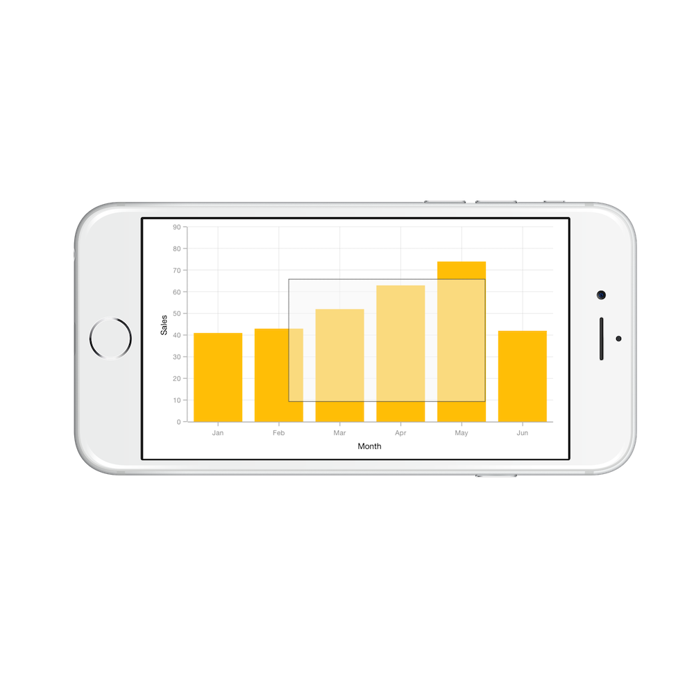
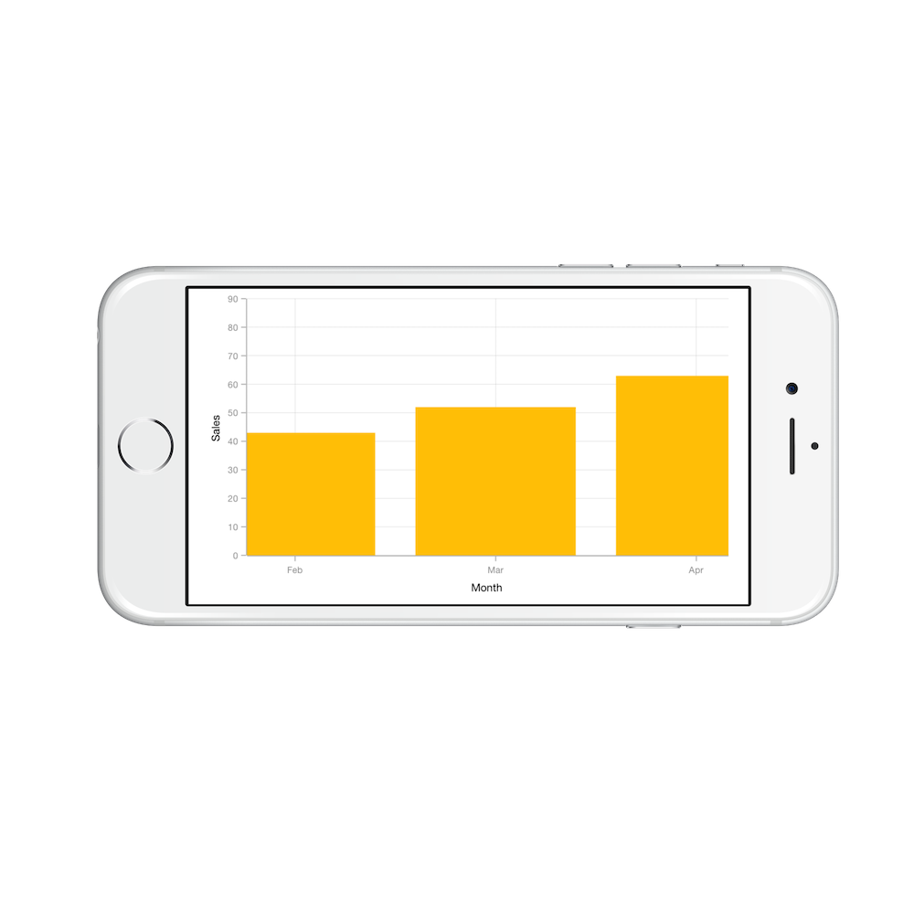

# Zooming and Panning

## Enable Zooming

Chart supports zooming to view the data clearly. To enable this feature, you need to add an instance of [`SFChartZoomPanBehavior`](https://help.syncfusion.com/cr/cref_files/xamarin-ios/Syncfusion.SFChart.iOS~Syncfusion.SfChart.iOS.SFChartZoomPanBehavior.html) to the [`Behaviors`](https://help.syncfusion.com/cr/cref_files/xamarin-ios/Syncfusion.SFChart.iOS~Syncfusion.SfChart.iOS.ChartBase~Behaviors.html) collection using the [`AddChartBehavior`](https://help.syncfusion.com/cr/cref_files/xamarin-ios/Syncfusion.SFChart.iOS~Syncfusion.SfChart.iOS.SFChart~AddChartBehavior.html) method of [`SFChart`](https://help.syncfusion.com/cr/cref_files/xamarin-ios/Syncfusion.SFChart.iOS~Syncfusion.SfChart.iOS.SFChart.html).

Following properties are used to configure the zooming feature,

* [`EnableZooming`](https://help.syncfusion.com/cr/cref_files/xamarin-ios/Syncfusion.SFChart.iOS~Syncfusion.SfChart.iOS.SFChartZoomPanBehavior~EnableZooming.html) – used to enable/disable the pinch zooming. Default value is true. 
* [`EnableDirectionalZooming`](https://help.syncfusion.com/cr/cref_files/xamarin-ios/Syncfusion.SFChart.iOS~Syncfusion.SfChart.iOS.SFChartZoomPanBehavior~EnableDirectionalZooming.html) - Enables or disables the pinch zooming based on pinch gesture direction. The default value of this property is false.
* [`EnableDoubleTap`](https://help.syncfusion.com/cr/cref_files/xamarin-ios/Syncfusion.SFChart.iOS~Syncfusion.SfChart.iOS.SFChartZoomPanBehavior~EnableDoubleTap.html) – when you enable this property, you can double tap on the chart to reset it to the original size or zoom in by one level.
* [`EnablePanning`](https://help.syncfusion.com/cr/cref_files/xamarin-ios/Syncfusion.SFChart.iOS~Syncfusion.SfChart.iOS.SFChartZoomPanBehavior~EnablePanning.html) – used to enable/disable the panning. Default value is true.
* [`MaximumZoomLevel`](https://help.syncfusion.com/cr/cref_files/xamarin-ios/Syncfusion.SFChart.iOS~Syncfusion.SfChart.iOS.SFChartZoomPanBehavior~MaximumZoomLevel.html) - used to determine the maximum zoom level of the chart.

Following code snippet illustrates how to enable zooming.



SFChartZoomPanBehavior zoomPan = new SFChartZoomPanBehavior ();

chart.AddChartBehavior (zoomPan); 



## Selection zooming

By specifying [`EnableSelectionZooming`](https://help.syncfusion.com/cr/cref_files/xamarin-ios/Syncfusion.SFChart.iOS~Syncfusion.SfChart.iOS.SFChartZoomPanBehavior~EnableSelectionZooming.html) property to true, you can double tap and drag to select a range on the chart to be zoomed in.

Following code snippet illustrates how to enable the box selection zooming,



SFChartZoomPanBehavior zoomPan = new SFChartZoomPanBehavior();
zoomPan.EnableSelectionZooming = true;
chart.AddChartBehavior (zoomPan); 



Following screenshot shows the box selection on chart area,

Following screenshot shows the zoomed area,

### Selection rectangle customization

You can customize the selection rectangle using the below properties.

* [`SelectionRectBorderWidth`](https://help.syncfusion.com/cr/cref_files/xamarin-ios/Syncfusion.SFChart.iOS~Syncfusion.SfChart.iOS.SFChartZoomPanBehavior~SelectionRectBorderWidth.html) - used to change the border width of selection rectangle.
* [`SelectionRectStrokeColor`](https://help.syncfusion.com/cr/cref_files/xamarin-ios/Syncfusion.SFChart.iOS~Syncfusion.SfChart.iOS.SFChartZoomPanBehavior~SelectionRectBorderColor.html) - used to change the border color of selection rectangle.
* [`SelectionRectBorderDashes`](https://help.syncfusion.com/cr/cref_files/xamarin-ios/Syncfusion.SFChart.iOS~Syncfusion.SfChart.iOS.SFChartZoomPanBehavior~SelectionRectBorderDashes.html) - used to change the border dashes of selection rectangle.
* [`SelectionRectFillColor`](https://help.syncfusion.com/cr/cref_files/xamarin-ios/Syncfusion.SFChart.iOS~Syncfusion.SfChart.iOS.SFChartZoomPanBehavior~SelectionRectFillColor.html) - used to change the fill color of selection rectangle.

### Show axis tooltip

The axis tooltip on selection zooming can be enabled using the [`SFChartAxis.TrackballLabelStyle.Visible`](https://help.syncfusion.com/cr/cref_files/xamarin-ios/Syncfusion.SFChart.iOS~Syncfusion.SfChart.iOS.SFChartTrackballLabelStyle~Visible.html) property. You can customize the appearance of the axis tooltip by the below properties of [`SFChartAxis.SFChartTrackballAxisLabelStyle`](https://help.syncfusion.com/cr/cref_files/xamarin-ios/Syncfusion.SFChart.iOS~Syncfusion.SfChart.iOS.SFChartTrackballAxisLabelStyle.html).

* [`LabelAlignment`](https://help.syncfusion.com/cr/cref_files/xamarin-ios/Syncfusion.SFChart.iOS~Syncfusion.SfChart.iOS.SFChartTrackballAxisLabelStyle~LabelAlignment.html) - used to change the position of the axis label.
* [`BorderColor`](https://help.syncfusion.com/cr/cref_files/xamarin-ios/Syncfusion.SFChart.iOS~Syncfusion.SfChart.iOS.SFLabelStyle~BorderColor.html) – used to change the label border color.
* [`BorderWidth`](https://help.syncfusion.com/cr/cref_files/xamarin-ios/Syncfusion.SFChart.iOS~Syncfusion.SfChart.iOS.SFLabelStyle~BorderWidth.html) – used to change the label border width.
* [`BackgroundColor`](https://help.syncfusion.com/cr/cref_files/xamarin-ios/Syncfusion.SFChart.iOS~Syncfusion.SfChart.iOS.SFLabelStyle~BackgroundColor.html) – used to change the label background color.
* [`Color`](https://help.syncfusion.com/cr/cref_files/xamarin-ios/Syncfusion.SFChart.iOS~Syncfusion.SfChart.iOS.SFLabelStyle~Color.html) – used to change the label text color.
* [`Font`](https://help.syncfusion.com/cr/cref_files/xamarin-ios/Syncfusion.SFChart.iOS~Syncfusion.SfChart.iOS.SFLabelStyle~Font.html) – used to change the label font size, family and weight.
* [`LabelFormatter`](https://help.syncfusion.com/cr/cref_files/xamarin-ios/Syncfusion.SFChart.iOS~Syncfusion.SfChart.iOS.SFLabelStyle~LabelFormatter.html) – used to format the label.
* [`Margin`](https://help.syncfusion.com/cr/cref_files/xamarin-ios/Syncfusion.SFChart.iOS~Syncfusion.SfChart.iOS.SFLabelStyle~Margin.html) - used to change the margin for label.
* [`Visible`](https://help.syncfusion.com/cr/cref_files/xamarin-ios/Syncfusion.SFChart.iOS~Syncfusion.SfChart.iOS.SFChartTrackballLabelStyle~Visible.html) – used to control the visibility of axis tooltip label.



SFChart chart = new SFChart ();

SFNumericalAxis primaryAxis = new SFNumericalAxis();
primaryAxis.TrackballLabelStyle.Visible = true;
chart.PrimaryAxis = primaryAxis; 

SFNumericalAxis secondaryAxis = new SFNumericalAxis();
secondaryAxis.TrackballLabelStyle.Visible = true;
chart.SecondaryAxis = secondaryAxis; 

SFChartZoomPanBehavior zoomPan = new SFChartZoomPanBehavior();
zoomPan.EnableSelectionZooming = true;

chart.AddChartBehavior (zoomPan);



## Zoom Mode

The [`ZoomMode`](https://help.syncfusion.com/cr/cref_files/xamarin-ios/Syncfusion.SFChart.iOS~Syncfusion.SfChart.iOS.SFChartZoomPanBehavior~ZoomMode.html) property specifies whether chart should be allowed to scale along horizontal axis or vertical axis or along both axis. The default value of [`ZoomMode`](https://help.syncfusion.com/cr/cref_files/xamarin-ios/Syncfusion.SFChart.iOS~Syncfusion.SfChart.iOS.SFChartZoomPanBehavior~ZoomMode.html) is [`SFChartZoomMode.XY`](https://help.syncfusion.com/cr/cref_files/xamarin-ios/Syncfusion.SFChart.iOS~Syncfusion.SfChart.iOS.SFChartZoomMode.html) (both axis).

Following code example illustrates how to restrict the chart to be zoomed only along horizontal axis,



SFChartZoomPanBehavior zoomPan = new SFChartZoomPanBehavior();

zoomPan.ZoomMode               = SFChartZoomMode.X;

chart.AddChartBehavior(zoomPan); 



## Auto interval on zooming

[`EnableAutoIntervalOnZooming`](https://help.syncfusion.com/cr/cref_files/xamarin-ios/Syncfusion.SFChart.iOS~Syncfusion.SfChart.iOS.SFAxis~EnableAutoIntervalOnZooming.html) property determines the update of axis internal based on the current visible range while zooming the chart. Default value of this property is true. If this property is false, the nice internal will not be calculated for new range after zoom in and actual interval will be sustained.

## Delegates

We need to implement delegate to deal with the user interactions in chart for zooming and panning. In order to do this,you need to adopt the [`SFChartDelegate`](https://help.syncfusion.com/cr/cref_files/xamarin-ios/Syncfusion.SFChart.iOS~Syncfusion.SfChart.iOS.SFChartDelegate.html) protocol through the class extension as shown below.



public override void ViewDidLoad ()
{
    chart.Delegate = new ChartDelegate ();
}

public class ChartDelegate : SFChartDelegate
{
    public override void WillZoom (SFChart chart, SFChartZoomingInfo info)
    {

    }
}



**WillZoom**

The [`WillZoom`](https://help.syncfusion.com/cr/cref_files/xamarin-ios/Syncfusion.SFChart.iOS~Syncfusion.SfChart.iOS.SFChartDelegate~WillZoom.html) delegate is called when the axis is started zooming, the argument includes the [`SFChartZoomingInfo`](https://help.syncfusion.com/cr/cref_files/xamarin-ios/Syncfusion.SFChart.iOS~Syncfusion.SfChart.iOS.SFChartZoomingInfo.html) which is used to get the zooming state. The argument contains the following information.

* [`Axis`](https://help.syncfusion.com/cr/cref_files/xamarin-ios/Syncfusion.SFChart.iOS~Syncfusion.SfChart.iOS.SFChartZoomInfo~Axis.html) - the zoom start event will be triggered for all the axis in the chart.
* [`CurrentZoomFactor`](https://help.syncfusion.com/cr/cref_files/xamarin-ios/Syncfusion.SFChart.iOS~Syncfusion.SfChart.iOS.SFChartZoomInfo~CurrentZoomFactor.html) - used to get the new zoom factor of the corresponding axis.
* [`CurrentZoomPosition`](https://help.syncfusion.com/cr/cref_files/xamarin-ios/Syncfusion.SFChart.iOS~Syncfusion.SfChart.iOS.SFChartZoomInfo~CurrentZoomPosition.html) - used to get the new zoom position of the corresponding axis.
* [`PreviousZoomFactor`](https://help.syncfusion.com/cr/cref_files/xamarin-ios/Syncfusion.SFChart.iOS~Syncfusion.SfChart.iOS.SFChartZoomInfo~PreviousZoomFactor.html) - used to get the previous zoom factor of the corresponding axis.
* [`PreviousZoomPosition`](https://help.syncfusion.com/cr/cref_files/xamarin-ios/Syncfusion.SFChart.iOS~Syncfusion.SfChart.iOS.SFChartZoomInfo~PreviousZoomPosition.html) - used to get the previous zoom position of the corresponding axis.
* [`Cancel`](https://help.syncfusion.com/cr/cref_files/xamarin-ios/Syncfusion.SFChart.iOS~Syncfusion.SfChart.iOS.SFChartZoomingInfo~Cancel.html) - used to set the value indicating whether the zooming should be canceled. 
* [`State`](https://help.syncfusion.com/cr/cref_files/xamarin-ios/Syncfusion.SFChart.iOS~Syncfusion.SfChart.iOS.SFChartZoomInfo~State.html) - used to get the [`SFChartZoomPanState`](https://help.syncfusion.com/cr/cref_files/xamarin-ios/Syncfusion.SFChart.iOS~Syncfusion.SfChart.iOS.SFChartZoomPanState.html) of the zooming.

**DidZoom**

The [`DidZoom`](https://help.syncfusion.com/cr/cref_files/xamarin-ios/Syncfusion.SFChart.iOS~Syncfusion.SfChart.iOS.SFChartDelegate~DidZoom.html) delegate is called when the axis is started zooming, the argument includes the [`SFChartZoomInfo`](https://help.syncfusion.com/cr/cref_files/xamarin-ios/Syncfusion.SFChart.iOS~Syncfusion.SfChart.iOS.SFChartZoomInfo.html) which is used to get the zooming state. The argument contains the following information.

* [`Axis`](https://help.syncfusion.com/cr/cref_files/xamarin-ios/Syncfusion.SFChart.iOS~Syncfusion.SfChart.iOS.SFChartZoomInfo~Axis.html) - the zoom start event will be triggered for all the axis in the chart.
* [`CurrentZoomFactor`](https://help.syncfusion.com/cr/cref_files/xamarin-ios/Syncfusion.SFChart.iOS~Syncfusion.SfChart.iOS.SFChartZoomInfo~CurrentZoomFactor.html) - used to get the new zoom factor of the corresponding axis.
* [`CurrentZoomPosition`](https://help.syncfusion.com/cr/cref_files/xamarin-ios/Syncfusion.SFChart.iOS~Syncfusion.SfChart.iOS.SFChartZoomInfo~CurrentZoomPosition.html) - used to get the new zoom position of the corresponding axis.
* [`PreviousZoomFactor`](https://help.syncfusion.com/cr/cref_files/xamarin-ios/Syncfusion.SFChart.iOS~Syncfusion.SfChart.iOS.SFChartZoomInfo~PreviousZoomFactor.html) - used to get the previous zoom factor of the corresponding axis.
* [`PreviousZoomPosition`](https://help.syncfusion.com/cr/cref_files/xamarin-ios/Syncfusion.SFChart.iOS~Syncfusion.SfChart.iOS.SFChartZoomInfo~PreviousZoomPosition.html) - used to get the previous zoom position of the corresponding axis.
* [`State`](https://help.syncfusion.com/cr/cref_files/xamarin-ios/Syncfusion.SFChart.iOS~Syncfusion.SfChart.iOS.SFChartZoomInfo~State.html) - used to get the [`SFChartZoomPanState`](https://help.syncfusion.com/cr/cref_files/xamarin-ios/Syncfusion.SFChart.iOS~Syncfusion.SfChart.iOS.SFChartZoomPanState.html) of the zooming.

**WillPan**

The [`WillPan`](https://help.syncfusion.com/cr/cref_files/xamarin-ios/Syncfusion.SFChart.iOS~Syncfusion.SfChart.iOS.SFChartDelegate~WillPan.html) delegate is called when the axis is started zooming, the argument includes the [`SFChartPanningInfo`](https://help.syncfusion.com/cr/cref_files/xamarin-ios/Syncfusion.SFChart.iOS~Syncfusion.SfChart.iOS.SFChartPanningInfo.html)which is used to get the zooming state. The argument contains the following information.

* [`Axis`](https://help.syncfusion.com/cr/cref_files/xamarin-ios/Syncfusion.SFChart.iOS~Syncfusion.SfChart.iOS.SFChartPanInfo~Axis.html) - the zoom start event will be triggered for all the axis in the chart.
* [`CurrentZoomPosition`](https://help.syncfusion.com/cr/cref_files/xamarin-ios/Syncfusion.SFChart.iOS~Syncfusion.SfChart.iOS.SFChartPanInfo~CurrentZoomPosition.html) - used to get the new zoom position of the corresponding axis.
* [`PreviousZoomPosition`](https://help.syncfusion.com/cr/cref_files/xamarin-ios/Syncfusion.SFChart.iOS~Syncfusion.SfChart.iOS.SFChartPanInfo~PreviousZoomPosition.html) - used to get the previous zoom position of the corresponding axis.
* [`Cancel`](https://help.syncfusion.com/cr/cref_files/xamarin-ios/Syncfusion.SFChart.iOS~Syncfusion.SfChart.iOS.SFChartPanningInfo~Cancel.html) - used to set the value indicating whether the zooming should be canceled. 
* [`State`](https://help.syncfusion.com/cr/cref_files/xamarin-ios/Syncfusion.SFChart.iOS~Syncfusion.SfChart.iOS.SFChartPanInfo~State.html) - used to get the [`SFChartZoomPanState`](https://help.syncfusion.com/cr/cref_files/xamarin-ios/Syncfusion.SFChart.iOS~Syncfusion.SfChart.iOS.SFChartZoomPanState.html) of the zooming.

**DidPan**

The [`DidPan`](https://help.syncfusion.com/cr/cref_files/xamarin-ios/Syncfusion.SFChart.iOS~Syncfusion.SfChart.iOS.SFChartDelegate~DidPan.html) delegate is called when the axis is started zooming, the argument includes the [`SFChartPanInfo`](https://help.syncfusion.com/cr/cref_files/xamarin-ios/Syncfusion.SFChart.iOS~Syncfusion.SfChart.iOS.SFChartPanInfo.html) which is used to get the zooming state. The argument contains the following information.

* [`Axis`](https://help.syncfusion.com/cr/cref_files/xamarin-ios/Syncfusion.SFChart.iOS~Syncfusion.SfChart.iOS.SFChartPanInfo~Axis.html) - the zoom start event will be triggered for all the axis in the chart.
* [`CurrentZoomPosition`](https://help.syncfusion.com/cr/cref_files/xamarin-ios/Syncfusion.SFChart.iOS~Syncfusion.SfChart.iOS.SFChartPanInfo~CurrentZoomPosition.html) - used to get the new zoom position of the corresponding axis.
* [`PreviousZoomPosition`](https://help.syncfusion.com/cr/cref_files/xamarin-ios/Syncfusion.SFChart.iOS~Syncfusion.SfChart.iOS.SFChartPanInfo~PreviousZoomPosition.html) - used to get the previous zoom position of the corresponding axis. 
* [`State`](https://help.syncfusion.com/cr/cref_files/xamarin-ios/Syncfusion.SFChart.iOS~Syncfusion.SfChart.iOS.SFChartPanInfo~State.html) - used to get the [`SFChartZoomPanState`](https://help.syncfusion.com/cr/cref_files/xamarin-ios/Syncfusion.SFChart.iOS~Syncfusion.SfChart.iOS.SFChartZoomPanState.html) of the zooming.

**WillSelectionZoom**

The [`WillSelectionZoom`](https://help.syncfusion.com/cr/cref_files/xamarin-ios/Syncfusion.SFChart.iOS~Syncfusion.SfChart.iOS.SFChartDelegate~WillSelectionZoom.html) delegate is called when the axis is started zooming, the argument includes the [`SFChartSelectionZoomingInfo`](https://help.syncfusion.com/cr/cref_files/xamarin-ios/Syncfusion.SFChart.iOS~Syncfusion.SfChart.iOS.SFChartSelectionZoomingInfo.html) which is used to get the zooming state. The argument contains the following information.

* [`ZoomRect`](https://help.syncfusion.com/cr/cref_files/xamarin-ios/Syncfusion.SFChart.iOS~Syncfusion.SfChart.iOS.SFChartSelectionZoomInfo~ZoomRect.html) - contains the bounds of the currently selected region.
* [`Cancel`](https://help.syncfusion.com/cr/cref_files/xamarin-ios/Syncfusion.SFChart.iOS~Syncfusion.SfChart.iOS.SFChartSelectionZoomingInfo~Cancel.html) - used to set the value indicating whether the box selection zooming should be canceled.
* [`State`](https://help.syncfusion.com/cr/cref_files/xamarin-ios/Syncfusion.SFChart.iOS~Syncfusion.SfChart.iOS.SFChartSelectionZoomInfo~State.html) - used to get the [`SFChartZoomPanState`](https://help.syncfusion.com/cr/cref_files/xamarin-ios/Syncfusion.SFChart.iOS~Syncfusion.SfChart.iOS.SFChartZoomPanState.html) of the zooming.

**DidSelectionZoom**

The [`DidSelectionZoom`](https://help.syncfusion.com/cr/cref_files/xamarin-ios/Syncfusion.SFChart.iOS~Syncfusion.SfChart.iOS.SFChartDelegate~DidSelectionZoom.html) delegate is called when the axis is started zooming, the argument includes the [`SFChartSelectionZoomInfo`](https://help.syncfusion.com/cr/cref_files/xamarin-ios/Syncfusion.SFChart.iOS~Syncfusion.SfChart.iOS.SFChartSelectionZoomInfo.html) which is used to get the zooming state. The argument contains the following information.

* [`ZoomRect`](https://help.syncfusion.com/cr/cref_files/xamarin-ios/Syncfusion.SFChart.iOS~Syncfusion.SfChart.iOS.SFChartSelectionZoomInfo~ZoomRect.html) - contains the bounds of the currently selected region.
* [`State`](https://help.syncfusion.com/cr/cref_files/xamarin-ios/Syncfusion.SFChart.iOS~Syncfusion.SfChart.iOS.SFChartSelectionZoomInfo~State.html) - used to get the [`SFChartZoomPanState`](https://help.syncfusion.com/cr/cref_files/xamarin-ios/Syncfusion.SFChart.iOS~Syncfusion.SfChart.iOS.SFChartZoomPanState.html) of the zooming.

**DidResetZoom**

The [`DidResetZoom`](https://help.syncfusion.com/cr/cref_files/xamarin-ios/Syncfusion.SFChart.iOS~Syncfusion.SfChart.iOS.SFChartDelegate~DidResetZoom.html) delegate is called when the axis is started zooming, the argument includes the [`SFChartResetZoomInfo`](https://help.syncfusion.com/cr/cref_files/xamarin-ios/Syncfusion.SFChart.iOS~Syncfusion.SfChart.iOS.SFChartResetZoomInfo.html) which is used to get the zooming state. The argument contains the following information.

 * [`Axis`](https://help.syncfusion.com/cr/cref_files/xamarin-ios/Syncfusion.SFChart.iOS~Syncfusion.SfChart.iOS.SFChartResetZoomInfo~Axis.html) – Instance of the axis whose range is changed because of this event. This event is triggered for each axis in the chart.
 * [`PreviousZoomFactor`](https://help.syncfusion.com/cr/cref_files/xamarin-ios/Syncfusion.SFChart.iOS~Syncfusion.SfChart.iOS.SFChartResetZoomInfo~PreviousZoomFactor.html) – used to get the previous zoom factor.
 * [`PreviousZoomPosition`](https://help.syncfusion.com/cr/cref_files/xamarin-ios/Syncfusion.SFChart.iOS~Syncfusion.SfChart.iOS.SFChartResetZoomInfo~PreviousZoomPosition.html) – used to get the previous zoom position.

## Methods

Zooming and panning can be performed programmatically with the following methods:

### ZoomIn

The [`ZoomIn`](https://help.syncfusion.com/cr/cref_files/xamarin-ios/Syncfusion.SFChart.iOS~Syncfusion.SfChart.iOS.SFChartZoomPanBehavior~ZoomIn.html) method is used to increase the magnification of the plot area to view the data clearly.



SFChartZoomPanBehavior zoomPan = new SFChartZoomPanBehavior();

zoomPan.ZoomIn();



### ZoomOut 

The [`ZoomOut`](https://help.syncfusion.com/cr/cref_files/xamarin-ios/Syncfusion.SFChart.iOS~Syncfusion.SfChart.iOS.SFChartZoomPanBehavior~ZoomOut.html) method is used to decrease the magnification of the plot area to reset the default view.



SFChartZoomPanBehavior zoomPan = new SFChartZoomPanBehavior();

zoomPan.ZoomOut();



### Zoom

**Zoom(factor)**

The [`Zoom(factor)`](https://help.syncfusion.com/cr/cref_files/xamarin-ios/Syncfusion.SFChart.iOS~Syncfusion.SfChart.iOS.SFChartZoomPanBehavior~Zoom(Single).html) method is used to change the zoom level by using [`ZoomFactor`](https://help.syncfusion.com/cr/cref_files/xamarin-ios/Syncfusion.SFChart.iOS~Syncfusion.SfChart.iOS.SFAxis~ZoomFactor.html).



SFChartZoomPanBehavior zoomPan = new SFChartZoomPanBehavior();

zoomPan.Zoom(0.5f);



**Zoom(CGRect)**

The [`Zoom(CGRect)`](https://help.syncfusion.com/cr/cref_files/xamarin-ios/Syncfusion.SFChart.iOS~Syncfusion.SfChart.iOS.SFChartZoomPanBehavior~Zoom(CGRect).html) method is used to zoom the chart for a given rectangle value.



SFChartZoomPanBehavior zoomPan = new SFChartZoomPanBehavior();

zoomPan.Zoom(new CGRect(10, 10, 200, 350));



**Zoom(chartAxis, zoomPosition, zoomFactor)**

The [`Zoom(chartAxis, zoomPosition, zoomFactor)`](https://help.syncfusion.com/cr/cref_files/xamarin-ios/Syncfusion.SFChart.iOS~Syncfusion.SfChart.iOS.SFChartZoomPanBehavior~Zoom(SFAxis,Single,Single).html) method is used to change the zoom level by using [`ZoomPosition`](https://help.syncfusion.com/cr/cref_files/xamarin-ios/Syncfusion.SFChart.iOS~Syncfusion.SfChart.iOS.SFAxis~ZoomPosition.html) and [`ZoomFactor`](https://help.syncfusion.com/cr/cref_files/xamarin-ios/Syncfusion.SFChart.iOS~Syncfusion.SfChart.iOS.SFAxis~ZoomFactor.html). Zoom position value specifies the starting point of zooming, and zoom factor value specifies the level of zooming.



SFChartZoomPanBehavior zoomPan = new SFChartZoomPanBehavior();

zoomPan.Zoom(axis, 0.5f, 0.5f);



**Zoom(chartAxis, start, end)**

The [`Zoom(chartAxis, start, end)`](https://help.syncfusion.com/cr/cref_files/xamarin-ios/Syncfusion.SFChart.iOS~Syncfusion.SfChart.iOS.SFChartZoomPanBehavior~Zoom(SFAxis,Object,Object).html) method is used to zoom the given axis to given range.



SFChartZoomPanBehavior zoomPan = new SFChartZoomPanBehavior();

zoomPan.Zoom(axis, 20, 25);



### ZoomWithCumulativeScale(cumulativeLevel, origin, chartAxis)

The [`ZoomWithCumulativeScale`](https://help.syncfusion.com/cr/cref_files/xamarin-ios/Syncfusion.SFChart.iOS~Syncfusion.SfChart.iOS.SFChartZoomPanBehavior~ZoomWithCumulativeScale.html) method is used to change the zoom level of given axis to the specified level and origin.



SFChartZoomPanBehavior zoomPan = new SFChartZoomPanBehavior();

zoomPan.ZoomWithCumulativeScale(0.5, 0.5, axis);



### Reset

The [`Reset`](https://help.syncfusion.com/cr/cref_files/xamarin-ios/Syncfusion.SFChart.iOS~Syncfusion.SfChart.iOS.SFChartZoomPanBehavior~Reset.html) method is used to return the plot area back to its original position after zooming. 



SFChartZoomPanBehavior zoomPan = new SFChartZoomPanBehavior();

zoomPan.Reset();


