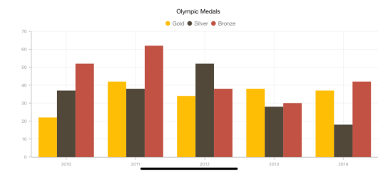
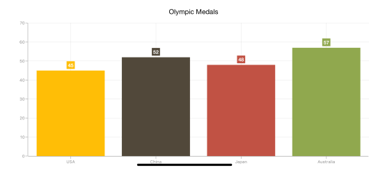
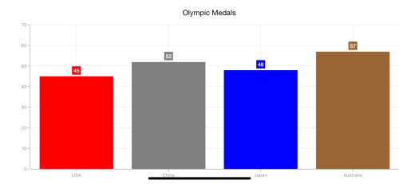
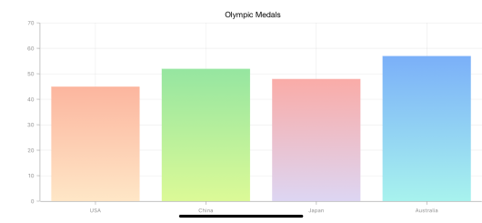
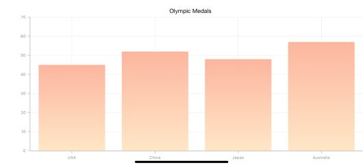

# Color Palette

## Apply palette for Chart

[`ColorModel`](https://help.syncfusion.com/cr/cref_files/xamarin-ios/Syncfusion.SFChart.iOS~Syncfusion.SfChart.iOS.ChartBase~ColorModel.html) property of [`SFChart`](https://help.syncfusion.com/cr/cref_files/xamarin-ios/Syncfusion.SFChart.iOS~Syncfusion.SfChart.iOS.SFChart.html) is used to define the colors for each series. [`ColorModel`](https://help.syncfusion.com/cr/cref_files/xamarin-ios/Syncfusion.SFChart.iOS~Syncfusion.SfChart.iOS.ChartBase~ColorModel.html) contains the following color palettes.

**Predefined Palettes**

Currently, Chart supports three different palettes. They are 

* Metro
* TomatoSpectrum
* Pineapple

Metro is the default palette for [`SFChart`](https://help.syncfusion.com/cr/cref_files/xamarin-ios/Syncfusion.SFChart.iOS~Syncfusion.SfChart.iOS.SFChart.html). 

The following screenshot shows the default appearance of multiple series.

**Custom Palette**

Chart will use the colors from [`CustomColors`](https://help.syncfusion.com/cr/cref_files/xamarin-ios/Syncfusion.SFChart.iOS~Syncfusion.SfChart.iOS.SFChartColorModel~CustomColors.html) property if [`ColorModel.Palette`](https://help.syncfusion.com/cr/cref_files/xamarin-ios/Syncfusion.SFChart.iOS~Syncfusion.SfChart.iOS.SFChartColorModel~Palette.html) is set to [`SFChartColorPalette.Custom`](https://help.syncfusion.com/cr/cref_files/xamarin-ios/Syncfusion.SFChart.iOS~Syncfusion.SfChart.iOS.SFChartColorPalette.html).

Following code illustrates how to set the custom colors.



chart.ColorModel.Palette          = SFChartColorPalette.Custom;

chart.ColorModel.CustomColors     = NSArray.FromObjects 
                                    (UIColor.FromRGB (238, 241, 11),
                                    UIColor.FromRGB (139, 139, 139),
                                    UIColor.FromRGB (100, 0, 5)); 



**None Palette**

None palette will not apply any color to the series. So in order to define the color for any series, you can use the Color property or the [`ColorModel`](https://help.syncfusion.com/cr/cref_files/xamarin-ios/Syncfusion.SFChart.iOS~Syncfusion.SfChart.iOS.ChartBase~ColorModel.html) property of ChartSeries (The ColorModel of Series will be explained later in this document).

## Apply palette for Series

[`ColorModel`](https://help.syncfusion.com/cr/cref_files/xamarin-ios/Syncfusion.SFChart.iOS~Syncfusion.SfChart.iOS.SFSeries~ColorModel.html) property of [`SFSeries`](https://help.syncfusion.com/cr/cref_files/xamarin-ios/Syncfusion.SFChart.iOS~Syncfusion.SfChart.iOS.SFSeries.html) is used to define the colors for each data point. Following palettes are used to define the colors.

**Predefined Palettes**

Currently, Series supports three types of palette and None palette is the default palette for Series.
 
These predefined palettes are

* Metro
* Pineapple
* TomatoSpectrum



SFColumnSeries series       = new SFColumnSeries ();

series.ColorModel.Palette   = SFChartColorPalette.Metro; 



**Custom Palette**

Series will use the colors from `CustomBrushes` property if the [`ColorModel.Palette`](https://help.syncfusion.com/cr/cref_files/xamarin-ios/Syncfusion.SFChart.iOS~Syncfusion.SfChart.iOS.SFChartColorModel~Palette.html) property of series is set to [`Custom`](https://help.syncfusion.com/cr/cref_files/xamarin-ios/Syncfusion.SFChart.iOS~Syncfusion.SfChart.iOS.SFChartColorPalette.html).

Following code illustrates how to set the custom colors.



SFColumnSeries series           = new SFColumnSeries ();

series.ColorModel.Palette       = SFChartColorPalette.Custom;

series.ColorModel.CustomColors  = NSArray.FromObjects 
                                    (UIColor.Red, 
                                    UIColor.Gray,
                                    UIColor.Blue, 
                                    UIColor.Brown, 
                                    UIColor.Purple); 



**None Palette**

None palette will not apply any color to the data points. So in order to define the color for the data points, you can use the [`Color`](https://help.syncfusion.com/cr/cref_files/xamarin-ios/Syncfusion.SFChart.iOS~Syncfusion.SfChart.iOS.SFSeries~Color.html) property of ChartSeries.

## Gradient Colors

The [`CustomGradientColors`](https://help.syncfusion.com/cr/cref_files/xamarin-ios/Syncfusion.SFChart.iOS~Syncfusion.SfChart.iOS.SFChartColorModel~CustomGradientColors.html) property of [`ChartColorModel`](https://help.syncfusion.com/cr/cref_files/xamarin-ios/Syncfusion.SFChart.iOS~Syncfusion.SfChart.iOS.SFChartColorModel.html) is used to define the gradient colors, the colors from this property is used for series or chart if the [`Palette`](https://help.syncfusion.com/cr/cref_files/xamarin-ios/Syncfusion.SFChart.iOS~Syncfusion.SfChart.iOS.SFChartColorModel~Palette.html) property of ChartColorModel is [`Custom`](https://help.syncfusion.com/cr/cref_files/xamarin-ios/Syncfusion.SFChart.iOS~Syncfusion.SfChart.iOS.SFChartColorPalette.html) and the [`CustomColors`](https://help.syncfusion.com/cr/cref_files/xamarin-ios/Syncfusion.SFChart.iOS~Syncfusion.SfChart.iOS.SFChartColorModel~CustomColors.html) property is null. The following properties are used to define the gradient color for the chart.

The [`StartPoint`](https://help.syncfusion.com/cr/cref_files/xamarin-ios/Syncfusion.SFChart.iOS~Syncfusion.SfChart.iOS.ChartGradientColor~StartPoint.html) and [`EndPoint`](https://help.syncfusion.com/cr/cref_files/xamarin-ios/Syncfusion.SFChart.iOS~Syncfusion.SfChart.iOS.ChartGradientColor~EndPoint.html)  properties of [`ChartGradientColor`](https://help.syncfusion.com/cr/cref_files/xamarin-ios/Syncfusion.SFChart.iOS~Syncfusion.SfChart.iOS.ChartGradientColor.html) is used to configure the direction of gradient color, [`GradientStops`](https://help.syncfusion.com/cr/cref_files/xamarin-ios/Syncfusion.SFChart.iOS~Syncfusion.SfChart.iOS.ChartGradientColor~GradientStops.html)  property is used to set the color based on the offset.

The [`Color`](https://help.syncfusion.com/cr/cref_files/xamarin-ios/Syncfusion.SFChart.iOS~Syncfusion.SfChart.iOS.ChartGradientStop~Color.html) and [`Offset`](https://help.syncfusion.com/cr/cref_files/xamarin-ios/Syncfusion.SFChart.iOS~Syncfusion.SfChart.iOS.ChartGradientStop~Offset.html) properties of [`ChartGradientStop`](https://help.syncfusion.com/cr/cref_files/xamarin-ios/Syncfusion.SFChart.iOS~Syncfusion.SfChart.iOS.ChartGradientStop.html) is used to configure the color and offset position of each color. 

Following code snippets and screenshot illustrates how to apply the gradient color to the chart series.

 
[C#]

            series.ColorModel.Palette = SFChartColorPalette.Custom;

            ChartGradientColor gradientColor1 = new ChartGradientColor() { StartPoint = new CGPoint(0.5f, 1), EndPoint = new CGPoint(0.5f, 0) };
            ChartGradientStop stop11 = new ChartGradientStop() { Color = UIColor.FromRGB(255,231,199), Offset = 0 };
            ChartGradientStop stop12 = new ChartGradientStop() { Color = UIColor.FromRGB(252,182,159), Offset = 1 };
            gradientColor1.GradientStops.Add(stop11);
            gradientColor1.GradientStops.Add(stop12);

            ChartGradientColor gradientColor2 = new ChartGradientColor() { StartPoint = new CGPoint(0.5f, 1), EndPoint = new CGPoint(0.5f, 0) };
            ChartGradientStop stop21 = new ChartGradientStop() { Color = UIColor.FromRGB(220,250,151), Offset = 0 };
            ChartGradientStop stop22 = new ChartGradientStop() { Color = UIColor.FromRGB(150,230,161), Offset = 1 };
            gradientColor2.GradientStops.Add(stop21);
            gradientColor2.GradientStops.Add(stop22);

            ChartGradientColor gradientColor3 = new ChartGradientColor() { StartPoint = new CGPoint(0.5f, 1), EndPoint = new CGPoint(0.5f, 0) };
            ChartGradientStop stop31 = new ChartGradientStop() { Color = UIColor.FromRGB(221,214,243), Offset = 0 };
            ChartGradientStop stop32 = new ChartGradientStop() { Color = UIColor.FromRGB(250,172,168), Offset = 1 };
            gradientColor3.GradientStops.Add(stop31);
            gradientColor3.GradientStops.Add(stop32);

            ChartGradientColor gradientColor4 = new ChartGradientColor() { StartPoint = new CGPoint(0.5f, 1), EndPoint = new CGPoint(0.5f, 0) };
            ChartGradientStop stop41 = new ChartGradientStop() { Color = UIColor.FromRGB(168,243,238), Offset = 0 };
            ChartGradientStop stop42 = new ChartGradientStop() { Color = UIColor.FromRGB(123,176,249), Offset = 1 };
            gradientColor4.GradientStops.Add(stop41);
            gradientColor4.GradientStops.Add(stop42);

            ChartGradientColorCollection gradientColors = new ChartGradientColorCollection()
            {
                gradientColor1,
                gradientColor2,
                gradientColor3,
                gradientColor4
            };

        series.ColorModel.CustomGradientColors = gradientColors;



Following code snippet and screenshot illustrates how to apply the gradient color to the chart area.

 
[C#]

            chart.ColorModel.Palette = SFChartColorPalette.Custom;

            ChartGradientColor gradientColor = new ChartGradientColor() { StartPoint = new CGPoint(0.5f, 1), EndPoint = new CGPoint(0.5f, 0) };
            ChartGradientStop stop1 = new ChartGradientStop() { Color = UIColor.FromRGB(255,231,199), Offset = 0 };
            ChartGradientStop stop2 = new ChartGradientStop() { Color = UIColor.FromRGB(252,182, 159), Offset = 1 };
            gradientColor.GradientStops.Add(stop1);
            gradientColor.GradientStops.Add(stop2);

             ChartGradientColorCollection gradientColors = new ChartGradientColorCollection()
            {
                gradientColor
            };

            chart.ColorModel.CustomGradientColors = gradientColors;



