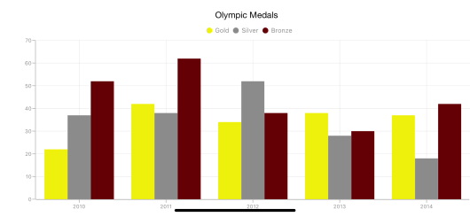

# Color Palette

## Apply palette for Chart

`ColorModel` property of `SFChart` is used to define the colors for each series. ColorModel contains the following color palettes.

**Predefined Palettes**

Currently, Chart supports three different palettes. They are 

* Metro
* TomatoSpectrum
* Pineapple

Metro is the default palette for SFChart. 

The following screenshot shows the default appearance of multiple series.

**Custom Palette**

Chart will use the colors from `CustomColors` property if `ColorModel.Palette` is set to `SFChartColorPalette.Custom`.

Following code illustrates how to set the custom colors.



chart.ColorModel.Palette          = SFChartColorPalette.Custom;

chart.ColorModel.CustomColors     = NSArray.FromObjects 
                                    (UIColor.FromRGB (238, 241, 11),
                                    UIColor.FromRGB (139, 139, 139),
                                    UIColor.FromRGB (100, 0, 5)); 



**None Palette**

None palette will not apply any color to the series. So in order to define the color for any series, you can use the Color property or the ColorModel property of ChartSeries (The ColorModel of Series will be explained later in this document).

## Apply palette for Series

`ColorModel` property of `SFSeries` is used to define the colors for each data point. Following palettes are used to define the colors.

**Predefined Palettes**

Currently, Series supports three types of palette and None palette is the default palette for Series.
 
These predefined palettes are

* Metro
* Pineapple
* TomatoSpectrum



SFColumnSeries series       = new SFColumnSeries ();

series.ColorModel.Palette   = SFChartColorPalette.Metro; 



**Custom Palette**

Series will use the colors from `CustomBrushes` property if the `ColorModel.Palette` property of series is set to `Custom`.

Following code illustrates how to set the custom colors.



SFColumnSeries series           = new SFColumnSeries ();

series.ColorModel.Palette       = SFChartColorPalette.Custom;

series.ColorModel.CustomColors  = NSArray.FromObjects 
                                    (UIColor.Red, 
                                    UIColor.Gray,
                                    UIColor.Blue, 
                                    UIColor.Brown, 
                                    UIColor.Purple); 



**None Palette**

None palette will not apply any color to the data points. So in order to define the color for the data points, you can use the Color property of ChartSeries.