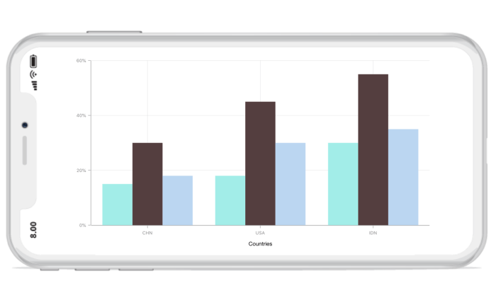

# Selection

[`SFChart`](https://help.syncfusion.com/cr/xamarin-ios/Syncfusion.SfChart.iOS.SFChart.html) supports selection that enables you to select a segment in a series or series itself.

## Data Point Selection

You can select a data point by tapping on it. To enable the selection feature, set [`EnableDataPointSelection`](https://help.syncfusion.com/cr/xamarin-ios/Syncfusion.SfChart.iOS.SFSeries.html#Syncfusion_SfChart_iOS_SFSeries_EnableDataPointSelection) property as `True` for series. 



SFColumnSeries series           = new SFColumnSeries ();

series.EnableDataPointSelection = true; 



Following properties are used to configure the selection feature,

* [`SelectedDataPointIndex`](https://help.syncfusion.com/cr/xamarin-ios/Syncfusion.SfChart.iOS.SFSeries.html#Syncfusion_SfChart_iOS_SFSeries_SelectedDataPointIndex) – used to programmatically select a data point
* [`SelectedDataPointColor`](https://help.syncfusion.com/cr/xamarin-ios/Syncfusion.SfChart.iOS.SFSeries.html#Syncfusion_SfChart_iOS_SFSeries_SelectedDataPointColor) – used to change the selected data point color



SFColumnSeries series           = new SFColumnSeries ();

series.EnableDataPointSelection = true;

series.SelectedDataPointIndex   = 2;

series.SelectedDataPointColor   = UIColor.Red; 



N> For Accumulation series like pie, doughnut, pyramid and funnel, when you select a data point, the corresponding legend item also will be selected.

## Series Selection

Series selection is used in case of multiple series when you want to highlight a particular series. Series Selection can be enabled by setting [`EnableSeriesSelection`](https://help.syncfusion.com/cr/xamarin-ios/Syncfusion.SfChart.iOS.ChartBase.html#Syncfusion_SfChart_iOS_ChartBase_EnableSeriesSelection) property to true. The [`SeriesSelectionColor`](https://help.syncfusion.com/cr/xamarin-ios/Syncfusion.SfChart.iOS.ChartBase.html#Syncfusion_SfChart_iOS_ChartBase_SeriesSelectionColor) property is used to set the color to highlight the series.



chart.EnableSeriesSelection = true;
...

SFColumnSeries series = new SFColumnSeries();
series.Color = UIColor.FromRGB(174, 235, 231);
...

SFColumnSeries series1 = new SFColumnSeries();
series1.Color = UIColor.FromRGB(211, 190, 229);
...

SFColumnSeries series2 = new SFColumnSeries();
series2.Color = UIColor.FromRGB(192, 216, 240);



To set the series selection color,



chart.SeriesSelectionColor = UIColor.FromRGB(0, 155, 247);



## Delegates

We need to implement delegate to deal with the user interactions in chart for data point selection. In order to do this,you need to adopt the [`SFChartDelegate`](https://help.syncfusion.com/cr/xamarin-ios/Syncfusion.SfChart.iOS.SFChartDelegate.html) protocol through the class extension as shown below.



public override void ViewDidLoad ()
{
    chart.Delegate = new ChartDelegate ();
}

public class ChartDelegate : SFChartDelegate
{
    public override void DidDataPointSelect (SFChart chart, SFChartSelectionInfo info)
    {

    }
}



**WillDataPointSelect**

The [`WillDataPointSelect`](https://help.syncfusion.com/cr/xamarin-ios/Syncfusion.SfChart.iOS.SFChartDelegate.html#Syncfusion_SfChart_iOS_SFChartDelegate_WillDataPointSelect_Syncfusion_SfChart_iOS_SFChart_Syncfusion_SfChart_iOS_SFChartSelectionChangingInfo_) delegate is called when the series datapoint selection operation has been started, the argument includes the [`SFChartSelectionChangingInfo`](https://help.syncfusion.com/cr/xamarin-ios/Syncfusion.SfChart.iOS.SFChartSelectionChangingInfo.html) which is used to get the selection state. The argument contains the following information.

* [`SelectedSeries`](https://help.syncfusion.com/cr/xamarin-ios/Syncfusion.SfChart.iOS.SFChartSelectionInfo.html#Syncfusion_SfChart_iOS_SFChartSelectionInfo_SelectedSeries) – used to get the series of selected data point.
* [`SelectedSegment`](https://help.syncfusion.com/cr/xamarin-ios/Syncfusion.SfChart.iOS.SFChartSelectionInfo.html#Syncfusion_SfChart_iOS_SFChartSelectionInfo_SelectedSegment) - used to get the segment of selected data point.
* [`SelectedDataPointIndex`](https://help.syncfusion.com/cr/xamarin-ios/Syncfusion.SfChart.iOS.SFChartSelectionInfo.html#Syncfusion_SfChart_iOS_SFChartSelectionInfo_SelectedDataPointIndex) – used to get the selected data point index.
* [`PreviousSelectedIndex`](https://help.syncfusion.com/cr/xamarin-ios/Syncfusion.SfChart.iOS.SFChartSelectionInfo.html#Syncfusion_SfChart_iOS_SFChartSelectionInfo_PreviousSelectedIndex) – used to get the previous selected data point index.
* [`PreviousSelectedSeries`](https://help.syncfusion.com/cr/xamarin-ios/Syncfusion.SfChart.iOS.SFChartSelectionInfo.html#Syncfusion_SfChart_iOS_SFChartSelectionInfo_PreviousSelectedSeries) - used to get the previous selected series. 
* [`Cancel`](https://help.syncfusion.com/cr/xamarin-ios/Syncfusion.SfChart.iOS.SFChartSelectionChangingInfo.html#Syncfusion_SfChart_iOS_SFChartSelectionChangingInfo_Cancel) – used to set the value indicating whether the selection should be canceled.

**DidDataPointSelect**

The [`DidDataPointSelect`](https://help.syncfusion.com/cr/xamarin-ios/Syncfusion.SfChart.iOS.SFChartDelegate.html#Syncfusion_SfChart_iOS_SFChartDelegate_DidDataPointSelect_Syncfusion_SfChart_iOS_SFChart_Syncfusion_SfChart_iOS_SFChartSelectionInfo_)  delegate is called when the series datapoint selection operation has been started, the argument includes the [`SFChartSelectionInfo`](https://help.syncfusion.com/cr/xamarin-ios/Syncfusion.SfChart.iOS.SFChartSelectionInfo.html) which is used to get the selection state. The argument contains the following information.

* [`SelectedSeries`](https://help.syncfusion.com/cr/xamarin-ios/Syncfusion.SfChart.iOS.SFChartSelectionInfo.html#Syncfusion_SfChart_iOS_SFChartSelectionInfo_SelectedSeries) – used to get the series of selected data point.
* [`SelectedSegment`](https://help.syncfusion.com/cr/xamarin-ios/Syncfusion.SfChart.iOS.SFChartSelectionInfo.html#Syncfusion_SfChart_iOS_SFChartSelectionInfo_SelectedSegment) - used to get the segment of selected data point.
* [`SelectedDataPointIndex`](https://help.syncfusion.com/cr/xamarin-ios/Syncfusion.SfChart.iOS.SFChartSelectionInfo.html#Syncfusion_SfChart_iOS_SFChartSelectionInfo_SelectedDataPointIndex) – used to get the selected data point index.
* [`PreviousSelectedIndex`](https://help.syncfusion.com/cr/xamarin-ios/Syncfusion.SfChart.iOS.SFChartSelectionInfo.html#Syncfusion_SfChart_iOS_SFChartSelectionInfo_PreviousSelectedIndex) – used to get the previous selected data point index.
* [`PreviousSelectedSeries`](https://help.syncfusion.com/cr/xamarin-ios/Syncfusion.SfChart.iOS.SFChartSelectionInfo.html#Syncfusion_SfChart_iOS_SFChartSelectionInfo_PreviousSelectedSeries) - used to get the previous selected series. 
