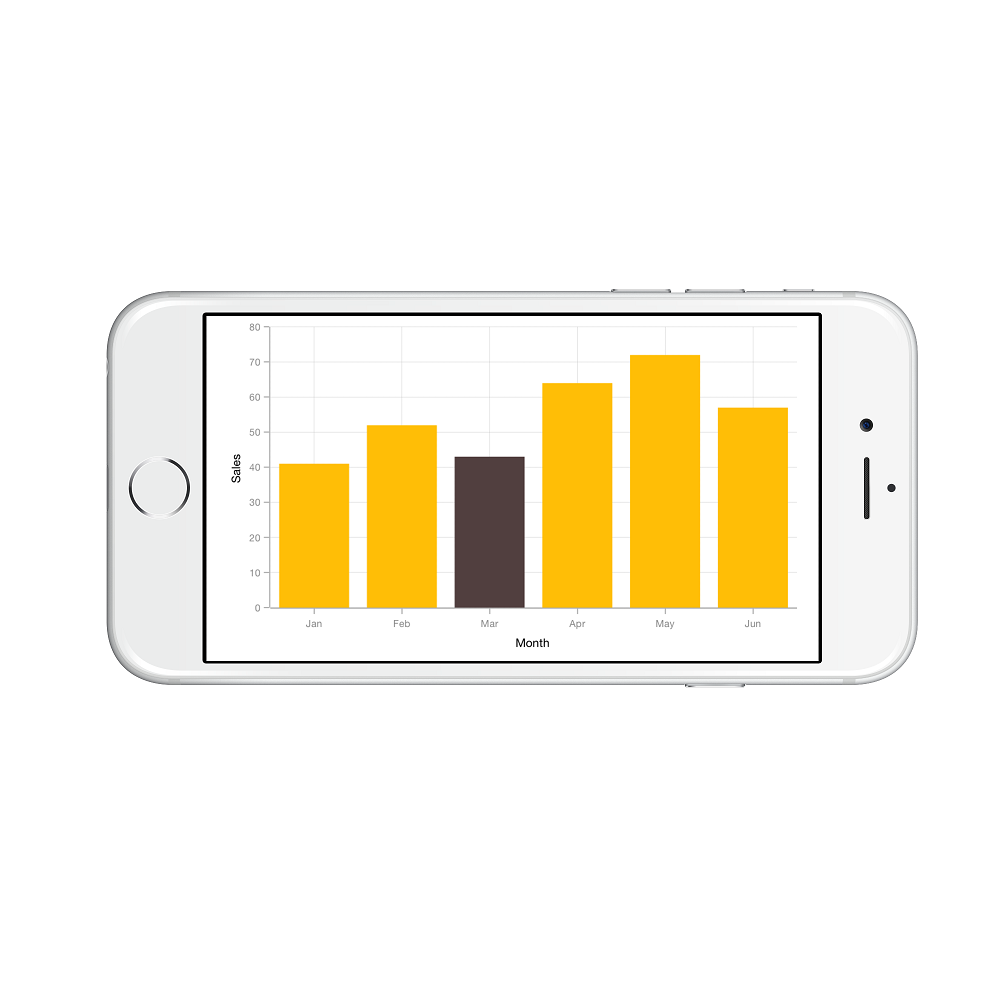
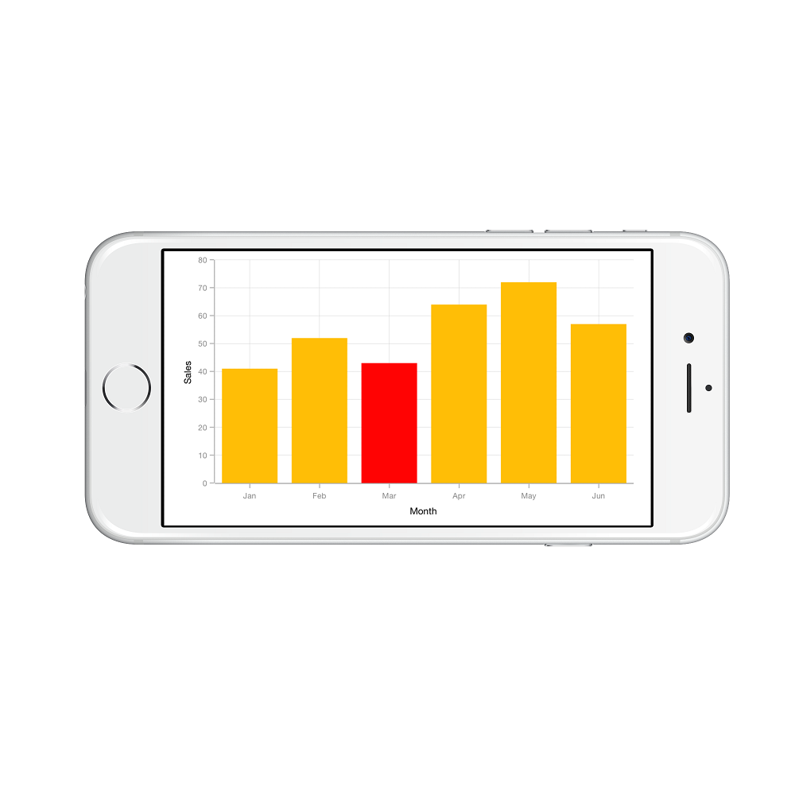

# Data Point Selection

You can select a data point by tapping on it. To enable the selection feature, set [`EnableDataPointSelection`](https://help.syncfusion.com/cr/cref_files/xamarin-ios/sfchart/Syncfusion.SFChart.iOS~Syncfusion.SfChart.iOS.SFSeries~EnableDataPointSelection.html) property as `True` for series. 



SFColumnSeries series           = new SFColumnSeries ();

series.EnableDataPointSelection = true; 



Following properties are used to configure the selection feature,

* [`SelectedDataPointIndex`](https://help.syncfusion.com/cr/cref_files/xamarin-ios/sfchart/Syncfusion.SFChart.iOS~Syncfusion.SfChart.iOS.SFSeries~SelectedDataPointIndex.html) – used to programmatically select a data point
* [`SelectedDataPointColor`](https://help.syncfusion.com/cr/cref_files/xamarin-ios/sfchart/Syncfusion.SFChart.iOS~Syncfusion.SfChart.iOS.SFSeries~SelectedDataPointColor.html) – used to change the selected data point color



SFColumnSeries series           = new SFColumnSeries ();

series.EnableDataPointSelection = true;

series.SelectedDataPointIndex   = 2;

series.SelectedDataPointColor   = UIColor.Red; 



N> For Accumulation series like pie, doughnut, pyramid and funnel, when you select a data point, the corresponding legend item also will be selected.

## Delegates

We need to implement delegate to deal with the user interactions in chart for data point selection. In order to do this,you need to adopt the [`SFChartDelegate`](https://help.syncfusion.com/cr/cref_files/xamarin-ios/sfchart/Syncfusion.SFChart.iOS~Syncfusion.SfChart.iOS.SFChartDelegate.html) protocol through the class extension as shown below.



public override void ViewDidLoad ()
{
    chart.Delegate = new ChartDelegate ();
}

public class ChartDelegate : SFChartDelegate
{
    public override void DidDataPointSelect (SFChart chart, SFChartSelectionInfo info)
    {

    }
}



**WillDataPointSelect**

The [`WillDataPointSelect`](https://help.syncfusion.com/cr/cref_files/xamarin-ios/sfchart/Syncfusion.SFChart.iOS~Syncfusion.SfChart.iOS.SFChartDelegate~WillDataPointSelect.html) delegate is called when the series datapoint selection operation has been started, the argument includes the [`SFChartSelectionChangingInfo`](https://help.syncfusion.com/cr/cref_files/xamarin-ios/sfchart/Syncfusion.SFChart.iOS~Syncfusion.SfChart.iOS.SFChartSelectionChangingInfo.html) which is used to get the selection state. The argument contains the following information.

* [`SelectedSeries`](https://help.syncfusion.com/cr/cref_files/xamarin-ios/sfchart/Syncfusion.SFChart.iOS~Syncfusion.SfChart.iOS.SFChartSelectionInfo~SelectedSeries.html) – used to get the series of selected data point.
* [`SelectedSegment`](https://help.syncfusion.com/cr/cref_files/xamarin-ios/sfchart/Syncfusion.SFChart.iOS~Syncfusion.SfChart.iOS.SFChartSelectionInfo~SelectedSegment.html) - used to get the segment of selected data point.
* [`SelectedDataPointIndex`](https://help.syncfusion.com/cr/cref_files/xamarin-ios/sfchart/Syncfusion.SFChart.iOS~Syncfusion.SfChart.iOS.SFChartSelectionInfo~SelectedDataPointIndex.html) – used to get the selected data point index.
* [`PreviousSelectedIndex`](https://help.syncfusion.com/cr/cref_files/xamarin-ios/sfchart/Syncfusion.SFChart.iOS~Syncfusion.SfChart.iOS.SFChartSelectionInfo~PreviousSelectedIndex.html) – used to get the previous selected data point index.
* [`Cancel`](https://help.syncfusion.com/cr/cref_files/xamarin-ios/sfchart/Syncfusion.SFChart.iOS~Syncfusion.SfChart.iOS.SFChartSelectionChangingInfo~Cancel.html) – used to set the value indicating whether the selection should be canceled.

**DidDataPointSelect**

The [`DidDataPointSelect`](https://help.syncfusion.com/cr/cref_files/xamarin-ios/sfchart/Syncfusion.SFChart.iOS~Syncfusion.SfChart.iOS.SFChartDelegate~DidDataPointSelect.html)  delegate is called when the series datapoint selection operation has been started, the argument includes the [`SFChartSelectionInfo`](https://help.syncfusion.com/cr/cref_files/xamarin-ios/sfchart/Syncfusion.SFChart.iOS~Syncfusion.SfChart.iOS.SFChartSelectionInfo.html) which is used to get the selection state. The argument contains the following information.

* [`SelectedSeries`](https://help.syncfusion.com/cr/cref_files/xamarin-ios/sfchart/Syncfusion.SFChart.iOS~Syncfusion.SfChart.iOS.SFChartSelectionInfo~SelectedSeries.html) – used to get the series of selected data point.
* [`SelectedSegment`](https://help.syncfusion.com/cr/cref_files/xamarin-ios/sfchart/Syncfusion.SFChart.iOS~Syncfusion.SfChart.iOS.SFChartSelectionInfo~SelectedSegment.html) - used to get the segment of selected data point.
* [`SelectedDataPointIndex`](https://help.syncfusion.com/cr/cref_files/xamarin-ios/sfchart/Syncfusion.SFChart.iOS~Syncfusion.SfChart.iOS.SFChartSelectionInfo~SelectedDataPointIndex.html) – used to get the selected data point index.
* [`PreviousSelectedIndex`](https://help.syncfusion.com/cr/cref_files/xamarin-ios/sfchart/Syncfusion.SFChart.iOS~Syncfusion.SfChart.iOS.SFChartSelectionInfo~PreviousSelectedIndex.html) – used to get the previous selected data point index.
