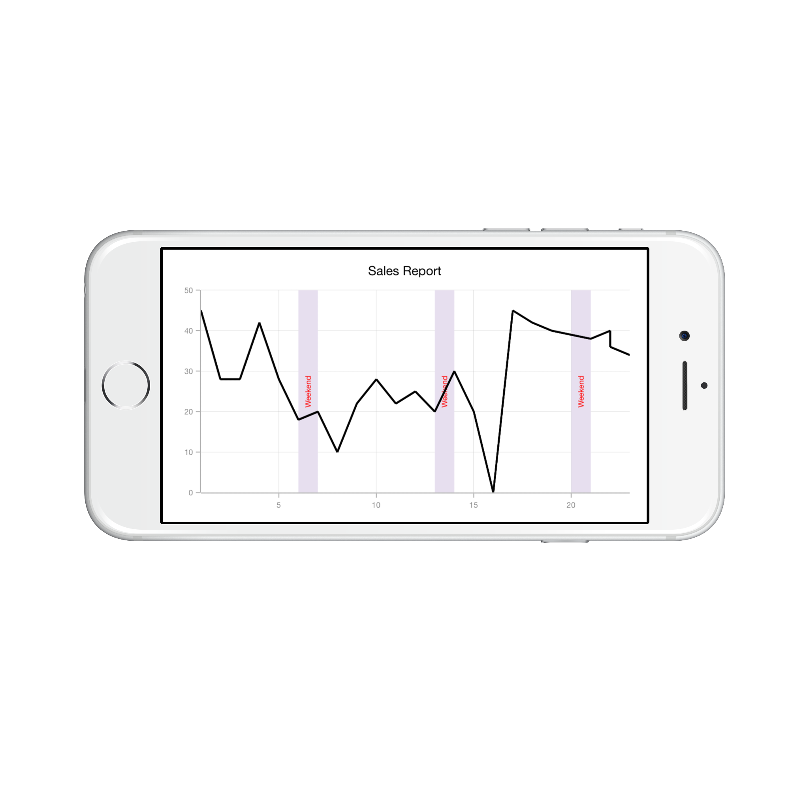
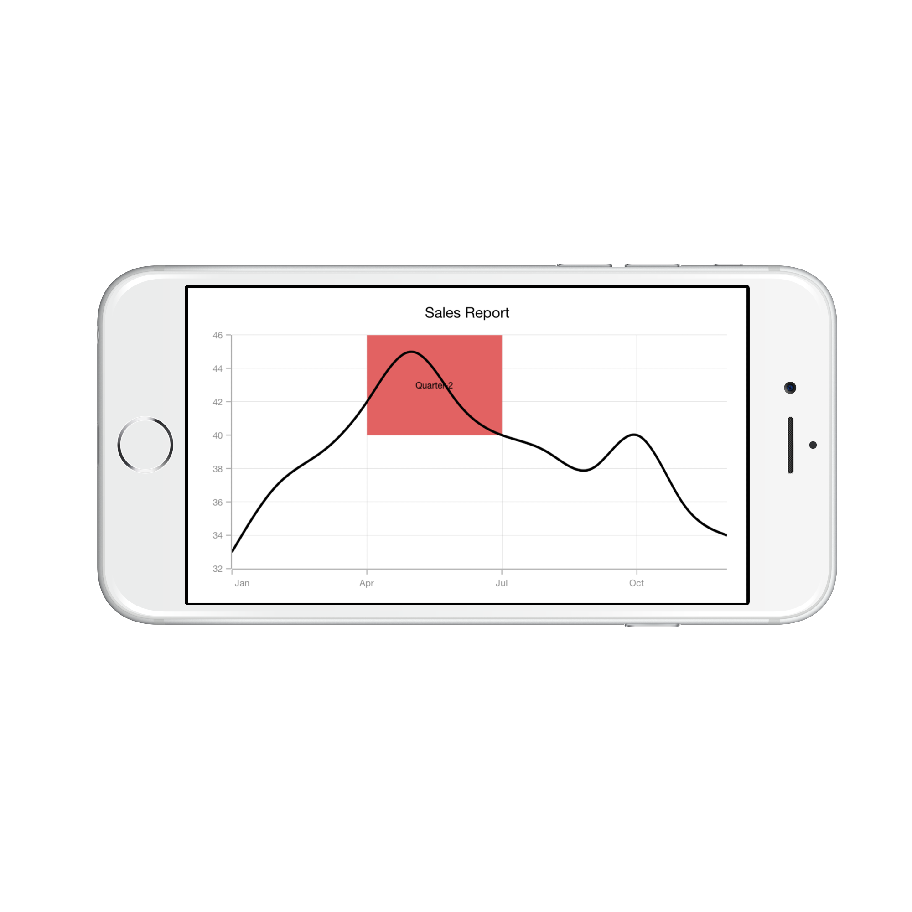

# Strip Lines

## What is strip line?

Strip lines are used to shade the different ranges in plot area in different colors to improve the readability of the chart. You can annotate it with text to indicate what that particular region indicates. You can also enable the strip lines to be drawn repeatedly at regular intervals – this will be useful when you want to mark an event that occurs recursively along the timeline of the chart.

## How to add strip lines?

Strip line is classified into **NumericalStripLine** and **DateTimeStripLine** based on the type of input you provide to draw the strip line. Since strip lines are drawn based on the axis, you have to add strip line instance to [`AddStripLine`](https://help.syncfusion.com/cr/cref_files/xamarin-ios/sfchart/Syncfusion.SFChart.iOS~Syncfusion.SfChart.iOS.SFAxis~AddStripLine.html) method of respective axis. You can also add multiple strip lines to an axis.

Following properties are used to configure the strip line.

* [`Start`](https://help.syncfusion.com/cr/cref_files/xamarin-ios/sfchart/Syncfusion.SFChart.iOS~Syncfusion.SfChart.iOS.SFChartNumericalStripLine~Start.html) – used to change the start position of the strip line.
* [`Width`](https://help.syncfusion.com/cr/cref_files/xamarin-ios/sfchart/Syncfusion.SFChart.iOS~Syncfusion.SfChart.iOS.SFChartStripLine~Width.html) – used to change how long strip line should expand.
* [`WidthType`](https://help.syncfusion.com/cr/cref_files/xamarin-ios/sfchart/Syncfusion.SFChart.iOS~Syncfusion.SfChart.iOS.SFChartDateTimeStripLine~WidthType.html) - used to change the date time unit of the value specified in the width property.
* [`Text`](https://help.syncfusion.com/cr/cref_files/xamarin-ios/sfchart/Syncfusion.SFChart.iOS~Syncfusion.SfChart.iOS.SFChartStripLine~Text.html) – used to change the text of the strip line.
* [`BackgroundColor`](https://help.syncfusion.com/cr/cref_files/xamarin-ios/sfchart/Syncfusion.SFChart.iOS~Syncfusion.SfChart.iOS.SFChartStripLine~BackgroundColor.html) – used to change the background color of the strip line.
* [`BorderWidth`](https://help.syncfusion.com/cr/cref_files/xamarin-ios/sfchart/Syncfusion.SFChart.iOS~Syncfusion.SfChart.iOS.SFChartStripLine~BorderWidth.html) – used to change the border width of the strip line.
* [`BorderColor`](https://help.syncfusion.com/cr/cref_files/xamarin-ios/sfchart/Syncfusion.SFChart.iOS~Syncfusion.SfChart.iOS.SFChartStripLine~BorderColor.html) – used to change the border color of the strip line.
* [`Visible`](https://help.syncfusion.com/cr/cref_files/xamarin-ios/sfchart/Syncfusion.SFChart.iOS~Syncfusion.SfChart.iOS.SFChartStripLine~Visible.html) - used to change the visibility of the strip line in chart axis.
* [`IsPixelWidth`](https://help.syncfusion.com/cr/cref_files/xamarin-ios/sfchart/Syncfusion.SFChart.iOS~Syncfusion.SfChart.iOS.SFChartStripLine~IsPixelWidth.html) - used to specify the unit type for [`Width`](https://help.syncfusion.com/cr/cref_files/xamarin-ios/sfchart/Syncfusion.SFChart.iOS~Syncfusion.SfChart.iOS.SFChartStripLine~Width.html) property, whether it will be screen point or chart value.

**NumericalStripLine**

[`SFChartNumericalStripLine`](https://help.syncfusion.com/cr/cref_files/xamarin-ios/sfchart/Syncfusion.SFChart.iOS~Syncfusion.SfChart.iOS.SFChartNumericalStripLine.html) are used to draw strip lines for [`SFNumericalAxis`](https://help.syncfusion.com/cr/cref_files/xamarin-ios/sfchart/Syncfusion.SFChart.iOS~Syncfusion.SfChart.iOS.SFNumericalAxis.html) and [`SFCategoryAxis`](https://help.syncfusion.com/cr/cref_files/xamarin-ios/sfchart/Syncfusion.SFChart.iOS~Syncfusion.SfChart.iOS.SFCategoryAxis.html). To add a strip line, create an instance of [`SFChartNumericalStripLine`](https://help.syncfusion.com/cr/cref_files/xamarin-ios/sfchart/Syncfusion.SFChart.iOS~Syncfusion.SfChart.iOS.SFChartNumericalStripLine.html) and add to the [`StripLines`](https://help.syncfusion.com/cr/cref_files/xamarin-ios/sfchart/Syncfusion.SFChart.iOS~Syncfusion.SfChart.iOS.SFNumericalAxis~StripLines.html) collection property using [`AddStripLine`](https://help.syncfusion.com/cr/cref_files/xamarin-ios/sfchart/Syncfusion.SFChart.iOS~Syncfusion.SfChart.iOS.SFNumericalAxis~AddStripLine.html) method of the respective axis.



SFNumericalAxis yAxis   = new SFNumericalAxis ();

chart.SecondaryAxis     = yAxis;

yAxis.Minimum           = new NSNumber (28);

yAxis.Maximum           = new NSNumber (52); 

SFChartNumericalStripLine stripLine = new SFChartNumericalStripLine ();

stripLine.Start                     = 36;

stripLine.Width                     = 8;

stripLine.Text                      = "Average Temperature";

stripLine.BackgroundColor           = UIColor.FromRGB (244, 199, 98);

yAxis.AddStripLine (stripLine); 



**DateTimeStripLine**

As the name indicates, [`SFChartDateTimeStripLine`](https://help.syncfusion.com/cr/cref_files/xamarin-ios/sfchart/Syncfusion.SFChart.iOS~Syncfusion.SfChart.iOS.SFChartDateTimeStripLine.html) are used to draw strip lines for [`SFDateTimeAxis`](https://help.syncfusion.com/cr/cref_files/xamarin-ios/sfchart/Syncfusion.SFChart.iOS~Syncfusion.SfChart.iOS.SFDateTimeAxis.html). To add a strip line for [`SFDateTimeAxis`](https://help.syncfusion.com/cr/cref_files/xamarin-ios/sfchart/Syncfusion.SFChart.iOS~Syncfusion.SfChart.iOS.SFDateTimeAxis.html), create an instance of [`SFChartDateTimeStripLine`](https://help.syncfusion.com/cr/cref_files/xamarin-ios/sfchart/Syncfusion.SFChart.iOS~Syncfusion.SfChart.iOS.SFChartDateTimeStripLine.html) and add to the [`StripLines`](https://help.syncfusion.com/cr/cref_files/xamarin-ios/sfchart/Syncfusion.SFChart.iOS~Syncfusion.SfChart.iOS.SFDateTimeAxis~StripLines.html) collection property using [`AddStripLine`](https://help.syncfusion.com/cr/cref_files/xamarin-ios/sfchart/Syncfusion.SFChart.iOS~Syncfusion.SfChart.iOS.SFDateTimeAxis~AddStripLine.html) method of [`SFDateTimeAxis`](https://help.syncfusion.com/cr/cref_files/xamarin-ios/sfchart/Syncfusion.SFChart.iOS~Syncfusion.SfChart.iOS.SFDateTimeAxis.html).



SFDateTimeAxis xAxis                  = new SFDateTimeAxis ();

chart.PrimaryAxis                     = xAxis; 

SFChartDateTimeStripLine stripLine    = new SFChartDateTimeStripLine ();

NSDateFormatter dateFormatter         = new NSDateFormatter ();

dateFormatter.DateFormat              = new NSString ("dd/MM/yyyy"); 

stripLine.Start                       = dateFormatter.Parse ("01/04/2010"); 

stripLine.WidthType                   = SFChartDateTimeIntervalType.Months;

stripLine.Width                       = 3;

stripLine.Text                        = "Quarter - 2";

stripLine.BackgroundColor             = UIColor.FromRGB (30, 115, 15);

xAxis.AddStripLine (stripLine); 



## Strip Line Recurrence

This feature is used to enable the strip lines to be drawn repeatedly at the regular intervals – this will be useful when you want to mark an event that occurs recursively along the timeline of the chart. Following properties are used to configure this feature.

* [`RepeatEvery`](https://help.syncfusion.com/cr/cref_files/xamarin-ios/sfchart/Syncfusion.SFChart.iOS~Syncfusion.SfChart.iOS.SFChartStripLine~RepeatEvery.html) – used to change the frequency of the strip line being repeated.
* [`RepeatEveryType`](https://help.syncfusion.com/cr/cref_files/xamarin-ios/sfchart/Syncfusion.SFChart.iOS~Syncfusion.SfChart.iOS.SFChartDateTimeStripLine~RepeatEveryType.html) - specifies the date time unit of the value specified in the [`RepeatEvery`](https://help.syncfusion.com/cr/cref_files/xamarin-ios/sfchart/Syncfusion.SFChart.iOS~Syncfusion.SfChart.iOS.SFChartStripLine~RepeatEvery.html) property.
* [`RepeatUntil`](https://help.syncfusion.com/cr/cref_files/xamarin-ios/sfchart/Syncfusion.SFChart.iOS~Syncfusion.SfChart.iOS.SFChartNumericalStripLine~RepeatUntil.html) – specifies the end value at which point strip line has to stop repeating.

Following code snippet and screenshot demonstrates this feature by highlighting weekends. 



SFNumericalAxis xAxis = new SFNumericalAxis ();

chart.PrimaryAxis = xAxis; 

SFChartNumericalStripLine stripLine = new SFChartNumericalStripLine();

stripLine.BackgroundColor           = UIColor.FromRGB(231,223,239);

stripLine.Start                     = 6;

stripLine.Width                     = 1;

stripLine.RepeatEvery               = 7;

stripLine.Text                      = "Weekend";

stripLine.LabelStyle.Angle          = 270;

stripLine.LabelStyle.Color          = UIColor.Red;

xAxis.AddStripLine(stripLine); 



## Customize Text

The [`LabelStyle`](https://help.syncfusion.com/cr/cref_files/xamarin-ios/sfchart/Syncfusion.SFChart.iOS~Syncfusion.SfChart.iOS.SFChartStripLine~LabelStyle.html) property provide options to customize the font-family, color, size and font-weight of strip line text. Following are the options available,

* [`Color`](https://help.syncfusion.com/cr/cref_files/xamarin-ios/sfchart/Syncfusion.SFChart.iOS~Syncfusion.SfChart.iOS.SFLabelStyle~Color.html) – used to change the color of the text.
* [`BackgroundColor`](https://help.syncfusion.com/cr/cref_files/xamarin-ios/sfchart/Syncfusion.SFChart.iOS~Syncfusion.SfChart.iOS.SFLabelStyle~BackgroundColor.html) – used to change the label background color.
* [`BorderColor`](https://help.syncfusion.com/cr/cref_files/xamarin-ios/sfchart/Syncfusion.SFChart.iOS~Syncfusion.SfChart.iOS.SFLabelStyle~BorderColor.html) – used to change the border color.
* [`BorderWidth`](https://help.syncfusion.com/cr/cref_files/xamarin-ios/sfchart/Syncfusion.SFChart.iOS~Syncfusion.SfChart.iOS.SFLabelStyle~BorderWidth.html) – used to change the width of the border.
* [`BorderDashes`](https://help.syncfusion.com/cr/cref_files/xamarin-ios/sfchart/Syncfusion.SFChart.iOS~Syncfusion.SfChart.iOS.SFChartStripLine~BorderDashes.html) – used to set the dashes for border.
* [`Font`](https://help.syncfusion.com/cr/cref_files/xamarin-ios/sfchart/Syncfusion.SFChart.iOS~Syncfusion.SfChart.iOS.SFLabelStyle~Font.html)– used to change the text size, font family and font weight.
* [`Margin`](https://help.syncfusion.com/cr/cref_files/xamarin-ios/sfchart/Syncfusion.SFChart.iOS~Syncfusion.SfChart.iOS.SFLabelStyle~Margin.html) - used to change the margin size for text.
* [`Angle`](https://help.syncfusion.com/cr/cref_files/xamarin-ios/sfchart/Syncfusion.SFChart.iOS~Syncfusion.SfChart.iOS.SFStripLineLabelStyle~Angle.html) – used to rotate the text.
* [`HorizontalAlignment`](https://help.syncfusion.com/cr/cref_files/xamarin-ios/sfchart/Syncfusion.SFChart.iOS~Syncfusion.SfChart.iOS.SFStripLineLabelStyle~HorizontalAlignment.html) – used to change the horizontal alignment of text.
* [`VerticalAlignment`](https://help.syncfusion.com/cr/cref_files/xamarin-ios/sfchart/Syncfusion.SFChart.iOS~Syncfusion.SfChart.iOS.SFStripLineLabelStyle~VerticalAlignment.html)  - used to change the vertical alignment of text.
* [`CornerRadius`](https://help.syncfusion.com/cr/cref_files/xamarin-ios/sfchart/Syncfusion.SFChart.iOS~Syncfusion.SfChart.iOS.SFChartStripLine~CornerRadius.html) – used to set the corner radius for striplines.



SFNumericalAxis yAxis = new SFNumericalAxis ();

chart.SecondaryAxis  = yAxis;

SFChartNumericalStripLine stripLine         = new SFChartNumericalStripLine ();

stripLine.Start                             = 42;

stripLine.Width                             = 6;

stripLine.Text                              = "High Temperature";

stripLine.BackgroundColor                   = UIColor.FromRGB (228, 98, 98);

stripLine.LabelStyle.Color                  = UIColor.Blue;

stripLine.LabelStyle.HorizontalAlignment    = SFChartAlignment.Near;

stripLine.LabelStyle.VerticalAlignment      = SFChartAlignment.Center;

yAxis.AddStripLine (stripLine); 



## Segmented StripLine

Typically, if you draw a strip line for a vertical axis, the height of the strip line is determined by the [`Start`](https://help.syncfusion.com/cr/cref_files/xamarin-ios/sfchart/Syncfusion.SFChart.iOS~Syncfusion.SfChart.iOS.SFChartNumericalStripLine~Start.html) and [`Width`](https://help.syncfusion.com/cr/cref_files/xamarin-ios/sfchart/Syncfusion.SFChart.iOS~Syncfusion.SfChart.iOS.SFChartStripLine~Width.html) properties and width of the strip line is equivalent to the width of its associated horizontal axis i.e., strip line is drawn horizontally to the entire stretch of its associated horizontal axis. Similarly, for horizontal axis, width is determined by [`Start`](https://help.syncfusion.com/cr/cref_files/xamarin-ios/sfchart/Syncfusion.SFChart.iOS~Syncfusion.SfChart.iOS.SFChartNumericalStripLine~Start.html) and [`Width`](https://help.syncfusion.com/cr/cref_files/xamarin-ios/sfchart/Syncfusion.SFChart.iOS~Syncfusion.SfChart.iOS.SFChartStripLine~Width.html) properties, and vertically, it is drawn to the entire stretch of the associated vertical axis.

Suppose, you want to draw a strip line that should not stretch along its associated axis, you have to set [`SegmentStartValue`](https://help.syncfusion.com/cr/cref_files/xamarin-ios/sfchart/Syncfusion.SFChart.iOS~Syncfusion.SfChart.iOS.SFChartStripLine~SegmentStartValue.html) and [`SegmentEndValue`](https://help.syncfusion.com/cr/cref_files/xamarin-ios/sfchart/Syncfusion.SFChart.iOS~Syncfusion.SfChart.iOS.SFChartStripLine~SegmentEndValue.html) properties. Values provided in these two properties correspond to its associated axis specified by [`SegmentAxisName`](https://help.syncfusion.com/cr/cref_files/xamarin-ios/sfchart/Syncfusion.SFChart.iOS~Syncfusion.SfChart.iOS.SFChartStripLine~SegmentAxisName.html) property. Finally, you need to set [`EnableSegmentStripline`](https://help.syncfusion.com/cr/cref_files/xamarin-ios/sfchart/Syncfusion.SFChart.iOS~Syncfusion.SfChart.iOS.SFChartStripLine~EnableSegmentStripLine.html) property to true to indicate that strip line should be drawn as a segment.

* [`EnableSegmentStripline`](https://help.syncfusion.com/cr/cref_files/xamarin-ios/sfchart/Syncfusion.SFChart.iOS~Syncfusion.SfChart.iOS.SFChartStripLine~EnableSegmentStripLine.html) – Used to enable / disable the segmented strip line.
* [`SegmentStartValue`](https://help.syncfusion.com/cr/cref_files/xamarin-ios/sfchart/Syncfusion.SFChart.iOS~Syncfusion.SfChart.iOS.SFChartStripLine~SegmentStartValue.html) – Used to change the segment start value. Value correspond to associated axis.
* [`SegmentEndValue`](https://help.syncfusion.com/cr/cref_files/xamarin-ios/sfchart/Syncfusion.SFChart.iOS~Syncfusion.SfChart.iOS.SFChartStripLine~SegmentEndValue.html) – Used to change the segment end value. Value correspond to associated axis.
* [`SegmentAxisName`](https://help.syncfusion.com/cr/cref_files/xamarin-ios/sfchart/Syncfusion.SFChart.iOS~Syncfusion.SfChart.iOS.SFChartStripLine~SegmentAxisName.html) – Specify the name of the associated axis name.

N> You can set the double or DateTime value for SegmentStart and SegmentEnd properties based on the associated axis type.

Following code snippet shows how to set the segment start and end value if the associated axis type is numerical.



SFCategoryAxis xAxis        = new SFCategoryAxis ();

chart.PrimaryAxis           = xAxis;

xAxis.EdgeLabelsDrawingMode = SFChartAxisEdgeLabelsDrawingMode.Shift;

xAxis.Interval              = new NSNumber (3); 

SFChartNumericalStripLine stripLine = new SFChartNumericalStripLine ();

stripLine.Start                     = 3;

stripLine.Width                     = 3;

stripLine.Text                      = "Quarter-2";

stripLine.BackgroundColor           = UIColor.FromRGB (226, 98, 98);

stripLine.EnableSegmentStripLine    = true;

stripLine.SegmentAxisName           = new NSString ("Amount");

stripLine.SegmentStartValue         = new NSNumber (40);

stripLine.SegmentEndValue           = new NSNumber (46);

xAxis.AddStripLine (stripLine); 



Following code snippet shows how to set the segment start and end value if the associated axis type is date time. 



SFDateTimeAxis xAxis    = new SFDateTimeAxis ();

chart.PrimaryAxis       = xAxis;

SFNumericalAxis yAxis   = new SFNumericalAxis ();

chart.SecondaryAxis     = yAxis;

yAxis.Minimum           = new NSNumber (30);

yAxis.Maximum           = new NSNumber (48); 

SFChartNumericalStripLine stripLine = new SFChartNumericalStripLine ();

stripLine.Start                     = 42;

stripLine.Width                     = 4;

stripLine.Text                      = "Quarter-2";

stripLine.BackgroundColor           = UIColor.FromRGB (63, 158, 19);

stripLine.EnableSegmentStripLine    = true;

stripLine.SegmentAxisName           = new NSString ("Period");

NSDateFormatter dateFormatter       = new NSDateFormatter ();

dateFormatter.DateFormat            = new NSString ("dd/MM/yyyy");

stripLine.SegmentStartValue         = dateFormatter.Parse ("01/04/2010");

stripLine.SegmentEndValue           = dateFormatter.Parse ("30/06/2010"); 

yAxis.AddStripLine (stripLine);	



