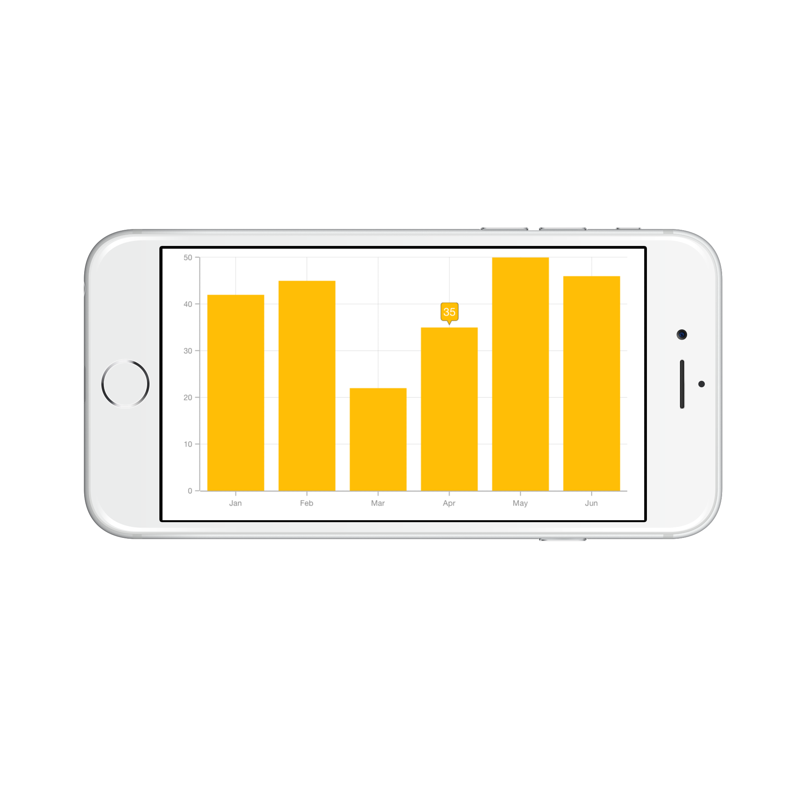
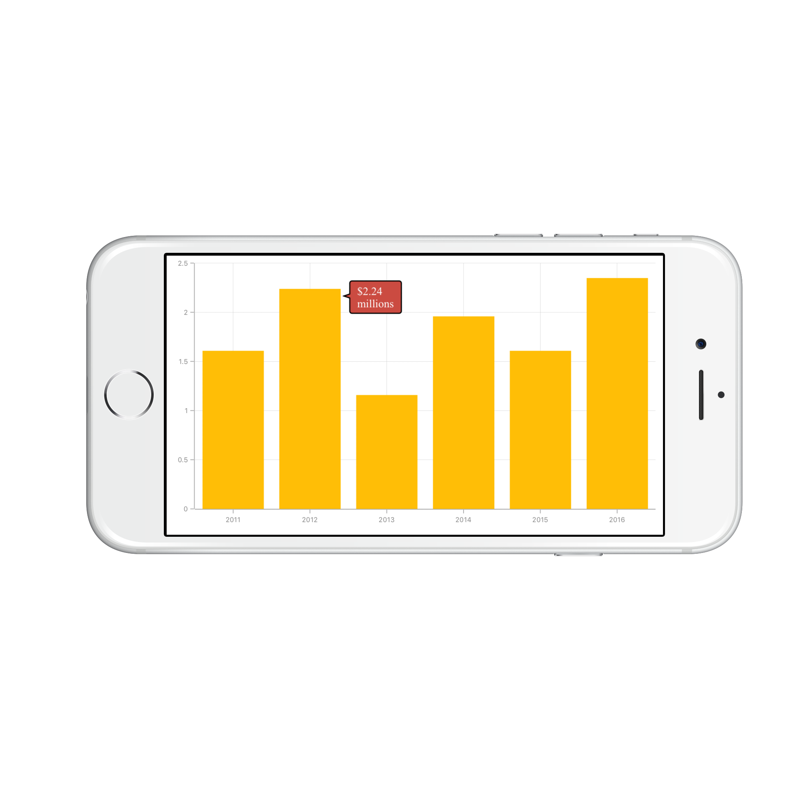
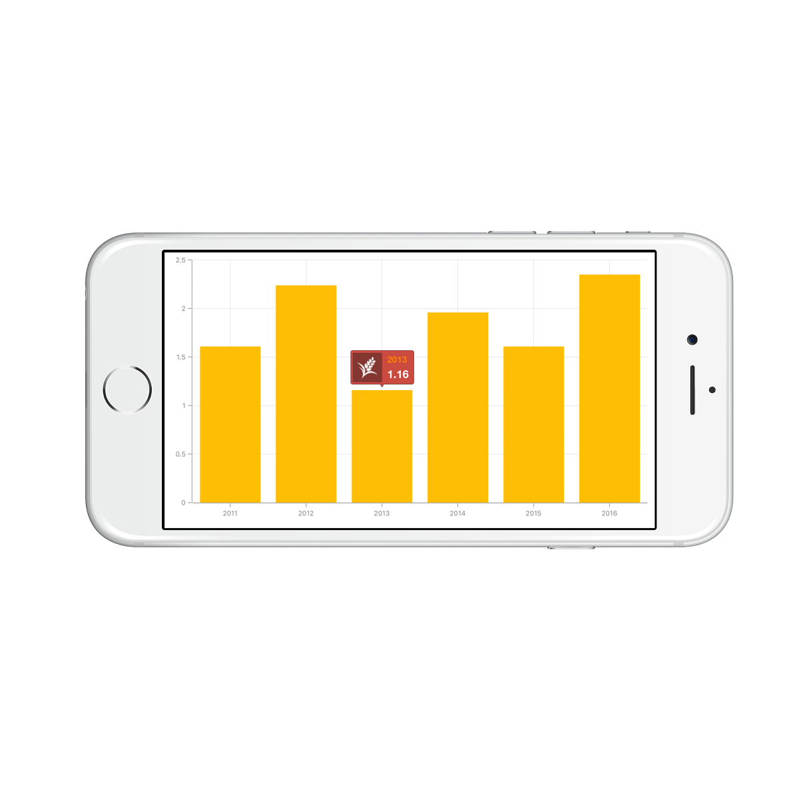

# Tooltip 

[`SFChart`](https://help.syncfusion.com/cr/cref_files/xamarin-ios/sfchart/Syncfusion.SFChart.iOS~Syncfusion.SfChart.iOS.SFChart.html
) provides tooltip support for all series. It is used to show information about the segment, when you tap on
the segment. To enable the tooltip, you need to set [`EnableTooltip`](https://help.syncfusion.com/cr/cref_files/xamarin-ios/sfchart/Syncfusion.SFChart.iOS~Syncfusion.SfChart.iOS.SFSeries~EnableTooltip.html) property as true.



SFColumnSeries series          = new SFColumnSeries ();

series.EnableTooltip           = true;


## customizing appearance 

You can customize the tooltip label. For customizing, you need to add an instance of [`SFChartTooltipBehavior`](https://help.syncfusion.com/cr/cref_files/xamarin-ios/sfchart/Syncfusion.SFChart.iOS~Syncfusion.SfChart.iOS.SFChartTooltipBehavior.html) using the addChartBehavior method of SFChart. 

Following properties of [`SFChartTooltipBehavior`](https://help.syncfusion.com/cr/cref_files/xamarin-ios/sfchart/Syncfusion.SFChart.iOS~Syncfusion.SfChart.iOS.SFChartTooltipBehavior.html) are used to customize the tooltip label.

* [`BorderColor`](https://help.syncfusion.com/cr/cref_files/xamarin-ios/sfchart/Syncfusion.SFChart.iOS~Syncfusion.SfChart.iOS.SFChartTooltipBehavior~BorderColor.html) – used to change the label border color
* [`BorderWidth`](https://help.syncfusion.com/cr/cref_files/xamarin-ios/sfchart/Syncfusion.SFChart.iOS~Syncfusion.SfChart.iOS.SFChartTooltipBehavior~BorderWidth.html) – used to change the label border width
* [`BackgroundColor`](https://help.syncfusion.com/cr/cref_files/xamarin-ios/sfchart/Syncfusion.SFChart.iOS~Syncfusion.SfChart.iOS.SFChartTooltipBehavior~BackgroundColor.html) – used to change the label background color
* [`EdgeInsets`](https://help.syncfusion.com/cr/cref_files/xamarin-ios/sfchart/Syncfusion.SFChart.iOS~Syncfusion.SfChart.iOS.SFChartTooltipBehavior~EdgeInsets.html) – used to change tooltip content edge insets
* [`TextColor`](https://help.syncfusion.com/cr/cref_files/xamarin-ios/sfchart/Syncfusion.SFChart.iOS~Syncfusion.SfChart.iOS.SFChartTooltipBehavior~TextColor.html) – used to change the text color
* [`Font`](https://help.syncfusion.com/cr/cref_files/xamarin-ios/sfchart/Syncfusion.SFChart.iOS~Syncfusion.SfChart.iOS.SFChartTooltipBehavior~Font.html) – used to change label font size, family and weight
* [`LabelFormatter`](https://help.syncfusion.com/cr/cref_files/xamarin-ios/sfchart/Syncfusion.SFChart.iOS~Syncfusion.SfChart.iOS.SFChartTooltipBehavior~LabelFormatter.html) – used to format the label
* [`Duration`](https://help.syncfusion.com/cr/cref_files/xamarin-ios/sfchart/Syncfusion.SFChart.iOS~Syncfusion.SfChart.iOS.SFChartTooltipBehavior~Duration.html) – used to set the visible duration of label
* [`OffsetX`](https://help.syncfusion.com/cr/cref_files/xamarin-ios/sfchart/Syncfusion.SFChart.iOS~Syncfusion.SfChart.iOS.SFChartTooltipBehavior~OffsetX.html) - used to move the label horizontally
* [`OffsetY`](https://help.syncfusion.com/cr/cref_files/xamarin-ios/sfchart/Syncfusion.SFChart.iOS~Syncfusion.SfChart.iOS.SFChartTooltipBehavior~OffsetY.html) - used to move the label vertically
* [`Position`](https://help.syncfusion.com/cr/cref_files/xamarin-ios/sfchart/Syncfusion.SFChart.iOS~Syncfusion.SfChart.iOS.SFChartTooltipBehavior~Position.html) - used to position the tooltip
* [`Animation`](https://help.syncfusion.com/cr/cref_files/xamarin-ios/sfchart/Syncfusion.SFChart.iOS~Syncfusion.SfChart.iOS.SFChartTooltipBehavior~Animation.html) - used to animate the tooltip
* [`MaximumWidth`](https://help.syncfusion.com/cr/cref_files/xamarin-ios/sfchart/Syncfusion.SFChart.iOS~Syncfusion.SfChart.iOS.SFChartTooltipBehavior~MaximumWidth.html) - used to change label maximum width



SFChartTooltipBehavior behavior       = new SFChartTooltipBehavior ();

behavior.BackgroundColor              = UIColor.FromRGBA (203.0f / 255.0f, 75.0f / 255.0f, 65.0f / 255.0f, 1.0f);

behavior.BorderColor                  = UIColor.Black;

behavior.BorderWidth                  = 1.5f;

behavior.Duration                     = 10;

behavior.MaximumWidth                 = 50;

NSNumberFormatter formatter           = new NSNumberFormatter();

formatter.PositiveFormat              = "$###.00 millions";

behavior.LabelFormatter               = formatter;

behavior.Position                     = SFChartElementPosition.Right;

behavior.Animation                    = SFChartTooltipAnimation.Fade;

behavior.OffsetX                      = 22;

behavior.OffsetY                      = 5;

behavior.TextColor                    = UIColor.White;

behavior.EdgeInsets                   = new UIEdgeInsets(5 ,10, 5, 10);

behavior.Font                         = UIFont.FromName("Times",15);

chart.AddChartBehavior (behavior);


## Tooltip Methods

The [`SFChartTooltipBehavior`](https://help.syncfusion.com/cr/cref_files/xamarin-ios/sfchart/Syncfusion.SFChart.iOS~Syncfusion.SfChart.iOS.SFChartTooltipBehavior.html) helps you to deal with user interaction, with the below listed methods.

* [`Show(CGPoint,Boolean)`](https://help.syncfusion.com/cr/cref_files/xamarin-ios/sfchart/Syncfusion.SFChart.iOS~Syncfusion.SfChart.iOS.SFChartTooltipBehavior~Show(CGPoint,Boolean).html) - this method shows the tooltip if a data point is present at the specified x and y co-ordinates
* [`Show(CGPoint,UIView,Boolean)`](https://help.syncfusion.com/cr/cref_files/xamarin-ios/sfchart/Syncfusion.SFChart.iOS~Syncfusion.SfChart.iOS.SFChartTooltipBehavior~Show(CGPoint,UIView,Boolean).html) - this method shows the tooltip at the specified coordinate 
* [`Hide(Boolean)`](https://help.syncfusion.com/cr/cref_files/xamarin-ios/sfchart/Syncfusion.SFChart.iOS~Syncfusion.SfChart.iOS.SFChartTooltipBehavior~Hide.html) - this method hides the tooltip, if it is already shown
* [`GetView(SFChartToolTip)`](https://help.syncfusion.com/cr/cref_files/xamarin-ios/sfchart/Syncfusion.SFChart.iOS~Syncfusion.SfChart.iOS.SFChartTooltipBehavior~GetView.html) - this method can be overridden to customize the tooltip view or to return custom view to be displayed as a tooltip
* [`DrawRect(CGRect)`](https://help.syncfusion.com/cr/cref_files/xamarin-ios/sfchart/Syncfusion.SFChart.iOS~Syncfusion.SfChart.iOS.SFChartTooltipBehavior~DrawRect.html) - draws the tooltip within the specified rectangle

## Delegates

We need to implement delegate to deal with the user interactions in chart for tooltip. In order to do this, you need to adopt the [`SFChartDelegate`](https://help.syncfusion.com/cr/cref_files/xamarin-ios/sfchart/Syncfusion.SFChart.iOS~Syncfusion.SfChart.iOS.SFChartDelegate.html) protocol through the class extension as shown below.



public override void ViewDidLoad ()
{
    chart.Delegate = new ChartDelegate ();
}

public class ChartDelegate : SFChartDelegate
{
    public override void DidShowTooltip (SFChart chart, SFChartTooltip tooltipView)
    {

    }
}



* [`WillShowTooltip:`](https://help.syncfusion.com/cr/cref_files/xamarin-ios/sfchart/Syncfusion.SFChart.iOS~Syncfusion.SfChart.iOS.SFChartDelegate~WillShowTooltip.html) - this method is invoked before the tooltip is shown
* [`DidShowTooltip:`](https://help.syncfusion.com/cr/cref_files/xamarin-ios/sfchart/Syncfusion.SFChart.iOS~Syncfusion.SfChart.iOS.SFChartDelegate~DidShowTooltip.html) - this method is invoked after the tooltip is shown
* [`WillHideTooltip:`](https://help.syncfusion.com/cr/cref_files/xamarin-ios/sfchart/Syncfusion.SFChart.iOS~Syncfusion.SfChart.iOS.SFChartDelegate~WillHideTooltip.html) - this method is invoked before the tooltip is hidden
* [`DidHideTooltip:`](https://help.syncfusion.com/cr/cref_files/xamarin-ios/sfchart/Syncfusion.SFChart.iOS~Syncfusion.SfChart.iOS.SFChartDelegate~DidHideTooltip.html) - this method is invoked after the tooltip is hidden

## Customizing appearance of SFChartTooltip view

you can use the following properties available in the SFChartTooltip to customize the appearance of tooltip view. The customized view can be used in [`SFChartTooltipBehavior`](https://help.syncfusion.com/cr/cref_files/xamarin-ios/sfchart/Syncfusion.SFChart.iOS~Syncfusion.SfChart.iOS.SFChartTooltipBehavior.html) methods and delegates.

* [`Text`](https://help.syncfusion.com/cr/cref_files/xamarin-ios/sfchart/Syncfusion.SFChart.iOS~Syncfusion.SfChart.iOS.SFChartTooltip~Text.html) – used to change the text of the tooltip
* [`CustomView`](https://help.syncfusion.com/cr/cref_files/xamarin-ios/sfchart/Syncfusion.SFChart.iOS~Syncfusion.SfChart.iOS.SFChartTooltip~CustomView.html) – used to change the custom view of the tooltip
* [`PointerLength`](https://help.syncfusion.com/cr/cref_files/xamarin-ios/sfchart/Syncfusion.SFChart.iOS~Syncfusion.SfChart.iOS.SFChartTooltip~PointerLength.html) – used to change the pointer length of the tooltip
* [`CornerRadius`](https://help.syncfusion.com/cr/cref_files/xamarin-ios/sfchart/Syncfusion.SFChart.iOS~Syncfusion.SfChart.iOS.SFChartTooltip~CornerRadius.html) – used to change the corner radius of the tooltip
* [`Color`](https://help.syncfusion.com/cr/cref_files/xamarin-ios/sfchart/Syncfusion.SFChart.iOS~Syncfusion.SfChart.iOS.SFChartTooltip~Color.html) – used to change the tooltip color
* [`TextAlignment`](https://help.syncfusion.com/cr/cref_files/xamarin-ios/sfchart/Syncfusion.SFChart.iOS~Syncfusion.SfChart.iOS.SFChartTooltip~TextAlignment.html) – used to change text alignment horizontally
* [`Series`](https://help.syncfusion.com/cr/cref_files/xamarin-ios/sfchart/Syncfusion.SFChart.iOS~Syncfusion.SfChart.iOS.SFChartTooltip~Series.html) – returns the series at the tapped location
* [`DataPoint`](https://help.syncfusion.com/cr/cref_files/xamarin-ios/sfchart/Syncfusion.SFChart.iOS~Syncfusion.SfChart.iOS.SFChartTooltip~DataPoint.html) – returns the chart data point at the tapped location
* `ChartBehavior` - returns the SFChartTooltipBehavior of the tooltip



public override void WillShowTooltip (SFChart chart, SFChartTooltip tooltipView)
{
    UIView customView       = new UIView ();
    
    customView.Frame        = new CGRect (0,0,80,40);

    UIImageView imageView   = new UIImageView ();

    imageView.Frame         = new CGRect (0, 0, 40, 40);

    imageView.Image         = UIImage.FromBundle ("Images/grain.png");

    UILabel xLabel          = new UILabel ();

    xLabel.Frame            = new CGRect (47,0,35,18);

    xLabel.TextColor        = UIColor.Orange;

    xLabel.Font             = UIFont.FromName("Helvetica", 12f);

    xLabel.Text             = (tooltipView.DataPoint as Model).XValue.ToString();

    UILabel yLabel          = new UILabel ();
    
    yLabel.Frame            = new CGRect (47, 20, 35, 18);

    yLabel.TextColor        = UIColor.White;

    yLabel.Font             = UIFont.FromName("Helvetica", 15f);

    yLabel.Text             = tooltipView.Text;

    customView.AddSubview (imageView);

    customView.AddSubview (xLabel);

    customView.AddSubview (yLabel);

    tooltipView.CustomView  = customView;
}



## Methods

You can show or hide the chart tooltip programmatically by using the show or hide method. 

### Show method

The [`Show`](https://help.syncfusion.com/cr/cref_files/xamarin-ios/sfchart/Syncfusion.SFChart.iOS~Syncfusion.SfChart.iOS.SFChartTooltipBehavior~Show.html) method is used to activate the tooltip at the specified location.



//Arguments are x position, y position and bool value determines whether the tooltip should be animated while displaying.

tooltip.Show(pointX, pointY, true);



N> The tooltip will be activated at the specified location only if there is any data point under the specified location.

### Hide method

The [`Hide`](https://help.syncfusion.com/cr/cref_files/xamarin-ios/sfchart/Syncfusion.SFChart.iOS~Syncfusion.SfChart.iOS.SFChartTooltipBehavior~Hide.html) method is used to hide the tooltip programmatically.



//The argument determines whether the tooltip should be animated while hiding.
    
tooltip.Hide(true);


