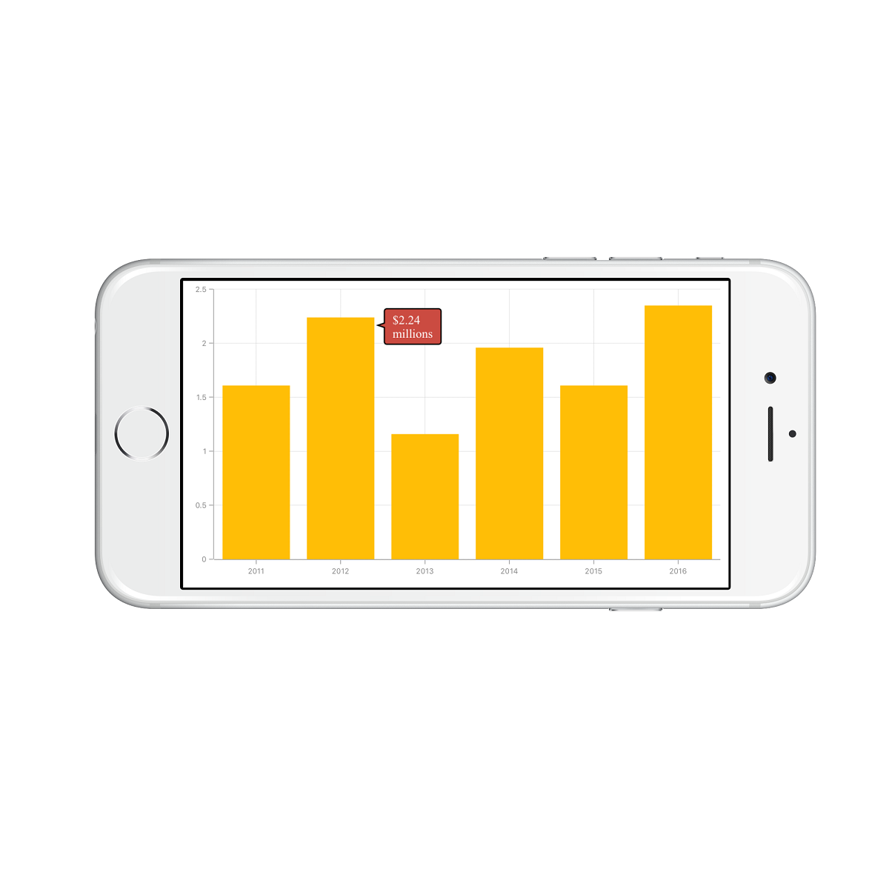

# Tooltip 

[`SFChart`](https://help.syncfusion.com/cr/xamarin-ios/Syncfusion.SfChart.iOS.SFChart.html) provides tooltip support for all series. It is used to show information about the segment, when you tap on
the segment. To enable the tooltip, you need to set [`EnableTooltip`](https://help.syncfusion.com/cr/xamarin-ios/Syncfusion.SfChart.iOS.SFSeries.html#Syncfusion_SfChart_iOS_SFSeries_EnableTooltip) property as true.



SFColumnSeries series          = new SFColumnSeries ();

series.EnableTooltip           = true;



## Customizing appearance 

You can customize the tooltip label. For customizing, you need to add an instance of [`SFChartTooltipBehavior`](https://help.syncfusion.com/cr/xamarin-ios/Syncfusion.SfChart.iOS.SFChartTooltipBehavior.html) using the addChartBehavior method of SFChart. 

Following properties of [`SFChartTooltipBehavior`](https://help.syncfusion.com/cr/xamarin-ios/Syncfusion.SfChart.iOS.SFChartTooltipBehavior.html) are used to customize the tooltip label.

* [`BorderColor`](https://help.syncfusion.com/cr/xamarin-ios/Syncfusion.SfChart.iOS.SFChartTooltipBehavior.html#Syncfusion_SfChart_iOS_SFChartTooltipBehavior_BorderColor) – used to change the label border color.
* [`BorderWidth`](https://help.syncfusion.com/cr/xamarin-ios/Syncfusion.SfChart.iOS.SFChartTooltipBehavior.html#Syncfusion_SfChart_iOS_SFChartTooltipBehavior_BorderWidth) – used to change the label border width.
* [`BackgroundColor`](https://help.syncfusion.com/cr/xamarin-ios/Syncfusion.SfChart.iOS.SFChartTooltipBehavior.html#Syncfusion_SfChart_iOS_SFChartTooltipBehavior_BackgroundColor) – used to change the label background color.
* [`EdgeInsets`](https://help.syncfusion.com/cr/xamarin-ios/Syncfusion.SfChart.iOS.SFChartTooltipBehavior.html#Syncfusion_SfChart_iOS_SFChartTooltipBehavior_EdgeInsets) – used to change tooltip content edge insets.
* [`TextColor`](https://help.syncfusion.com/cr/xamarin-ios/Syncfusion.SfChart.iOS.SFChartTooltipBehavior.html#Syncfusion_SfChart_iOS_SFChartTooltipBehavior_TextColor) – used to change the text color.
* [`Font`](https://help.syncfusion.com/cr/xamarin-ios/Syncfusion.SfChart.iOS.SFChartTooltipBehavior.html#Syncfusion_SfChart_iOS_SFChartTooltipBehavior_Font) – used to change label font size, family and weight.
* [`LabelFormatter`](https://help.syncfusion.com/cr/xamarin-ios/Syncfusion.SfChart.iOS.SFChartTooltipBehavior.html#Syncfusion_SfChart_iOS_SFChartTooltipBehavior_LabelFormatter) – used to format the label.
* [`Duration`](https://help.syncfusion.com/cr/xamarin-ios/Syncfusion.SfChart.iOS.SFChartTooltipBehavior.html#Syncfusion_SfChart_iOS_SFChartTooltipBehavior_Duration) – used to set the visible duration of label.
* [`OffsetX`](https://help.syncfusion.com/cr/xamarin-ios/Syncfusion.SfChart.iOS.SFChartTooltipBehavior.html#Syncfusion_SfChart_iOS_SFChartTooltipBehavior_OffsetX) - used to move the label horizontally.
* [`OffsetY`](https://help.syncfusion.com/cr/xamarin-ios/Syncfusion.SfChart.iOS.SFChartTooltipBehavior.html#Syncfusion_SfChart_iOS_SFChartTooltipBehavior_OffsetY) - used to move the label vertically.
* [`Position`](https://help.syncfusion.com/cr/xamarin-ios/Syncfusion.SfChart.iOS.SFChartTooltipBehavior.html#Syncfusion_SfChart_iOS_SFChartTooltipBehavior_Position) - used to position the tooltip at [`Bottom`](https://help.syncfusion.com/cr/xamarin-ios/Syncfusion.SfChart.iOS.SFChartElementPosition.html), Left, Right, or Top.
* [`Animation`](https://help.syncfusion.com/cr/xamarin-ios/Syncfusion.SfChart.iOS.SFChartTooltipBehavior.html#Syncfusion_SfChart_iOS_SFChartTooltipBehavior_Animation) - used to animate the tooltip([`Fade`](https://help.syncfusion.com/cr/xamarin-ios/Syncfusion.SfChart.iOS.SFChartTooltipAnimation.html), None, Pop). 
* [`MaximumWidth`](https://help.syncfusion.com/cr/xamarin-ios/Syncfusion.SfChart.iOS.SFChartTooltipBehavior.html#Syncfusion_SfChart_iOS_SFChartTooltipBehavior_MaximumWidth) - used to change label maximum width.



SFChartTooltipBehavior behavior       = new SFChartTooltipBehavior ();

behavior.BackgroundColor              = UIColor.FromRGBA (203.0f / 255.0f, 75.0f / 255.0f, 65.0f / 255.0f, 1.0f);

behavior.BorderColor                  = UIColor.Black;

behavior.BorderWidth                  = 1.5f;

behavior.Duration                     = 10;

behavior.MaximumWidth                 = 50;

NSNumberFormatter formatter           = new NSNumberFormatter();

formatter.PositiveFormat              = "$###.00 millions";

behavior.LabelFormatter               = formatter;

behavior.Position                     = SFChartElementPosition.Right;

behavior.Animation                    = SFChartTooltipAnimation.Fade;

behavior.OffsetX                      = 22;

behavior.OffsetY                      = 5;

behavior.TextColor                    = UIColor.White;

behavior.EdgeInsets                   = new UIEdgeInsets(5 ,10, 5, 10);

behavior.Font                         = UIFont.FromName("Times",15);

chart.AddChartBehavior (behavior);


## Delegates

We need to implement delegate to deal with the user interactions in chart for tooltip. In order to do this, you need to adopt the [`SFChartDelegate`](https://help.syncfusion.com/cr/xamarin-ios/Syncfusion.SfChart.iOS.SFChartDelegate.html) protocol through the class extension as shown below.



public override void ViewDidLoad ()
{
    chart.Delegate = new ChartDelegate ();
}

public class ChartDelegate : SFChartDelegate
{
    public override void DidShowTooltip (SFChart chart, SFChartTooltip tooltipView)
    {

    }
}



* [`WillShowTooltip`](https://help.syncfusion.com/cr/xamarin-ios/Syncfusion.SfChart.iOS.SFChartDelegate.html#Syncfusion_SfChart_iOS_SFChartDelegate_WillShowTooltip_Syncfusion_SfChart_iOS_SFChart_Syncfusion_SfChart_iOS_SFChartTooltip_) - this method is invoked before the tooltip is shown.
* [`DidShowTooltip`](https://help.syncfusion.com/cr/xamarin-ios/Syncfusion.SfChart.iOS.SFChartDelegate.html#Syncfusion_SfChart_iOS_SFChartDelegate_DidShowTooltip_Syncfusion_SfChart_iOS_SFChart_Syncfusion_SfChart_iOS_SFChartTooltip_) - this method is invoked after the tooltip is shown.
* [`WillHideTooltip`](https://help.syncfusion.com/cr/xamarin-ios/Syncfusion.SfChart.iOS.SFChartDelegate.html#Syncfusion_SfChart_iOS_SFChartDelegate_WillHideTooltip_Syncfusion_SfChart_iOS_SFChart_Syncfusion_SfChart_iOS_SFChartTooltip_) - this method is invoked before the tooltip is hidden.
* [`DidHideTooltip`](https://help.syncfusion.com/cr/xamarin-ios/Syncfusion.SfChart.iOS.SFChartDelegate.html#Syncfusion_SfChart_iOS_SFChartDelegate_DidHideTooltip_Syncfusion_SfChart_iOS_SFChart_Syncfusion_SfChart_iOS_SFChartTooltip_) - this method is invoked after the tooltip is hidden.

## Customizing appearance of SFChartTooltip view

The following properties available in the SFChartTooltip to customize the appearance of tooltip view. The customized view can be used in [`SFChartTooltipBehavior`](https://help.syncfusion.com/cr/xamarin-ios/Syncfusion.SfChart.iOS.SFChartTooltipBehavior.html) methods and delegates.

* [`Text`](https://help.syncfusion.com/cr/xamarin-ios/Syncfusion.SfChart.iOS.SFChartTooltip.html#Syncfusion_SfChart_iOS_SFChartTooltip_Text) – used to change the text of the tooltip.
* [`CustomView`](https://help.syncfusion.com/cr/xamarin-ios/Syncfusion.SfChart.iOS.SFChartTooltip.html#Syncfusion_SfChart_iOS_SFChartTooltip_CustomView) – used to change the custom view of the tooltip.
* [`PointerLength`](https://help.syncfusion.com/cr/xamarin-ios/Syncfusion.SfChart.iOS.SFChartTooltip.html#Syncfusion_SfChart_iOS_SFChartTooltip_PointerLength) – used to change the pointer length of the tooltip.
* [`CornerRadius`](https://help.syncfusion.com/cr/xamarin-ios/Syncfusion.SfChart.iOS.SFChartTooltip.html#Syncfusion_SfChart_iOS_SFChartTooltip_CornerRadius) – used to change the corner radius of the tooltip.
* [`Color`](https://help.syncfusion.com/cr/xamarin-ios/Syncfusion.SfChart.iOS.SFChartTooltip.html#Syncfusion_SfChart_iOS_SFChartTooltip_Color) – used to change the tooltip color.
* [`TextAlignment`](https://help.syncfusion.com/cr/xamarin-ios/Syncfusion.SfChart.iOS.SFChartTooltip.html#Syncfusion_SfChart_iOS_SFChartTooltip_TextAlignment) – used to change text alignment horizontally.
* [`Series`](https://help.syncfusion.com/cr/xamarin-ios/Syncfusion.SfChart.iOS.SFChartTooltip.html#Syncfusion_SfChart_iOS_SFChartTooltip_Series) – returns the series at the tapped location.
* [`DataPoint`](https://help.syncfusion.com/cr/xamarin-ios/Syncfusion.SfChart.iOS.SFChartTooltip.html#Syncfusion_SfChart_iOS_SFChartTooltip_DataPoint) – returns the chart data point at the tapped location.
* [`ChartBehavior`](https://help.syncfusion.com/cr/xamarin-ios/Syncfusion.SfChart.iOS.SFChartTooltipBehavior.html) - returns the SFChartTooltipBehavior of the tooltip.



public override void WillShowTooltip (SFChart chart, SFChartTooltip tooltipView)
{
    UIView customView       = new UIView ();
    
    customView.Frame        = new CGRect (0,0,80,40);

    UIImageView imageView   = new UIImageView ();

    imageView.Frame         = new CGRect (0, 0, 40, 40);

    imageView.Image         = UIImage.FromBundle ("Images/grain.png");

    UILabel xLabel          = new UILabel ();

    xLabel.Frame            = new CGRect (47,0,35,18);

    xLabel.TextColor        = UIColor.Orange;

    xLabel.Font             = UIFont.FromName("Helvetica", 12f);

    xLabel.Text             = (tooltipView.DataPoint as Model).XValue.ToString();

    UILabel yLabel          = new UILabel ();
    
    yLabel.Frame            = new CGRect (47, 20, 35, 18);

    yLabel.TextColor        = UIColor.White;

    yLabel.Font             = UIFont.FromName("Helvetica", 15f);

    yLabel.Text             = tooltipView.Text;

    customView.AddSubview (imageView);

    customView.AddSubview (xLabel);

    customView.AddSubview (yLabel);

    tooltipView.CustomView  = customView;
}



## Methods

### Show method

The [`Show`](https://help.syncfusion.com/cr/xamarin-ios/Syncfusion.SfChart.iOS.SFChartTooltipBehavior.html#Syncfusion_SfChart_iOS_SFChartTooltipBehavior_Show_CoreGraphics_CGPoint_System_Boolean_) method is used to activate the tooltip at the specified location.



public partial class ViewController : UIViewController
{
    SFChartTooltipBehavior tooltipBehavior;

    public override void ViewDidLoad()
    {
        . . .
		
        UIButton button = new UIButton();
        button.TouchUpInside += Button_TouchUpInside

        tooltipBehavior = new SFChartTooltipBehavior();
        chart.Behaviors.Add(tooltipBehavior);

        . . .
    }

    void Button_TouchUpInside(object sender, EventArgs e)
    {
        //point - determines the x, y positions of tooltip and bool value determines whether the tooltip should be animated while displaying.
        tooltipBehavior.Show(point, true);
    }
}



The [`Show(CGPoint,UIView,Boolean)`](https://help.syncfusion.com/cr/xamarin-ios/Syncfusion.SfChart.iOS.SFChartTooltipBehavior.html#Syncfusion_SfChart_iOS_SFChartTooltipBehavior_Show_CoreGraphics_CGPoint_UIKit_UIView_System_Boolean_) method shows the tooltip at the specified coordinate location. 

### Hide method

The [`Hide`](https://help.syncfusion.com/cr/xamarin-ios/Syncfusion.SfChart.iOS.SFChartTooltipBehavior.html#Syncfusion_SfChart_iOS_SFChartTooltipBehavior_Hide_System_Boolean_) method is used to hide the tooltip programmatically.



// The argument determines whether the tooltip should be animated while hiding.
    
tooltip.Hide(true);



### GetView method 

The [`GetView(SFChartTooltip)`](https://help.syncfusion.com/cr/xamarin-ios/Syncfusion.SfChart.iOS.SFChartTooltipBehavior.html#Syncfusion_SfChart_iOS_SFChartTooltipBehavior_GetView_Syncfusion_SfChart_iOS_SFChartTooltip_) method can be overridden to customize the tooltip view or to return custom view to be displayed as a tooltip.

### DrawRect method

The [`DrawRect(CGRect)`](https://help.syncfusion.com/cr/xamarin-ios/Syncfusion.SfChart.iOS.SFChartTooltipBehavior.html#Syncfusion_SfChart_iOS_SFChartTooltipBehavior_DrawRect_CoreGraphics_CGRect_) method is used to drawing the tooltip within the specified rectangle.
