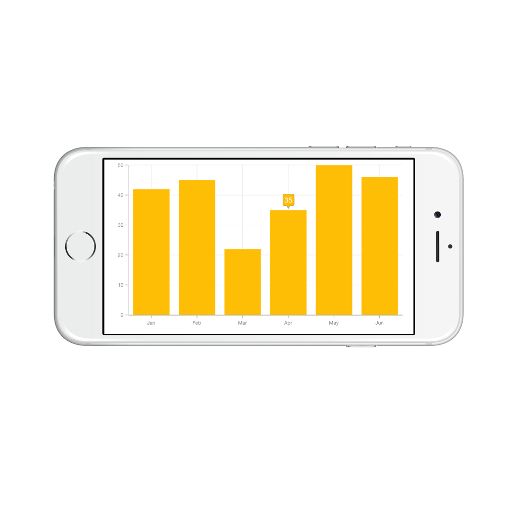

# Tooltip 

SFChart provides tooltip support for all series. It is used to show information about the segment, when you tap on
the segment. To enable the tooltip, you need to set `EnableTooltip` property as true.



SFColumnSeries series          = new SFColumnSeries ();

series.EnableTooltip           = true;


## customizing appearance 

You can customize the tooltip label. For customizing, you need to add an instance of SFChartTooltipBehavior using the addChartBehavior method of SFChart. 

Following properties of `SFChartTooltipBehavior` are used to customize the tooltip label.

* `BorderColor` – used to change the label border color
* `BorderWidth` – used to change the label border width
* `BackgroundColor` – used to change the label background color
* `EdgeInsets ` – used to change tooltip content edge insets
* `TextColor` – used to change the text color
* `Font` – used to change label font size, family and weight
* `LabelFormatter` – used to format the label
* `Duration` – used to set the visible duration of label
* `OffsetX` - used to move the label horizontally
* `OffsetY` - used to move the label vertically
* `Position` - used to position the tooltip
* `Animation` - used to animate the tooltip
* `MaximumWidth` - used to change label maximum width



SFChartTooltipBehavior behavior       = new SFChartTooltipBehavior ();

behavior.BackgroundColor              = UIColor.FromRGBA (203.0f / 255.0f, 75.0f / 255.0f, 65.0f / 255.0f, 1.0f);

behavior.BorderColor                  = UIColor.Black;

behavior.BorderWidth                  = 1.5f;

behavior.Duration                     = 10;

behavior.MaximumWidth                 = 50;

NSNumberFormatter formatter           = new NSNumberFormatter();

formatter.PositiveFormat              = "$###.00 millions";

behavior.LabelFormatter               = formatter;

behavior.Position                     = SFChartElementPosition.Right;

behavior.Animation                    = SFChartTooltipAnimation.Fade;

behavior.OffsetX                      = 22;

behavior.OffsetY                      = 5;

behavior.TextColor                    = UIColor.White;

behavior.EdgeInsets                   = new UIEdgeInsets(5 ,10, 5, 10);

behavior.Font                         = UIFont.FromName("Times",15);

chart.AddChartBehavior (behavior);


## Tooltip Methods

The SFChartTooltipBehavior helps you to deal with user interaction, with the below listed methods.

* `Show(CGPoint,Boolean)` - this method shows the tooltip if a data point is present at the specified x and y co-ordinates
* `Show(CGPoint,UIView,Boolean)` - this method shows the tooltip at the specified coordinate 
* `Hide(Boolean)` - this method hides the tooltip, if it is already shown
* `GetView(SFChartToolTip)` - this method can be overridden to customize the tooltip view or to return custom view to be displayed as a tooltip
* `DrawRect(CGRect)` - draws the tooltip within the specified rectangle

## Delegates

We need to implement delegate to deal with the user interactions in chart for tooltip. In order to do this, you need to adopt the `SFChartDelegate` protocol through the class extension as shown below.



public override void ViewDidLoad ()
{
    chart.Delegate = new ChartDelegate ();
}

public class ChartDelegate : SFChartDelegate
{
    public override void DidShowTooltip (SFChart chart, SFChartTooltip tooltipView)
    {

    }
}



* `WillShowTooltip:` - this method is invoked before the tooltip is shown
* `DidShowTooltip:` - this method is invoked after the tooltip is shown
* `WillHideTooltip:` - this method is invoked before the tooltip is hidden
* `DidHideTooltip:` - this method is invoked after the tooltip is hidden

## Customizing appearance of SFChartTooltip view

you can use the following properties available in the SFChartTooltip to customize the appearance of tooltip view. The customized view can be used in `SFChartTooltipBehavior` methods and delegates.

* `Text` – used to change the text of the tooltip
* `CustomView` – used to change the custom view of the tooltip
* `PointerLength` – used to change the pointer length of the tooltip
* `CornerRadius` – used to change the corner radius of the tooltip
* `Color` – used to change the tooltip color
* `TextAlignment` – used to change text alignment horizontally
* `Series` – returns the series at the tapped location
* `DataPoint` – returns the chart data point at the tapped location
* `ChartBehavior` - returns the SFChartTooltipBehavior of the tooltip



public override void WillShowTooltip (SFChart chart, SFChartTooltip tooltipView)
{
    UIView customView       = new UIView ();
    
    customView.Frame        = new CGRect (0,0,80,40);

    UIImageView imageView   = new UIImageView ();

    imageView.Frame         = new CGRect (0, 0, 40, 40);

    imageView.Image         = UIImage.FromBundle ("Images/grain.png");

    UILabel xLabel          = new UILabel ();

    xLabel.Frame            = new CGRect (47,0,35,18);

    xLabel.TextColor        = UIColor.Orange;

    xLabel.Font             = UIFont.FromName("Helvetica", 12f);

    xLabel.Text             = (tooltipView.DataPoint as ViewModel).XValue.ToString();

    UILabel yLabel          = new UILabel ();
    
    yLabel.Frame            = new CGRect (47, 20, 35, 18);

    yLabel.TextColor        = UIColor.White;

    yLabel.Font             = UIFont.FromName("Helvetica", 15f);

    yLabel.Text             = tooltipView.Text;

    customView.AddSubview (imageView);

    customView.AddSubview (xLabel);

    customView.AddSubview (yLabel);

    tooltipView.CustomView  = customView;
}



