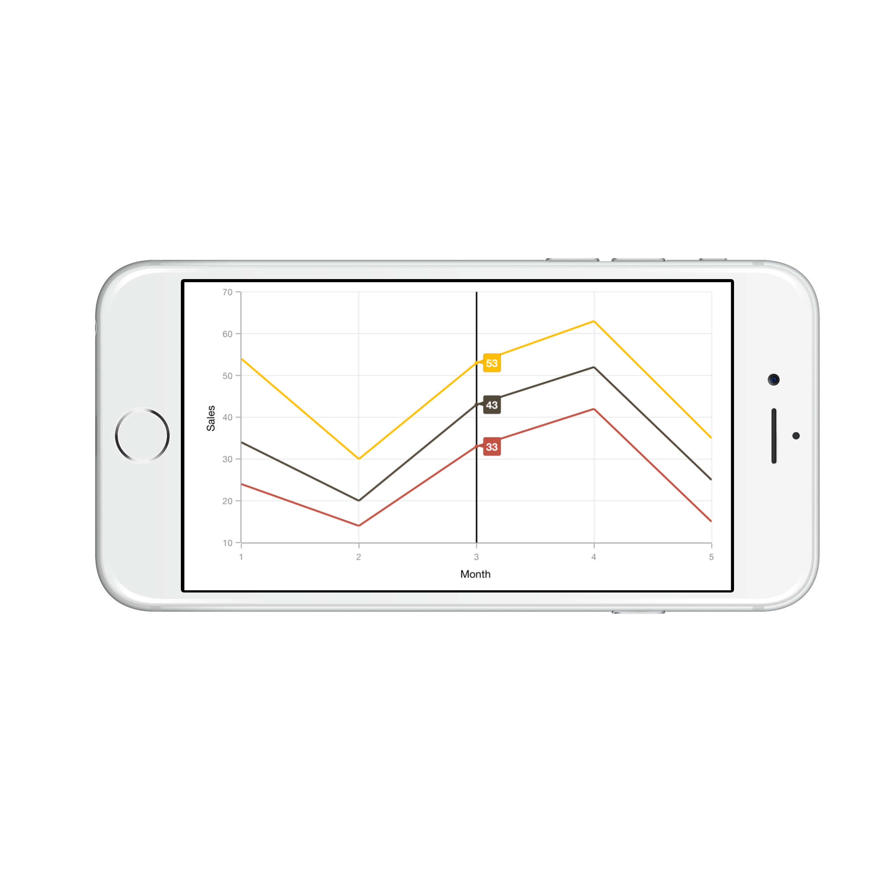
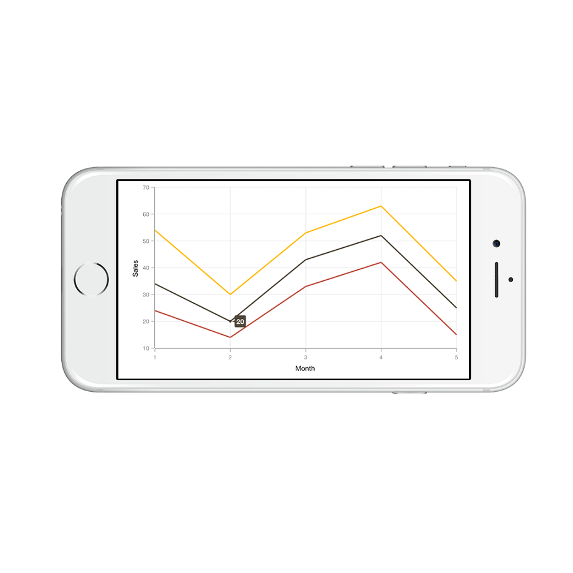
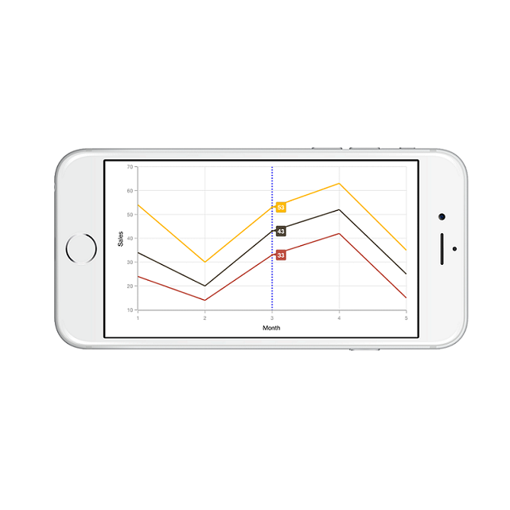
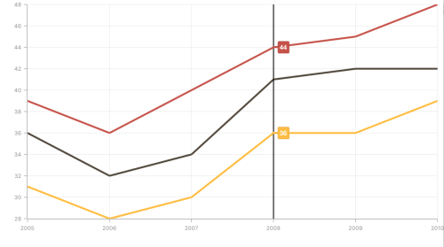

# Trackball

Trackball feature displays the tooltip for the data points that are closer to the point where you touch on the chart area. This feature, especially, can be used instead of data label feature when you cannot show data labels for all data points due to space constraint. To enable this feature, add an instance of [`SFChartTrackballBehavior`](https://help.syncfusion.com/cr/cref_files/xamarin-ios/Syncfusion.SFChart.iOS~Syncfusion.SfChart.iOS.SFChartTrackballBehavior.html) to the [`Behaviors`](https://help.syncfusion.com/cr/cref_files/xamarin-ios/Syncfusion.SFChart.iOS~Syncfusion.SfChart.iOS.ChartBase~Behaviors.html) collections property of [`SFChart`](https://help.syncfusion.com/cr/cref_files/xamarin-ios/Syncfusion.SFChart.iOS~Syncfusion.SfChart.iOS.SFChart.html) using [`AddChartBehavior`](https://help.syncfusion.com/cr/cref_files/xamarin-ios/Syncfusion.SFChart.iOS~Syncfusion.SfChart.iOS.SFChart~AddChartBehavior.html) method. Trackball will be activated once you long-press anywhere on the chart area. Once it is activated, it will appear in the UI and move based on your touch movement until you stop touching on the chart.

You can use the following properties to show/hide the line and labels.

* `ShowLabel` – Shows/hides trackball label. Default value is true.

* `ShowLine` – Shows/hides the trackball line. Default value is true.



SFChartTrackballBehavior behavior = new SFChartTrackballBehavior ();

chart.AddChartBehavior (behavior); 



## Label Display Mode

[`LabelDisplayMode`](https://help.syncfusion.com/cr/cref_files/xamarin-ios/Syncfusion.SFChart.iOS~Syncfusion.SfChart.iOS.SFChartTrackballBehavior~LabelDisplayMode.html) property is used to specify whether to display label for all the data points along the vertical line or display only single label. Following are the two options you can set to this property,

* [`FloatAllPoints`](https://help.syncfusion.com/cr/cref_files/xamarin-ios/Syncfusion.SFChart.iOS~Syncfusion.SfChart.iOS.SFChartTrackballLabelDisplayMode.html) – Displays label for all the data points along the vertical line.
* [`GroupAllPoints`](https://help.syncfusion.com/cr/cref_files/xamarin-ios/Syncfusion.SFChart.iOS~Syncfusion.SfChart.iOS.SFChartTrackballLabelDisplayMode.html) – Displays label for all the data points on top of the chart along the vertical line.
* [`NearestPoint`](https://help.syncfusion.com/cr/cref_files/xamarin-ios/Syncfusion.SFChart.iOS~Syncfusion.SfChart.iOS.SFChartTrackballLabelDisplayMode.html) – Displays label for single data point that is nearer to the touch contact position.



SFChartTrackballBehavior behavior   = new SFChartTrackballBehavior ();

behavior.LineStyle.Visible          = false;

behavior.LabelDisplayMode           = SFChartTrackballLabelDisplayMode.NearestPoint;

chart.AddChartBehavior (behavior);



In the following screenshot, trackball label is shown for only single data point,

## Customizing appearance

**Customize Trackball Labels**

The [`LabelStyle`](https://help.syncfusion.com/cr/cref_files/xamarin-ios/Syncfusion.SFChart.iOS~Syncfusion.SfChart.iOS.SFChartTrackballBehavior~LabelStyle.html) property provides options to customize the trackball labels.

* [`BorderColor`](https://help.syncfusion.com/cr/cref_files/xamarin-ios/Syncfusion.SFChart.iOS~Syncfusion.SfChart.iOS.SFLabelStyle~BorderColor.html) – used to change the label border color.
* [`BackgroundColor`](https://help.syncfusion.com/cr/cref_files/xamarin-ios/Syncfusion.SFChart.iOS~Syncfusion.SfChart.iOS.SFLabelStyle~BackgroundColor.html) – used to change the label background color.
* [`BorderWidth`](https://help.syncfusion.com/cr/cref_files/xamarin-ios/Syncfusion.SFChart.iOS~Syncfusion.SfChart.iOS.SFLabelStyle~BorderWidth.html) – used to change the label border width.
* [`Color`](https://help.syncfusion.com/cr/cref_files/xamarin-ios/Syncfusion.SFChart.iOS~Syncfusion.SfChart.iOS.SFLabelStyle~Color.html) – used to change the text color.
* [`Font`](https://help.syncfusion.com/cr/cref_files/xamarin-ios/Syncfusion.SFChart.iOS~Syncfusion.SfChart.iOS.SFLabelStyle~Font.html) – used to change label font size, family and weight.
* [`Visible`](https://help.syncfusion.com/cr/cref_files/xamarin-ios/Syncfusion.SFChart.iOS~Syncfusion.SfChart.iOS.SFChartTrackballLabelStyle~Visible.html) – used to control the visibility of label.
* [`Margin`](https://help.syncfusion.com/cr/cref_files/xamarin-ios/Syncfusion.SFChart.iOS~Syncfusion.SfChart.iOS.SFLabelStyle~Margin.html) – used to set the margin for label.
* [`LabelFormatter`](https://help.syncfusion.com/cr/cref_files/xamarin-ios/Syncfusion.SFChart.iOS~Syncfusion.SfChart.iOS.SFLabelStyle~LabelFormatter.html)– used to format the label.



SFChartTrackballBehavior behavior   = new SFChartTrackballBehavior ();

behavior.LabelStyle.BorderColor     = UIColor.Brown;

behavior.LabelStyle.BorderWidth     = 2;

behavior.LabelStyle.Font            = UIFont.ItalicSystemFontOfSize (18);

behavior.LabelStyle.BackgroundColor = UIColor.Cyan;

behavior.LabelStyle.Color           = UIColor.Red;

chart.AddChartBehavior (behavior); 



**Customize Trackball Marker**

The [`MarkerStyle`](https://help.syncfusion.com/cr/cref_files/xamarin-ios/Syncfusion.SFChart.iOS~Syncfusion.SfChart.iOS.SFChartTrackballBehavior~MarkerStyle.html) property provides options to customize the trackball markers.

* [`Visible`](https://help.syncfusion.com/cr/cref_files/xamarin-ios/Syncfusion.SFChart.iOS~Syncfusion.SfChart.iOS.SFChartTrackballMarkerStyle~Visible.html) – used to enable / disable the marker. Default value is true.
* [`BorderColor`](https://help.syncfusion.com/cr/cref_files/xamarin-ios/Syncfusion.SFChart.iOS~Syncfusion.SfChart.iOS.SFChartTrackballMarkerStyle~BorderColor.html) – used to change the marker border color.
* [`Color`](https://help.syncfusion.com/cr/cref_files/xamarin-ios/Syncfusion.SFChart.iOS~Syncfusion.SfChart.iOS.SFChartTrackballMarkerStyle~Color.html) – used to change the marker background color.
* [`BorderWidth`](https://help.syncfusion.com/cr/cref_files/xamarin-ios/Syncfusion.SFChart.iOS~Syncfusion.SfChart.iOS.SFChartTrackballMarkerStyle~BorderWidth.html) – used to change the width of the marker border.
* [`Width`](https://help.syncfusion.com/cr/cref_files/xamarin-ios/Syncfusion.SFChart.iOS~Syncfusion.SfChart.iOS.SFChartTrackballMarkerStyle~Width.html) – used to change the width of the marker.
* [`Height`](https://help.syncfusion.com/cr/cref_files/xamarin-ios/Syncfusion.SFChart.iOS~Syncfusion.SfChart.iOS.SFChartTrackballMarkerStyle~Height.html) – used to change the height of the marker.
* [`MarkerType`](https://help.syncfusion.com/cr/cref_files/xamarin-ios/Syncfusion.SFChart.iOS~Syncfusion.SfChart.iOS.SFChartTrackballMarkerStyle~MarkerType.html) – used to change the shapes of the marker.



SFChartTrackballBehavior behavior   = new SFChartTrackballBehavior ();

behavior.MarkerStyle.BorderWidth    = 1;

behavior.MarkerStyle.BorderColor    = UIColor.Purple;

behavior.MarkerStyle.Height         = 8;

behavior.MarkerStyle.Width          = 8;

behavior.MarkerStyle.Color          = UIColor.Green;

behavior.MarkerStyle.Visible        = true;

chart.AddChartBehavior (behavior); 



**Customize Trackball Line**

The [`LineStyle`](https://help.syncfusion.com/cr/cref_files/xamarin-ios/Syncfusion.SFChart.iOS~Syncfusion.SfChart.iOS.SFChartTrackballBehavior~LineStyle.html) property provides options to customize the trackball line.

* [`Visible`](https://help.syncfusion.com/cr/cref_files/xamarin-ios/Syncfusion.SFChart.iOS~Syncfusion.SfChart.iOS.SFChartTrackballLineStyle~Visible.html) – used to enable / disable the line. Default value is true.
* [`LineWidth`](https://help.syncfusion.com/cr/cref_files/xamarin-ios/Syncfusion.SFChart.iOS~Syncfusion.SfChart.iOS.SFLineStyle~LineWidth.html) – used to change the stroke width of the line.
* [`LineColor`](https://help.syncfusion.com/cr/cref_files/xamarin-ios/Syncfusion.SFChart.iOS~Syncfusion.SfChart.iOS.SFLineStyle~LineColor.html) – used to change the stroke color of the line.
* [`Dashes`](https://help.syncfusion.com/cr/cref_files/xamarin-ios/Syncfusion.SFChart.iOS~Syncfusion.SfChart.iOS.SFChartTrackballLineStyle~Dashes.html) – Specifies the dashes to be applied on the line.



SFChartTrackballBehavior behavior = new SFChartTrackballBehavior ();

behavior.LineStyle.Visible        = true;

behavior.LineStyle.LineWidth      = new NSNumber (2);

behavior.LineStyle.LineColor      = UIColor.Blue;

NSObject[] dashes                 = new NSObject[2];

dashes [0]                        = (NSNumber)2;

dashes [1]                        = (NSNumber)3;

behavior.LineStyle.Dashes         = NSArray.FromNSObjects (dashes);

chart.AddChartBehavior (behavior); 



Following screenshot illustrates the customization of trackball elements.

## Axis label alignment

The position of trackball’s axis label can be changed using the [`LabelAlignment`](https://help.syncfusion.com/cr/cref_files/xamarin-ios/Syncfusion.SFChart.iOS~Syncfusion.SfChart.iOS.SFChartTrackballAxisLabelStyle~LabelAlignment.html) property of [`SFChartTrackballAxisLabelStyle`](https://help.syncfusion.com/cr/cref_files/xamarin-ios/Syncfusion.SFChart.iOS~Syncfusion.SfChart.iOS.SFChartTrackballAxisLabelStyle.html). The following options are available in [`LabelAlignment`](https://help.syncfusion.com/cr/cref_files/xamarin-ios/Syncfusion.SFChart.iOS~Syncfusion.SfChart.iOS.SFChartTrackballAxisLabelStyle~LabelAlignment.html).

* [`Far`](https://help.syncfusion.com/cr/cref_files/xamarin-ios/Syncfusion.SFChart.iOS~Syncfusion.SfChart.iOS.SFChartAlignment.html) - The label will be positioned below the tick in vertical axis and right of the tick in horizontal axis. 
* [`Near`](https://help.syncfusion.com/cr/cref_files/xamarin-ios/Syncfusion.SFChart.iOS~Syncfusion.SfChart.iOS.SFChartAlignment.html) - The label will be positioned above the tick in vertical axis and left of the tick in horizontal axis.
* [`Center`](https://help.syncfusion.com/cr/cref_files/xamarin-ios/Syncfusion.SFChart.iOS~Syncfusion.SfChart.iOS.SFChartAlignment.html) - The label will be positioned at the center of tick. This is the default value.

## Show/hide the series label

This feature is used to show/hide the trackball label of the series by using [`CartesianSeries.ShowTrackballInfo`](https://help.syncfusion.com/cr/cref_files/xamarin-ios/Syncfusion.SFChart.iOS~Syncfusion.SfChart.iOS.SFCartesianSeries~ShowTrackballInfo.html) property. Default value of [`CartesianSeries.ShowTrackballInfo`](https://help.syncfusion.com/cr/cref_files/xamarin-ios/Syncfusion.SFChart.iOS~Syncfusion.SfChart.iOS.SFCartesianSeries~ShowTrackballInfo.html) property is `True`.



SFChart chart = new SFChart();
...

SFLineSeries lineSeries = new SFLineSeries()
{
    ItemsSource = Data,
    XBindingPath = "Year",
    YBindingPath = "Value",
    ShowTrackballInfo = false

};
chart.Series.Add(lineSeries);



## Methods

### Show method

The [`Show`](https://help.syncfusion.com/cr/cref_files/xamarin-ios/Syncfusion.SFChart.iOS~Syncfusion.SfChart.iOS.SFChartTrackballBehavior~Show.html) method is used to activate the trackball at the specified location.

 
[C#]

trackball.Show(point);



### Hide method

The [`Hide`](https://help.syncfusion.com/cr/cref_files/xamarin-ios/Syncfusion.SFChart.iOS~Syncfusion.SfChart.iOS.SFChartTrackballBehavior~Hide.html) method is used to hide the trackball programmatically.

 
[C#]

trackball.Hide();


