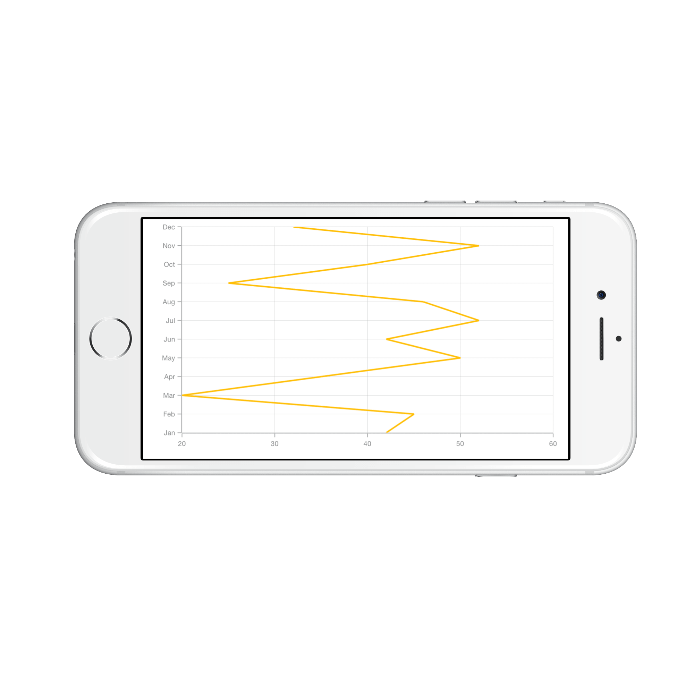

# Vertical Chart

Vertical chart is used to show the CartesianSeries vertically which helps to view the data in different
perceptive using [`IsTransposed`](https://help.syncfusion.com/cr/cref_files/xamarin-ios/sfchart/Syncfusion.SFChart.iOS~Syncfusion.SfChart.iOS.SFCartesianSeries~IsTransposed.html) property. 



SFLineSeries series   = new SFLineSeries ();

series.IsTransposed   = true;

return series; 



