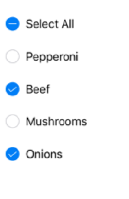

# Getting Started
This section explains the steps required to configure the `SfCheckBox` control in a real-time scenario and provides a walk-through on some of the customization features available in `SfCheckBox` control.

## Add SfCheckBox reference
Syncfusion Xamarin components are available in [nuget.org](https://www.nuget.org/). To add checkbox to your project, open the NuGet package manager in Visual Studio, and search for "[syncfusion.xamarin.buttons](https://www.nuget.org/packages/Syncfusion.Xamarin.Buttons)", and then install it. 

N>Starting with v16.2.0.x, if you reference Syncfusion assemblies from trial setup or from the NuGet feed, you also have to include a license key in your projects. Please refer to this [link](https://help.syncfusion.com/common/essential-studio/licensing/license-key) to know about registering Syncfusion license key in your Xamarin application to use our components.

## Create a Simple SfCheckBox
The `SfCheckBox` control is configured entirely in C# code. The following steps explain how to create a `SfCheckBox` and configure its elements.

### Add namespace for referred assemblies



using Syncfusion.XForms.Buttons;



### Refer SfCheckBox control with declared suffix name for Namespace



using CoreGraphics;
using Syncfusion.iOS.Buttons;
using System;
using UIKit;

namespace CheckBox_Sample
{
    public partial class ViewController : UIViewController
    {
        public ViewController(IntPtr handle) : base(handle)
        {
        }

        public override void ViewDidLoad()
        {
            base.ViewDidLoad();
            SfCheckBox checkBox = new SfCheckBox();
            checkBox.Frame = new CGRect(10, 50, 350, 40);
            View.AddSubview(checkBox);
        }

        public override void DidReceiveMemoryWarning()
        {
            base.DidReceiveMemoryWarning();
            // Release any cached data, images, etc that aren't in use.
        }
    }
}



## Setting caption
The check box caption can be defined using the `SetTitle` method of `SfCheckBox`. This caption normally describes the meaning of the check box and it displays next to check box.



SfCheckBox checkBox = new SfCheckBox();
checkBox.IsChecked = true;
checkBox.SetTitle("CheckBox",UIControlState.Normal);



 

This demo can be downloaded from this [link](http://files2.syncfusion.com/Xamarin.iOS/Samples/CheckBox_GettingStarted.zip).

## Change the check box state
The three visual states of `SfCheckBox` are: 

* Checked
* Unchecked
* Indeterminate

 

You can change the state of the check box using the `IsChecked` property of `SfCheckBox`. In checked state, a tick mark is added to the visualization of check box.

<table>
<tr>
<td>
<b>State</b>
</td>
<td>
<b>Property</b>
</td>
<td>
<b>Value</b>
</td>
</tr>
<tr>
<td>
checked
</td>
<td>
IsChecked
</td>
<td>
true
</td>
</tr>
<tr>
<td>
unchecked
</td>
<td>
IsChecked
</td>
<td>
false
</td>
</tr>
<tr>
<td>
indeterminate
</td>
<td>
IsChecked
</td>
<td>
null
</td>
</tr>
</table>

N>For the check box, to report the indeterminate state, set the `IsThreeState` property to true.

Check box can be used as a single or as a group. A single check box mostly used for a binary yes/no choice, such as "Remember me?", login scenario, or a terms of service agreement.



SfCheckBox checkBox = new SfCheckBox();
checkBox.SetTitle("I agree to the terms of services for this site", UIControlState.Normal);
checkBox.IsChecked = true;



Multiple check boxes can be used as a group for multi-select scenarios in which a user chooses one or more items from the group of choices that are not mutually exclusive.



UITextView label = new UITextView();
label.Text = "Pizza Toppings";
SfCheckBox pepperoni = new SfCheckBox();
pepperoni.SetTitle("Pepperoni", UIControlState.Normal);
SfCheckBox beef = new SfCheckBox();
beef.SetTitle("Beef", UIControlState.Normal);
beef.IsChecked = true;
SfCheckBox mushroom = new SfCheckBox();
mushroom.SetTitle("Mushrooms", UIControlState.Normal);
SfCheckBox onion = new SfCheckBox();
onion.SetTitle("Onions", UIControlState.Normal);
onion.IsChecked = true;



This demo can be downloaded from this [link](http://files2.syncfusion.com/Xamarin.iOS/Samples/CheckBox_StateChanging.zip).

## Indeterminate

The `SfCheckBox` allows an indeterminate state in addition to the checked and unchecked state. The indeterminate state of the check box is enabled by setting the `IsThreeState` property of the control to `True`.

N>When the `IsThreeState` property is set to `False` and `IsChecked` property is set to `null` then the check box will be in unchecked state.

The indeterminate state is used when a group of sub-choices has both checked and unchecked states. In the following example, the "Select all" checkbox has the `IsThreeState` property set to `true`. The "Select all" checkbox is checked if all child elements are checked, unchecked if all the child elements are unchecked, and indeterminate otherwise.



bool skip = false;
SfCheckBox selectAll, pepperoni, beef, mushroom, onion;
selectAll = new SfCheckBox();
selectAll.StateChanged += SelectAll_StateChanged;
selectAll.SetTitle("Select All",UIControlState.Normal);
pepperoni = new SfCheckBox();
pepperoni.StateChanged += CheckBox_StateChanged;
pepperoni.SetTitle("Pepperoni", UIControlState.Normal);
beef = new SfCheckBox();
beef.StateChanged += CheckBox_StateChanged;
beef.SetTitle("Beef", UIControlState.Normal);
beef.IsChecked = true;
mushroom = new SfCheckBox();
mushroom.StateChanged += CheckBox_StateChanged;
mushroom.SetTitle("Mushrooms", UIControlState.Normal);
onion = new SfCheckBox();
onion.StateChanged += CheckBox_StateChanged;
onion.SetTitle("Onions", UIControlState.Normal);
onion.IsChecked = true;

private void SelectAll_StateChanged(object sender, StateChangedEventArgs e)
{
    if (!skip)
    {
       skip = true;
       pepperoni.IsChecked = beef.IsChecked = mushroom.IsChecked = onion.IsChecked = e.IsChecked;
       skip = false;
    }
}

private void CheckBox_StateChanged(object sender, StateChangedEventArgs e)
{
    if (!skip)
    {
       skip = true;
       if (pepperoni.IsChecked.Value && beef.IsChecked.Value && mushroom.IsChecked.Value && onion.IsChecked.Value)
           selectAll.IsChecked = true;
       else if (!pepperoni.IsChecked.Value && !beef.IsChecked.Value && !mushroom.IsChecked.Value && !onion.IsChecked.Value)
	       selectAll.IsChecked = false;
       else
           selectAll.IsChecked = null;
       skip = false;
    }
}
		



 

This demo can be downloaded from this [link](http://files2.syncfusion.com/Xamarin.iOS/Samples/CheckBox_IndeterminateState.zip).