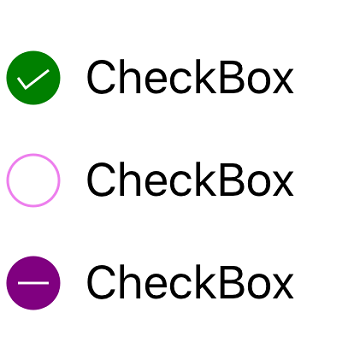

# Visual Customization

## Customizing shape
The check box shape can be customized using the `CornerRadius` property. This property specifies uniform radius value for every corner of the check box.



SfCheckBox checkBox = new SfCheckBox();
checkBox.SetTitle("CheckBox", UIControlState.Normal);
checkBox.IsChecked = true;
checkBox.CornerRadius = 5.0f;



## Customizing state color
The default state colors can be customized using the `CheckedColor` and `UncheckedColor `properties. The checked/indeterminate state color is updated to the `CheckedColor` property value when the state is changed to the checked/indeterminate.The unchecked state color is updated to `UncheckedColor` property value when the state is changed to unchecked. 


SfCheckBox check = new SfCheckBox();
check.SetTitle("CheckBox", UIControlState.Normal);
check.IsChecked = true;
check.CheckedColor = UIColor.Green;
SfCheckBox uncheck = new SfCheckBox();
uncheck.SetTitle("CheckBox",UIControlState.Normal);
uncheck.UncheckedColor = UIColor.FromRGB(238, 130, 238);
SfCheckBox indeterminate = new SfCheckBox();
indeterminate.IsChecked = null;
indeterminate.IsThreeState = true;
indeterminate.SetTitle("CheckBox", UIControlState.Normal);
indeterminate.CheckedColor = UIColor.Purple;



## BorderWidth
The tick box border thickness of the checkbox control can be customized with the `BorderWidth` property.  



SfCheckBox check1 = new SfCheckBox();
check1.SetTitle("Hello", UIControlState.Normal);
check1.BorderWidth = 2;
check1.Font = UIFont.SystemFontOfSize(20);
check1.UncheckedColor = Color.Blue;
SfCheckBox check2 = new SfCheckBox();
check2.SetTitle("Hello", UIControlState.Normal);
check2.BorderWidth = 4;
check2.Font = UIFont.SystemFontOfSize(25);
check2.UncheckedColor = Color.Blue;
SfCheckBox check3 = new SfCheckBox();
check3.SetTitle("Hello", UIControlState.Normal);
check3.BorderWidth = 6;
check3.Font = UIFont.SystemFontOfSize(30);
check3.UncheckedColor = Color.Blue;



## Setting caption text appearance 
You can customize the display text appearance of the `SfCheckBox` control using the following properties:

* `SetTitleColor`: Changes the color of the text.
* `HorizontalAlignment`: Changes the horizontal alignment of the caption text.
* `Font`:Changes the font family of the text and sets font attributes(bold/italic/none) of the text and also sets font size of the caption text.



SfCheckBox caption = new SfCheckBox();
caption.IsChecked = true;
caption.SetTitle("CheckBox", UIControlState.Normal);
caption.SetTitleColor(UIColor.FromRGB(238, 130, 238), UIControlState.Normal);
caption.HorizontalAlignment = UIControlContentHorizontalAlignment.Center;
caption.Font = UIFont.FromName("Arial", 20);
caption.Font = UIFont.SystemFontOfSize(20);
UIFontDescriptor fontDescriptor = caption.Font.FontDescriptor;
caption.Font = UIFont.FromDescriptor(fontDescriptor.CreateWithTraits(UIFontDescriptorSymbolicTraits.Bold), 0);



This demo can be downloaded from this [link](http://files2.syncfusion.com/Xamarin.iOS/Samples/CheckBox_VisualCustomization.zip ).