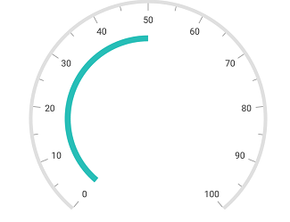

---

layout: post
title: Getting Started | SfCircularGauge | iOS | Syncfusion
description: Ranges
platform: xamarin.iOS
control: SfCircularGauge
documentation: ug

---

# Ranges

Range is a visual element, which begins and ends at specified values within a scale.

## Setting start and end values for range

Start and end values of ranges are set by using the [`StartValue`](https://help.syncfusion.com/cr/xamarin-ios/Syncfusion.SfGauge.iOS.SFCircularRange.html#Syncfusion_SfGauge_iOS_SFCircularRange_StartValue) and [`EndValue`](https://help.syncfusion.com/cr/xamarin-ios/Syncfusion.SfGauge.iOS.SFCircularRange.html#Syncfusion_SfGauge_iOS_SFCircularRange_EndValue) properties. 



            SFCircularGauge circularGauge = new SFCircularGauge();
            ObservableCollection<SFCircularScale> scales = new ObservableCollection<SFCircularScale>();
            SFCircularScale scale = new SFCircularScale();
            scale.StartValue = 0;
            scale.EndValue = 100;
            SFCircularRange range = new SFCircularRange();
            range.StartValue = 0;
            range.EndValue = 50;
            scale.Ranges.Add(range);
            circularGauge.Scales.Add(scale); 
            this.View.AddSubview(circularGauge);



## Range customization

An UI of a range is customized by using the [`Color`](https://help.syncfusion.com/cr/xamarin-ios/Syncfusion.SfGauge.iOS.SFCircularRange.html#Syncfusion_SfGauge_iOS_SFCircularRange_Color) and [`Width`](https://help.syncfusion.com/cr/xamarin-ios/Syncfusion.SfGauge.iOS.SFCircularRange.html#Syncfusion_SfGauge_iOS_SFCircularRange_Width) properties. First, you should set the [`Offset`](https://help.syncfusion.com/cr/xamarin-ios/Syncfusion.SfGauge.iOS.SFCircularRange.html#Syncfusion_SfGauge_iOS_SFCircularRange_Offset) property for range, then increase the width of the range. 



             SFCircularGauge circularGauge = new SFCircularGauge();
            ObservableCollection<SFCircularScale> scales = new ObservableCollection<SFCircularScale>();
            SFCircularScale scale = new SFCircularScale();   
            scale.StartValue = 0;
            scale.EndValue = 100;
            scale.RimWidth = 10;
            scale.RimColor = UIColor.FromRGB(224,224,224);
            scale.LabelColor = UIColor.FromRGB(66, 66, 66);
            scale.MajorTickSettings.Width = 3;
            scale.LabelOffset = 0.9f;
            scale.MinorTickSettings.Size = 5;
            scale.MajorTickSettings.Size = 10;
            scale.MajorTickSettings.Offset = 0.8f;
            scale.MinorTickSettings.Offset = 0.8f;
            scale.MinorTicksPerInterval = 3;
            SFCircularRange range = new SFCircularRange();
            range.StartValue = 0;
            range.EndValue = 50;
            range.Width = 70;
            range.Offset = 0.8f;
            range.Color = UIColor.FromRGB(255,192,203);
            scale.Ranges.Add(range);
            circularGauge.Scales.Add(scale); 
            this.View.AddSubview(circularGauge);



## Setting position for range

The range can be placed inside the scale, outside the scale, or on the scale by using the following two ways:

1.The [`Offset`](https://help.syncfusion.com/cr/xamarin-ios/Syncfusion.SfGauge.iOS.SFCircularRange.html#Syncfusion_SfGauge_iOS_SFCircularRange_Offset) property with the [`Width`](https://help.syncfusion.com/cr/xamarin-ios/Syncfusion.SfGauge.iOS.SFCircularRange.html#Syncfusion_SfGauge_iOS_SFCircularRange_Width) property.



             SFCircularGauge circularGauge = new SFCircularGauge();
            ObservableCollection<SFCircularScale> scales = new ObservableCollection<SFCircularScale>();
            SFCircularScale scale = new SFCircularScale();   
            scale.StartValue = 0;
            scale.EndValue = 100;
            SFCircularRange range = new SFCircularRange();
            range.StartValue = 0;
            range.EndValue = 100;
            range.Offset = 0.5f;
            range.Width = 20;
            scale.Ranges.Add(range);
            circularGauge.Scales.Add(scale); 
            this.View.AddSubview(circularGauge);



2.The [`InnerStartOffset`](https://help.syncfusion.com/cr/xamarin-ios/Syncfusion.SfGauge.iOS.SFCircularRange.html#Syncfusion_SfGauge_iOS_SFCircularRange_InnerStartOffset), [`InnerEndOffset`](https://help.syncfusion.com/cr/xamarin-ios/Syncfusion.SfGauge.iOS.SFCircularRange.html#Syncfusion_SfGauge_iOS_SFCircularRange_InnerEndOffset), [`OuterStartOffset`](https://help.syncfusion.com/cr/xamarin-ios/Syncfusion.SfGauge.iOS.SFCircularRange.html#Syncfusion_SfGauge_iOS_SFCircularRange_OuterStartOffset), and [`OuterEndOffset`](https://help.syncfusion.com/cr/xamarin-ios/Syncfusion.SfGauge.iOS.SFCircularRange.html#Syncfusion_SfGauge_iOS_SFCircularRange_OuterEndOffset) properties.



            SFCircularGauge circularGauge = new SFCircularGauge();
            ObservableCollection<SFCircularScale> scales = new ObservableCollection<SFCircularScale>();
            SFCircularScale scale = new SFCircularScale();   
            scale.StartValue = 0;
            scale.EndValue = 100;
            SFCircularRange range = new SFCircularRange();
            range.StartValue = 10;
            range.EndValue = 80;
            range.InnerStartOffset = 0.83f;
            range.InnerEndOffset = 0.6f;
            range.OuterStartOffset = 0.85f;
            range.OuterEndOffset = 0.8f;
            scale.Ranges.Add(range);
            circularGauge.Scales.Add(scale); 
            this.View.AddSubview(circularGauge);



## Setting multiple ranges

In addition to the default range, you can add n number of ranges to a scale by using the [`Ranges`](https://help.syncfusion.com/cr/xamarin-ios/Syncfusion.SfGauge.iOS.SFCircularScale.html#Syncfusion_SfGauge_iOS_SFCircularScale_Ranges) property.



           SFCircularGauge circularGauge = new SFCircularGauge();
            ObservableCollection<SFCircularScale> scales = new ObservableCollection<SFCircularScale>();
            SFCircularScale scale = new SFCircularScale();   
            scale.StartValue = 0;
            scale.EndValue = 100;
            scale.StartAngle = 90;
            scale.SweepAngle = 270;
            scale.Interval = 10;
            scale.ShowLabels = false;
            scale.ShowTicks = false;
            scale.ShowRim = false;
            scale.RimWidth = 40;
            scale.RadiusFactor = 0.9f;
            scale.RimColor = UIColor.FromRGB(224, 224, 224);

            SFGaugeHeader header1 = new SFGaugeHeader();
            header1.Text = (Foundation.NSString) "Poor";
            header1.Position = new CoreGraphics.CGPoint((float)0.1, (float)0.55);
            header1.TextColor = UIColor.FromRGB(240, 62, 62);
            header1.TextStyle = UIFont.FromName("Helvetica", 20f);
            circularGauge.Headers.Add(header1);

            SFGaugeHeader header2 = new SFGaugeHeader();
            header2.Text = (Foundation.NSString)"Good";
            header2.Position = new CoreGraphics.CGPoint((float)0.87, (float)0.55);
            header2.TextColor = UIColor.FromRGB(39, 122, 190);
            header2.TextStyle = UIFont.FromName("Helvetica", 20f);
            circularGauge.Headers.Add(header2);

            //Poor
            SFCircularRange range = new SFCircularRange();
            range.StartValue = 0;
            range.EndValue = 35;
            range.Offset = 0.9f;
            range.Width = 40;
            range.Color = UIColor.FromRGB(240, 62, 62);
            scale.Ranges.Add(range);

            //Average
            SFCircularRange range1 = new SFCircularRange();
            range1.StartValue = 35;
            range1.EndValue = 75;
            range1.Offset = 0.9f;
            range1.Width = 40;
            range1.Color = UIColor.FromRGB(255, 221, 0);
            scale.Ranges.Add(range1);

            //Good
            SFCircularRange range2 = new SFCircularRange();
            range2.StartValue = 75;
            range2.EndValue = 100;
            range2.Offset = 0.9f;
            range2.Width = 40;
            range2.Color = UIColor.FromRGB(39, 122, 190);
            scale.Ranges.Add(range2);

            SFNeedlePointer pointer = new SFNeedlePointer();
            pointer.Width = 10;
            pointer.LengthFactor = 0.66f;
            pointer.Color = UIColor.FromRGB(255,69,0);
            pointer.KnobColor = UIColor.White;
            pointer.PointerType = SFCiruclarGaugePointerType.SFCiruclarGaugePointerTypeTriangle;
            pointer.KnobRadius = 0;
            pointer.Value = 70;
            pointer.KnobStrokeColor = UIColor.FromRGB(6, 130, 246);
            pointer.KnobStrokeWidth = 6;
            scale.Pointers.Add(pointer);
            scales.Add(scale);
            circularGauge.Scales = scales;
            this.View.AddSubview(circularGauge);



## Setting gradient color for range

You can give smooth color transition to range by specifying the different colors based on range value.



            SFCircularGauge circularGauge = new SFCircularGauge();
            ObservableCollection<SFCircularScale> scales = new ObservableCollection<SFCircularScale>();
            SFCircularScale scale = new SFCircularScale();   
            scale.StartValue = 0;
            scale.EndValue = 100;
            scale.Interval = 10;
            scale.LabelFont = UIFont.FromName("Helvetica", 16f);
            scale.LabelOffset = 0.95f;
            scale.RimWidth = 28;
            scale.ShowRim = false;
            scale.MinorTicksPerInterval = 4;

            SFTickSettings major = new SFTickSettings();
            major.Width = 1;
            major.EndOffset = 0.83f;
            major.StartOffset = 0.75f;
            major.Size = 8;
            scale.MajorTickSettings = major;

            SFTickSettings minor = new SFTickSettings();
            minor.Width = 0.7f;
            minor.EndOffset = 0.79f;
            minor.StartOffset = 0.75f;
            scale.MinorTickSettings = minor;
            scales.Add(scale);
            circularGauge.Scales = scales;

            SFCircularRange range = new SFCircularRange();
            range.Offset = 0.6f;
            range.Width = 30;
            range.StartValue = 0;
            range.EndValue = 100;
            scale.Ranges.Add(range);

            ObservableCollection<GaugeGradientStop> gradientColor1 = new ObservableCollection<GaugeGradientStop>();

            GaugeGradientStop gaugeGradientStop = new GaugeGradientStop();
            gaugeGradientStop.Value = 0;
            gaugeGradientStop.Color = UIColor.FromRGB(48, 179, 45);
            gradientColor1.Add(gaugeGradientStop);

            GaugeGradientStop gaugeGradientStop1 = new GaugeGradientStop();
            gaugeGradientStop1.Value = 50;
            gaugeGradientStop1.Color = UIColor.FromRGB(255, 221, 0);
            gradientColor1.Add(gaugeGradientStop1);

            GaugeGradientStop gaugeGradientStop2 = new GaugeGradientStop();
            gaugeGradientStop2.Value = 80;
            gaugeGradientStop2.Color = UIColor.FromRGB(240, 62, 62);
            gradientColor1.Add(gaugeGradientStop2);

            range.GradientStops = gradientColor1;

            circularGauge.Scales = scales;
            this.View.AddSubview(circularGauge);



