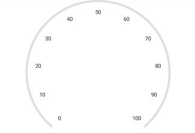
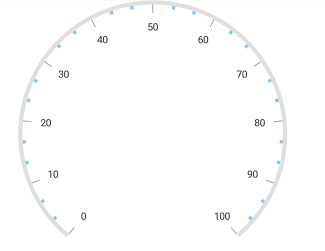
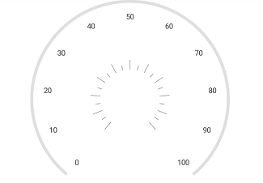

---

layout: post
title: Getting Started | SfCircularGauge | iOS | Syncfusion
description: Tick Setting
platform: xamarin.iOS
control: SfCircularGauge
documentation: ug

---

# Tick Setting

The `TickSetting` property helps you to identify the gauge’s data value by marking the gauge scale in regular increments.

## Show ticks for scale

The [`ShowTicks`](https://help.syncfusion.com/cr/xamarin-ios/Syncfusion.SfGauge.iOS.SFCircularScale.html#Syncfusion_SfGauge_iOS_SFCircularScale_ShowTicks) property allows you to enable or disable the ticks of circular gauge.



            SFCircularGauge circularGauge = new SFCircularGauge();
            ObservableCollection<SFCircularScale> scales = new ObservableCollection<SFCircularScale>();
            SFCircularScale scale = new SFCircularScale();
            scale.StartValue = 0;
            scale.EndValue = 100;
            scale.ShowTicks = false;
            circularGauge.Scales.Add(scale);
            this.View.AddSubview(circularGauge);



## Ticks customization 

The [`Interval`](https://help.syncfusion.com/cr/xamarin-ios/Syncfusion.SfGauge.iOS.SFCircularScale.html#Syncfusion_SfGauge_iOS_SFCircularScale_Interval) property is used to calculate the tick counts for a scale. Similar to ticks, minor ticks are calculated by using the [`MinorTicksPerInterval`](https://help.syncfusion.com/cr/xamarin-ios/Syncfusion.SfGauge.iOS.SFCircularScale.html#Syncfusion_SfGauge_iOS_SFCircularScale_MinorTicksPerInterval) property.

Color and thickness of the tick are set by using the [`Color`](https://help.syncfusion.com/cr/xamarin-ios/Syncfusion.SfGauge.iOS.SFTickSettings.html#Syncfusion_SfGauge_iOS_SFTickSettings_Color) and [`Width`](https://help.syncfusion.com/cr/xamarin-ios/Syncfusion.SfGauge.iOS.SFTickSettings.html#Syncfusion_SfGauge_iOS_SFTickSettings_Width) UI properties. You can also customize the length of the ticks by using the  [`Size`](https://help.syncfusion.com/cr/xamarin-ios/Syncfusion.SfGauge.iOS.SFTickSettings.html#Syncfusion_SfGauge_iOS_SFTickSettings_Size) property. First, you should set the `Offset` property for ticks, then increase the size of the ticks.

## Customize major ticks for scale  



             SFCircularGauge circularGauge = new SFCircularGauge();
            ObservableCollection<SFCircularScale> scales = new ObservableCollection<SFCircularScale>();
            SFCircularScale scale = new SFCircularScale();
            scale.StartValue = 0;
            scale.EndValue = 100;
            SFTickSettings majorTicks = new SFTickSettings();
            majorTicks.Size = 15;
            majorTicks.Color = UIColor.Brown;
            majorTicks.Width = 4;
            majorTicks.Offset = 0.97f;
            scale.MajorTickSettings = majorTicks;
            circularGauge.Scales.Add(scale);
            this.View.AddSubview(circularGauge);
  


## Customize minor ticks for scale



           SFCircularGauge circularGauge = new SFCircularGauge();
            ObservableCollection<SFCircularScale> scales = new ObservableCollection<SFCircularScale>();
            SFCircularScale scale = new SFCircularScale();
            scale.StartValue = 0;
            scale.EndValue = 100;
            SFTickSettings minorTicks = new SFTickSettings();
            minorTicks.Size = 4;
            minorTicks.Color = UIColor.FromRGB(135,206,250);
            minorTicks.Width = 4;
            minorTicks.Offset = 0.97f;
            scale.MinorTickSettings = minorTicks;
            circularGauge.Scales.Add(scale);
            this.View.AddSubview(circularGauge);
  


## Setting position for ticks

The major and minor ticks can be positioned far away from the rim by using the following two ways:

1.[`Offset`](https://help.syncfusion.com/cr/xamarin-ios/Syncfusion.SfGauge.iOS.SFTickSettings.html#Syncfusion_SfGauge_iOS_SFTickSettings_Offset) property. 
2.[`StartOffset`](https://help.syncfusion.com/cr/xamarin-ios/Syncfusion.SfGauge.iOS.SFTickSettings.html#Syncfusion_SfGauge_iOS_SFTickSettings_StartOffset) and [`EndOffset`](https://help.syncfusion.com/cr/xamarin-ios/Syncfusion.SfGauge.iOS.SFTickSettings.html#Syncfusion_SfGauge_iOS_SFTickSettings_EndOffset) properties.

### Setting offset for scale



            SFCircularGauge circularGauge = new SFCircularGauge();
            ObservableCollection<SFCircularScale> scales = new ObservableCollection<SFCircularScale>();
            SFCircularScale scale = new SFCircularScale();
            scale.StartValue = 0;
            scale.EndValue = 100;
            SFTickSettings majorTicks = new SFTickSettings();
            majorTicks.Offset = 0.5f;
            scale.MajorTickSettings = majorTicks;
            SFTickSettings minorTicks = new SFTickSettings();
            minorTicks.Offset = 0.5f;
            scale.MinorTickSettings = minorTicks;
            circularGauge.Scales.Add(scale);
            this.View.AddSubview(circularGauge);



### Setting scale start and end offset for scale



           SFCircularGauge circularGauge = new SFCircularGauge();
            ObservableCollection<SFCircularScale> scales = new ObservableCollection<SFCircularScale>();
            SFCircularScale scale = new SFCircularScale();
            scale.StartValue = 0;
            scale.EndValue = 100;
            SFTickSettings majorTicks = new SFTickSettings();
            majorTicks.StartOffset = 0.3f;
            majorTicks.EndOffset = 0.4f;
            scale.MajorTickSettings = majorTicks;
            SFTickSettings minorTicks = new SFTickSettings();
            minorTicks.StartOffset = 0.3f;
            minorTicks.EndOffset = 0.35f;
            scale.MinorTickSettings = minorTicks;
            circularGauge.Scales.Add(scale);
            this.View.AddSubview(circularGauge);
  


