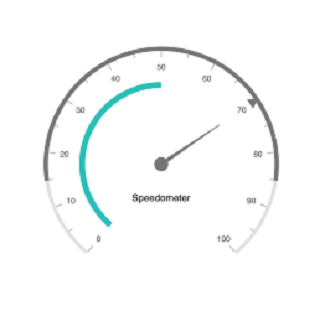
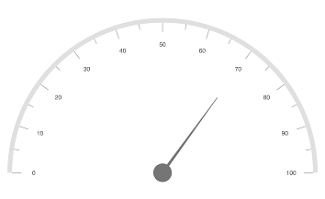

---

layout: post
title: How to | SfCircularGauge | iOS | Syncfusion
description: This section explains the steps required to customize the Syncfusion Circular Gauge control for Xamarin.iOS
platform: xamarin.iOS
control: SfCircularGauge
documentation: ug

---

# How to change the gauge size and alignment

## Changing the gauge size

The [`CircularCoefficient`](https://help.syncfusion.com/cr/xamarin-ios/Syncfusion.SfGauge.iOS.SFCircularGauge.html#Syncfusion_SfGauge_iOS_SFCircularGauge_CircularCoefficient) property is used to change the diameter of the gauge.
It ranges from 0 to 1, and the default value is 1.



    SFCircularGauge sfCircularGauge = new SFCircularGauge();
    sfCircularGauge.CircularCoefficient = 0.7f;
    SFGaugeHeader header = new SFGaugeHeader();
    header.Text = (NSString)"Speedometer";
    header.TextColor = UIColor.Black;
    sfCircularGauge.Headers.Add(header);
    ObservableCollection<SFCircularScale> scales = new ObservableCollection<SFCircularScale>();
    SFCircularScale scale = new SFCircularScale();
    scale.StartValue = 0;
    scale.EndValue = 100;
    SFNeedlePointer needlePointer = new SFNeedlePointer();
    needlePointer.Value = 70;
    scale.Pointers.Add(needlePointer);
    scales.Add(scale);
    SFRangePointer rangePointer = new SFRangePointer();
    rangePointer.RangeStart = 15;
    rangePointer.Value = 85;
    scale.Pointers.Add(rangePointer);
    SFMarkerPointer markerPointer = new SFMarkerPointer();
    markerPointer.Value = 70;
    markerPointer.MarkerShape = MarkerShape.Triangle;
    scale.Pointers.Add(markerPointer);
    SFCircularRange range = new SFCircularRange();
    range.StartValue = 0;
    range.EndValue = 50;
    scale.Ranges.Add(range);
    sfCircularGauge.Scales = scales;



## Gauge alignment

The [`IsCenterAligned`](https://help.syncfusion.com/cr/xamarin-ios/Syncfusion.SfGauge.iOS.SFCircularGauge.html#Syncfusion_SfGauge_iOS_SFCircularGauge_IsCenterAligned) property is used to align the gauge to the center. In semi-circular gauge, bottom space will be removed using the [`IsCenterAligned`](https://help.syncfusion.com/cr/xamarin-ios/Syncfusion.SfGauge.iOS.SFCircularGauge.html#Syncfusion_SfGauge_iOS_SFCircularGauge_IsCenterAligned) property.



    SFCircularGauge sfCircularGauge = new SFCircularGauge();
    sfCircularGauge.IsCenterAligned = true;
    ObservableCollection<SFCircularScale> scales = new ObservableCollection<SFCircularScale>();
    SFCircularScale scale = new SFCircularScale();
    scale.StartValue = 0;
    scale.EndValue = 100;
    scale.StartAngle = 90;
    scale.SweepAngle = 270;
    SFNeedlePointer needlePointer = new SFNeedlePointer();
    needlePointer.Value = 70;
    scale.Pointers.Add(needlePointer);
    scales.Add(scale);
    sfCircularGauge.Scales = scales;



