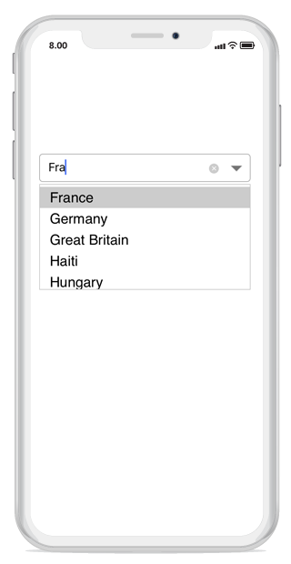
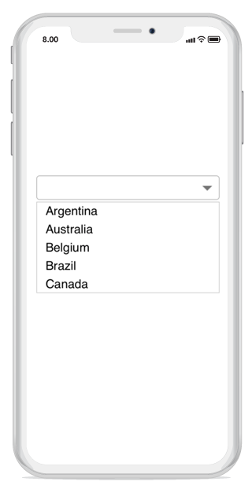

# ComboBoxModes

The control provides you an option to show or select the dropdown items either by editing or non-editing the combobox textbox. The two combo box modes are, 

* Editable  

* Non-Editable 

## Editable 

In editable mode the user can select an item from the dropdown list by either typing any string or clicking the dropdown button.



sfCombo.IsEditable = true;



## Non-editable 

In non-editable mode users can select an item from the dropdown list only by clicking the drop-down button. 

N> The default ComboBoxModes is Non-Editable



sfCombo.IsEditable = false;



