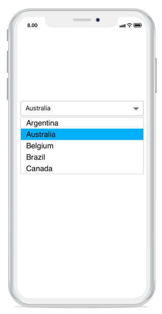
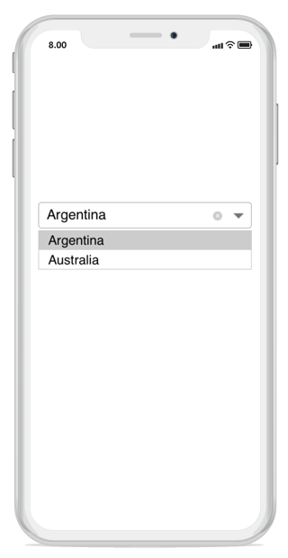
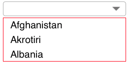
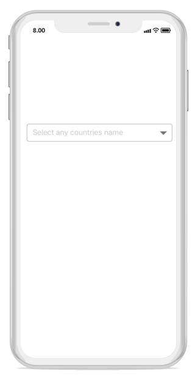

---
layout : post
title : Customizing the Syncfusion ComboBox control in Xamarin.iOS
description : Learn how to Customizing the ComboBox 
platform : Xamarin.iOS
control : ComboBox
documentation : ug
---

# Customization

The combobox control provides multiple customization options. The below topics deals with different forms of customization in the SfComboBox Control. 

## Drop-down items customization 

The dropdown list displaying behavior can be customized based on the entered text and delays in displaying the items. 

## Selected drop-down item color 

you can set color for the selected item in the drop-down item using the property `SelectedDropDownItemColor` property.





combobox.SelectedDropDownItemColor = UIColor.FromRGB(0, 173, 255);





## Set maximum height to the drop-down

The height of the drop-down portion of the combo box control can be varied using the `MaximumDropDownHeight` property. 

N> The value of `MaximumDropDownHeight` property can be any positive integer value.





combobox.MaxDropDownHeight = 60;





## Set border color to the DropDown

The DropDownBorderColor property is used to change the border color of DropDown. The following code example demonstrates how to change the border color of DropDown.




    
SfComboBox countryComboBox = new SfComboBox();
countryComboBox.Frame = new CGRect(10, 20, 250, 30);
NSMutableArray countryList = new NSMutableArray();
countryList.Add((NSString)"Afghanistan");
countryList.Add((NSString)"Akrotiri");
countryList.Add((NSString)"Albania");
countryComboBox.ComboBoxSource = countryList;
countryComboBox.DropDownBorderColor = UIColor.Red;
this.View.AddSubview(countryComboBox);





## DropDown Button Customization 

The dropdown button can be customized using the DropDownButtonSettings property in the following ways:

`Width` – Sets the width for the dropdown button.

`Height` - Sets the height for the dropdown button.

`FontIcon` - Sets different FontIcon for the dropdown button.

`FontColor` - Sets different  FontColor for the dropdown button.

`FontSize` - Sets different  FontSize for the dropdown button. 

`FontFamily` - Sets the different  FontFamily for the dropdown button. 

`BackgroundColor` - Sets the background color for the dropdown button. 

`HighlightedBackgroundColor` - Sets the background color for the dropdown button when it is pressed. 

`HighlightedFontColor` - Sets the font color for the dropdown button when it is pressed. 

`Image` - Sets the image to the dropdown button. 

`View` – Sets a custom view to the dropdown button. 





DropDownButtonSettings dropDownButtonSettings = new DropDownButtonSettings(); 
dropDownButtonSettings.Image = "calendar.png"; 
combobox.DropDownButtonSettings = dropDownButtonSettings; 





## Watermark

The watermark text is used to display some information regarding the combo box. This watermark is visible only when the textbox is empty or null. The watermark text disappears when users begins to type or select any item from the dropdown list in the combo box control. 





combobox.Watermark = (NSString)"Select any Countries name"; 





