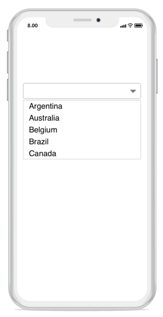
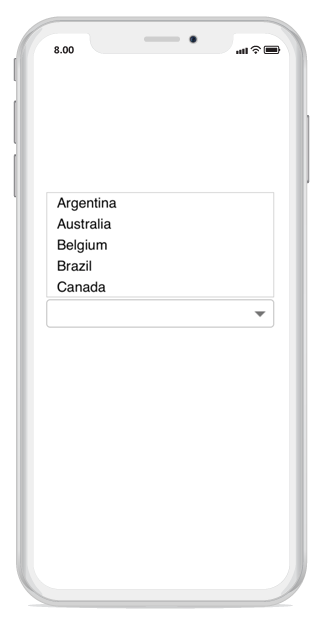

# Dealing with suggestion box 
In the combobox control, the DropDown Box can placed in the following two positions:

* Bottom 

* Top 

Using the Suggestion box placement property, you can place the suggestion box at the top or bottom. 

## SuggestionBox placement at bottom

Displays the suggestion box at the bottom of the combo box control. 
 



combobox.SuggestionBoxPlacement = SuggestionBoxPlacement.Bottom; 
 



## SuggestionBox placement at top

Displays the suggestion box at the top of the combo box control. 
 



combobox.SuggestionBoxPlacement = SuggestionBoxPlacement.Top; 
 



