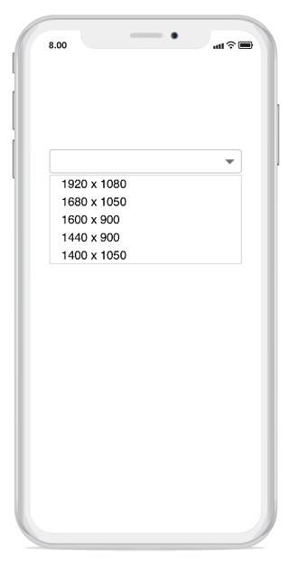
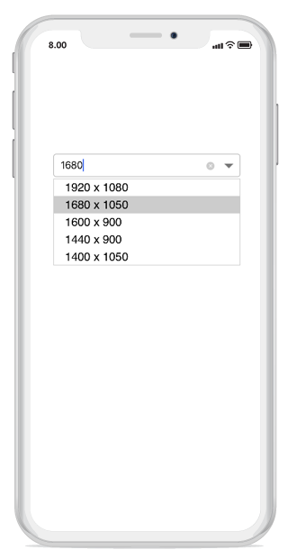
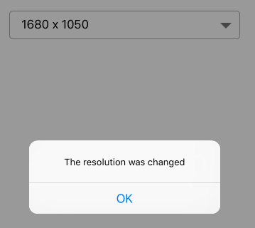

# Getting started

This section explains the steps required to create combo box, populate it with data, and filter suggestions. Here, we create a simple sample is created for changing the resolution. and this This section covers only the minimal features that are needed to get started with the ComboBox combo box.  

## Referencing Essential Studio components in your solution

After installing Essential Studio for Xamarin, find all the required assemblies in the installation folders, 

{Syncfusion Installed location}\Essential Studio {version number}\lib

The assembly reference to the iOS unified project is as follows.

iOS-unifed\Syncfusion.SfComboBox.iOS.dll

## Adding SfComboBox

* Add namespace for the added assemblies.





using Syncfusion.iOS.ComboBox; 





* Then add the SfComboBox control with a required optimal name by using the included namespace.





SfComboBox combobox = new SfComboBox(); 
 




## Adding items

A NSMutableArray of string with resolution list is created and added to the combo box source. This list is populated as suggestion list by setting the ComboBoxSource property based on text entry.




// Add the combo box Control
SfComboBox combobox = new SfComboBox();

// Set a frame to display the control
combobox.Frame = new CoreGraphics.CGRect(25,100, UIScreen.MainScreen.Bounds.Width-50, 40);

//Add the items
NSMutableArray resolutionList = new NSMutableArray();
resolutionList .Add((NSString)" 1920 x 1080");
resolutionList .Add((NSString)" 1680 x 1050");
resolutionList .Add((NSString)" 1600 x 900");
resolutionList .Add((NSString)" 1440 x 900");
resolutionList .Add((NSString)" 1400 x 1050");
resolutionList .Add((NSString)" 1366 x 768");
resolutionList .Add((NSString)" 1280 x 1024");
resolutionList .Add((NSString)" 1280 x 960");
resolutionList .Add((NSString)" 1280 x 720");
resolutionList .Add((NSString)" 854 x 480");
resolutionList .Add((NSString)" 800 x 480");
resolutionList .Add((NSString)" 480 X 640");
resolutionList .Add((NSString)" 480 x 320");
resolutionList .Add((NSString)" 432 x 240");
resolutionList .Add((NSString)" 360 X 640");
resolutionList .Add((NSString)" 320 x 240");
combobox.ComboBoxSource = resolutionList;
this.Add(combobox); 





## Combo box modes

The SfComboBox supports both editable and non-editable text boxes to choose selected items in given data source. Users can select an item from the suggestion box.

N > The default value of the IsEditableMode property is false

## Non-editable combo box 

Non-editable mode is used to prevents users from typing and allows them to select items from the drop-down list. If the `IsEditable` property is set to false, the combo box is non-editable mode. In non-editable mode, the suggestion box can be displayed by clicking the control or drop-down button.




// Add the combo box Control
SfComboBox combobox = new SfComboBox();

// Set a frame to display the control
combobox.Frame = new CoreGraphics.CGRect(25,100, UIScreen.MainScreen.Bounds.Width-50, 40);

// Set the non-editable mode
combobox.IsEditable = false;

//Add the items
NSMutableArray resolutionList = new NSMutableArray();
resolutionList .Add((NSString)" 1920 x 1080");
resolutionList .Add((NSString)" 1680 x 1050");
resolutionList .Add((NSString)" 1600 x 900");
resolutionList .Add((NSString)" 1440 x 900");
resolutionList .Add((NSString)" 1400 x 1050");
resolutionList .Add((NSString)" 1366 x 768");
resolutionList .Add((NSString)" 1280 x 1024");
resolutionList .Add((NSString)" 1280 x 960");
resolutionList .Add((NSString)" 1280 x 720");
resolutionList .Add((NSString)" 854 x 480");
resolutionList .Add((NSString)" 800 x 480");
resolutionList .Add((NSString)" 480 X 640");
resolutionList .Add((NSString)" 480 x 320");
resolutionList .Add((NSString)" 432 x 240");
resolutionList .Add((NSString)" 360 X 640");
resolutionList .Add((NSString)" 320 x 240");
combobox.ComboBoxSource = resolutionList;
this.Add(combobox); 





## Editable combo box

In editable mode, the combo box allows users to edit in the text box that shows suggestions in the drop-down list based on the input. With the previous codes, the `IsEditableMode` property is set to true. This helps users to edit the SfComboBox control.




// Add the combo box Control
SfComboBox combobox = new SfComboBox();

// Set a frame to display the control
combobox.Frame = new CoreGraphics.CGRect(25,100, UIScreen.MainScreen.Bounds.Width-50, 40);

// Set the non-editable mode
combobox.IsEditable = true;

//Add the items
NSMutableArray resolutionList = new NSMutableArray();
resolutionList .Add((NSString)" 1920 x 1080");
resolutionList .Add((NSString)" 1680 x 1050");
resolutionList .Add((NSString)" 1600 x 900");
resolutionList .Add((NSString)" 1440 x 900");
resolutionList .Add((NSString)" 1400 x 1050");
resolutionList .Add((NSString)" 1366 x 768");
resolutionList .Add((NSString)" 1280 x 1024");
resolutionList .Add((NSString)" 1280 x 960");
resolutionList .Add((NSString)" 1280 x 720");
resolutionList .Add((NSString)" 854 x 480");
resolutionList .Add((NSString)" 800 x 480");
resolutionList .Add((NSString)" 480 X 640");
resolutionList .Add((NSString)" 480 x 320");
resolutionList .Add((NSString)" 432 x 240");
resolutionList .Add((NSString)" 360 X 640");
resolutionList .Add((NSString)" 320 x 240");

combobox.ComboBoxSource = resolutionList;
this.Add(combobox); 





## Selecting an item

When selecting an item from the drop-down list, the selection changed event will be called. Using the following code snippet, a dialogue box will be displayed when a new item is selected from the suggestion box.





// Add the combo box Control
SfComboBox combobox = new SfComboBox();

// Set a frame to display the control
combobox.Frame = new CoreGraphics.CGRect(5,100, UIScreen.MainScreen.Bounds.Width-5, 40);

// Set the non-editable mode
combobox.IsEditable = true;

//Add the items
NSMutableArray resolutionList = new NSMutableArray();
resolutionList .Add((NSString)" 1920 x 1080");
resolutionList .Add((NSString)" 1680 x 1050");
resolutionList .Add((NSString)" 1600 x 900");
resolutionList .Add((NSString)" 1440 x 900");
resolutionList .Add((NSString)" 1400 x 1050");
resolutionList .Add((NSString)" 1366 x 768");
resolutionList .Add((NSString)" 1280 x 1024");
resolutionList .Add((NSString)" 1280 x 960");
resolutionList .Add((NSString)" 1280 x 720");
resolutionList .Add((NSString)" 854 x 480");
resolutionList .Add((NSString)" 800 x 480");
resolutionList .Add((NSString)" 480 X 640");
resolutionList .Add((NSString)" 480 x 320");
resolutionList .Add((NSString)" 432 x 240");
resolutionList .Add((NSString)" 360 X 640");
resolutionList .Add((NSString)" 320 x 240");
combobox.ComboBoxSource = resolutionList;
combobox.SelectionChanged += SfCombo_SelectionChanged;
this.Add(combobox); 

void SfCombo_SelectionChanged(object sender, Syncfusion.iOS.ComboBox.SelectionChangedEventArgs e)
{
//Create Alert
var okAlertController = UIAlertController.Create("Selected Month", e.Value+" month is selected", UIAlertControllerStyle.Alert);

//Add Action
okAlertController.AddAction(UIAlertAction.Create("OK", UIAlertActionStyle.Default, null));

// Present Alert
PresentViewController(okAlertController, true, null);
}





You can find the complete getting started sample from this [here.](http://www.syncfusion.com/downloads/support/directtrac/general/ze/ComboboxGettingStaretedSample1179764127 )