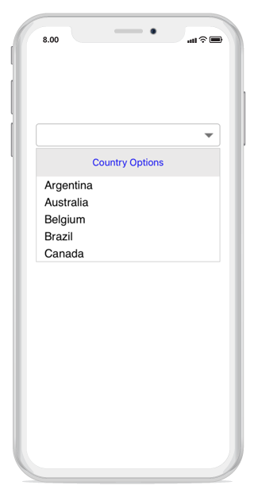
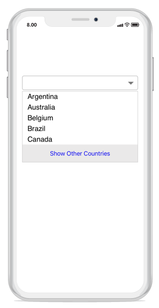

# Header and Footer

You can add header and footer views to the suggestion list in the combo box control by enabling the  `ShowDropDownHeaderView` and `ShowDropDownFooterView` properties. 

## Header content

The header content can be added at the top of the combo box control's suggestion box using the  `DropDownHeaderView` property. The following code example shows how to set the header content in the combo box. The height of the header in the combo box can be adjusted using the `DropDownHeaderViewHeight` property. 





//Shows the header view 
sfCombo.ShowDropDownHeaderView = true; 

//Set height of the Header view 
sfCombo.DropDownHeaderViewHeight = 50; 
UILabel label = new UILabel(); 
label.Text = "Country Options"; 
label.TextColor = UIColor.Blue; 
label.BackgroundColor = UIColor.FromRGB(234,233,233); 
label.TextAlignment = UITextAlignment.Center; 
sfCombo.DropDownHeaderView = label; 





## Footer Content

The footer content can be added at the bottom of the combo box control's suggestion box using the  `DropDownFooterView` property. The following code example shows how to set the footer content in the combo box. The height of the footer in the combo box can be adjusted using the `DropDownFooterViewHeight` property. 




//Shows the footer view 
sfCombo.ShowDropDownFooterView = true; 

//Set height of the footer view 
sfCombo.DropDownFooterViewHeight  = 50; 
UILabel label = new UILabel(); 
label.Text = "Show Other Countries"; 
label.TextColor = UIColor.Blue; 
label.BackgroundColor = UIColor.FromRGB(234,233,233); 
label.TextAlignment = UITextAlignment.Center; 
sfCombo.DropDownFooterView = label;





