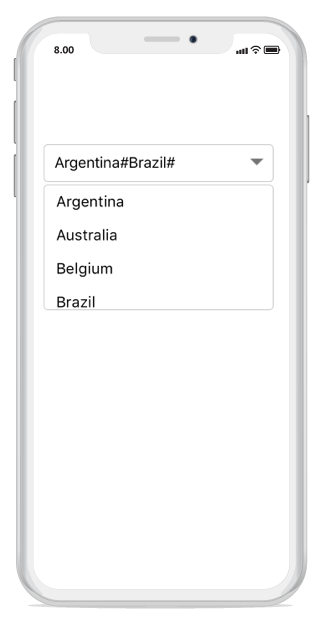

# Multiple Selection

You can select multiple items from a dropdown list in the following two ways:
 
* Token Representation
* Delimiter

## Token Representation

Selected items will be displayed with a customizable token representation, and users can remove each tokenized item using the close button.





combobox.MultiSelectMode = MultiSelectMode.Token; 





### Wrap Mode of Token

The selected items can be displayed as tokens inside the ComboBox in the following two ways:

* **Wrap** - When the `TokensWrapMode` is set to `Wrap`, the selected items will be wrapped to the next line of the ComboBox.
* **None** - When the `TokensWrapMode` is set to `None`, the selected items will be arranged in horizontal orientation.





//Create instance for SfComboBox

{ 
SfComboBox combobox = new SfComboBox(); 
combobox.IsEditable = true; 
combobox.SuggestionMode = SuggestionMode.StartsWith; 
combobox.Frame = new CoreGraphics.CGRect(25,100, UIScreen.MainScreen.Bounds.Width-50, 100); 
combobox.MultiSelectMode = MultiSelectMode.Token; 
combobox.TokensWrapMode = TokensWrapMode.Wrap; 
combobox.ItemHeight = 60; 
this.GetEmployeeData(); 
combobox.DisplayMemberPath = (NSString)"Name"; 
combobox.ImageMemberPath = "Image"; 
combobox.DataSource = EmployeeDetails; 
combobox.DropDownItemChanged += SfCombo_DropDownItemChanged; 
combobox.MaxDropDownHeight = 250; 
} 

string[] EmployeeNames = new string[] 
{ 
    "Alan", 
    "Alexander", 
    "Arthur", 
    "Benjamin", 
    "Bobby", 
    "Carter", 
    "Caleb", 
    "Clara", 
    "Elena", 
    "Evelyn", 
    "Elizabeth", 
    "Freddie", 
    "Gracie", 
    "James", 
    "John", 
    "Joseph", 
    "Jacob", 
    "Victoria", 
    "Joy", 
    "Zachary", 
    "Ivy", 
    "Zara", 
}; 

void GetEmployeeData() 
{ 
    EmployeeDetails = new ObservableCollection<Employee>(); 
    for (int i = 1; i <= EmployeeNames.Length; i++) 
    { 
        EmployeeDetails.Add(new Employee(EmployeeNames[i-1], "Image"+i+".png")); 
    } 
} 

UIView SfCombo_DropDownItemChanged(object sender, DropDownItemEventArgs e) 
{ 
    UIView parentView = new UIView(); 
    SfComboBox auto = (sender as SfComboBox); 
    parentView.Frame = new CGRect(0, 0, auto.Bounds.Width, auto.ItemHeight); 
    UIImageView imageView = new UIImageView(); 
    imageView.Frame = new CGRect(5, 5, 50, auto.ItemHeight - 10); 
    UILabel resultLabel = new UILabel(); 
    resultLabel.Frame = new CGRect(60, auto.ItemHeight / 4, auto.Bounds.Width - 65, auto.ItemHeight / 2 - 5); 
    resultLabel.Font = UIFont.FromName("Helvetica", 20f); 
    resultLabel.TextAlignment = UITextAlignment.Left; 
    var item = auto.DataSource.ElementAt((int)e.Index); 
    var selectedObject = (item as Employee); 
    imageView.Image = new UIImage(selectedObject.Image); 
    resultLabel.Text = selectedObject.Name; 
    parentView.AddSubview(imageView); 
    parentView.AddSubview(resultLabel); 
    e.View = parentView; 
    return e.View; 
} 
public class Employee 
{ 
private string name; 
public string Name 
{ 
get 
{ 
    return name; 
} 

set 
{ 
    name = value; 
}          
} 

private string image; 
public string Image 
{ 
get 
{ 
    return image; 
} 

set 
{ 
    image = value; 
} 
} 

public Employee(string name, string image) 
{ 
    this.Name = name; 
    this.Image = image; 
} 
} 





### Token Customization

Tokens can be customized in the following ways:

* **TextColor** - Sets the color of the text inside the token.
* **FontSize** - Sets the size of the font inside the token.
* **FontFamily** - Sets the font family for the text inside the token.
* **BackgroundColor** - Sets the background color of the token.
* **SelectedBackgroundColor** - Sets the background color of the token when it is selected.
* **IsCloseButtonVisible** - Enables and disables the close button inside the token.
* **DeleteButtonColor** - Sets the color of the close button inside the token.
* **CornerRadius** - Sets the corner radius for the token.





// Token Customization

TokenSettings token = new TokenSettings(); 
token.FontSize = 16; 
token.BackgroundColor = UIColor.FromRGB(102,204,255); 
token.TextColor = UIColor.White; 
token.SelectedBackgroundColor = UIColor.FromRGB(255,255,224); 
token.DeleteButtonColor = UIColor.Black; 
token.FontFamily = "Times New Roman"; 
token.IsCloseButtonVisible = true; 
token.CornerRadius = 10; 
combobox.TokenSettings = token;





## Delimiter

When selecting multiple items, the selected items can be separated with a desired character specified as a delimiter. You can set the delimiter character using the `Delimiter` property.

N> The default delimiter character is ",".





combobox.MultiSelectMode = MultiSelectMode.Delimiter; 





You can add a custom delimiter character by using the `Delimiter` property.





combobox.MultiSelectMode = MultiSelectMode.Delimiter; 
combobox.Delimiter="#";





