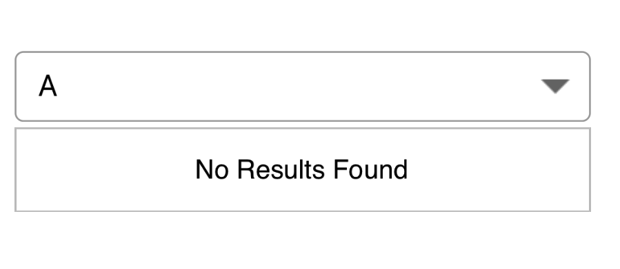
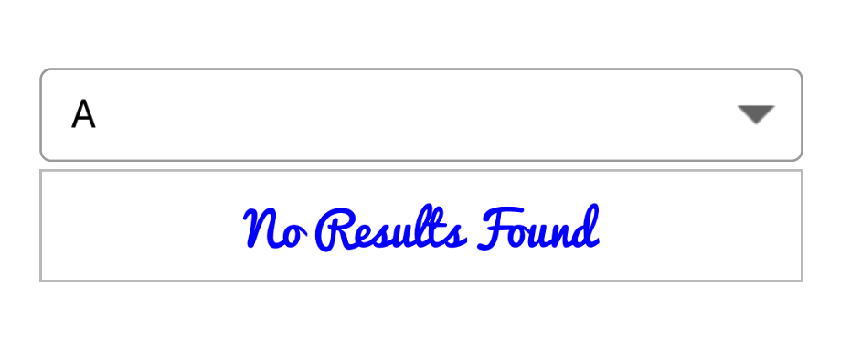

# No Results Found

When the entered item is not in the suggestion list, SfComboBox displays a text indicating there is no search results found. We can set the desire text to be displayed for indicating no results found with the `NoResultsFoundText` property.





comboBox.NoResultsFoundText = "No Results Found";
comboBox.SuggestionMode = SuggestionMode.StartsWith;





## Customizing NoResultsFoundText

The `NoResultsFoundTextColor` and `NoResultsFoundFont` are the properties used to customize the foreground color and font of the NoResultsFoundText.





comboBox.SuggestionMode = SuggestionMode.StartsWith;
comboBox.NoResultsFoundText = "No Results Found";
comboBox.NoResultsFoundTextColor = UIColor.Blue;
comboBox.NoResultsFoundFont = UIFont.FromName("Pacifico", 20);





