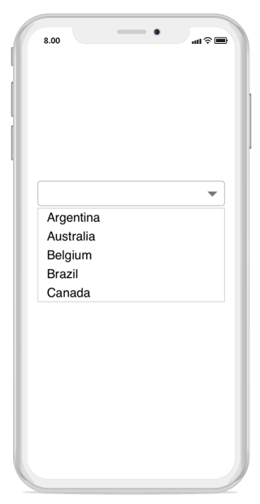

# Overview

The combo box control allows users to choose an option from the list of predefined options. When the arrow icon accompanied with this component is pressed, the drop-down displays a list of values, from which users can select an option. 

## Key Features

* `ComboBox Mode` - Provides an option to select an item from the drop-down list by either editing or non-editing the combobox textbox.

* `Suggestion Mode` - Suggestions can be displayed in eight different modes, such as StartsWith, EndWith, Contains, Equals, etc.

* `Multiple Selection` - Provides two different ways to select multiple items from the dropdown list using token representation and delimiter. 

* `Filtering` - Provides options to support both filtering and non-filtering suggestion list. The combo box provides three different ways to display the filtered suggestions. They displays suggestions using the drop-down list, appends the first suggestion to text and both of these.

* `Header and Footer` - Header and footer content can be given in the top and bottom of the dropdown list. 

* `Highlighting Text` - Highlights the matching text in the dropdown list based on the input. 

* `Customization support` - Provides options to customize both the Entry and dropdown. 

* `Watermark` – Supports explanatory text inside the combo box control until users inputs the text. Watermark is restored again if user clears the text.

