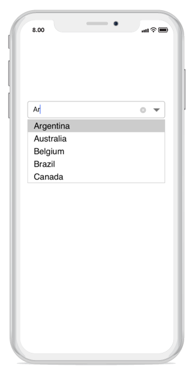

# Suggestion Display Mode

The `ComboBoxMode` property determines how suggestions are displayed in the dropdown list based on the text entered by the user. The different types of patterns are described below:

* Suggest

* Append

* Suggest and Append

N> The default option is suggest mode.

## Suggest Mode

The **Suggest** mode displays matching suggestions in the dropdown list.




	
combobox.ComboBoxMode = ComboBoxMode.Suggest;	





## Append Mode

The **Append** mode automatically appends the first matching string to the entered text.




	
combobox.ComboBoxMode = ComboBoxMode.Append;





## Suggest and Append Mode

The **SuggestAppend** mode combines both behaviors: it displays suggestions in the dropdown while also appending the first matching string to the entered text.



	
combobox.ComboBoxMode = ComboBoxMode.SuggestAppend;





