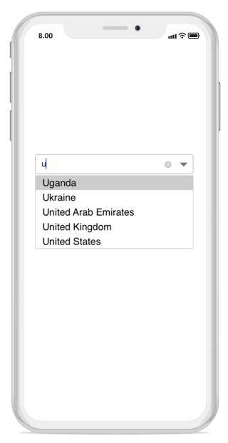
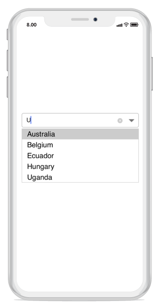
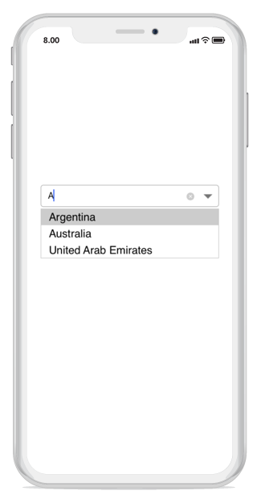
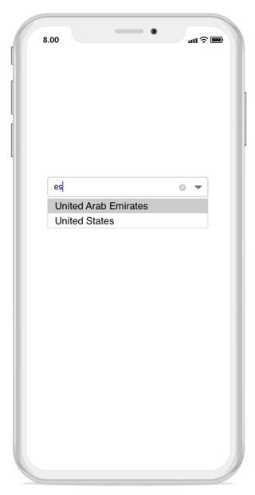

# Various Filter Options for Suggestions

The ComboBox control provides filtering options to filter suggestions displayed in the dropdown list.




	
  combobox.AllowFiltering = true;
  combobox.IsEditableMode = true;
	 




## Types of Filtering

The string comparison method for filtering suggestions can be configured using the `SuggestionMode` property. The default filtering strategy is `StartsWith` and it is case insensitive. The available filtering modes are:

* StartsWith
* StartsWithCaseSensitive
* Contains
* ContainsWithCaseSensitive
* Equals
* EqualsWithCaseSensitive
* EndsWith
* EndsWithCaseSensitive
* Custom

## StartsWith Mode

### Words that start with input text

Displays a list of suggestions based on items that start with the entered text.





    combobox.SuggestionMode = SuggestionMode.StartsWith;   	
	 



	

### Case-sensitive filtering

Displays a list of suggestions based on items that start with the entered text, with case-sensitive matching.



	
	combobox.SuggestionMode = SuggestionMode.StartsWithCaseSensitive;
	 



	

## Contains Mode
### Words that contain the input text

Displays a list of suggestions if the ComboBox items contain the entered text.




	
	combobox.SuggestionMode = SuggestionMode.Contains;
	 



	

### Case-sensitive filtering

Displays a list of suggestions if the ComboBox items contain the entered text, with case-sensitive matching.



	
	combobox.SuggestionMode = SuggestionMode.ContainsWithCaseSensitive;
	 



	

## Equals Mode
### Words that equal the input text

Displays suggestions that exactly match the entered text.




	
	combobox.SuggestionMode = SuggestionMode.Equals;
	 



	

### Case-sensitive filtering

Displays suggestions that exactly match the entered text, with case-sensitive matching.



	
	combobox.SuggestionMode = SuggestionMode.EqualsWithCaseSensitive;
	 



	

## EndsWith Mode
### Words that end with input text

Displays a list of suggestions based on items that end with the entered text.




	
	combobox.SuggestionMode = SuggestionMode.EndsWith;
	 



	

### Case-sensitive filtering

Displays a list of suggestions based on items that end with the entered text, with case-sensitive matching.



	
combobox.SuggestionMode = SuggestionMode.EndsWithCaseSensitive;
	 



	

## Custom Filter Mode

Enables custom filtering logic for displaying suggestions based on your specific requirements.



	
combobox.SuggestionMode = SuggestionMode.Custom;
	 



	

