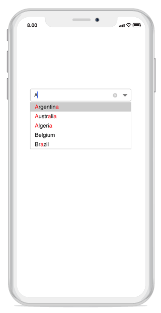

# Highlighting Matched Text

An item can be picked with more clarity by highlighting the matching characters in a suggestion list using the following two ways:

* First Occurrence
* Multiple Occurrence

Text highlighting can be customized with various styles by configuring the following properties:

* **HighlightedTextColor** - Sets the color of the highlighted text for differentiating the highlighted characters.

N> The dropdown text can be highlighted only when the `AllowFiltering` property is set to `true`.

## First Occurrence

Highlights the first position of the matching characters in the suggestion list.





combobox.AllowFiltering = true;
combobox.IsEditableMode = true;
combobox.TextHighlightMode = OccurrenceMode.FirstOccurrence;
combobox.HighlightedTextColor = Color.Red; 
	 




N> The default color of `HighlightedTextColor` is Red.

## Multiple Occurrence

Highlights all matching characters that occur throughout the suggestion list when using the Contains mode in `SuggestionMode`.





combobox.IsEditableMode = true;
combobox.TextHighlightMode = OccurrenceMode.MultipleOccurrence;
combobox.HighlightedTextColor = Color.Red;
combobox.SuggestionMode = SuggestionMode.Contains; 
	 



	

