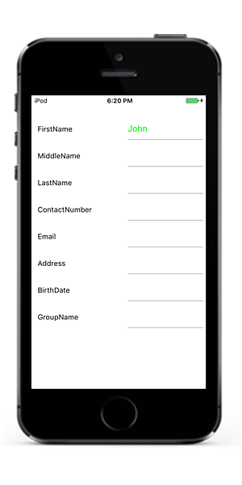
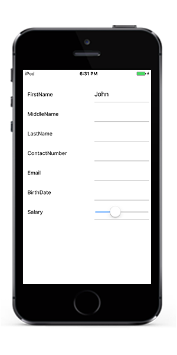
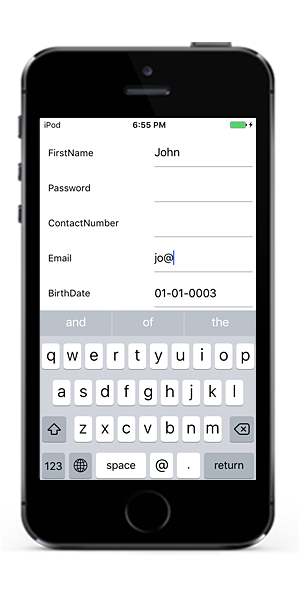

# Editing 

SfDataForm provides support for several built-in editors.

## Supported editors and associated DataFormItem

<table>
<tr>
<th>
Editor name
</th>
<th>
Editor class
</th>
<th>
Data Type/Attribute
</th>
<th>
Input control loaded
</th>
</tr>
<tr>
<td>
Text
</td>
<td>
{{'[DataFormTextEditor](https://help.syncfusion.com/cr/cref_files/xamarin-ios/Syncfusion.SfDataForm.iOS~Syncfusion.iOS.DataForm.Editors.DataFormTextEditor.html)'| markdownify }}
</td>
<td>
Property of type string and any other type apart from below specified cases.
</td>
<td>
UITextField
</td>
</tr>
<tr>
<td>
MultilineText
</td>
<td>
{{'[DataFormMultiLineTextEditor](https://help.syncfusion.com/cr/cref_files/xamarin-ios/Syncfusion.SfDataForm.iOS~Syncfusion.iOS.DataForm.Editors.DataFormMultiLineTextEditor.html)'| markdownify }}
</td>
<td>
Property of string type with Multiline text.
[DataType(DataType.Multiline)] 
</td>
<td>
UITextView
</td>
</tr>
<tr>
<td>
Numeric
</td>
<td>
{{'[DataFormNumericEditor](https://help.syncfusion.com/cr/cref_files/xamarin-ios/Syncfusion.SfDataForm.iOS~Syncfusion.iOS.DataForm.Editors.DataFormNumericEditor.html)'| markdownify }}
</td>
<td>
Property of type int, double, float, decimal, long types and its nullable also properties with below attributes.
</td>
<td>
SfNumericTextBox
</td>
</tr>
<tr>
<td>
Percent
</td>
<td>
{{'[DataFormNumericEditor](https://help.syncfusion.com/cr/cref_files/xamarin-ios/Syncfusion.SfDataForm.iOS~Syncfusion.iOS.DataForm.Editors.DataFormNumericEditor.html)'| markdownify }}
</td>
<td>
Property of type int, double, float, decimal, long types and its nullable also properties with below attributes. [DataType(“Percent”)].
</td>
<td>
SfNumericTextBox
</td>
</tr>
<tr>
<td>
Currency
</td>
<td>
{{'[DataFormNumericEditor](https://help.syncfusion.com/cr/cref_files/xamarin-ios/Syncfusion.SfDataForm.iOS~Syncfusion.iOS.DataForm.Editors.DataFormNumericEditor.html)'| markdownify }}
</td>
<td>
Property of type int, double, float, decimal, long types and its nullable also properties with below attributes. [DataType(DataType.Currency)].
</td>
<td>
SfNumericTextBox
</td>
</tr>
<tr>
<td>
Date
</td>
<td>
{{'[DataFormDateEditor](https://help.syncfusion.com/cr/cref_files/xamarin-ios/Syncfusion.SfDataForm.iOS~Syncfusion.iOS.DataForm.Editors.DataFormDateEditor.html)'| markdownify }}
</td>
<td>
Property of type DateTime and Property with below attribute
[DataType(DataType.Date)].
[DataType(DataType.DateTime)]
</td>
<td>
SfDatePicker
</td>
</tr>
<tr>
<td>
Time
</td>
<td>
{{'[DataFormTimeEditor](https://help.syncfusion.com/cr/cref_files/xamarin-ios/Syncfusion.SfDataForm.iOS~Syncfusion.iOS.DataForm.Editors.DataFormTimeEditor.html)'| markdownify }}
</td>
<td>
Property with below attribute.
[DataType(DataType.Time)].
</td>
<td>
SfTimePicker
</td>
</tr>
<tr>
<td>
NumericUpDown
</td>
<td>
{{'[DataFormNumericUpDownEditor](https://help.syncfusion.com/cr/cref_files/xamarin-ios/Syncfusion.SfDataForm.iOS~Syncfusion.iOS.DataForm.Editors.DataFormNumericUpDownEditor.html)'| markdownify }}
</td>
<td>
Property of type Int or Double.
</td>
<td>
SfNumericUpDown
</td>
</tr>
<tr>
<td>
Segment
</td>
<td>
{{'[DataFormSegmentedEditor](https://help.syncfusion.com/cr/cref_files/xamarin-ios/Syncfusion.SfDataForm.iOS~Syncfusion.iOS.DataForm.Editors.DataFormSegmentedEditor.html)'| markdownify }}
</td>
<td>
Property of type enum.
</td>
<td>
UISegmentedControl
</td>
</tr>
<tr>
<td>
Bool
</td>
<td>
{{'[DataFormSwitchEditor](https://help.syncfusion.com/cr/cref_files/xamarin-ios/Syncfusion.SfDataForm.iOS~Syncfusion.iOS.DataForm.Editors.DataFormSwitchEditor.html)'| markdownify }}
</td>
<td>
Property of type bool
</td>
<td>
UISwitch
</td>
</tr>
<tr>
<td>
Picker
</td>
<td>
{{'[DataFormPickerEditor](https://help.syncfusion.com/cr/cref_files/xamarin-ios/Syncfusion.SfDataForm.iOS~Syncfusion.iOS.DataForm.Editors.DataFormPickerEditor.html)'| markdownify }}
</td>
<td>
Property of type enum and list. 
[EnumDataTypeAttribute]
</td>
<td>
SfPicker
</td>
</tr>
<tr>
<td>
Password
</td>
<td>
{{'[DataFormPasswordEditor](https://help.syncfusion.com/cr/cref_files/xamarin-ios/sfdataform/Syncfusion.SfDataForm.iOS~Syncfusion.iOS.DataForm.Editors.DataFormPasswordEditor.html)'| markdownify }}
</td>
<td>
The String type property and property with 
[DataType(DataType.Password)] attribute.
</td>
<td>
UITextField
</td>
</tr>
</table>

## Changing editor for type

By default, editors will be loaded based on above table. If you want to change the editor for any type, you need to use [RegisterEditor](https://help.syncfusion.com/cr/cref_files/xamarin-ios/Syncfusion.SfDataForm.iOS~Syncfusion.iOS.DataForm.SfDataForm~RegisterEditor(Type,String).html) method and specify type and editor.



dataForm.RegisterEditor(typeof(int), "NumericUpDown");



Here, `NumericUpDown` editor will be loaded for integer type instead of numeric editor.

## Changing editor for property

If you want to change the editor for any property, you need to use [RegisterEditor](https://help.syncfusion.com/cr/cref_files/xamarin-ios/Syncfusion.SfDataForm.iOS~Syncfusion.iOS.DataForm.SfDataForm~RegisterEditor(String,String).html) method and specify property name and editor.



dataForm.RegisterEditor("Name", "DropDown");



Here, Switch editor will be loaded for `Name` property (Enum type) instead of `Picker` editor.

## Customizing existing editor

You can customize the existing editors defined in above table, by overriding default editors.

Here,[DataFormTextEditor](https://help.syncfusion.com/cr/cref_files/xamarin-ios/Syncfusion.SfDataForm.iOS~Syncfusion.iOS.DataForm.Editors.DataFormTextEditor.html) is customized to set different foreground for FirstName property text editor.



public class CustomTextEditor : DataFormTextEditor
{
    public CustomTextEditor(SfDataForm dataForm) : base(dataForm)
    {
    }

    protected override void OnInitializeView(DataFormItem dataFormItem, UITextField view)
    {
        if (dataFormItem.Name == "FirstName")
            view.TextColor = UIColor.Green;
        base.OnInitializeView(dataFormItem, view);
    }
}
dataForm.RegisterEditor("Text", new CustomTextEditor(dataForm));



## Creating new custom editor

You can create custom editor by overriding [DataFormEditor](https://help.syncfusion.com/cr/cref_files/xamarin-ios/Syncfusion.SfDataForm.iOS~Syncfusion.iOS.DataForm.Editors.DataFormEditor%601.html) class.
Property settings, commit, data validation can be handled by overriding required methods. Here, `UISlider` is loaded for `Salary` editor.



public class CustomSliderEditor : DataFormEditor<UISlider>
{
    public CustomSliderEditor(SfDataForm dataForm) : base(dataForm)
    {
    }

    protected override UISlider OnCreateEditorView()
    {
        return new UISlider();
    }

    protected override void OnInitializeView(DataFormItem dataFormItem, UISlider view)
    {
        view.Value = (int)dataForm.ItemManager.GetValue(dataFormItem);
    }

    protected override void OnWireEvents(UISlider view)
    {
        view.ValueChanged += View_ValueChanged;
    }

    private void View_ValueChanged(object sender, EventArgs e)
    {
        OnCommitValue(sender as UISlider);
        OnValidateValue(sender as UISlider);
    }

    protected override void OnUnWireEvents(UISlider view)
    {
        view.ValueChanged -= View_ValueChanged;
    }

    protected override void OnCommitValue(UISlider view)
    {
        var dataFormItemView = view.Superview as DataFormItemView;
        dataForm.ItemManager.SetValue(dataFormItemView.DataFormItem, view.Value);
    }
}

dataForm.RegisterEditor("Slider", new CustomSliderEditor(dataForm));
dataForm.RegisterEditor("Salary", "Slider");



## Support for Email editor

You can load Email editor by changing `KeyBoardType` in [AutoGeneratingDataFormItem](https://help.syncfusion.com/cr/cref_files/xamarin-ios/Syncfusion.SfDataForm.iOS~Syncfusion.iOS.DataForm.SfDataForm~AutoGeneratingDataFormItem_EV.html) event.



dataForm.AutoGeneratingDataFormItem += DataForm_AutoGeneratingDataFormItem;private void DataForm_AutoGeneratingDataFormItem(object sender, AutoGeneratingDataFormItemEventArgs e)
{
    if (e.DataFormItem != null && e.DataFormItem.Name == "Email")
    {
        (e.DataFormItem as DataFormTextItem).KeyBoardType = UIKeyboardType.EmailAddress;
    }
}



## Commit mode

[CommitMode](https://help.syncfusion.com/cr/cref_files/xamarin-ios/Syncfusion.SfDataForm.iOS~Syncfusion.iOS.DataForm.SfDataForm~CommitMode.html) determines when the value should be committed to data object.

Below are the supported commit modes.

* LostFocus
* PropertyChanged
* Explicit



dataForm.CommitMode = CommitMode.LostFocus;



**LostFocus**

If the commit mode is LostFocus, value is committed when the editor lost its focus.

**PropertyChanged**

Value is committed immediately when it is changed.

**Explicit**

Value should be committed manually by calling [SfDataForm.Commit](https://help.syncfusion.com/cr/cref_files/xamarin-ios/Syncfusion.SfDataForm.iOS~Syncfusion.iOS.DataForm.SfDataForm~Commit().html) or [SfDataForm.Commit(propertyName)](https://help.syncfusion.com/cr/cref_files/xamarin-ios/Syncfusion.SfDataForm.iOS~Syncfusion.iOS.DataForm.SfDataForm~Commit(String).html) method.

Below code commits the value of all the properties in data object.



dataForm.Commit();



If you want to commit specific property value, you need to pass property name as argument.



dataForm.Commit("Name");



## Update editor value based on another editor

You can the update the editor value by using [SfDataForm.UpdateEditor](https://help.syncfusion.com/cr/cref_files/xamarin-ios/Syncfusion.SfDataForm.iOS~Syncfusion.iOS.DataForm.SfDataForm~UpdateEditor.html) method at runtime.



var expenseInfo = new ExpenseInfo();
expenseInfo.PropertyChanged += ExpenseInfo_PropertyChanged;
dataForm.DataObject = expenseInfo;
SetContentView(dataForm);

private void ExpenseInfo_PropertyChanged(object sender, PropertyChangedEventArgs e)
{
    if (e.PropertyName == "Budget" || e.PropertyName == "Expense")
    {
        var item = sender as ExpenseInfo;
        item.Balance = item.Budget - item.Expense;
        dataForm.UpdateEditor("Balance");               
    }
}



Here, `Balance` property value is updated based on `Budget` and `Expense` properties. For updating value in editor, `UpdateEditor` method is called.
You can download the sample from [here](http://www.syncfusion.com/downloads/support/directtrac/general/ze/UpdateEditor-2039559641).

## Converter

If you want to show the original value in different format or as different value, you need to use [Converter](https://help.syncfusion.com/cr/cref_files/xamarin-ios/Syncfusion.SfDataForm.iOS~Syncfusion.iOS.DataForm.ConverterAttribute.html) attribute.
Here, original value is multiplied by 10 and shown in editor. While committing, it is divided by 10 and stored in data object.



public class ValueConverterExt : IPropertyValueConverter
{
    public object Convert(object value)
    {            
        var amount = double.Parse(value.ToString());
        return amount * 10;
    }

    public object ConvertBack(object value)
    {
        var amount = double.Parse(value.ToString());
        return amount / 10;
    }
}

private double? amount = 1000;

[Converter(typeof(ValueConverterExt))]
public double? Amount
{
    get
    {
        return amount;
    }
    set
    {
        amount = value;
        RaisePropertyChanged("Amount");
    }
}



## Disable editing

You can disable edit by setting [IsReadOnly](https://help.syncfusion.com/cr/cref_files/xamarin-ios/Syncfusion.SfDataForm.iOS~Syncfusion.iOS.DataForm.SfDataForm~IsReadOnly.html) property of SfDataForm.



dataForm.IsReadOnly = true;



You can also change the editing behavior by setting [IsReadOnly](https://help.syncfusion.com/cr/cref_files/xamarin-ios/Syncfusion.SfDataForm.iOS~Syncfusion.iOS.DataForm.DataFormItem~IsReadOnly.html) property of [DataFormItem](https://help.syncfusion.com/cr/cref_files/xamarin-ios/Syncfusion.SfDataForm.iOS~Syncfusion.iOS.DataForm.DataFormItem.html).



dataForm.AutoGeneratingDataFormItem += DataForm_AutoGeneratingDataFormItem;

private void DataForm_AutoGeneratingDataFormItem(object sender, AutoGeneratingDataFormItemEventArgs e)
{
    if (e.DataFormItem != null)
    {
        if (e.DataFormItem.Name == "Salary")
            e.DataFormItem.IsReadOnly = true;
    }
}



You can change the editing behavior at runtime also.




private void Button_Click(object sender, System.EventArgs e)
{
    var dataFormItem = dataForm.ItemManager.DataFormItems["FirstName"];
    dataFormItem.IsReadOnly = true;
}




N> [DataFormItem.IsReadOnly](https://help.syncfusion.com/cr/cref_files/xamarin-ios/Syncfusion.SfDataForm.iOS~Syncfusion.iOS.DataForm.DataFormItem~IsReadOnly.html) takes higher priority than [SfDataForm.IsReadOnly](https://help.syncfusion.com/cr/cref_files/xamarin-ios/Syncfusion.SfDataForm.iOS~Syncfusion.iOS.DataForm.SfDataForm~IsReadOnly.html).
You can also have option to define the editing behavior from `SfDataForm.DataObject` definition using [ReadOnly](https://msdn.microsoft.com/en-us/library/system.componentmodel.readonlyattribute.aspx) attribute and [EditableAttribute](https://msdn.microsoft.com/en-us/library/system.componentmodel.dataannotations.editableattribute.aspx)




private double? balance;
[ReadOnly(true)]
public double? Balance
{
    get
    {
        return balance;
    }
    set
    {
        balance = value;
        RaisePropertyChanged("Balance");
    }
}
private double? balance;
[Editable(false)]
public double? Balance
{
    get
    {
        return balance;
    }
    set
    {
        balance = value;
        RaisePropertyChanged("Balance");
    }
}




You can also define the editing behavior by defining [SfDataForm.DataObject](https://help.syncfusion.com/cr/cref_files/xamarin-ios/Syncfusion.SfDataForm.iOS~Syncfusion.iOS.DataForm.SfDataForm~DataObject.html) fields definition without `setter` or with `private set`.



private double? balance;
public double? Balance
{
    get
    {
        return balance;
    }    
}
private double? balance;
public double? Balance
{
    get
    {
        return balance;
    }
    private set
    {
        balance = value;
    }
}

