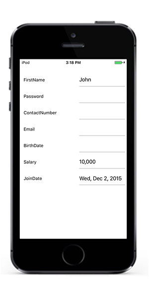
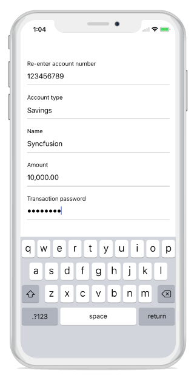

# Editors

SfDataForm provides support for several built-in editors. Below are the supported editors.

<table>
<tr>
<th>Editor name</th>
<th>Editor class</th>
<th>Supported Data Type/Attribute</th>
<th>Input control loaded</th>
</tr>
<tr>
<td>
Text
</td>
<td>
{{'[DataFormTextEditor](https://help.syncfusion.com/cr/cref_files/xamarin-ios/Syncfusion.SfDataForm.iOS~Syncfusion.iOS.DataForm.Editors.DataFormTextEditor.html)'| markdownify }}
</td>
<td>
Property of type string and any other type apart from below specified cases.
</td>
<td>
{{'[UITextField](https://developer.apple.com/documentation/uikit/uitextfield)'| markdownify }}
</td>
</tr>
<tr>
<td>
MultilineText
</td>
<td>
{{'[DataFormMultiLineTextEditor](https://help.syncfusion.com/cr/cref_files/xamarin-ios/Syncfusion.SfDataForm.iOS~Syncfusion.iOS.DataForm.Editors.DataFormMultiLineTextEditor.html)'| markdownify }}
</td>
<td>
Property of string type with Multiline text.
[DataType(DataType.Multiline)] 
</td>
<td>
{{'[UITextView](https://developer.apple.com/documentation/uikit/uitextview)'| markdownify }}
</td>
</tr>
<tr>
<td>
Numeric
</td>
<td>
{{'[DataFormNumericEditor](https://help.syncfusion.com/cr/cref_files/xamarin-ios/Syncfusion.SfDataForm.iOS~Syncfusion.iOS.DataForm.Editors.DataFormNumericEditor.html)'| markdownify }}
</td>
<td>
Property of type int, double, float, decimal, long types and its nullable also properties with below attributes.
</td>
<td>
{{'[SfNumericTextBox](https://help.syncfusion.com/xamarin-ios/sfnumerictextbox/overview)'| markdownify }}
</td>
</tr>
<tr>
<td>
Percent
</td>
<td>
{{'[DataFormNumericEditor](https://help.syncfusion.com/cr/cref_files/xamarin-ios/Syncfusion.SfDataForm.iOS~Syncfusion.iOS.DataForm.Editors.DataFormNumericEditor.html)'| markdownify }}
</td>
<td>
Property of type int, double, float, decimal, long types and its nullable also properties with below attributes. [DataType(“Percent”)].
</td>
<td>
{{'[SfNumericTextBox](https://help.syncfusion.com/xamarin-ios/sfnumerictextbox/overview)'| markdownify }}
</td>
</tr>
<tr>
<td>
Currency
</td>
<td>
{{'[DataFormNumericEditor](https://help.syncfusion.com/cr/cref_files/xamarin-ios/Syncfusion.SfDataForm.iOS~Syncfusion.iOS.DataForm.Editors.DataFormNumericEditor.html)'| markdownify }}
</td>
<td>
Property of type int, double, float, decimal, long types and its nullable also properties with below attributes. [DataType(DataType.Currency)].
</td>
<td>
{{'[SfNumericTextBox](https://help.syncfusion.com/xamarin-ios/sfnumerictextbox/overview)'| markdownify }}
</td>
</tr>
<tr>
<td>
Date
</td>
<td>
{{'[DataFormDateEditor](https://help.syncfusion.com/cr/cref_files/xamarin-ios/Syncfusion.SfDataForm.iOS~Syncfusion.iOS.DataForm.Editors.DataFormDateEditor.html)'| markdownify }}
</td>
<td>
Property of type DateTime and Property with below attribute
[DataType(DataType.Date)].
[DataType(DataType.DateTime)]
</td>
<td>
{{'[SfDatePicker](https://help.syncfusion.com/cr/cref_files/xamarin-ios/Syncfusion.SfDataForm.iOS~Syncfusion.iOS.DataForm.Editors.SfDatePicker.html)'| markdownify }}
</td>
</tr>
<tr>
<td>
Time
</td>
<td>
{{'[DataFormTimeEditor](https://help.syncfusion.com/cr/cref_files/xamarin-ios/Syncfusion.SfDataForm.iOS~Syncfusion.iOS.DataForm.Editors.DataFormTimeEditor.html)'| markdownify }}
</td>
<td>
Property with below attribute.
[DataType(DataType.Time)].
</td>
<td>
{{'[SfTimePicker](https://help.syncfusion.com/cr/cref_files/xamarin-ios/Syncfusion.SfDataForm.iOS~Syncfusion.iOS.DataForm.Editors.SfTimePicker.html)'| markdownify }}
</td>
</tr>
<tr>
<td>
NumericUpDown
</td>
<td>
{{'[DataFormNumericUpDownEditor](https://help.syncfusion.com/cr/cref_files/xamarin-ios/Syncfusion.SfDataForm.iOS~Syncfusion.iOS.DataForm.Editors.DataFormNumericUpDownEditor.html)'| markdownify }}
</td>
<td>
Property of type Int or Double.
</td>
<td>
{{'[SfNumericUpDown](https://help.syncfusion.com/xamarin-ios/sfnumericupdown/overview)'| markdownify }}
</td>
</tr>
<tr>
<td>
Segment
</td>
<td>
{{'[DataFormSegmentedEditor](https://help.syncfusion.com/cr/cref_files/xamarin-ios/Syncfusion.SfDataForm.iOS~Syncfusion.iOS.DataForm.Editors.DataFormSegmentedEditor.html)'| markdownify }}
</td>
<td>
Property of type enum.
</td>
<td>
{{'[UISegmentedControl](https://developer.apple.com/documentation/uikit/uisegmentedcontrol)'| markdownify }}
</td>
</tr>
<tr>
<td>
Bool
</td>
<td>
{{'[DataFormSwitchEditor](https://help.syncfusion.com/cr/cref_files/xamarin-ios/Syncfusion.SfDataForm.iOS~Syncfusion.iOS.DataForm.Editors.DataFormSwitchEditor.html)'| markdownify }}
</td>
<td>
Property of type bool
</td>
<td>
{{'[UISwitch](https://developer.apple.com/documentation/uikit/uiswitch)'| markdownify }}
</td>
</tr>
<tr>
<td>
Picker
</td>
<td>
{{'[DataFormPickerEditor](https://help.syncfusion.com/cr/cref_files/xamarin-ios/Syncfusion.SfDataForm.iOS~Syncfusion.iOS.DataForm.Editors.DataFormPickerEditor.html)'| markdownify }}
</td>
<td>
Property of type enum and list. 
[EnumDataTypeAttribute]
</td>
<td>
{{'[SfPicker](https://help.syncfusion.com/cr/cref_files/xamarin-ios/Syncfusion.SfDataForm.iOS~Syncfusion.iOS.DataForm.Editors.SfPicker.html)'| markdownify }}
</td>
</tr>
<tr>
<td>
Password
</td>
<td>
{{'[DataFormPasswordEditor](https://help.syncfusion.com/cr/cref_files/xamarin-ios/sfdataform/Syncfusion.SfDataForm.iOS~Syncfusion.iOS.DataForm.Editors.DataFormPasswordEditor.html)'| markdownify }}
</td>
<td>
The String type property and property with 
[DataType(DataType.Password)] attribute.
</td>
<td>
{{'[UITextField](https://developer.apple.com/documentation/uikit/uitextfield)'| markdownify }}
</td>
</tr>
</table>

## Text Editor

In Text editor, [UITextField](https://developer.xamarin.com/api/type/MonoTouch.UIKit.UITextField/) is loaded. 

### Loading upper case keyboard in UITextField

You can load upper case letters in keyboard by setting [InputType](https://help.syncfusion.com/cr/cref_files/xamarin-android/Syncfusion.SfDataForm.Android~Syncfusion.Android.DataForm.DataFormTextItem~InputType.html) as `TextFlagCapCharacters`.



dataForm.AutoGeneratingDataFormItem += DataForm_AutoGeneratingDataFormItem;
private void DataForm_AutoGeneratingDataFormItem(object sender, AutoGeneratingDataFormItemEventArgs e)
{    
    if (e.DataFormItem != null && e.DataFormItem.Name == "FirstName")
    {
         (e.DataFormItem as DataFormTextItem).AutocapitalizationType =   UITextAutocapitalizationType.AllCharacters;
    }
}



## Multiline Text editor

In the `MultilineText` editor, the [UITextView](https://developer.apple.com/documentation/uikit/uitextview) is loaded.

And `MultilineText` editor height will auto expand/reduce based on the line wraps in editor , which allowing text to be readable without scrolling the editor.




[DataType(DataType.MultilineText)]
public String Address { get; set; }




## Numeric Editor

In numeric editor, [SfNumericTextBox](https://help.syncfusion.com/xamarin-ios/sfnumerictextbox/overview) is loaded.

### Change maximum NumberDecimalDigits in Numeric editor

In `SfNumericTextBox`, two decimal digits will be displayed by default. You can change it by using [MaximumNumberDecimalDigits](https://help.syncfusion.com/cr/cref_files/xamarin-ios/Syncfusion.SfDataForm.iOS~Syncfusion.iOS.DataForm.DataFormNumericItemBase~MaximumNumberDecimalDigits.html) property in [DataFormNumericItem](https://help.syncfusion.com/cr/cref_files/xamarin-ios/Syncfusion.SfDataForm.iOS~Syncfusion.iOS.DataForm.DataFormNumericItem.html).



dataForm.AutoGeneratingDataFormItem += DataForm_AutoGeneratingDataFormItem;
private void DataForm_AutoGeneratingDataFormItem(object sender, AutoGeneratingDataFormItemEventArgs e)
{
    if (e.DataFormItem != null && e.DataFormItem.Name == "Amount")
    {
        (e.DataFormItem as DataFormNumericItem).MaximumNumberDecimalDigits = 3;
    }
}



## Date Editor

In Date editor, [SfDatePicker](https://help.syncfusion.com/cr/cref_files/xamarin-ios/Syncfusion.SfDataForm.iOS~Syncfusion.iOS.DataForm.Editors.SfDatePicker.html) will be loaded.

### Setting null value in date editor

In `SfDatePicker`, the default date value (1/01/0001) is displayed by default. You can also set the null value by adding nullable `DateTime` data type for the date picker property in data form, which allows you to set the null value and display the empty value in date editor. 




[DataType(DataType.Date)]
[Display(Name ="Birth Date")]
public DateTime? BirthDate { get; set; }




### Customizing format in date editor

In `SfDatePicker`, Short date will be shown by default. You can the customize format to be applied by using [Format](https://help.syncfusion.com/cr/cref_files/xamarin-ios/Syncfusion.SfDataForm.iOS~Syncfusion.iOS.DataForm.DataFormDateItem~Format.html) property in [DataFormDateItem](https://help.syncfusion.com/cr/cref_files/xamarin-ios/Syncfusion.SfDataForm.iOS~Syncfusion.iOS.DataForm.DataFormDateItem.html).



dataForm.AutoGeneratingDataFormItem += DataForm_AutoGeneratingDataFormItem;

private void DataForm_AutoGeneratingDataFormItem(object sender, AutoGeneratingDataFormItemEventArgs e)
{ 
    if (e.DataFormItem != null && e.DataFormItem.Name == "Date")
    {
        (e.DataFormItem as DataFormDateItem).Format = "ddd, MMM d, yyyy";
    }
}



### Setting MaximumDate and MinimumDate in Date editor

You can customize the maximum and minimum allowable dates in `SfDatePicker` by setting [MaximumDate](https://help.syncfusion.com/cr/cref_files/xamarin-ios/Syncfusion.SfDataForm.iOS~Syncfusion.iOS.DataForm.DataFormDateItem~MaximumDate.html) and [MinimumDate](https://help.syncfusion.com/cr/cref_files/xamarin-ios/Syncfusion.SfDataForm.iOS~Syncfusion.iOS.DataForm.DataFormDateItem~MinimumDate.html) in [DataFormDateItem](https://help.syncfusion.com/cr/cref_files/xamarin-ios/Syncfusion.SfDataForm.iOS~Syncfusion.iOS.DataForm.DataFormDateItem.html) respectively.



dataForm.AutoGeneratingDataFormItem += DataForm_AutoGeneratingDataFormItem;

private void DataForm_AutoGeneratingDataFormItem(object sender, AutoGeneratingDataFormItemEventArgs e)
{
    if (e.DataFormItem != null && e.DataFormItem.Name == "Date")
    {
        (e.DataFormItem as DataFormDateItem).MinimumDate = new DateTime(2017, 5, 5);
        (e.DataFormItem as DataFormDateItem).MaximumDate = new DateTime(2017, 9, 2);
    }
}




## Time editor

In the time editor, the [SfTimePicker](https://help.syncfusion.com/cr/cref_files/xamarin-ios/Syncfusion.SfDataForm.iOS~Syncfusion.iOS.DataForm.Editors.SfTimePicker.html) will be loaded.

**Setting null value in time editor**

In `SfTimePicker`, the default time value (12:00 AM) is displayed by default. You can also set the null value by adding nullable `DateTime` data type for the time picker property in data form, which allows you to set the null value and display the empty value in time editor. 




[DataType(DataType.Time)]
[Display(Name = "Birth Time")]
public DateTime? BirthTime { get; set; }




**Customizing format in time editor**

In the `SfTimePicker`, short time will be shown by default. You can change the applied format by setting the [Format](https://help.syncfusion.com/cr/cref_files/xamarin-ios/Syncfusion.SfDataForm.iOS~Syncfusion.iOS.DataForm.Editors.SfTimePicker~Format.html) property in [DataFormTimeItem](https://help.syncfusion.com/cr/cref_files/xamarin-ios/Syncfusion.SfDataForm.iOS~Syncfusion.iOS.DataForm.DataFormTimeItem.html).




dataForm.AutoGeneratingDataFormItem += DataForm_AutoGeneratingDataFormItem;

private void DataForm_AutoGeneratingDataFormItem(object sender, AutoGeneratingDataFormItemEventArgs e)
{
    if (e.DataFormItem != null && e.DataFormItem.Name == "BirthTime")
        (e.DataFormItem as DataFormTimeItem).Format = "HH:mm";
} 




## Switch Editor

In switch editor, [UISwitch]( https://developer.apple.com/documentation/uikit/uiswitch) is loaded, and DataForm `Switch` editor supports bool data type property.

To add `Switch` editor in DataForm, register the editor as `Switch` for the required property using the [RegisterEditor](https://help.syncfusion.com/cr/cref_files/xamarin-ios/Syncfusion.SfDataForm.iOS~Syncfusion.iOS.DataForm.SfDataForm~RegisterEditor(String,String).html) method.




[Display(Name ="Cellular Data")]
public bool CellularData { get; set; } = true;

[Display(Name = "Airplane Mode")]
public bool AirplaneMode { get; set; }
 




## Picker Editor

In picker editor, [SfPicker](https://help.syncfusion.com/cr/cref_files/xamarin-ios/Syncfusion.SfDataForm.iOS~Syncfusion.iOS.DataForm.Editors.SfPicker.html) will be loaded.

### Customizing ItemsSource of SfPicker

By default, `ItemsSource` for picker is auto-generated for enum type and collection type properties. For other types, you can set `ItemsSource` by using [SourceProvider](https://help.syncfusion.com/cr/cref_files/xamarin-ios/Syncfusion.SfDataForm.iOS~Syncfusion.iOS.DataForm.SfDataForm~SourceProvider.html).

### Using SourceProvider



private string _ItemName;
public string ItemName
{
    get
    {
        return _ItemName;
    }
    set
    {
        _ItemName = value;
    }
}
public class SourceProviderExt : SourceProvider
{
    public override IList GetSource(string sourceName)
    {
        var list = new List<string>();
        if (sourceName == "ItemName")
        {
            list.Add("Item1");
            list.Add("Item2");
            list.Add("Item3");
        }
        return list;
    }
}
dataForm.SourceProvider = new SourceProviderExt();
dataForm.RegisterEditor("ItemName", "Picker");



### Using event

You can also set the `ItemsSource` for picker editor by using [ItemsSource](https://help.syncfusion.com/cr/cref_files/xamarin-ios/Syncfusion.SfDataForm.iOS~Syncfusion.iOS.DataForm.DataFormPickerItem~ItemsSource.html) property in [DataFormPickerItem](https://help.syncfusion.com/cr/cref_files/xamarin-ios/Syncfusion.SfDataForm.iOS~Syncfusion.iOS.DataForm.DataFormPickerItem.html).



dataForm.AutoGeneratingDataFormItem += DataForm_AutoGeneratingDataFormItem;

private void DataForm_AutoGeneratingDataFormItem(object sender, AutoGeneratingDataFormItemEventArgs e)
{
if (e.DataFormItem != null && e.DataFormItem.Name == "Name")
{
        var list = new List<string>();
        list.Add("Home");
        list.Add("Food");
        list.Add("Utilities");
        list.Add("Education");
        (e.DataFormItem as DataFormPickerItem).ItemsSource = list;
    }
}



### Changing ItemsSource of picker at run time

You can also change the `ItemsSource` at runtime.



private void Button_Click(object sender, EventArgs e)
{
    var dataFormItem = dataForm.ItemManager.DataFormItems["Name"];
    if (dataFormItem.Name == "Name")
    {
        var list = new List<string>();
        list.Add("Home");
        list.Add("Food");
        list.Add("Utilities");
        list.Add("Education");
        (dataFormItem as DataFormPickerItem).ItemsSource = list;
    }
}



### Loading complex type property values in picker

You can display the complex type property values in picker editor by using the [GetSource](https://help.syncfusion.com/cr/xamarin-ios/Syncfusion.SfDataForm.iOS~Syncfusion.iOS.DataForm.SourceProvider~GetSource.html) override method of SourceProvider class, which is used to get source list as complex property values for picker editor and set it to `SourceProvider` property of SfDataForm. You need to use `AutoGeneratingDataFormItem` event to set [DisplayMemberPath](https://help.syncfusion.com/cr/cref_files/xamarin-ios/Syncfusion.SfDataForm.iOS~Syncfusion.iOS.DataForm.DataFormPickerItem~DisplayMemberPath.html) and [ValueMemberPath](https://help.syncfusion.com/cr/cref_files/xamarin-ios/Syncfusion.SfDataForm.iOS~Syncfusion.iOS.DataForm.DataFormPickerItem~ValueMemberPath.html) property value DataFormPickerItem for complex type property. 

N> Class cannot be directly set as data type for picker editor in this complex type scenario.



dataForm.SourceProvider = new SourceProviderExt();
dataForm.RegisterEditor("City", "Picker");
dataForm.DataObject = new ContactInfo();
dataForm.AutoGeneratingDataFormItem += DataForm_AutoGeneratingDataFormItem;
 
private void DataForm_AutoGeneratingDataFormItem(object sender, AutoGeneratingDataFormItemEventArgs e)
{
    if (e.DataFormItem != null && e.DataFormItem.Name == "City")
    {
        (e.DataFormItem as DataFormPickerItem).DisplayMemberPath = "City";
        (e.DataFormItem as DataFormPickerItem).ValueMemberPath = "PostalCode";
    }
} 
 
public class SourceProviderExt : SourceProvider
{
    public override IList GetSource(string sourceName)
    {
        if (sourceName == "City")
        {
            List<Address> details = new List<Address>();
            details.Add(new Address() { City = "Chennai", PostalCode = 1 });
            details.Add(new Address() { City = "Paris", PostalCode = 2 });
            details.Add(new Address() { City = "Vatican", PostalCode = 3 });

            return details;
        }
       return new List<string>();
    }
}

public class ContactInfo
{
    public String FirstName { get; set; } 
    public string City { get; set; }
}

public class Address
{
    public int PostalCode { get; set; }
    public string City { get; set; }
}



You can download the entire source code of this demo for Xamarin.Forms from here [DataFormPickerEditor](http://www.syncfusion.com/downloads/support/directtrac/general/ze/DataForm_iOSPicker1559934655.zip)

## NumericUpDown Editor

In numeric editor, [SfNumericUpDown]

 will be loaded.

### Changing SpinButtonAlignment in NumericUpDown

By default, up down button will be displayed in right side. You can change its alignment by setting [SpinButtonAlignment](https://help.syncfusion.com/cr/cref_files/xamarin-ios/Syncfusion.SfDataForm.iOS~Syncfusion.iOS.DataForm.DataFormNumericUpDownItem~SpinButtonAlignment.html) property in [DataFormNumericUpDownItem](https://help.syncfusion.com/cr/cref_files/xamarin-ios/Syncfusion.SfDataForm.iOS~Syncfusion.iOS.DataForm.DataFormNumericUpDownItem.html).



dataForm.AutoGeneratingDataFormItem += DataForm_AutoGeneratingDataFormItem;
private void DataForm_AutoGeneratingDataFormItem(object sender, AutoGeneratingDataFormItemEventArgs e)
{
    if (e.DataFormItem != null && e.DataFormItem.Name == "Rating")
        (e.DataFormItem as DataFormNumericUpDownItem).SpinButtonAlignment = SpinButtonAlignment.Both;
}



### Changing step value in NumericUpDown

You can change the next increment and decrement value by using [StepValue](https://help.syncfusion.com/cr/cref_files/xamarin-ios/Syncfusion.SfDataForm.iOS~Syncfusion.iOS.DataForm.DataFormNumericUpDownItem~StepValue.html) property in [DataFormNumericUpDownItem](https://help.syncfusion.com/cr/cref_files/xamarin-ios/Syncfusion.SfDataForm.iOS~Syncfusion.iOS.DataForm.DataFormNumericUpDownItem.html). The default value of step value is 1.



dataForm.AutoGeneratingDataFormItem += DataForm_AutoGeneratingDataFormItem;

private void DataForm_AutoGeneratingDataFormItem(object sender, AutoGeneratingDataFormItemEventArgs e)
{
    if (e.DataFormItem != null && e.DataFormItem.Name == "Quantity")
        (e.DataFormItem as DataFormNumericUpDownItem).StepValue = 2;
}



### Setting Maximum and Minimum value in NumericUpDown

You can set minimum and maximum value for numeric up down by using [Minimum](https://help.syncfusion.com/cr/cref_files/xamarin-ios/Syncfusion.SfDataForm.iOS~Syncfusion.iOS.DataForm.DataFormNumericUpDownItem~Minimum.html) and [Maximum](https://help.syncfusion.com/cr/cref_files/xamarin-ios/Syncfusion.SfDataForm.iOS~Syncfusion.iOS.DataForm.DataFormNumericUpDownItem~Maximum.html) property values respectively.



dataForm.AutoGeneratingDataFormItem += DataForm_AutoGeneratingDataFormItem;

private void DataForm_AutoGeneratingDataFormItem(object sender, AutoGeneratingDataFormItemEventArgs e)
{
    if (e.DataFormItem != null && e.DataFormItem.Name == "Quantity")
    {
        (e.DataFormItem as DataFormNumericUpDownItem).Maximum = 100;
        (e.DataFormItem as DataFormNumericUpDownItem).Minimum = 0;
    }
}



### Enabling Auto reverse in Numeric up down

In `SfNumericUpDown`, once maximum and minimum value reached, value will be unchanged. You can enable cyclic behavior by setting [AutoReverse](https://help.syncfusion.com/cr/cref_files/xamarin-ios/Syncfusion.SfDataForm.iOS~Syncfusion.iOS.DataForm.DataFormNumericUpDownItem~AutoReverse.html) as `true` in [DataFormNumericUpDownItem](https://help.syncfusion.com/cr/cref_files/xamarin-ios/Syncfusion.SfDataForm.iOS~Syncfusion.iOS.DataForm.DataFormNumericUpDownItem.html).



dataForm.AutoGeneratingDataFormItem += DataForm_AutoGeneratingDataFormItem;

private void DataForm_AutoGeneratingDataFormItem(object sender, AutoGeneratingDataFormItemEventArgs e)
{
    if (e.DataFormItem != null && e.DataFormItem.Name == "Quantity")
    {
        (e.DataFormItem as DataFormNumericUpDownItem).AutoReverse = true;
    }
}



### Changing CultureInfo in NumericUpDown and NumericTextBox

You can change the Culture in `SfNumericTextBox` and `SfNumericUpDown` by using [CultureInfo](https://help.syncfusion.com/cr/cref_files/xamarin-ios/Syncfusion.SfDataForm.iOS~Syncfusion.iOS.DataForm.DataFormNumericItemBase~CultureInfo.html) property in [DataFormNumericItemBase](https://help.syncfusion.com/cr/cref_files/xamarin-ios/Syncfusion.SfDataForm.iOS~Syncfusion.iOS.DataForm.DataFormNumericItemBase.html).

**SfNumericTextBox**



private double _budget = 10000;
        
[DataType(DataType.Currency)]
public double Budget
{
    get
    {
        return _ budget;
    }
    set
    {
        _ budget = value;
        RaisePropertyChanged("Budget");
    }
}
dataForm.AutoGeneratingDataFormItem += DataForm_AutoGeneratingDataFormItem;

private void DataForm_AutoGeneratingDataFormItem(object sender, AutoGeneratingDataFormItemEventArgs e)
{
    if (e.DataFormItem != null && e.DataFormItem.Name == "Budget")
    {
        (e.DataFormItem as DataFormNumericItem).CultureInfo = new Foundation.NSLocale("fr_FR");    }
}



**SfNumericUpDown**



dataForm.RegisterEditor("Discount", "NumericUpDown");
dataForm.AutoGeneratingDataFormItem += DataForm_AutoGeneratingDataFormItem;
private void DataForm_AutoGeneratingDataFormItem(object sender, AutoGeneratingDataFormItemEventArgs e)
{
    if (e.DataFormItem != null && e.DataFormItem.Name == "Discount")
    {
        (e.DataFormItem as DataFormNumericUpDownItem).FormatString = @"c";
        (e.DataFormItem as DataFormNumericUpDownItem).CultureInfo = new Foundation.NSLocale("fr_FR");
    }
}



## Password editor

In the password editor, the [UITextField](https://developer.xamarin.com/api/type/MonoTouch.UIKit.UITextField/) is loaded.



private string password;

[Display(ShortName = "Transaction password", Prompt = "Enter password")]
[DataType(DataType.Password)]
public string Password
{
    get { return this.password; }
    set
    {
        this.password = value;
        RaisePropertyChanged("Password");
        this.RaiseErrorChanged("Password");
    }
}



