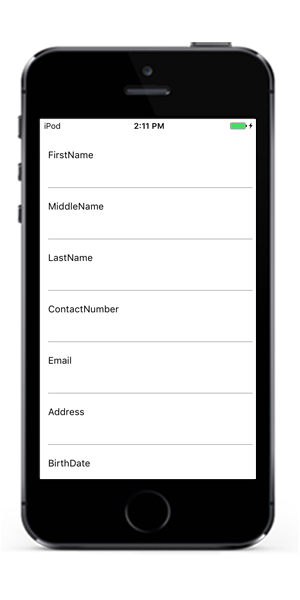

# SfDataForm

SfDataForm control helps to edit data fields of any data object. It can be used to develop various forms such as login, reservation, data entry, and more. Key features include the following,

* Layout and Grouping - Support for linear and grid layout along with grouping support. Support to customize layout with different heights for each item.
* Caption Customization - Support to load images as captions for editor.
* Editors - Built-in support for text, numeric, numeric up-down, picker, date picker and time picker editors. 
* Custom Editor - Support for loading custom editors.
* Validation - Built-in support to validate data based on IDataErrorInfo, INotifyDataErrorInfo, and data annotations. Also, supports to handle validation programmatically.

# Getting Started

The section explains you the quick overview to use `SfDataForm` for Xamarin.iOS in your application.

## Assembly Deployment

After installing Essential Studio for Xamarin, you can find all the required assemblies in the installation folders,
{Syncfusion Essential Studio Installed location} \Essential Studio\15.x.x.x\Xamarin\lib
Eg: C:\Program Files (x86) \Syncfusion\Essential Studio\15.3.0.26\Xamarin\lib

N> Assemblies can be found in unzipped package location in Mac.

The following list of assemblies need to be added as reference from the lib folder to use `SfDataForm` in your application.

<table>
<tr>
<th>Project</th>
<th>Required assemblies</th>
</td>
</tr>
<tr>
<td>
Xamarin.iOS
</td>
<td>
Syncfusion.SfNumericUpDown.iOS.dll Syncfusion.SfNumericTextBox.iOS.dll Syncfusion.SfDataForm.iOS.dll </td>
</tr>
</table>

## Creating SfDataForm

In this section, you will create Xamarin.iOS application with `SfDataForm`. The SfDataForm needs to be configured entirely in C# code. You can also drag the SfDataForm from ToolBox and add it to your application.

* Creating the project.
* Adding SfDataForm in Xamarin.iOS.
* Creating DataObject.
* Setting DataObject.

### Creating the project

Create new iOS application in Xamarin Studio or Visual Studio for Xamarin.iOS.

### Adding SfDataForm in Xamarin.iOS

To add SfDataForm to your application, do the following steps.
1. Add required assemblies as discussed in Assembly Deployment section.
2. Import the `SfDataForm` namespace `Syncfusion.iOS.DataForm`.
3. Create instance of SfDataForm control and add as a SubView to a UIViewController.




using Syncfusion.iOS.DataForm;

public partial class ViewController : UIViewController
{
    public ViewController(IntPtr handle) : base(handle)
    {
    }

    public override void ViewDidLoad()
    {
        base.ViewDidLoad();
        var dataForm = new SfDataForm(new CoreGraphics.CGRect(0,45,this.View.Frame.Width, this.View.Frame.Height));
        View.AddSubview(dataForm);
    }

    public override void DidReceiveMemoryWarning()
    {
        base.DidReceiveMemoryWarning();
    }
}



### Creating DataObject

`SfDataForm` is a data edit control. So, you need to create the data object that you want to get edit.
Here data object named **ContactsInfo** created with properties.



public class ContactsInfo
{
    private string firstName;
    private string middelName;
    private string lastname;
    private string contactNo;
    private string email;
    private string address;
    private DateTime? birthDate;
    private string groupName;

    public ContactsInfo()
    {

    }

    public string FirstName
    {
        get { return this.firstName; }
        set
        {
            this.firstName = value;
        }
    }

    public string MiddleName
    {
        get { return this.middelName; }
        set
        {
            this.middelName = value;
        }
    }
    public string LastName
    {
        get { return this.lastname; }
        set
        {
            this.lastname = value;
        }
    }

    public string ContactNumber
    {
        get { return contactNo; }
        set
        {
            this.contactNo = value;
        }
    }

    public string Email
    {
        get { return email; }
        set
        {
            email = value;
        }
    }

    public string Address
    {
        get { return address; }
        set
        {
            address = value;
        }
    }

    public DateTime? BirthDate
    {
        get { return birthDate; }
        set
        {
            birthDate = value;
        }
    }

    public string GroupName
    {
        get { return groupName; }
        set
        {
            groupName = value;
        }
    }
}



## Setting DataObject

In order, to populate labels and editors in SfDataForm, set `DataObject` property of SfDataForm.



dataForm.DataObject = new ContactsInfo();




Now run the application to render the `SfDataForm` to edit the data object as like in below.

## Defining Editors

By default, SfDataForm control generates DataFormItems (which has UI settings of data field) automatically when data object set to `SfDataForm.DataObject` property. `DataFormItem` encapsulates the layout and editor setting for a data field appearing in `SfDataForm.DataObject`. 
The type of input editor generated depends on the type of property and attribute of the property. The following table lists the `DataFormItem` and its constraints for auto generation.

<table>
<tr>
<th>Generated DataFormItem Type</th>
<th>Data Type / Attribute</th>
</tr>
<tr>
<td>
DataFormTextItem
</td>
<td>
Property of type String and any other type apart from below specified cases.
</td>
</tr>
<tr>
<td>
DataFormNumericItem
</td>
<td>
Property of type Int or Double.
[DataType(DataType.Currency)].
[DataType(DataType.Percent)].
</td>
</tr>
<tr>
<td>
DataFormDateItem
</td>
<td>
Property of type DateTime.
[DataType(DataType.Date)].
</td>
</tr>
<tr>
<td>
DataFormTimeItem
</td>
<td>
Property of type DateTime
[DataType(DataType.Time)].
</td>
</tr>
<tr>
<td>
DataFormPickerItem
</td>
<td>
Property of type enum.
[EnumDataTypeAttribute]
</td>
</tr>
</table>

When the `DataFormItems` are auto-generated, you can handle the SfDataForm.AutoGeneratingDataFormItem event to customize or cancel the DataFormItems before they are added to the `SfDataForm`.
Below is the list of editors supported for type and attribute.

<table>
<tr>
<th>Editor</th>
<th>Data Type/Attribute</th>
<th>Input control loaded</th>
</tr>
<tr>
<td>
Text
</td>
<td>
Property of type String and any other type apart from below specified cases.
</td>
<td>
UITextField
</td>
</tr>
<tr>
<td>
MultilineText
</td>
<td>
Property of string type.
[DataType(DataType.Multiline)] 
</td>
<td>
UITextView
</td>
</tr>
<tr>
<td>
Numeric
</td>
<td>
Property of type Int or Double.
</td>
<td>
SfNumericTextBox
</td>
</tr>
<tr>
<td>
Percent
</td>
<td>
Property of type Int or Double. [DataType(DataType.Percent)].
</td>
<td>
SfNuemricTextBox
</td>
</tr>
<tr>
<td>
Currency
</td>
<td>
Property of type Int or Double.
[DataType(DataType.Currency)].
</td>
<td>
SfNumericTextBox
</td>
</tr>
<tr>
<td>
Date
</td>
<td>
Property of type DateTime.
[DataType(DataType.Date)].
</td>
<td>
SfDatePicker
</td>
</tr>
<tr>
<td>
Time
</td>
<td>
Property of type DateTime.
[DataType(DataType.Time)].
</td>
<td>
SfTimePicker
</td>
</tr>
<tr>
<td>
NumericUpDown
</td>
<td>
Property of type Int or Double.
</td>
<td>
SfNumericUpDown
</td>
</tr>
<tr>
<td>
Segment
</td>
<td>
Property of type enum.
</td>
<td>
UISegmentedControl
</td>
</tr>
<tr>
<td>
Bool
</td>
<td>
Property of type bool
</td>
<td>
UISwitch
</td>
</tr>
<tr>
<td>
Picker
</td>
<td>
Property of type enum, list. 
[EnumDataTypeAttribute]
</td>
<td>
SfPicker
</td>
</tr>
</table>

## Layout options

### Label Position

By default, DataForm arrange the label at left side and input control at the right side. You can change the label position by setting SfDataForm.LabelPosition property. You can position the label from left to top of input control by setting `LabelPosition` as Top.




dataForm.LabelPosition = LabelPosition.Top;




### Grid Layout

By default, DataForm arrange one data field per row. It is possible to have more than one date field per row by setting `ColumnCount` property which provide Grid like layout for DataForm.




dataForm.ColumnCount = 2;




## Editing

By default, SfDataForm allows to edit the editors. You can disable edit by setting `IsReadOnly` property of SfDataForm.
Or, you can change the editing behavior by setting `IsReadOnly` property of `DataFormItem`. DataFormItem.IsReadOnly takes higher priority.
You can also have option to define the editing behavior from `SfDataForm.DataObject` definition using [EditableAttribute](https://msdn.microsoft.com/en-us/library/system.componentmodel.dataannotations.editableattribute.aspx# "")
You can also define the editing behavior by defining `SfDataForm.DataObject` fields definition without `setter` or with `private set`.
