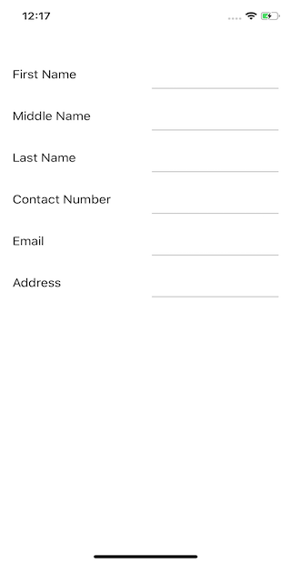
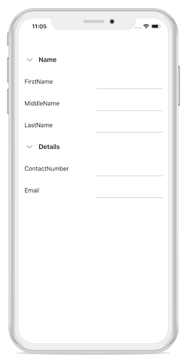

# Layout

## Overview

DataForm provides support for linear and grid layout. [DataFormLayoutManager](https://help.syncfusion.com/cr/cref_files/xamarin-ios/Syncfusion.SfDataForm.iOS~Syncfusion.iOS.DataForm.DataFormLayoutManager.html) creates [DataFormItemView](https://help.syncfusion.com/cr/cref_files/xamarin-ios/Syncfusion.SfDataForm.iOS~Syncfusion.iOS.DataForm.DataFormItemView.html), [DataFormGroupItemView](https://help.syncfusion.com/cr/cref_files/xamarin-ios/Syncfusion.SfDataForm.iOS~Syncfusion.iOS.DataForm.DataFormGroupItemView.html) and manages layout of label, editor and validation label.

## Linear layout support

By default, the data form arranges the fields one-by-one. It is applicable for both label positions: left and top.

When the label position is Left, the linear layout is shown as follows:

When the label position is Top, the linear layout is shown as follows:

## Grid layout support

By default, DataForm arranges one data field per row. It is possible to have more than one date field per row by setting [ColumnCount](https://help.syncfusion.com/cr/cref_files/xamarin-ios/Syncfusion.SfDataForm.iOS~Syncfusion.iOS.DataForm.SfDataForm~ColumnCount.html) property which provide Grid like layout for DataForm.  



dataForm.ColumnCount = 2;



N> Setting the `ColumnCount` property to SfDataForm does not arrange the data field in a group according to the column count. To set the column count for data fields in the data form group, refer to [loading different layout for data form group](https://help.syncfusion.com/xamarin-ios/sfdataform/layout?cs-save-lang=1&cs-lang=csharp#loading-different-layout-for-group)

When Label position is Left, Grid layout is shown like below.

When Label position is `Top`, Grid layout is shown like below.

## Label visibility

You can hide the label by defining [DisplayOptions](https://help.syncfusion.com/cr/cref_files/xamarin-ios/Syncfusion.SfDataForm.iOS~Syncfusion.iOS.DataForm.DisplayOptionsAttribute.html) attribute or by handling `AutoGeneratingDataFormItem` event. In this case, editor only will be loaded.

**Using attributes**



private double? percentage;

[DisplayOptions(ShowLabel = false)]
[Display(Prompt = "Enter percentage")]
public double? Percentage
{
    get
    {
        return percentage;
    }
    set
    {
        percentage = value;
        RaisePropertyChanged("Percentage");
    }
}



**Using event**



private void DataForm_AutoGeneratingDataFormItem(object sender, AutoGeneratingDataFormItemEventArgs e)
{
    if (e.DataFormItem != null && e.DataFormItem.Name == "Percentage")
    {
        e.DataFormItem.PlaceHolderText = "Enter percentage";
        e.DataFormItem.ShowLabel = false;
    }
}



## Label position

Labels can be positioned either at the top or left side of editor. By using the [LabelPosition](https://help.syncfusion.com/cr/cref_files/xamarin-ios/Syncfusion.SfDataForm.iOS~Syncfusion.iOS.DataForm.SfDataForm~LabelPosition.html) property, you can layout the label associated with editor.
By default, label will be positioned at left side of the editor.



dataForm.LabelPosition = LabelPosition.Top;



### Changing label position of the DataFormItem

You can change the label position using the [LabelPosition](https://help.syncfusion.com/cr/cref_files/xamarin-iOs/Syncfusion.SfDataForm.iOS~Syncfusion.iOS.DataForm.DataFormItem~LabelPosition.html) property in `DataFormItem`, and it will be handled in the `AutoGeneratingDataFormItem` event.



<dataForm:SfDataForm x:Name="dataForm" DataObject="{Binding ContactsInfo}"  AutoGeneratingDataFormItem="DataForm_AutoGeneratingDataFormItem">
</dataForm:SfDataForm>


dataForm.RegisterEditor("Gender", "Segment");
dataForm.AutoGeneratingDataFormItem += DataForm_AutoGeneratingDataFormItem;

private void DataForm_AutoGeneratingDataFormItem(object sender, AutoGeneratingDataFormItemEventArgs e)
{
    if (e.DataFormItem != null)
    {
        if (e.DataFormItem.Name.Equals("Gender") || e.DataFormItem.Name.Equals("Address"))
        {
            e.DataFormItem.LabelPosition = LabelPosition.Top;
        }
    }
}




## Loading images for label

You can load image instead of label by defining attribute or by handing `AutoGeneratingDataFormItem` event.

**Using Attributes**

To show the image as label, you need to use [ImageSource](https://help.syncfusion.com/cr/cref_files/xamarin-ios/Syncfusion.SfDataForm.iOS~Syncfusion.iOS.DataForm.DisplayOptionsAttribute~ImageSource.html) property in [DisplayOptions](https://help.syncfusion.com/cr/cref_files/xamarin-ios/Syncfusion.SfDataForm.iOS~Syncfusion.iOS.DataForm.DisplayOptionsAttribute.html) attribute. Images will be taken from …\Resources folder.



private string firstName;
[DisplayOptions(ImageSource = "Name.png")]
public string FirstName
{
    get { return this.firstName; }
    set
    {
        this.firstName = value;
    }
}



**Using event**

By using [ImageSource](https://help.syncfusion.com/cr/cref_files/xamarin-ios/Syncfusion.SfDataForm.iOS~Syncfusion.iOS.DataForm.DataFormItem~ImageSource.html) property in `DataFormItem`, you can load image as label.



dataForm.AutoGeneratingDataFormItem += DataForm_AutoGeneratingDataFormItem;
private void DataForm_AutoGeneratingDataFormItem(object sender, AutoGeneratingDataFormItemEventArgs e)
{
    if (e.DataFormItem != null)
    {        
        if (e.DataFormItem.Name == "FirstName")
           e.DataFormItem.ImageSource = new UIImage("Name.png");    
    }
}



## Changing order of the DataFormItem

You can change the order of `DataFormItem` by using attributes or by handling `AutoGeneratingDataFormItem` event.

**Using attributes**

You can set the order by using `Order` property in Display attribute.



public class ContactsInfo
{
    private string lastName;
    private string contactNo;       
    public ContactsInfo()
    {

    }

    [Display(Order = 2)]
    public string ContactNumber
    {
        get { return contactNo; }
        set
        {
            this.contactNo = value;
        }
    }

    private string firstName;
    [Display(Order = 0)]
    public string FirstName
    {
        get { return this.firstName; }
        set
        {
            this.firstName = value;
        }
    }

    [Display(Order = 1)]
    public string LastName
    {
        get { return this.lastName; }
        set
        {
            this.lastName = value;
        }
    }
}



**Using event**

You can change the fields order by using [Order](https://help.syncfusion.com/cr/cref_files/xamarin-ios/Syncfusion.SfDataForm.iOS~Syncfusion.iOS.DataForm.DataFormItem~Order.html) property in `DataFormItem`.



dataForm.AutoGeneratingDataFormItem += DataForm_AutoGeneratingDataFormItem;

private void DataForm_AutoGeneratingDataFormItem(object sender, AutoGeneratingDataFormItemEventArgs e)
{
    if (e.DataFormItem != null)
    {
        if (e.DataFormItem.Name == "FirstName")
            e.DataFormItem.Order = 0;
    }
}



## Grouping Data fields

It is possible to group some fields and set group name in DataForm. You can expand or collapse the group by tapping on group item.
Grouping can be achieved by defining attributes or by handling `AutoGeneratingDataFormItem` event.

### Using attributes



public class ContactsInfo
{
    private string lastName;
    private string contactNo;
    private string email;   
    private DateTime? birthDate;

    public ContactsInfo()
    {

    }

    private string firstName;
    [Display(GroupName = "Name")]
    public string FirstName
    {
        get { return this.firstName; }
        set
        {
            this.firstName = value;
        }
    }
        
    private string middleName;
    [Display(GroupName = "Name")]
    public string MiddleName
    {
        get { return this.middleName; }
        set
        {
            this.middleName = value;
        }
    }
    [Display(GroupName = "Name")]
    public string LastName
    {
        get { return this.lastName; }
        set
        {
            this.lastName = value;
        }
    }
    [Display(GroupName ="Details", ShortName = "ContactNo.")]
    public string ContactNumber
    {
        get { return contactNo; }
        set
        {
            this.contactNo = value;
        }
    }

    [Display(GroupName = "Details")]
    public string Email
    {
        get { return email; }
        set
        {
            email = value;
        }
    }

    [Display(GroupName = "Details")]
    public DateTime? BirthDate
    {
        get { return birthDate; }
        set
        {
            birthDate = value;
        }
    }
}



### Using event



dataForm.AutoGeneratingDataFormItem += DataForm_AutoGeneratingDataFormItem;
private void DataForm_AutoGeneratingDataFormItem(object sender, AutoGeneratingDataFormItemEventArgs e)
{
    if (e.DataFormItem != null)
    {
        if (e.DataFormItem.Name == "FirstName" || e.DataFormItem.Name == "MiddleName" || e.DataFormItem.Name == "LastName")
            e.DataFormItem.GroupName = "Name";
        else
            e.DataFormItem.GroupName = "Details";
    }
}



### Changing order of the DataFormGroupItem

You can change the order of the `DataFormGroupItem` by using attributes. You can set the order of data form items in group by using the `Order` property along with `GroupName` property in display attribute.



public class ContactInfo
{
    private string lastName;
    private string contactNo;
    public ContactInfo()
    {

    }

    private string firstName;
    [Display(Order = 0, GroupName = "Name")]
    public string FirstName
    {
        get { return this.firstName; }
        set
        {
            this.firstName = value;
        }
    }

    [Display(Order = 2, GroupName = "Name")]
    public string LastName
    {
        get { return this.lastName; }
        set
        {
            this.lastName = value;
        }
    }

    private string middleName;
    [Display(Order =1, GroupName = "Name")]
    public string MiddleName
    {
        get { return this.middleName; }
        set
        {
            this.middleName = value;
        }
    }

    private string email;
    [Display(Order = 1, GroupName = "Details")]
    public string Email
    {
        get { return email; }
        set
        {
            this.email = value;
        }
    }

    [Display(Order = 0, GroupName = "Details")]
    public string ContactNumber
    {
        get { return contactNo; }
        set
        {
            this.contactNo = value;
        }
    }
}



### Change GroupName for group

You can change `GroupName` for group in `AutoGeneratingDataFormItem` event.



dataForm.AutoGeneratingDataFormItem += DataForm_AutoGeneratingDataFormItem;
private void DataForm_AutoGeneratingDataFormItem(object sender, AutoGeneratingDataFormItemEventArgs e)
{
    if (e.DataFormGroupItem != null && e.DataFormGroupItem.GroupName == "Name")
        e.DataFormGroupItem.GroupName = "Name Group";
}



### Loading different layout for group

You can load linear or grid layout for particular group by handling `AutoGeneratingDataFormItem` event.
By setting `ColumnCount` property in DataForm, not grouped items only will be arranged in grid layout. If you want to load grid layout, you need to set [ColumnCount](https://help.syncfusion.com/cr/cref_files/xamarin-ios/Syncfusion.SfDataForm.iOS~Syncfusion.iOS.DataForm.DataFormGroupItem~ColumnCount.html) for [DataFormGroupItem](https://help.syncfusion.com/cr/cref_files/xamarin-ios/Syncfusion.SfDataForm.iOS~Syncfusion.iOS.DataForm.DataFormGroupItem.html).



dataForm.AutoGeneratingDataFormItem += DataForm_AutoGeneratingDataFormItem;

private void DataForm_AutoGeneratingDataFormItem(object sender, AutoGeneratingDataFormItemEventArgs e)
{
    if (e.DataFormGroupItem != null && e.DataFormGroupItem.GroupName == "Name")
        e.DataFormGroupItem.ColumnCount = 2;
}



**Loading linear and grid layout for Group**



public class ContactsInfo
{
    private string lastName;
    private string contactNo;
    private string email;   
    private DateTime? birthDate;

    public ContactsInfo()
    {

    }

    private string firstName;
    [Display(GroupName = "Name")]
    public string FirstName
    {
        get { return this.firstName; }
        set
        {
            this.firstName = value;
        }
    }
        
    [Display(GroupName = "Name")]
    public string LastName
    {
        get { return this.lastName; }
        set
        {
            this.lastName = value;
        }
    }
    [Display(GroupName ="Details", ShortName = "ContactNo.")]
    public string ContactNumber
    {
        get { return contactNo; }
        set
        {
            this.contactNo = value;
        }
    }

    [Display(GroupName = "Details")]
    public string Email
    {
        get { return email; }
        set
        {
            email = value;
        }
    }

    [Display(GroupName = "Details")]
    public DateTime? BirthDate
    {
        get { return birthDate; }
        set
        {
            birthDate = value;
        }
    }
}


dataForm.AutoGeneratingDataFormItem += DataForm_AutoGeneratingDataFormItem;

private void DataForm_AutoGeneratingDataFormItem(object sender, AutoGeneratingDataFormItemEventArgs e)
{
    if (e.DataFormGroupItem != null && e.DataFormGroupItem.GroupName == "Name")
        e.DataFormGroupItem.ColumnCount = 2;
}



In the below image, for `Name` group, Grid layout is loaded and for `Details` group, linear layout is loaded.

**Setting different column count**

You can also set different `ColumnCount` for each group.



dataForm.AutoGeneratingDataFormItem += DataForm_AutoGeneratingDataFormItem;

private void DataForm_AutoGeneratingDataFormItem(object sender, AutoGeneratingDataFormItemEventArgs e)
{
    if (e.DataFormGroupItem != null)
    {
        if (e.DataFormGroupItem.GroupName == "Name")
            e.DataFormGroupItem.ColumnCount = 2;
        else if (e.DataFormGroupItem.GroupName == "Details")
            e.DataFormGroupItem.ColumnCount = 3;
    }
}




### Loading group in collapsed state

By default, group will be loaded in expanded state. You can collapse the group by setting [IsExpanded](https://help.syncfusion.com/cr/cref_files/xamarin-ios/Syncfusion.SfDataForm.iOS~Syncfusion.iOS.DataForm.DataFormGroupItem~IsExpanded.html) property as false in [DataFormGroupItem](https://help.syncfusion.com/cr/cref_files/xamarin-ios/Syncfusion.SfDataForm.iOS~Syncfusion.iOS.DataForm.DataFormGroupItem.html).



dataForm.AutoGeneratingDataFormItem += DataForm_AutoGeneratingDataFormItem;

private void DataForm_AutoGeneratingDataFormItem(object sender, AutoGeneratingDataFormItemEventArgs e)
{
    if (e.DataFormGroupItem != null && e.DataFormGroupItem.GroupName == "Name")
        e.DataFormGroupItem.IsExpanded = false;
}



### Restrict the group expand and collapse

You can set restrict the group being expanded or collapsed by setting [AllowExpandCollapse](https://help.syncfusion.com/cr/cref_files/xamarin-ios/Syncfusion.SfDataForm.iOS~Syncfusion.iOS.DataForm.DataFormGroupItem~AllowExpandCollapse.html) as `false` in [DataFormGroupItem](https://help.syncfusion.com/cr/cref_files/xamarin-ios/Syncfusion.SfDataForm.iOS~Syncfusion.iOS.DataForm.DataFormGroupItem.html).

In this case, group will be shown without expander.

### Programmatically expand or collapse group

You can expand or collapse the group programmatically by using [ExpandGroup](https://help.syncfusion.com/cr/cref_files/xamarin-ios/Syncfusion.SfDataForm.iOS~Syncfusion.iOS.DataForm.SfDataForm~ExpandGroup.html) and [CollapseGroup](https://help.syncfusion.com/cr/cref_files/xamarin-ios/Syncfusion.SfDataForm.iOS~Syncfusion.iOS.DataForm.SfDataForm~CollapseGroup.html) method respectively.



dataForm.ExpandGroup("Group1");

dataForm.CollapseGroup("Group1");



## Customizing DataFormLayoutManager

If you want to customize the layout, you need to override [DataFormLayoutManager](https://help.syncfusion.com/cr/cref_files/xamarin-ios/Syncfusion.SfDataForm.iOS~Syncfusion.iOS.DataForm.DataFormLayoutManager.html) and assign to [SfDataForm.LayoutManager](https://help.syncfusion.com/cr/cref_files/xamarin-ios/Syncfusion.SfDataForm.iOS~Syncfusion.iOS.DataForm.SfDataForm~LayoutManager.html) property.



public class DataFormLayoutManagerExt : DataFormLayoutManager
{
    public DataFormLayoutManagerExt(SfDataForm dataForm) : base(dataForm)
    {

    }
}
dataForm.LayoutManager = new DataFormLayoutManagerExt(dataForm);



### Customizing label and editor

By using DataFormLayoutManager class , you can customize the generated label by overriding the [GenerateViewForLabel](https://help.syncfusion.com/cr/cref_files/xamarin-ios/Syncfusion.SfDataForm.iOS~Syncfusion.iOS.DataForm.DataFormLayoutManager~GenerateViewForLabel.html) method and also you can customize the editor by overriding the `OnEditorCreated` method.Here, BackgroundColor and TextColor of label and editor is customized.



public class DataFormLayoutManagerExt : DataFormLayoutManager
{
    public DataFormLayoutManagerExt(SfDataForm dataForm) : base(dataForm)
    {

    }
    protected override UIView GenerateViewForLabel(DataFormItem dataFormItem)
    {
        var label = base.GenerateViewForLabel(dataFormItem);
        if (label is UILabel)
        {
            (label as UILabel).BackgroundColor = UIColor.FromRGB(255, 149, 34);
            (label as UILabel).TextColor = UIColor.White;
        }
        return label;
    }
    protected override void OnEditorCreated(DataFormItem dataFormItem, UIView editor)
    {
        if (editor is UITextField)
            (editor as UITextField).TextColor = UIColor.White;
        editor.BackgroundColor = UIColor.FromRGB(0, 115, 220);
    }
}
dataForm.LayoutManager = new DataFormLayoutManagerExt(dataForm);



### Changing Editor padding

You can change the editor padding by overriding `GetLeftPaddingForEditor` method.



public class ContactsInfo
{
    private string lastName;
    public ContactsInfo()
    {

    }

    private string firstName;
    [DisplayOptions(ImageSource = Resource.Drawable.Name)]
    public string FirstName
    {
        get { return this.firstName; }
        set
        {
            this.firstName = value;
        }
    }

    [Display(Prompt = "Enter last name")]
    [DisplayOptions(ShowLabel = false)]
    public string LastName
    {
        get { return this.lastName; }
        set
        {
            this.lastName = value;
        }
    }
}


dataForm.LayoutManager = new DataFormLayoutManagerExt(dataForm);

public class DataFormLayoutManagerExt : DataFormLayoutManager
{
    public DataFormLayoutManagerExt(SfDataForm dataForm) : base(dataForm)
    {

    }

    protected override int GetLeftPaddingForEditor(DataFormItem dataFormItem)
    {
        if (dataFormItem.Name == "LastName")
            return 50;
        return base.GetLeftPaddingForEditor(dataFormItem);
    }
}



Here, LastName padding is customized.

## Label width customization

You can set label and editor width proportionally by using [LabelWidth](https://help.syncfusion.com/cr/cref_files/xamarin-ios/Syncfusion.SfDataForm.iOS~Syncfusion.iOS.DataForm.SfDataForm~LabelWidth.html) and [EditorWidth](https://help.syncfusion.com/cr/cref_files/xamarin-ios/Syncfusion.SfDataForm.iOS~Syncfusion.iOS.DataForm.SfDataForm~EditorWidth.html) properties.



dataForm.LabelWidth = 1;
dataForm.EditorWidth = 2;



Here available width is divided into proportionally for editor (2) and label (1).

N> It is applicable only when `LabelPosition` is Left.

By default, available width is divided equally for editor and label.

## Spanning rows and columns

You can increase row height and column width by defining `DisplayOptions` attribute.

### RowSpan

You can set increase the row height by using [RowSpan](https://help.syncfusion.com/cr/cref_files/xamarin-ios/Syncfusion.SfDataForm.iOS~Syncfusion.iOS.DataForm.DisplayOptionsAttribute~RowSpan.html) property in `DisplayOptions` attribute.



private string firstName;
[DisplayOptions(RowSpan = 2)]
public string FirstName
{
    get { return this.firstName; }
    set
    {
        this.firstName = value;
    }
}



Here, `FirstName` field’s row height is increased.

### ColumnSpan

When grid layout is used, you can increase the column width by using [ColumnSpan](https://help.syncfusion.com/cr/cref_files/xamarin-ios/Syncfusion.SfDataForm.iOS~Syncfusion.iOS.DataForm.DisplayOptionsAttribute~ColumnSpan.html) property in `DisplayOptions `attribute.



dataForm.ColumnCount = 2;


private string firstName;
[DisplayOptions(ColumnSpan = 2)]
public string FirstName
{
    get { return this.firstName; }
    set
    {
        this.firstName = value;
    }
}



## Change DataFormItem visibility at runtime

You can change the field visibility by using [IsVisible](https://help.syncfusion.com/cr/cref_files/xamarin-ios/Syncfusion.SfDataForm.iOS~Syncfusion.iOS.DataForm.DataFormItemBase~IsVisible.html) property in `DataFormItem`.



var dataFormItem = dataForm.ItemManager.DataFormItems["Name"];
if (dataFormItem.Name == "Name")
{
    dataFormItem.IsVisible = false;
}


Here, `Name` field will be hidden.

## Programmatically scroll to specific editor

You can programmatically scroll to specific editor using the `ScrollTo` method by passing the `property name`. 



dataForm.ScrollTo("BirthDate")



## Changing the height of DataFormItem

You can define the height of each `DataFormItem` using the [Height](https://help.syncfusion.com/cr/cref_files/xamarin-ios/Syncfusion.SfDataForm.iOS~Syncfusion.iOS.DataForm.DataFormItemBase~Height.html) property, and it will be handled in the `AutoGeneratingDataFormItem` event.

You can define the `Height` as described as follows.

* You can directly set the exact `Height` value.
* You can use the `AutoFitLabel` to size the height of `DataFormItem`, so that it fits to the label text that it contains.





dataForm.AutoGeneratingDataFormItem += DataForm_AutoGeneratingDataFormItem;
private void DataForm_AutoGeneratingDataFormItem(object sender,AutoGeneratingDataFormItemEventArgs e)
{
   if (e.DataFormItem != null)
     {
       if (e.DataFormItem.Name == "Experience" || e.DataFormItem.Name == "Comments" || e.DataFormItem.Name == "Improvement")
       {
           e.DataFormItem.AutoFitLabel = true;
       }
       if (e.DataFormItem.Name == "Recommend")
       {
           e.DataFormItem.Height = 400;
       }
     }
}




