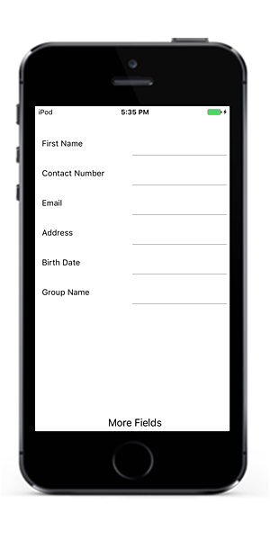
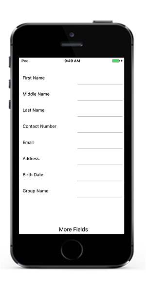
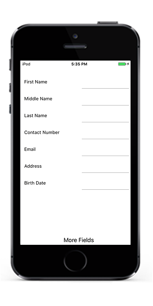

# Working with DataForm

## Auto-generating DataFormItems for Data field

By default, [DataFormItems](https://help.syncfusion.com/cr/cref_files/xamarin-ios/Syncfusion.SfDataForm.iOS~Syncfusion.iOS.DataForm.DataFormItemManager~DataFormItems.html) will be generated based on type of property. For example, [DataFormNumericItem](https://help.syncfusion.com/cr/cref_files/xamarin-ios/Syncfusion.SfDataForm.iOS~Syncfusion.iOS.DataForm.DataFormNumericItem.html) will be created for `int` type property. 
[DataFormItem](https://help.syncfusion.com/cr/cref_files/xamarin-ios/Syncfusion.SfDataForm.iOS~Syncfusion.iOS.DataForm.DataFormItem.html) generation depends on the type and attribute defined for the property. The following table lists the several types of `DataFormItem` and its constraints for auto generation.

<table>
<tr>
<th>Generated DataFormItem Type</th>
<th>Editor</th>
<th>Data Type / Attribute</th>
</tr>
<tr>
<td>
{{'[DataFormTextItem](https://help.syncfusion.com/cr/cref_files/xamarin-ios/Syncfusion.SfDataForm.iOS~Syncfusion.iOS.DataForm.DataFormTextItem.html)'| markdownify }}
</td>
<td>
Text
</td>
<td>
Default DataFormItem generated for string type and the properties with below attributes. 
[DataType(DataType.Text)]
[DataType(DataType.MultilineText)]
[DataType(DataType.Password)]
</td>
</tr>
<tr>
<td>
{{'[DataFormNumericItem](https://help.syncfusion.com/cr/cref_files/xamarin-ios/Syncfusion.SfDataForm.iOS~Syncfusion.iOS.DataForm.DataFormNumericItem.html)'| markdownify }}
</td>
<td>
Numeric
</td>
<td>
Generated for int, double, float, decimal, long types and its nullable also properties with below attributes. 
[DataType(DataType.Currency)]
[DataType(Percent)]
</td>
</tr>
<tr>
<td>
{{'[DataFormDateItem](https://help.syncfusion.com/cr/cref_files/xamarin-ios/Syncfusion.SfDataForm.iOS~Syncfusion.iOS.DataForm.DataFormDateItem.html)'| markdownify }}
</td>
<td>
Date
</td>
<td>
Generated for DateTime type and properties with below attributes. 
[DataType(DataType.Date)]
[DataType(DataType.DateTime)]
</td>
</tr>
<tr>
<td>
{{'[DataFormTimeItem](https://help.syncfusion.com/cr/cref_files/xamarin-ios/Syncfusion.SfDataForm.iOS~Syncfusion.iOS.DataForm.DataFormTimeItem.html)'| markdownify }}
</td>
<td>
Time
</td>
<td>
Generated for the property with below attribute. 
[DataType(DataType.Time)]
</td>
</tr>
<tr>
<td>
{{'[DataFormPickerItem](https://help.syncfusion.com/cr/cref_files/xamarin-ios/Syncfusion.SfDataForm.iOS~Syncfusion.iOS.DataForm.DataFormPickerItem.html)'| markdownify }}
</td>
<td>
Picker
</td>
<td>
Generated for Enum type property and the property with below attribute. 
[EnumDataTypeAttribute]
</td>
</tr>
<tr>
<td>
{{'[DataFormItem](https://help.syncfusion.com/cr/cref_files/xamarin-ios/Syncfusion.SfDataForm.iOS~Syncfusion.iOS.DataForm.DataFormItem.html)'| markdownify }}
</td>
<td>
Bool
</td>
<td>
Bool type
</td>
</tr>
</table>

You can customize the property settings or cancel the generation of `DataFormItem` by handling [AutoGeneratingDataFormItem](https://help.syncfusion.com/cr/cref_files/xamarin-ios/Syncfusion.SfDataForm.iOS~Syncfusion.iOS.DataForm.SfDataForm~AutoGeneratingDataFormItem_EV.html) event.

## Customize auto generated fields

You can customize or cancel the generated `DataFormItem` by handling [AutoGeneratingDataFormItem](https://help.syncfusion.com/cr/cref_files/xamarin-ios/Syncfusion.SfDataForm.iOS~Syncfusion.iOS.DataForm.SfDataForm~AutoGeneratingDataFormItem_EV.html) event. `AutoGeneratingDataFormItem` event occurs when the field is auto-generated for public and non-static property of the data object.



dataForm.AutoGeneratingDataFormItem += DataForm_AutoGeneratingDataFormItem;

private void DataForm_AutoGeneratingDataFormItem(object sender, AutoGeneratingDataFormItemEventArgs e)
{

}



[AutoGeneratingDataFormItemEventArgs](https://help.syncfusion.com/cr/cref_files/xamarin-ios/Syncfusion.SfDataForm.iOS~Syncfusion.iOS.DataForm.AutoGeneratingDataFormItemEventArgs.html) provides the information about the auto-generated.  [AutoGeneratingDataFormItemEventArgs.DataFormItem](https://help.syncfusion.com/cr/cref_files/xamarin-ios/Syncfusion.SfDataForm.iOS~Syncfusion.iOS.DataForm.AutoGeneratingDataFormItemEventArgs~DataFormItem.html)  property returns the newly created `DataFormItem`.

## Cancel DataFormItem generation of data field

You can cancel the specific [DataFormItem](https://help.syncfusion.com/cr/cref_files/xamarin-ios/Syncfusion.SfDataForm.iOS~Syncfusion.iOS.DataForm.DataFormItem.html) adding to the DataForm by handling `AutoGeneratingDataFormItem` event or by defining display attribute to avoid the particular data field being displayed in DataForm.

### Using attributes

You can use [Bindable](https://msdn.microsoft.com/en-us/library/system.componentmodel.bindableattribute.aspx) attribute or set [AutoGenerateField](https://msdn.microsoft.com/en-us/library/system.componentmodel.dataannotations.displayattribute.autogeneratefield.aspx) as `false` for canceling `DataFormItem` generation.



private int id;
[Display(AutoGenerateField = false)]
public int ID
{
    get
    {
        return id;
    }
    set
    {
        id = value;
        RaisePropertyChanged("ID");
    }
}
private string middleName;
[Bindable(false)]
public string MiddleName
{
    get { return this.middleName; }
    set
    {
        this.middleName = value;
    }
}



### Using event

In the below code, `DataFormItem` generation for `MiddleName` property is canceled by setting `Cancel` property to true.



dataForm.AutoGeneratingDataFormItem += DataForm_AutoGeneratingDataFormItem;

private void DataForm_AutoGeneratingDataFormItem(object sender, AutoGeneratingDataFormItemEventArgs e)
{
    if (e.DataFormItem.Name == "MiddleName")
        e.Cancel = true;
}



## Changing Editor type

You can change the editor of [DataFormItem](https://help.syncfusion.com/cr/cref_files/xamarin-ios/Syncfusion.SfDataForm.iOS~Syncfusion.iOS.DataForm.DataFormItem.html) in `AutoGeneratingDataFormItem` event.
In the below code, editor is changed for `Name` field from `Picker` to `DropDown`.



dataForm.AutoGeneratingDataFormItem += DataForm_AutoGeneratingDataFormItem;

private void DataForm_AutoGeneratingDataFormItem(object sender, AutoGeneratingDataFormItemEventArgs e)
{
    if (e.DataFormItem.Name == "Name")
        e.DataFormItem.Editor = "DropDown";
}



## Changing property settings

You can change the property of [DataFormItem](https://help.syncfusion.com/cr/cref_files/xamarin-ios/Syncfusion.SfDataForm.iOS~Syncfusion.iOS.DataForm.DataFormItem.html) in `AutoGeneratingDataFormItem` event.
Here, `Salary` data field is restricted from being edited in DataForm.



dataForm.AutoGeneratingDataFormItem += DataForm_AutoGeneratingDataFormItem;

private void DataForm_AutoGeneratingDataFormItem(object sender, AutoGeneratingDataFormItemEventArgs e)
{
    if (e.DataFormItem != null)
    {
        if (e.DataFormItem.Name == "Salary")
            e.DataFormItem.IsReadOnly = true;
    }
}



## Setting Watermark

You can display watermark in editor by defining display attribute or using `AutoGeneratingDataFormItem` event.

### Using attribute

You can show watermark in editor by setting [Prompt](https://msdn.microsoft.com/en-us/library/system.componentmodel.dataannotations.displayattribute.prompt.aspx) in display attribute.




private string middleName;
[Display(Prompt = "Enter middle name")]
public string MiddleName
{
    get { return this.middleName; }
    set
    {
        this.middleName = value;
    }
}




### Using event

You can show watermark in editor by using [PlaceHolderText](https://help.syncfusion.com/cr/cref_files/xamarin-ios/Syncfusion.SfDataForm.iOS~Syncfusion.iOS.DataForm.DataFormItem~PlaceHolderText.html) property in [DataFormItem](https://help.syncfusion.com/cr/cref_files/xamarin-ios/Syncfusion.SfDataForm.iOS~Syncfusion.iOS.DataForm.DataFormItem.html).



dataForm.AutoGeneratingDataFormItem += DataForm_AutoGeneratingDataFormItem;

private void DataForm_AutoGeneratingDataFormItem(object sender, AutoGeneratingDataFormItemEventArgs e)
{
    if (e.DataFormItem != null)
    {
        if (e.DataFormItem.Name == "Description")
            e.DataFormItem.PlaceHolderText = "Enter description";
    }
}



## Changing DataFormItem

You can change created [DataFormItem](https://help.syncfusion.com/cr/cref_files/xamarin-ios/Syncfusion.SfDataForm.iOS~Syncfusion.iOS.DataForm.DataFormItem.html) and assign new `DataFormItem` based on your requirement. 
Here,[DataFormTextItem](https://help.syncfusion.com/cr/cref_files/xamarin-ios/Syncfusion.SfDataForm.iOS~Syncfusion.iOS.DataForm.DataFormTextItem.html) with number keyboard loaded for numeric value instead of [DataFormNumericItem](https://help.syncfusion.com/cr/cref_files/xamarin-ios/Syncfusion.SfDataForm.iOS~Syncfusion.iOS.DataForm.DataFormNumericItem.html).



dataForm.AutoGeneratingDataFormItem += DataForm_AutoGeneratingDataFormItem;

private void DataForm_AutoGeneratingDataFormItem(object sender, AutoGeneratingDataFormItemEventArgs e)
{
    if (e.DataFormItem != null)
    {
        if (e.DataFormItem.Name == "ID")
            e.DataFormItem = new DataFormTextItem() { Name = "ID", Editor = "Text", KeyBoardType = UIKeyboardType.NumberPad };
    }
}



## Adding or removing Data field displayed in DataForm at runtime

If you want to remove or add data fields item at runtime, you can use [RefreshLayout](https://help.syncfusion.com/cr/cref_files/xamarin-ios/Syncfusion.SfDataForm.iOS~Syncfusion.iOS.DataForm.SfDataForm~RefreshLayout.html) method which auto-generates the DataFormItem’s where you can skip certain item from display. By default, it will generate the items that was canceled initially. If you want to regenerate all the items, you need to pass argument as `true`.
In the below code snippet, items are auto generated based on ` refreshLayout` flag where you can change flag at runtime and call `RefreshLayout` method to add or remove items being displayed in DataForm at runtime.



dataForm = new SfDataForm(new CoreGraphics.CGRect(0, 45, this.View.Frame.Width, this.View.Frame.Height - 30));
dataForm.DataObject = new ContactsInfo();
dataForm.AutoGeneratingDataFormItem += DataForm_AutoGeneratingDataFormItem;
var button = new UIButton(new CoreGraphics.CGRect(0, this.View.Frame.Height - 30, this.View.Frame.Width, 30));
button.SetTitle("More Fields", UIControlState.Normal);
button.SetTitleColor(UIColor.Black, UIControlState.Normal);
button.TouchDown += Button_TouchDown;
View.AddSubview(dataForm);
View.AddSubview(button);

private void DataForm_AutoGeneratingDataFormItem(object sender, AutoGeneratingDataFormItemEventArgs e)
{
    if (e.DataFormItem != null)
    {
        if (!refreshLayout)
        {
            if (e.DataFormItem.Name.Equals("MiddleName") || e.DataFormItem.Name.Equals("LastName"))
                e.Cancel = true;
        }
        else
        {
            if (e.DataFormItem.Name == "GroupName")
                e.Cancel = true;
        }
    }
}



If you want to generate MiddleName and LastName fields at runtime, you need to set `refreshLayout` flag as `true` and call [RefreshLayout](https://help.syncfusion.com/cr/cref_files/xamarin-ios/Syncfusion.SfDataForm.iOS~Syncfusion.iOS.DataForm.SfDataForm~RefreshLayout.html) method which triggers `AutoGeneratingDataFormItem` event again and generates the items based on `refreshLayout` flag.



private void Button_TouchDown(object sender, EventArgs e)
{
    refreshLayout = true;
    dataForm.RefreshLayout();
}



Here, `MiddleName` and `LastName` fields are generated at runtime after clicking more field button.

`GroupName` field is displayed initially in DataForm. If you want to remove it at runtime, you need to set refreshLayout flag as true and pass argument as true in[RefreshLayout](https://help.syncfusion.com/cr/cref_files/xamarin-ios/Syncfusion.SfDataForm.iOS~Syncfusion.iOS.DataForm.SfDataForm~RefreshLayout.html) method. It triggers `AutoGeneratingDataFormItem` event for all the fields where you can cancel `GroupName’ field item generation.



private void Button_TouchDown(object sender, EventArgs e)
{
    refreshLayout = true;
    dataForm.RefreshLayout(true);
}



Here, GroupName field is removed at runtime.

You can download the sample from [here](http://www.syncfusion.com/downloads/support/directtrac/general/ze/MoreFields303076378).

## DataFormItemManager

[DataFormItemManager](https://help.syncfusion.com/cr/cref_files/xamarin-ios/Syncfusion.SfDataForm.iOS~Syncfusion.iOS.DataForm.DataFormItemManager.html) creates [DataFormItems](https://help.syncfusion.com/cr/cref_files/xamarin-ios/Syncfusion.SfDataForm.iOS~Syncfusion.iOS.DataForm.DataFormItemManager~DataFormItems.html) collection and handles value reflection and validation. It also provides overrides to handle get and set property values from and to data object.

### Generate DataFormItems for data object

You can load the data form with `DataObject` by manually generating items and handling read and write values.

#### Manually defining DataFormItem

By default, [DataFormItems](https://help.syncfusion.com/cr/cref_files/xamarin-ios/Syncfusion.SfDataForm.iOS~Syncfusion.iOS.DataForm.DataFormItemManager~DataFormItems.html) will be generated based on data object. If you want to generate `DataFormItems` manually for data object, you need to override [DataFormItemManager](https://help.syncfusion.com/cr/cref_files/xamarin-ios/Syncfusion.SfDataForm.iOS~Syncfusion.iOS.DataForm.DataFormItemManager.html) class and set it to [SfDataForm.ItemManager](https://help.syncfusion.com/cr/cref_files/xamarin-ios/Syncfusion.SfDataForm.iOS~Syncfusion.iOS.DataForm.SfDataForm~ItemManager.html).
To create `DataFormItems`, you need to override [GenerateDataFormItems](https://help.syncfusion.com/cr/cref_files/xamarin-ios/Syncfusion.SfDataForm.iOS~Syncfusion.iOS.DataForm.DataFormItemManager~GenerateDataFormItems(PropertyDescriptorCollection,List%7BDataFormItemBase%7D).html) method.



public class DataFormItemManagerExt : DataFormItemManager
{       
    public SfDataForm sfDataForm;
    public DataFormItemManagerExt(SfDataForm dataForm) : base(dataForm)
    {
        sfDataForm = dataForm;       
    }
    protected override List<DataFormItemBase> GenerateDataFormItems(PropertyDescriptorCollection itemProperties, List<DataFormItemBase> dataFormItems)
    {
        var items = new List<DataFormItemBase>();
        foreach (PropertyDescriptor propertyInfo in itemProperties)
        {
            DataFormItem dataFormItem;
            if (propertyInfo.Name == "ContactNumber")
                dataFormItem = new DataFormTextItem() { Name = propertyInfo.Name, Editor = "Text", InputType = Android.Text.InputTypes.ClassNumber };
            else if (propertyInfo.Name == "FirstName")
                dataFormItem = new DataFormTextItem() { Name = propertyInfo.Name, Editor = "Text" };
            else
                dataFormItem = new DataFormTextItem() { Name = propertyInfo.Name, Editor = "Text" };
            items.Add(dataFormItem);
        }

        return items;
    }
}

dataForm.DataObject = new ContactsInfo();
dataForm.ItemManager = new DataFormItemManagerExt(dataForm);



#### Handling reading and writing values to and from the data object

By default, value will be shown in editor by getting it from data object and after editing data object will be committed with new value. If you want to customize the value, you need to override [GetValue](https://help.syncfusion.com/cr/cref_files/xamarin-ios/Syncfusion.SfDataForm.iOS~Syncfusion.iOS.DataForm.DataFormItemManager~GetValue.html) and [SetValue](https://help.syncfusion.com/cr/cref_files/xamarin-ios/Syncfusion.SfDataForm.iOS~Syncfusion.iOS.DataForm.DataFormItemManager~SetValue.html) methods in [DataFormItemManager](https://help.syncfusion.com/cr/cref_files/xamarin-ios/Syncfusion.SfDataForm.iOS~Syncfusion.iOS.DataForm.DataFormItemManager.html).

Here, the value is reading and writing from/to the data object.


public class DataFormItemManagerExt : DataFormItemManager
{
    public SfDataForm sfDataForm;
    public DataFormItemManagerExt(SfDataForm dataForm) : base(dataForm)
    {
        sfDataForm = dataForm;
    }

    public override object GetValue(DataFormItem dataFormItem)
    {
        var value = sfDataForm.DataObject.GetType().GetRuntimeProperty(dataFormItem.Name).GetValue(sfDataForm.DataObject);
        return value;
    }

    public override void SetValue(DataFormItem dataFormItem, object value)
    {
        sfDataForm.DataObject.GetType().GetRuntimeProperty(dataFormItem.Name).SetValue(sfDataForm.DataObject, value);
    }
}


You can download the source code of this demo from here [GenerateDataFormItemsForDataObject](https://github.com/SyncfusionExamples/Generate-DataFormItems-for-DataObject-in-Xamarin-DataForm)

### Generate DataFormItems for dictionary

You can load data form with custom dictionary by manually generating items and handling read and write values.

#### Manually defining DataFormItem

To create `DataFormItems` from dictionary , you need to override [GenerateDataFormItems](https://help.syncfusion.com/cr/cref_files/xamarin-ios/Syncfusion.SfDataForm.iOS~Syncfusion.iOS.DataForm.DataFormItemManager~GenerateDataFormItems(PropertyDescriptorCollection,List%7BDataFormItemBase%7D).html) method.



public class DataFormItemManagerExt : DataFormItemManager
{
    Dictionary<string, object> dataFormDictionary;
    public DataFormItemManagerExt(SfDataForm dataForm, Dictionary<string, object> dictionary) : base(dataForm)
    {
        dataFormDictionary = dictionary;
    }

    protected override List<DataFormItemBase> GenerateDataFormItems(PropertyDescriptorCollection itemProperties, List<DataFormItemBase> dataFormItems)
    {
        var items = new List<DataFormItemBase>();
        foreach (var key in dataFormDictionary.Keys)
        {
            DataFormItem dataFormItem;
            if (key == "ID")
                dataFormItem = new DataFormNumericItem() { Name = key, Editor = "Numeric", MaximumNumberDecimalDigits = 0 };
            else if (key == "Name")
                dataFormItem = new DataFormTextItem() { Name = key, Editor = "Text" };
            else
                dataFormItem = new DataFormTextItem() { Name = key, Editor = "Text" };

            items.Add(dataFormItem);
        }
         
        return items;
    }
}

var dictionary = new Dictionary<string, object>();
dictionary.Add("ID", 1);
dictionary.Add("Name", "John");
dataForm.ItemManager = new DataFormItemManagerExt(dataForm, dictionary);




By default, the value will be shown in editor by getting it from the dictionary.

#### Handling reading and writing value to and from data object

By default, value will be shown in editor by getting it from data object and after editing data object will be committed with new value. If you want to customize the value, you need to override [GetValue](https://help.syncfusion.com/cr/cref_files/xamarin-ios/Syncfusion.SfDataForm.iOS~Syncfusion.iOS.DataForm.DataFormItemManager~GetValue.html) and [SetValue](https://help.syncfusion.com/cr/cref_files/xamarin-ios/Syncfusion.SfDataForm.iOS~Syncfusion.iOS.DataForm.DataFormItemManager~SetValue.html) methods in [DataFormItemManager](https://help.syncfusion.com/cr/cref_files/xamarin-ios/Syncfusion.SfDataForm.iOS~Syncfusion.iOS.DataForm.DataFormItemManager.html).
Here, value is reading and writing from/to dictionary instead of data object.



public class DataFormItemManagerExt : DataFormItemManager
{
    Dictionary<string, object> dataFormDictionary;
    public DataFormItemManagerExt(SfDataForm dataForm, Dictionary<string, object> dictionary) : base(dataForm)
    {
        dataFormDictionary = dictionary;
    }

    public override object GetValue(DataFormItem dataFormItem)
    {
        var value = dataFormDictionary[dataFormItem.Name];
        return value;
    }

    public override void SetValue(DataFormItem dataFormItem, object value)
    {
        dataFormDictionary[dataFormItem.Name] = value;
    }

}



You can download the source code of this demo from here [GenerateDataFormItemsForDictionary](https://github.com/SyncfusionExamples/Generate-DataFormItems-for-Dictionary-loaded-in-Xamarin-DataForm)
