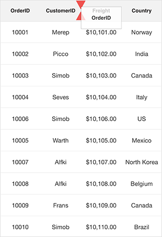

# Column Drag and Drop

The data grid allows dragging and dropping a column header by setting the [SfDataGrid.AllowDraggingColumn](http://help.syncfusion.com/cr/cref_files/xamarin-ios/Syncfusion.SfDataGrid.iOS~Syncfusion.SfDataGrid.SfDataGrid~AllowDraggingColumn.html) property to `true`. The drag view is displayed when dragging the column header. Drag and drop operations can be handled using the [SfDataGrid QueryColumnDragging](http://help.syncfusion.com/cr/cref_files/xamarin-ios/Syncfusion.SfDataGrid.iOS~Syncfusion.SfDataGrid.SfDataGrid~QueryColumnDragging_EV.html) event. 

The following code example illustrates how to enable column drag and drop in SfDataGrid.



sfGrid.AllowDraggingColumn = true;



## Column drag and drop event

The `QueryColumnDragging` event is fired when dragging a column, and will be continuously fired until the dragging ends. By handing the `SfDataGrid.QueryColumnDragging ` event, you can cancel the dragging of a particular column header.

The `QueryColumnDragging` event provides the following arguments through [QueryColumnDraggingEventArgs](http://help.syncfusion.com/cr/cref_files/xamarin-ios/Syncfusion.SfDataGrid.iOS~Syncfusion.SfDataGrid.QueryColumnDraggingEventArgs.html):

* [From](http://help.syncfusion.com/cr/cref_files/xamarin-ios/Syncfusion.SfDataGrid.iOS~Syncfusion.SfDataGrid.QueryColumnDraggingEventArgs~From.html): Returns the index of the dragging column.
* [To](http://help.syncfusion.com/cr/cref_files/xamarin-ios/Syncfusion.SfDataGrid.iOS~Syncfusion.SfDataGrid.QueryColumnDraggingEventArgs~To.html): Returns the dragging index where you try to drop the column.
* [Reason](http://help.syncfusion.com/cr/cref_files/xamarin-ios/Syncfusion.SfDataGrid.iOS~Syncfusion.SfDataGrid.QueryColumnDraggingEventArgs~Reason.html): Returns column dragging details as `QueryColumnDraggingReason`.
* [DraggingPosition](http://help.syncfusion.com/cr/cref_files/xamarin-ios/Syncfusion.SfDataGrid.iOS~Syncfusion.SfDataGrid.QueryColumnDraggingEventArgs~DraggingPosition.html): Returns the position of the drag view during column drag and drop operations.
* [CanAutoScroll](https://help.syncfusion.com/cr/cref_files/xamarin-ios/Syncfusion.SfDataGrid.iOS~Syncfusion.SfDataGrid.QueryColumnDraggingEventArgs~CanAutoScroll.html): Returns whether auto-scrolling should happen when column drag view reaches the left or right ends of the `SfDataGrid`.
* [Cancel](https://msdn.microsoft.com/en-us/library/system.componentmodel.canceleventargs_properties(v=vs.110).aspx): Returns a Boolean property to cancel the event.

### Cancel dragging for a particular column

Dragging of a particular column can be canceled using [QueryColumnDraggingReason](http://help.syncfusion.com/cr/cref_files/xamarin-ios/Syncfusion.SfDataGrid.iOS~Syncfusion.SfDataGrid.QueryColumnDraggingReason.html) argument of the `QueryColumnDragging` event handler. 




this.SfGrid.QueryColumnDragging += SfGrid_QueryColumnDragging;

private void SfGrid_QueryColumnDragging(object sender, QueryColumnDraggingEventArgs e)
{
    //e.From returns the index of the dragged column.
    //e.Reason returns the dragging status of the column.
    if (e.From == 1 && e.Reason == QueryColumnDraggingReason.DragStarted)
        e.Cancel = true;
}




### cancel dropping when dragging over particular columns

Dropping when dragging over a particular column can be canceled using `QueryColumnDraggingReason` argument of the `QueryColumnDragging` event handler.




this.SfGrid.QueryColumnDragging += SfGrid_QueryColumnDragging;

private void SfGrid_QueryColumnDragging(object sender, QueryColumnDraggingEventArgs e)
{
    //e.To returns the index of the current column.
    //e.Reason returns the dragging status of the column.
    if ((e.To > 5 || e.To < 10) &&
    (e.Reason == QueryColumnDraggingReason.DragEnded || e.Reason == QueryColumnDraggingReason.Dragging))
        e.Cancel = true;
} 




### cancel dropping for a particular column

Dropping of a particular column can be canceled using `QueryColumnDraggingReason` argument of the `QueryColumnDragging` event handler.




this.SfGrid.QueryColumnDragging += SfGrid_QueryColumnDragging;

private void SfGrid_QueryColumnDragging(object sender, QueryColumnDraggingEventArgs e)
{
    //e.From returns the index of the dragged column.
    //e.Reason returns the dragging status of the column.
    if (e.From == 1 && e.Reason == QueryColumnDraggingReason.DragEnded)
        e.Cancel = true;
}




### cancel dropping at a particular position

Dropping at a particular position can be canceled using `QueryColumnDraggingReason` argument in the `QueryColumnDragging` event handler.




this.SfGrid.QueryColumnDragging += SfGrid_QueryColumnDragging;

private void SfGrid_QueryColumnDragging(object sender, QueryColumnDraggingEventArgs e)
{
    //e.To returns the index of the current column.
    //e.Reason returns the dragging status of the column.
    if ((e.To == 5 || e.To == 7) && e.Reason == QueryColumnDraggingReason.DragEnded)
        e.Cancel = true;
}




## Cancel dropping of a particular column in a position

Dropping of a particular column in a position can be canceled using `QueryColumnDraggingReason` and `Position` arguments of the `QueryColumnDragging` event handler. 




this.SfGrid.QueryColumnDragging += SfGrid_QueryColumnDragging;

private void SfGrid_QueryColumnDragging(object sender, QueryColumnDraggingEventArgs e)
{
    //e.To returns the index of the current column.
    //e.DraggingPosition returns the x and y position of the current column
     if (e.DraggingPosition == new Point(100,100) && e.Reason == QueryColumnDraggingReason.DragEnded)
                e.Cancel = true;
}




## Cancel drag and drop between frozen and non-frozen columns

### Cancel dragging between frozen and non-frozen columns

Dragging between frozen and non-frozen columns can be canceled using `QueryColumnDraggingReason` and `From` arguments of the `QueryColumnDragging` event handler by checking whether the value of `From` argument is a frozen column index. 




SfGrid.FrozenColumnsCount = 2;

this.SfGrid.QueryColumnDragging += SfGrid_QueryColumnDragging;

private void SfGrid_QueryColumnDragging(object sender, QueryColumnDraggingEventArgs e)
{
    //e.From returns the index of the dragged column.
    //e.To returns the index of the current column.
      if (e.From < 2 && e.Reason == QueryColumnDraggingReason.DragStarted)
        e.Cancel = true;
}




### Cancel dropping between frozen and non-frozen columns

Dropping between frozen and non-frozen columns can be canceled using `QueryColumnDraggingReason` and `From` arguments of the `QueryColumnDragging` event handler by checking whether the `e.From` value is a frozen column index. 




SfGrid.FrozenColumnsCount = 2;

this.SfGrid.QueryColumnDragging += SfGrid_QueryColumnDragging;

private void SfGrid_QueryColumnDragging(object sender, QueryColumnDraggingEventArgs e)
{
    //e.From returns the index of the dragged column.
    //e.To returns the index of the current column.
      if (e.From < 2 && e.Reason == QueryColumnDraggingReason.DragEnded)
        e.Cancel = true;
}




## Customize column drag-and-drop indicators

Data grid allows customizing the column drag-and-drop indicators by writing a custom grid style, deriving from the [DataGridStyle](http://help.syncfusion.com/cr/cref_files/xamarin-ios/Syncfusion.SfDataGrid.iOS~Syncfusion.SfDataGrid.DataGridStyle.html) and assigning it to the [SfDataGrid.GridStyle](http://help.syncfusion.com/cr/cref_files/xamarin-ios/Syncfusion.SfDataGrid.iOS~Syncfusion.SfDataGrid.SfDataGrid~GridStyle.html) property.




dataGrid.GridStyle = new CustomGridStyle();






// Custom style class
public class CustomGridStyle : DataGridStyle
{
    public CustomGridStyle()
    {     
    }
    public override UIImage GetColumnDragUpIndicator()
    {
        return new ImageMapStream(LoadResource("GreenUp.png").ToArray()).ToUIImage();
    }
    public override UIImage GetColumnDragDownIndicator()
    {
        return new ImageMapStream(LoadResource("GreenDown.png").ToArray()).ToUIImage();
    }
}



## Cancel auto scrolling 

Horizontal auto-scrolling of the `SfDataGrid` during column drag and drop can be canceled using `CanAutoScroll` argument of the `QueryColumnDragging` event handler.




this.SfGrid.QueryColumnDragging += SfGrid_QueryColumnDragging;

private void SfGrid_QueryColumnDragging(object sender, QueryColumnDraggingEventArgs e)
{  
    // Disable scroll while dragging and dropping the columns.   
    e.CanAutoScroll = false;
}


