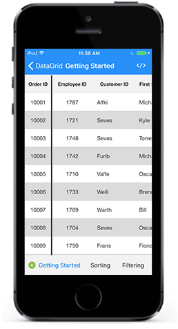
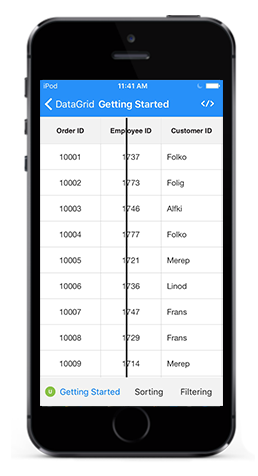

# Columns 

The data grid creates and add columns in two ways:

* Automatic Columns generation based on the underlying collection.
* Manually defining columns in C#.

## Automatic columns generation

The data grid creates columns automatically based on the [SfDataGrid.AutoGenerateColumns](https://help.syncfusion.com/cr/xamarin-ios/Syncfusion.SfDataGrid.SfDataGrid.html#Syncfusion_SfDataGrid_SfDataGrid_AutoGenerateColumns) property. Columns are generated based on the type of individual properties in the underlying collection which is set as ItemsSource. For example, [GridNumericColumn](https://help.syncfusion.com/cr/xamarin-ios/Syncfusion.SfDataGrid.GridNumericColumn.html) is added for the int type property. For remaining types, [GridTextColumn](http://help.syncfusion.com/cr/xamarin-ios/Syncfusion.SfDataGrid.GridTextColumn.html) will be created. Following table shows the column type created for the respective data type. 

<table>
<tr>
<th> Data Tye </th>
<th> Column </th>
</tr>
<tr>
<td> string and object </td>
<td> GridTextColumn </td>
</tr>
<tr>
<td> int, float, double, decimal, and its respective nullable types </td>
<td> GridNumericColumn </td>
</tr>
<tr>
<td> DateTime </td>
<td> GridDateTimeColumn </td>
</tr>
<tr>
<td> bool </td>
<td> GridSwitchColumn </td>
</tr>
<tr>
<td> enum </td>
<td> GridPickerColumn </td>
</tr>
<tr>
<td> UIImage </td>
<td> GridImageColumn </td>
</tr>
</table>

You can refer to the sample [here](http://www.syncfusion.com/downloads/support/directtrac/general/ze/AutoGenerateColumn_IOS572781242) to know the codes for defining properties in the Model class and populating the data for generating different types of column automatically. 

### AutoGenerateColumns with different modes

The auto generation of the columns in SfDataGrid is based on the [SfDataGrid.AutoGenerateColumnsMode](https://help.syncfusion.com/cr/xamarin-ios/Syncfusion.SfDataGrid.SfDataGrid.html#Syncfusion_SfDataGrid_SfDataGrid_AutoGenerateColumnsMode) property. 

The `SfDataGrid.AutoGenerateColumnsMode` determines how to create columns when `SfDataGrid.AutoGenerateColumns` is set to `true`. It also decides whether to retain grouping and sorting when the ItemsSource is changed. 

The `SfDataGrid.AutoGenerateColumnsMode` is of type [AutoGenerateColumnsMode](https://help.syncfusion.com/cr/xamarin-ios/Syncfusion.SfDataGrid.SfDataGrid.html#Syncfusion_SfDataGrid_SfDataGrid_AutoGenerateColumnsMode) which has the following five options.

<table>
<tr>
<th> Modes </th>
<th> Description </th>
</tr>
<tr>
<td>  {{'[None](http://help.syncfusion.com/cr/xamarin-ios/Syncfusion.SfDataGrid.AutoGenerateColumnsMode.html)'| markdownify }} </td>
<td> Stores only the columns that are defined in SfDataGrid.Columns collection.  When changing the ItemsSource, the grouping and sorting for explicitly defined SfDataGrid.Columns alone will be retained. </td>
</tr>
<tr>
<td> {{'[Reset](http://help.syncfusion.com/cr/xamarin-ios/Syncfusion.SfDataGrid.AutoGenerateColumnsMode.html)'| markdownify }} </td>
<td> Retains the defined columns explicitly in the application level and creates columns newly for all the other properties in a data source.  When changing the ItemsSource, grouping and sorting for explicitly defined `SfDataGrid.Columns` alone will be retained. </td>
</tr>
<tr>
<td> {{'[ResetAll](http://help.syncfusion.com/cr/xamarin-ios/Syncfusion.SfDataGrid.AutoGenerateColumnsMode.html)'| markdownify }} </td>
<td> When changing the ItemsSource, the columns for the previous data source are cleared and the columns will be created newly for the new data source. Even when columns are explicitly defined it does not consider the defined columns and creates the column based on the underlying collection.  Further, when changing the ItemsSource, grouping and sorting for all the columns will be cleared. </td>
</tr>
<tr>
<td> {{'[RetainOld](http://help.syncfusion.com/cr/xamarin-ios/Syncfusion.SfDataGrid.AutoGenerateColumnsMode.html)'| markdownify }} </td>
<td> When changing the ItemsSource, it creates columns for all fields in the data source when the grid does not have any explicit definition for columns. When columns are defined explicitly, the defined columns are retained and new columns are not created.  Similarly, when changing the ItemsSource and when the grid have any explicit definition for columns, grouping and sorting are retained as it is. </td>
</tr>
<tr>
<td> {{'[SmartReset](http://help.syncfusion.com/cr/xamarin-ios/Syncfusion.SfDataGrid.AutoGenerateColumnsMode.html)'| markdownify }} </td>
<td> Retains the columns defined explicitly in the application level and the columns with MappingName identical to the properties in the new data source. Creates columns newly for all the other properties in the data source.  Similarly, it retains grouping and sorting of the columns that are defined explicitly in application level and the columns with MappingName identical to the properties in the new data source. </td>
</tr>
</table>

Default value of the `SfDataGrid.AutoGenerateColumns` property is `true` and `SfDataGrid.AutoGenerateColumnsMode` is `Reset`. Hence, by default, the data grid creates columns automatically for every non-explicitly defined public property in the underlying collection bound to its `ItemsSource` property.

N> When you change items source for the data grid at runtime, the columns are generated on the basis of option set for `SfDataGrid.AutoGenerateColumnsMode`.

### Customize automatically generated columns

When the `SfDataGrid.AutoGenerateColumns` is `true`, the [SfDataGrid.AutoGeneratingColumn](https://help.syncfusion.com/cr/xamarin-ios/Syncfusion.SfDataGrid.SfDataGrid.html) event is raised for each GridColumn. This event receives two arguments namely, sender which is the data grid and [AutoGeneratingColumnArgs](http://help.syncfusion.com/cr/xamarin-ios/Syncfusion.SfDataGrid.AutoGeneratingColumnArgs.html).

The `AutoGeneratingColumnArgs` object contains the following property:

* [Column](https://help.syncfusion.com/cr/xamarin-ios/): This property returns the created column using which you can customize the column.
* [Cancel](https://msdn.microsoft.com/query/dev10.query?appId=Dev10IDEF1&l=EN-US&k=k(System.ComponentModel.CancelEventArgs.Cancel)&rd=true): This property cancels the column creation.
* PropertyType: This property provides the type of underlying model property for which the column is created.

You can skip generating a column by handling the `SfDataGrid.AutoGeneratingColumn` event as shown as follows:


dataGrid.AutoGeneratingColumn += GridAutoGeneratingColumns; 

void GridAutoGeneratingColumns(object sender, AutoGeneratingColumnArgs e)
{
    if (e.Column.MappingName == "EmployeeID")
        e.Cancel = true;
}


Customizing the width for auto generated columns as shown below.


void dataGrid_AutoGeneratingColumn(object sender, AutoGeneratingColumnArgs e){
if (e.Column.MappingName == "OrderID") {
    e.Column.Width = 100;
    }
}


You can also apply formatting for auto generated columns as shown below.


void GridAutoGeneratingColumns(object sender, AutoGeneratingColumnArgs e)
{
    if (e.Column.MappingName == "Freight") {
        e.Column.Format = "C";
        e.Column.CultureInfo = new CultureInfo ("en-US");
    } else if (e.Column.MappingName == "ShippingDate")
        e.Column.Format = "dd/MM/yyyy";
} 


You can perform any desired operation based on the property type of the underlying model object as follows.


void GridAutoGeneratingColumns(object sender,AutoGeneratingColumnEventArgs e)
{
    if(e.PropertyType == typeof(string))
    {
        // Here we have hidden the columns if the underlying property type is string.
        e.Column.IsHidden = true;
    }
}


You can also customize a column’s header text, sorting, alignment, padding, etc. by handling the `SfDataGrid.AutoGeneratingEvent`.

## Manually generated columns

The data grid also defines the columns manually by adding the grid column objects to the `SfDataGrid.Columns` collection. To view the manually defined columns, set the `SfDataGrid.AutoGenerateColumns` property to `false`. There are different types of columns available in the data grid, and you can create any column through code.
 
The following code example illustrates creating columns manually in the data grid:


dataGrid.AutoGenerateColumns = false;

GridTextColumn orderIdColumn = new GridTextColumn ();
orderIdColumn.MappingName = "OrderID";
orderIdColumn.HeaderText = "Order ID";

GridTextColumn customerIdColumn = new GridTextColumn ();
customerIdColumn.MappingName = "CustomerID";
customerIdColumn.HeaderText = "Customer ID";

GridTextColumn customerColumn = new GridTextColumn ();
customerColumn.MappingName = "Customer";

GridTextColumn countryColumn = new GridTextColumn ();
countryColumn.MappingName = "ShipCountry";
countryColumn.HeaderText = "Ship Country";

dataGrid.Columns.Add (orderIdColumn);
dataGrid.Columns.Add (customerIdColumn);
dataGrid.Columns.Add (customerColumn);
dataGrid.Columns.Add (countryColumn); 


## Resizing columns

The data grid allows resizing the columns by tapping and dragging the right border of the column headers. Resizing can be enabled or disabled by setting the [SfDataGrid.AllowResizingColumn](https://help.syncfusion.com/cr/xamarin-ios/Syncfusion.SfDataGrid.SfDataGrid.html#Syncfusion_SfDataGrid_SfDataGrid_AllowResizingColumn) property. A resizing indicator is displayed while resizing a column.

N> Resizing considers the [GridColumn.MinimumWidth](https://help.syncfusion.com/cr/xamarin-ios/Syncfusion.SfDataGrid.GridColumn.html#Syncfusion_SfDataGrid_GridColumn_MinimumWidth) and [GridColumn.MaximumWidth](https://help.syncfusion.com/cr/xamarin-ios/Syncfusion.SfDataGrid.GridColumn.html#Syncfusion_SfDataGrid_GridColumn_MaximumWidth) of the column and will not resize the past minimum and maximum width constraints.


dataGrid.AllowResizingColumn = true;


N> The resizing indicator appears when tapping the right corner of the column header.

You can interactively hide a column by setting the `GridColumn.MinimumWidth` property to 0 and resizing the column to a width less than 0.

### Resizing modes

The data grid allows two modes of resizing which can be set using the [SfDataGrid.ResizingMode](https://help.syncfusion.com/cr/xamarin-ios/Syncfusion.SfDataGrid.SfDataGrid.html#Syncfusion_SfDataGrid_SfDataGrid_ResizingMode) property. The available resizing modes are:

* [OnMoved](http://help.syncfusion.com/cr/xamarin-ios/Syncfusion.SfDataGrid.ResizingMode.html): The resizing indicator is moved based on the touch point and the width of the column is updated as the resizing indicator moves.
* [OnTouchUp](http://help.syncfusion.com/cr/xamarin-ios/Syncfusion.SfDataGrid.ResizingMode.html): The resizing indicator is moved based on the touch point but however the width of the column is updated only on a touch up operation.

N> Default resizing mode is `OnMoved`.

The following image shows the resizing mode `OnMoved`.

The following image shows the resizing mode `OnTouchUp`.

### Resizing events

The resizing operation can be handled by using the [SfDataGrid.ColumnResizing](https://help.syncfusion.com/cr/xamarin-ios/Syncfusion.SfDataGrid.SfDataGrid.html) event. The `SfDataGrid.ColumnResizing` event is fired upon starting to resize a column and will be continuously fired till the resizing operation ends.

By handling the `SfDataGrid.ColumnResizing` event, you can also cancel the resizing of a particular column.

The `SfDataGrid.ColumnResizing` event provides the following properties through [GridResizingEventArgs](http://help.syncfusion.com/cr/xamarin-ios/Syncfusion.SfDataGrid.GridResizingEventArgs.html).

* [Index](https://help.syncfusion.com/cr/xamarin-ios/Syncfusion.SfDataGrid.GridResizingEventArgs.html#Syncfusion_SfDataGrid_GridResizingEventArgs_Index): Returns the index of the resizing column.
* [NewValue](https://help.syncfusion.com/cr/xamarin-ios/Syncfusion.SfDataGrid.GridResizingEventArgs.html#Syncfusion_SfDataGrid_GridResizingEventArgs_NewValue): Returns the current width of the column being resized.
* [ResizingState](https://help.syncfusion.com/cr/xamarin-ios/Syncfusion.SfDataGrid.GridResizingEventArgs.html#Syncfusion_SfDataGrid_GridResizingEventArgs_ResizingState): Returns the current state of the user interaction through a value from the ProgressStates enum.
* [Cancel](https://msdn.microsoft.com/query/dev10.query?appId=Dev10IDEF1&l=EN-US&k=k(System.ComponentModel.CancelEventArgs.Cancel)&rd=true): Returns a Boolean property to cancel the event and the resizing operation. 

### Cancel resizing for a column

You can cancel resizing for a particular column using the [SfDataGrid.ColumnResizing](https://help.syncfusion.com/cr/xamarin-ios/Syncfusion.SfDataGrid.SfDataGrid.html) event. You can cancel the resizing operation of a column based on the different arguments provided in the `GridResizingEventArgs`. 

The following code example shows how to cancel resizing for a column using the `SfDataGrid.ColumnResizing` event using the `Index` value. 


    this.dataGrid.ResizingColumns += dataGrid_ResizingColumns;
    private void DataGrid_ColumnResizing(object sender, GridResizingEventArgs e)
        {
            //Code to end resizing if ColumnIndex is 2
            if (e.Index == 2)
                e.Cancel = true;
        }


The following code example shows how to cancel resizing for a column using the `SfDataGrid.ColumnResizing` event using the `NewValue` value. 


    this.dataGrid.ResizingColumns += dataGrid_ResizingColumns;
    private void DataGrid_ColumnResizing(object sender, GridResizingEventArgs e)
        {
            //Code to end resizing if Column's Width is >= 100
            if (e.NewValue >= 100 ||)
                e.Cancel = true;
        }


The following code example shows how to cancel resizing for a column using the `SfDataGrid.ColumnResizing` event using the `ProgressStates` value. 


    this.dataGrid.ResizingColumns += dataGrid_ResizingColumns;
    private void DataGrid_ColumnResizing(object sender, GridResizingEventArgs e)
        {
            //Code to end resizing if interaction state is Progressing
            if (e.ResizingState = ProgressStates.Progressing)
                e.Cancel = true;
        }


You can cancel resizing for a particular column using the `SfDataGrid.ColumnResizing` event. The following code example shows how to cancel resizing for a column using the `SfDataGrid.ColumnResizing` event. 


    this.dataGrid.ResizingColumns += dataGrid_ResizingColumns;
    private void DataGrid_ColumnResizing(object sender, GridResizingEventArgs e)
        {
            //Code to end resizing if ColumnIndex is 2 or Column's Width is >= 100 or if interaction state is Progressing
            if (e.Index == 2 || e.NewValue >= 100 || e.ResizingState = ProgressStates.Progressing)
                e.Cancel = true;
        }


## Picker closed event

This event is available for both the `GridPickerColumn` and the `GridDateTimeColumn`.The [GridPickerColumn.Closed](https://help.syncfusion.com/cr/xamarin-ios/Syncfusion.SfDataGrid.GridPickerColumn.html) and the [GridDateTimeColumn.Closed](https://help.syncfusion.com/cr/xamarin-ios/Syncfusion.SfDataGrid.GridDateTimeColumn.html) events will be triggered whenever the "Done" button is pressed in Picker editor and DateTime editor of the `GridPickerColumn` and `GridDateTimeColumn` respectively. This event handler contains the parameter of type [PickerClosedEventArgs](https://help.syncfusion.com/cr/xamarin-ios/Syncfusion.SfDataGrid.PickerClosedEventArgs.html) that contains the following properties.

* [OldValue](https://help.syncfusion.com/cr/xamarin-ios/Syncfusion.SfDataGrid.PickerClosedEventArgs.html#Syncfusion_SfDataGrid_PickerClosedEventArgs_OldValue) : Gets the old value of the picker.
* [NewValue](https://help.syncfusion.com/cr/xamarin-ios/Syncfusion.SfDataGrid.PickerClosedEventArgs.html#Syncfusion_SfDataGrid_PickerClosedEventArgs_NewValue) : Gets the newly selected value of the picker.
* [Action](https://help.syncfusion.com/cr/xamarin-ios/Syncfusion.SfDataGrid.PickerClosedEventArgs.html#Syncfusion_SfDataGrid_PickerClosedEventArgs_Action)   : Returns string value "Commit" when "Done" button is pressed or "Cancel" when the picker view is collapsed without pressing "Done" button.

The following code illustrates how to hook the `Closed` event and get the picker details.



            //For GridPickerColumn event has been raised.
            GridPickerColumn  pickerColumn= new GridPickerColumn() { MappingName = "ShipCountry" };
            pickerColumn.Closed += Closed_Method;
            dataGrid.Columns.Add(pickerColumn);

            //For GridDateTimeColumn event has been raised.
            GridDateTimeColumn dateTimeColumn = new GridDateTimeColumn() { MappingName = "ShippingDate" };
            dateTimeColumn.Closed += Closed_Method;
            dataGrid.Columns.Add(dateTimeColumn);

            private void Closed_Method(object sender, PickerClosedEventArgs e)
            {
              var newValue = e.NewValue;
              var oldValue = e.OldValue;
              var action = e.Action;
            }


