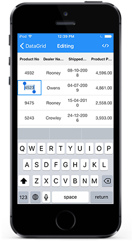

# Editing
SfDataGrid provides support for editing the cell values by setting [SfDataGrid.AllowEditing](https://help.syncfusion.com/cr/cref_files/xamarin-ios/sfdatagrid/Syncfusion.SfDataGrid.iOS~Syncfusion.SfDataGrid.SfDataGrid~AllowEditing.html) property.

The following code example shows how to enable editing in SfDataGrid. 


dataGrid.AllowEditing = true;


## Column Editing

You can enable or disable editing for particular column by setting [GridColumn.AllowEditing](https://help.syncfusion.com/cr/cref_files/xamarin-ios/sfdatagrid/Syncfusion.SfDataGrid.iOS~Syncfusion.SfDataGrid.GridColumn~AllowEditing.html) property.


GridTextColumn column = new GridTextColumn();
column.AllowEditing = false;


N > `GridColumn.AllowEditing` takes higher priority than `SfDataGrid.AllowEditing`.

## Entering into edit mode

You can enter into edit mode by selecting the row and tapping the cell. Users can also choose to edit the cell in single tap or double tap by setting by [SfDataGrid.EditTapAction](https://help.syncfusion.com/cr/cref_files/xamarin-ios/sfdatagrid/Syncfusion.SfDataGrid.iOS~Syncfusion.SfDataGrid.SfDataGrid~EditTapAction.html) property.


//Enter edit mode in single tap
this.dataGrid.EditTapAction = TapAction.OnTap;
//Enter edit mode in double tap
this.dataGrid.EditTapAction = TapAction.OnDoubleTap;


## Cursor behavior
When the cell enters into edit mode, cursor is placed based on [SfDataGrid.EditorSelectionBehavior](https://help.syncfusion.com/cr/cref_files/xamarin-ios/sfdatagrid/Syncfusion.SfDataGrid.iOS~Syncfusion.SfDataGrid.SfDataGrid~EditorSelectionBehavior.html) property.

* SelectAll – selects the text of edit element loaded inside cell.
* MoveLast – places the cursor at the last of edit element loaded inside cell.


//Selects all the text in the edit mode
this.dataGrid.EditorSelectionBehavior = EditorSelectionBehavior.SelectAll;
//Places the cursor at the last
this.dataGrid.EditorSelectionBehavior = EditorSelectionBehavior.MoveLast;


N> Editing support for UserCellTypeColumn and GridUnboundColumn are not provided yet.

## Support for IEditableObject
SfDataGrid supports to commit and roll back the changes in row level when underlying data object implements IEditableObject interface.

The editing changes in a row will be committed only when user moves to next row by tapping.

IEditableObject has the following methods to capture editing,

BeginEdit – Gets called to begin edit on underlying data object when cell in a row enters into edit mode.

CancelEdit – Gets called when user cencels editing to discard the changes in a row since last BeginEdit call.

EndEdit – Gets called when user move to the next row by tapping to commit changes in underlying data object since last BeginEdit call.

In the below code snippet explains the simple implementation of IEditableObject.


public class OrderInfo : INotifyPropertyChanged, IEditableObject
{
    public OrderInfo()
    {
    }

    private int _orderID;
    private int _employeeID;
    private int _customerID;
    private bool _isClosed;
    private string _firstname;
    private string _lastname;
    private string _gender;
    private string _shipCity;
    private string _shipCountry;
    private string _freight;
    private DateTime _shippingDate;

    public int OrderID
    {
        get { return _orderID; }
        set
        {
            this._orderID = value;
            RaisePropertyChanged("OrderID");
        }
    }

    public int EmployeeID
    {
        get { return _employeeID; }
        set
        {
            this._employeeID = value;
            RaisePropertyChanged("EmployeeID");
        }
    }

    public int CustomerID
    {
        get { return _customerID; }
        set
        {
            this._customerID = value;
            RaisePropertyChanged("CustomerID");
        }
    }

    public bool IsClosed
    {
        get { return _isClosed; }
        set
        {
            this._isClosed = value;
            RaisePropertyChanged("IsClosed");
        }
    }

    public string FirstName
    {
        get { return _firstname; }
        set
        {
            this._firstname = value;
            RaisePropertyChanged("FirstName");
        }
    }

    public string LastName
    {
        get { return _lastname; }
        set
        {
            this._lastname = value;
            RaisePropertyChanged("LastName");
        }
    }

    public string Gender
    {
        get { return _gender; }
        set
        {
            this._gender = value;
            RaisePropertyChanged("Gender");
        }
    }

    public string ShipCity
    {
        get { return _shipCity; }
        set
        {
            this._shipCity = value;
            RaisePropertyChanged("ShipCity");
        }
    }

    public string ShipCountry
    {
        get { return _shipCountry; }
        set
        {
            this._shipCountry = value;
            RaisePropertyChanged("ShipCountry");
        }
    }

    public string Freight
    {
        get { return _freight; }
        set
        {
            this._freight = value;
            RaisePropertyChanged("Freight");
        }
    }

    public DateTime ShippingDate
    {
        get { return _shippingDate; }
        set
        {
            this._shippingDate = value;
            RaisePropertyChanged("ShippingDate");
        }
    }

    public event PropertyChangedEventHandler PropertyChanged;

	private void RaisePropertyChanged (String Name)
	{
		if (PropertyChanged != null)
			this.PropertyChanged (this, new PropertyChangedEventArgs (Name));
	}

    private Dictionary<string, object> storedValues;

    public void BeginEdit()
    {
        this.storedValues = this.BackUp();
    }

    public void CancelEdit()
    {
        if (this.storedValues == null)
            return;

        foreach (var item in this.storedValues)
        {
            var itemProperties = this.GetType().GetTypeInfo().DeclaredProperties;
            var pDesc = itemProperties.FirstOrDefault(p => p.Name == item.Key);
            if (pDesc != null)
                pDesc.SetValue(this, item.Value);
        }
    }

    public void EndEdit()
    {
        if (this.storedValues != null)
        {
            this.storedValues.Clear();
            this.storedValues = null;
        }
        Debug.WriteLine("End Edit Called");
    }

    protected Dictionary<string, object> BackUp()
    {
        var dict = new Dictionary<string, object>();
        var itemProperties = this.GetType().GetTypeInfo().DeclaredProperties;
        foreach (var pDescriptor in itemProperties)
        {
            if (pDescriptor.CanWrite)
                dict.Add(pDescriptor.Name, pDescriptor.GetValue(this));
        }
        return dict;
    }
}


## Editing Events
SfDataGrid triggers the following events while editing.

### CurrentCellBeginEdit

[SfDataGrid.CurrentCellBeginEdit](https://help.syncfusion.com/cr/cref_files/xamarin-ios/sfdatagrid/Syncfusion.SfDataGrid.iOS~Syncfusion.SfDataGrid.SfDataGrid~CurrentCellBeginEdit_EV.html) event occurs when the CurrentCell enters into edit mode. [GridCurrentCellBeginEditEventArgs](https://help.syncfusion.com/cr/cref_files/xamarin-ios/sfdatagrid/Syncfusion.SfDataGrid.iOS~Syncfusion.SfDataGrid.GridCurrentCellBeginEditEventArgs.html) has the following members which provides information for `SfDataGrid.CurrentCellBeginEdit` event.

* [Cancel](https://msdn.microsoft.com/query/dev10.query?appId=Dev10IDEF1&l=EN-US&k=k(System.ComponentModel.CancelEventArgs.Cancel)&rd=true) : When set to ‘true’, the event is canceled and the CurrentCell does not enter into the edit mode.
* RowColumnIndex : Gets the current row,column index of the DataGrid.
* Column : Gets the Grid Column of the SfDataGrid.

### CurrentCellEndEdit

[CurrentCellEndEdit](https://help.syncfusion.com/cr/cref_files/xamarin-ios/sfdatagrid/Syncfusion.SfDataGrid.iOS~Syncfusion.SfDataGrid.SfDataGrid~CurrentCellEndEdit_EV.html) event occurs when the CurrentCell exits the edit mode. [GridCurrentCellEndEditEventArgs](https://help.syncfusion.com/cr/cref_files/xamarin-ios/sfdatagrid/Syncfusion.SfDataGrid.iOS~Syncfusion.SfDataGrid.GridCurrentCellEndEditEventArgs.html) has following members which provides information for `SfDataGrid.CurrentCellEndEdit` event.

* RowColumnIndex : Gets the current row,column index of the DataGrid.
* [Cancel](https://msdn.microsoft.com/query/dev10.query?appId=Dev10IDEF1&l=EN-US&k=k(System.ComponentModel.CancelEventArgs.Cancel)&rd=true) : When set to ‘true’, the event is canceled and the edited value is not committed in the underlying collection.

## Programatically edit a cell

### Begin editing

SfDataGrid allows you to edit the cell programmatically by calling the [SfDataGrid.BeginEdit](https://help.syncfusion.com/cr/cref_files/xamarin-ios/sfdatagrid/Syncfusion.SfDataGrid.iOS~Syncfusion.SfDataGrid.SfDataGrid~BeginEdit.html) method. Calling this method makes that particular cell enter the edit mode after which you can customize the data manually. The below code example shows how to edit a cell programatically.


this.dataGrid.Loaded += dataGrid_Loaded;
void dataGrid_Loaded(object sender, RoutedEventArgs e)
{
    //Edit the cell at 2nd row,2nd column programatically
    this.dataGrid.BeginEdit(2, 2);
}


### End editing

You can call the [SfDataGrid.EndEdit](https://help.syncfusion.com/cr/cref_files/xamarin-ios/sfdatagrid/Syncfusion.SfDataGrid.iOS~Syncfusion.SfDataGrid.SfDataGrid~EndEdit.html) method to programmatically end editing. Calling this method for a cell currently undergoing editing commits the edited value to the underlying collection and exits the edit mode. The below code example shows how to end the editing programatically.


this.dataGrid.EndEdit();


### Cancel editing

You can call the [SfDatagrid.CancelEdit](https://help.syncfusion.com/cr/cref_files/xamarin-ios/sfdatagrid/Syncfusion.SfDataGrid.iOS~Syncfusion.SfDataGrid.SfDataGrid~CancelEdit.html) method to programatically cancel the editing. Calling this method for a cell currently undergoing editing will exit the edit mode without committing the value in the underlying collection. The below code example shows how to cancel the editing programatically.


this.dataGrid.CancelEdit();


## How to 

### Cancel Editing

You can use the `SfDataGrid.CurrentCellBeginEdit` event to cancel the editing operation for the corresponding cell. The below code example shows how to cancel the editing operation using the `SfDataGrid.CurrentCellBeginEdit` event.


this.dataGrid.CurrentCellBeginEdit += DataGrid_CurrentCellBeginEdit;
private void DataGrid_CurrentCellBeginEdit(object sender, GridCurrentCellBeginEditEventArgs args)
{
    if (args.Column.MappingName == "OrderID" || args.RowColumnIndex.RowIndex == 2)
        args.Cancel = true;
}


### Cancel edited value from getting committed

You can prevent the edited value from getting committed using the `SfDataGrid.CurrentCellEndEdit` event. The below code example shows how to prevent the edited values from getting committed in the underlying collection.


this.dataGrid.CurrentCellEndEdit += DataGrid_CurrentCellEndEdit;

private void DataGrid_CurrentCellEndEdit(object sender, GridCurrentCellEndEditEventArgs args)
{
    if (args.RowColumnIndex.RowIndex == 2)
        args.Cancel == true;
}
