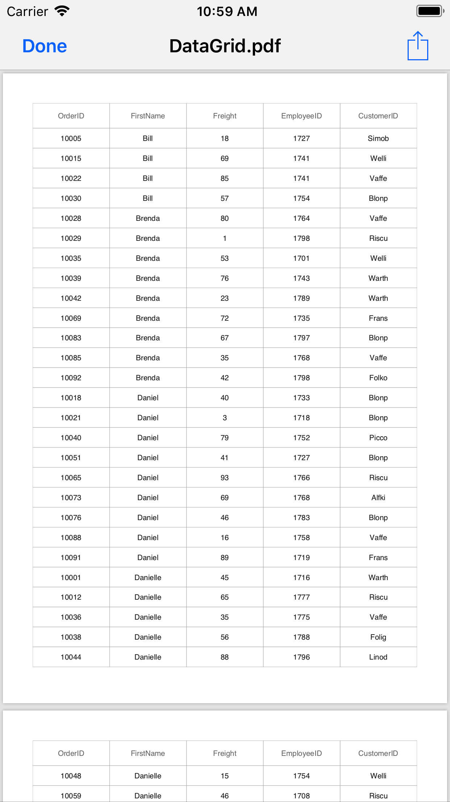
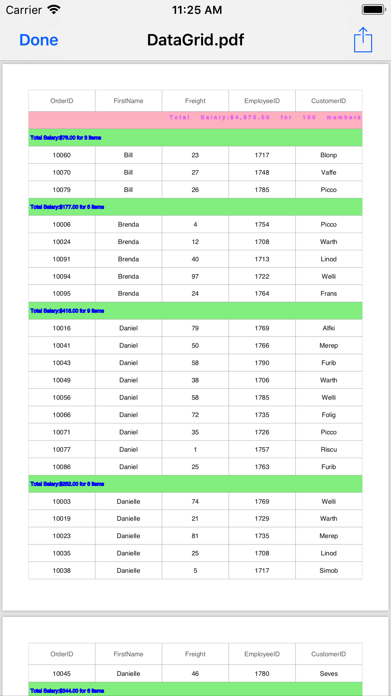
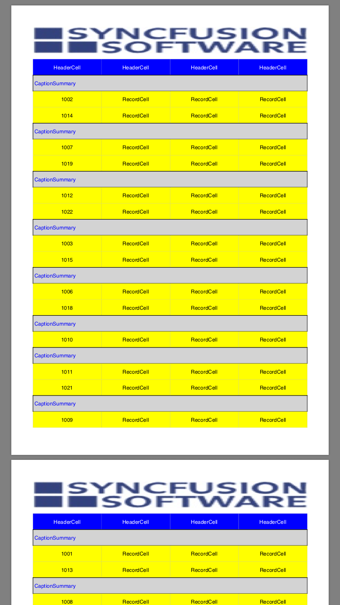
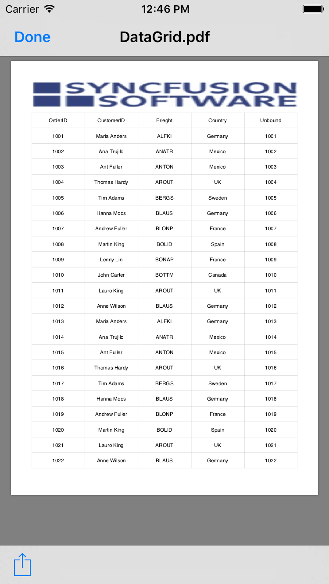

# Exporting

The SfDataGrid supports exporting the data to PDF with several customization options like custom appearance, excluding specific columns, excluding headers, setting custom row height, setting custom column width, etc. It also supports [Grouping](https://help.syncfusion.com/xamarin-ios/sfdatagrid/grouping), [Filtering](https://help.syncfusion.com/xamarin-ios/sfdatagrid/filtering), and [Sorting](https://help.syncfusion.com/xamarin-ios/sfdatagrid/sorting) when exporting.

To use the export to PDF functionalities of the SfDataGrid, add the required assembly references to your application as discussed in the [Assembly deployment](/xamarin-ios/sfdatagrid/getting-started#assembly-deployment) section.

The following code explains how to create and display a SfDataGrid in view.



// In MyViewController.cs

SfDataGrid SfGrid;
UIButton exportPdf;
        
public MyViewController()
{
    this.SfGrid = new SfDataGrid();
    this.SfGrid.AutoGenerateColumns = false;
    this.SfGrid.SelectionMode = SelectionMode.Single;
    this.SfGrid.ItemsSource = new OrderInfoRepository().OrderInfoCollection;
    this.SfGrid.ShowRowHeader = false;
    this.SfGrid.HeaderRowHeight = 45;
    this.SfGrid.RowHeight = 45;

    var FreightColumn = new GridTextColumn
    {
        MappingName = "Freight",
        HeaderText = "Freight"
    };
    var FirstNameColumn = new GridTextColumn
    {
        MappingName = "FirstName",
        HeaderText = "FirstName",
    };
    var OrderIdColumn = new GridTextColumn
    {
        MappingName = "OrderID",
        HeaderText = "OrderID",
    };
    var EmployeeIdColumn = new GridTextColumn
    {
        MappingName = "EmployeeID",
        HeaderText = "EmployeeID",
    };
    var IsClosedColumn = new GridTextColumn
    {
        MappingName = "IsClosed",
        HeaderText = "IsClosed",
    };
    SfGrid.Columns.Add(OrderIdColumn);
    SfGrid.Columns.Add(FirstNameColumn);
    SfGrid.Columns.Add(FreightColumn);
    SfGrid.Columns.Add(EmployeeIdColumn);
    SfGrid.Columns.Add(IsClosedColumn);

    exportPdf = new UIButton(UIButtonType.RoundedRect);
    exportPdf.Layer.CornerRadius = 5;
    exportPdf.SetTitleColor(UIColor.Black, UIControlState.Normal);
    exportPdf.SetTitle("Export To PDF", UIControlState.Normal);
    exportPdf.BackgroundColor = UIColor.FromRGB(212, 208, 200);
    exportPdf.TouchDown += ExportToPdf_Clicked;

    this.View.AddSubviews(exportPdf);
    this.View.AddSubviews(this.SfGrid);
}

public override void ViewDidLayoutSubviews()
{
    this.exportPdf.Frame = new CGRect((this.View.Frame.Left + 15), 10, ((this.View.Frame.Right / 2) - 30), 50);
    this.SfGrid.Frame = new CGRect(0, 70, this.View.Frame.Width, this.View.Frame.Height - 70);
    base.ViewDidLayoutSubviews();
}



## Export to PDF

You can export data to PDF by using the [ExportToPdf](http://help.syncfusion.com/cr/cref_files/xamarin-ios/Syncfusion.SfGridConverter.iOS~Syncfusion.SfDataGrid.Exporting.DataGridPdfExportingController~ExportToPdf.html) method by passing the SfDataGrid as an argument. 



private void ExportToPdf_Clicked(object sender, EventArgs e)
{
    DataGridPdfExportingController pdfExport = new DataGridPdfExportingController();
    MemoryStream stream = new MemoryStream();
    var doc = pdfExport.ExportToPdf(this.SfGrid);
    doc.Save(stream);
    doc.Close(true);
    Save("DataGrid.pdf", "application/pdf", stream);
}



## Exporting Options

You can also export data to PDF with various customizing options while exporting the SfDataGrid by passing the grid and [DataGridPdfExportingOption](http://help.syncfusion.com/cr/cref_files/xamarin-ios/Syncfusion.SfGridConverter.IOS~Syncfusion.SfDataGrid.Exporting.DataGridPdfExportOption.html) as arguments to the `ExportToPdf` method.



DataGridPdfExportingController pdfExport = new DataGridPdfExportingController ();
DataGridPdfExportOption exportOption = new DataGridPdfExportOption ();
exportOption.FitAllColumnsInOnePage = true;
var doc = pdfExport.ExportToPdf (this.dataGrid, exportOption); 



SfDataGrid provides you with several properties in `DataGridPdfExportingOption` class to customize the grid while exporting it to PDF. 

### Exclude Columns while Exporting

By default, all the columns (including hidden columns) in the SfDataGrid will be exported to PDF. To exclude some particular columns while exporting to PDF, add those columns to the [DataGridPdfExportOption.ExcludeColumns](https://help.syncfusion.com/cr/cref_files/xamarin-ios/Syncfusion.SfGridConverter.iOS~Syncfusion.SfDataGrid.Exporting.DataGridPdfExportOption~ExcludeColumns.html) list.



DataGridPdfExportingController pdfExport = new DataGridPdfExportingController ();
DataGridPdfExportOption exportOption = new DataGridPdfExportOption ();
var list = new List<string>();
list.Add("OrderID");
list.Add("LastName");
exportOption.ExcludedColumns = list;
var doc = pdfExport.ExportToPdf (this.dataGrid, exportOption); 



### PdfDocument

The [DataGridPdfExportOption.PdfDocument](https://help.syncfusion.com/cr/cref_files/xamarin-ios/Syncfusion.SfGridConverter.iOS~Syncfusion.SfDataGrid.Exporting.DataGridPdfExportOption~PdfDocument.html) allows exporting the SfDataGrid to an existing or new PdfDocument. 



DataGridPdfExportOption option = new DataGridPdfExportOption();
PdfDocument pdfDocument = new PdfDocument();
pdfDocument.Pages.Add();
pdfDocument.Pages.Add();
pdfDocument.Pages.Add();
option.StartPageIndex = 1;
option.PdfDocument = pdfDocument;



### RepeatHeaders

You can show or hide the column headers on each page of the exported PDF document by using the [DataGridPdfExportOption.RepeatHeaders](https://help.syncfusion.com/cr/cref_files/xamarin-ios/Syncfusion.SfGridConverter.iOS~Syncfusion.SfDataGrid.Exporting.DataGridPdfExportOption~RepeatHeaders.html) property. The default value is true.



private void PDFExport_Clicked(object sender, EventArgs e)
{
    DataGridPdfExportingController pdfExport = new DataGridPdfExportingController();
    MemoryStream stream = new MemoryStream();
    DataGridPdfExportOption option = new DataGridPdfExportOption();
    option.RepeatHeaders = true;
    var doc = pdfExport.ExportToPdf(this.SfGrid, option);
    doc.Save(stream);
    doc.Close(true);
    Save("DataGrid1.pdf", "application/pdf", stream);
}



### Exclude Groups while Exporting

By default, all the groups in the data grid will be exported to PDF document. To export the data grid without Groups, set the [DataGridPdfExportOption.ExportGroups](https://help.syncfusion.com/cr/cref_files/xamarin-ios/Syncfusion.SfGridConverter.iOS~Syncfusion.SfDataGrid.Exporting.DataGridPdfExportOption~ExportGroups.html) property to `false`.



private void PDFExport_Clicked(object sender, EventArgs e)
{
    DataGridPdfExportingController pdfExport = new DataGridPdfExportingController();
    MemoryStream stream = new MemoryStream();
    DataGridPdfExportOption option = new DataGridPdfExportOption();
    option.ExportGroups = false;
    var doc = pdfExport.ExportToPdf(this.SfGrid, option);
    doc.Save(stream);
    doc.Close(true);
    Save("DataGrid1.pdf", "application/pdf", stream);
}



* ExportGroups is false

* ExportGroups is true

### Exclude Column Header while Exporting

By default, the column headers will be exported to PDF document. To export the SfDataGrid without the column headers, set the [DataGridPdfExportOption.ExportHeader](https://help.syncfusion.com/cr/cref_files/xamarin-ios/Syncfusion.SfGridConverter.iOS~Syncfusion.SfDataGrid.Exporting.DataGridPdfExportOption~ExportHeader.html) to `false`.



private void PDFExport_Clicked(object sender, EventArgs e)
{
    DataGridPdfExportingController pdfExport = new DataGridPdfExportingController();
    MemoryStream stream = new MemoryStream();
    DataGridPdfExportOption option = new DataGridPdfExportOption();
    option.ExportHeader = false;
    var doc = pdfExport.ExportToPdf(this.SfGrid, option);
    doc.Save(stream);
    doc.Close(true);
    Save("DataGrid1.pdf", "application/pdf", stream);
}



### Exclude Table Summaries while Exporting

By default, table summaries in the data grid will be exported to excel. To export the SfDataGrid without table summaries, set the [DataGridPdfExportOption.ExportTableSummary](https://help.syncfusion.com/cr/cref_files/xamarin-ios/Syncfusion.SfGridConverter.iOS~Syncfusion.SfDataGrid.Exporting.DataGridPdfExportOption~ExportTableSummary.html) property to `false`.



private void PDFExport_Clicked(object sender, EventArgs e)
{
    DataGridPdfExportingController pdfExport = new DataGridPdfExportingController();
    MemoryStream stream = new MemoryStream();
    DataGridPdfExportOption option = new DataGridPdfExportOption();
    option.ExportTableSummary = false;
    var doc = pdfExport.ExportToPdf(this.SfGrid, option);
    doc.Save(stream);
    doc.Close(true);
    Save("DataGrid1.pdf", "application/pdf", stream);
}



### Exporting the SfDataGrid from Particular Starting Page

The SfDataGrid allows exporting the data from a particular staring position using the following options:

* StartPageIndex
* StartPoint 

#### StartPageIndex 

The SfDataGrid allows exporting the data to a particular starting page by using the [DataGridPdfExportOption.StartPageIndex](https://help.syncfusion.com/cr/cref_files/xamarin-ios/Syncfusion.SfGridConverter.iOS~Syncfusion.SfDataGrid.Exporting.DataGridPdfExportOption~StartPageIndex.html) property.



private void PDFExport_Clicked(object sender, EventArgs e)
{
    DataGridPdfExportingController pdfExport = new DataGridPdfExportingController();
    MemoryStream stream = new MemoryStream();
    PdfDocument pdfDocument = new PdfDocument();
    pdfDocument.Pages.Add();
    pdfDocument.Pages.Add();
    pdfDocument.Pages.Add();
    DataGridPdfExportOption option = new DataGridPdfExportOption();
    option.PdfDocument = pdfDocument;
    option.StartPageIndex = 1;
    var doc = pdfExport.ExportToPdf(this.SfGrid, option);
    doc.Save(stream);
    doc.Close(true);
    Save("DataGrid1.pdf", "application/pdf", stream);
}



#### StartPoint

The SfDataGrid allows exporting the data to a particular x,y starting point in the PDF page by using the [DataGridPdfExportOption.StartPoint](https://help.syncfusion.com/cr/cref_files/xamarin-ios/Syncfusion.SfGridConverter.iOS~Syncfusion.SfDataGrid.Exporting.DataGridPdfExportOption~StartPoint.html) property.



private void PDFExport_Clicked(object sender, EventArgs e)
{
    DataGridPdfExportingController pdfExport = new DataGridPdfExportingController();
    MemoryStream stream = new MemoryStream();
    DataGridPdfExportOption option = new DataGridPdfExportOption();
    option.StartPoint = new PointF(0, 500);
    var doc = pdfExport.ExportToPdf(this.SfGrid, option);
    doc.Save(stream);
    doc.Close(true);
    Save("DataGrid1.pdf", "application/pdf", stream);
}



### ApplyGridStyle

The SfDataGrid allows exporting the data with the applied GridStyle by setting the [DataGridPdfExportOption.ApplyGridStyle](https://help.syncfusion.com/cr/cref_files/xamarin-ios/Syncfusion.SfGridConverter.iOS~Syncfusion.SfDataGrid.Exporting.DataGridPdfExportOption~ApplyGridStyle.html) to `true`. By default, the data will be exported without the GridStyle.



private void PDFExport_Clicked(object sender, EventArgs e)
{
    DataGridPdfExportingController pdfExport = new DataGridPdfExportingController();
    MemoryStream stream = new MemoryStream();
    DataGridPdfExportOption option = new DataGridPdfExportOption();
    option.ApplyGridStyle = true;
    var doc = pdfExport.ExportToPdf(this.SfGrid, option);
    doc.Save(stream);
    doc.Close(true);
    Save("DataGrid1.pdf", "application/pdf", stream);
}



The SfDataGrid also allows customizing the following styles while exporting to PDF:

* BottomTableSummaryStyle 
* GroupCaptionStyle
* HeaderStyle
* RecordStyle 
* TopTableSummaryStyle

#### BottomTableSummaryStyle

The SfDataGrid supports exporting the bottom TableSummary with custom style by using the [DataGridPdfExportOption.BottomTableSummaryStyle](https://help.syncfusion.com/cr/cref_files/xamarin-ios/Syncfusion.SfGridConverter.iOS~Syncfusion.SfDataGrid.Exporting.DataGridPdfExportOption~BottomTableSummaryStyle.html) property.



DataGridPdfExportOption option = new DataGridPdfExportOption();
option.BottomTableSummaryStyle = new PdfGridCellStyle()
{
    BackgroundBrush = PdfBrushes.Yellow,
    Borders = new PdfBorders() { Bottom = PdfPens.Aqua, Left = PdfPens.AliceBlue, Right = PdfPens.Red, Top = PdfPens.RoyalBlue },
    CellPadding = new PdfPaddings(2, 3, 4, 5),
    TextBrush = PdfBrushes.Red,
    TextPen = PdfPens.Red,
    StringFormat = new PdfStringFormat() { Alignment = PdfTextAlignment.Right, CharacterSpacing = 3f, WordSpacing = 10f }
};



#### GroupCaptionStyle

The SfDataGrid supports exporting the GroupCaptionSummaries with custom style by using the [DataGridPdfExportOption.GroupCaptionStyle](https://help.syncfusion.com/cr/cref_files/xamarin-ios/Syncfusion.SfGridConverter.iOS~Syncfusion.SfDataGrid.Exporting.DataGridPdfExportOption~GroupCaptionStyle.html) property.



DataGridPdfExportOption option = new DataGridPdfExportOption();
option.GroupCaptionStyle = new PdfGridCellStyle
{
    BackgroundBrush = PdfBrushes.LightGreen,
    Borders = new PdfBorders() { Bottom = PdfPens.Aqua, Left = PdfPens.AliceBlue, Right = PdfPens.Red, Top = PdfPens.RoyalBlue },
    CellPadding = new PdfPaddings(2, 2, 2, 2),
    TextBrush = PdfBrushes.Blue,
    TextPen = PdfPens.Blue,
    StringFormat = new PdfStringFormat() { Alignment = PdfTextAlignment.Right, CharacterSpacing = 3f, WordSpacing = 10f }
};



#### HeaderStyle

The SfDataGrid allows exporting the column headers with custom style by using the [DataGridPdfExportOption.HeaderStyle](https://help.syncfusion.com/cr/cref_files/xamarin-ios/Syncfusion.SfGridConverter.iOS~Syncfusion.SfDataGrid.Exporting.DataGridPdfExportOption~HeaderStyle.html) property.



DataGridPdfExportOption option = new DataGridPdfExportOption();
option.HeaderStyle = new PdfGridCellStyle()
{
    BackgroundBrush = PdfBrushes.Yellow,
    Borders = new PdfBorders() { Bottom = PdfPens.Aqua, Left = PdfPens.AliceBlue, Right = PdfPens.Red, Top = PdfPens.RoyalBlue },
    CellPadding = new PdfPaddings(2, 2, 2, 2),
    TextBrush = PdfBrushes.Red,
    TextPen = PdfPens.Red,
    StringFormat = new PdfStringFormat() { Alignment = PdfTextAlignment.Right, CharacterSpacing = 3f, WordSpacing = 10f }
};



#### RecordStyle 

The SfDataGrid allows exporting the records with custom style by using the [DataGridPdfExportOption.RecordStyle](https://help.syncfusion.com/cr/cref_files/xamarin-ios/Syncfusion.SfGridConverter.iOS~Syncfusion.SfDataGrid.Exporting.DataGridPdfExportOption~RecordStyle.html) property.



DataGridPdfExportOption option = new DataGridPdfExportOption();
option.RecordStyle = new PdfGridCellStyle()
{
    BackgroundBrush = PdfBrushes.LightGreen,
    Borders = new PdfBorders() { Bottom = PdfPens.Aqua, Left = PdfPens.AliceBlue, Right = PdfPens.Red, Top = PdfPens.RoyalBlue },
    CellPadding = new PdfPaddings(2, 2, 2, 2),
    TextBrush = PdfBrushes.Blue,
    TextPen = PdfPens.Blue,
    StringFormat = new PdfStringFormat() { Alignment = PdfTextAlignment.Right, CharacterSpacing = 3f, WordSpacing = 10f }
};



#### TopTableSummaryStyle

The SfDataGrid supports exporting the top TableSummary with custom style by using the [DataGridPdfExportOption.TopTableSummaryStyle](https://help.syncfusion.com/cr/cref_files/xamarin-ios/Syncfusion.SfGridConverter.iOS~Syncfusion.SfDataGrid.Exporting.DataGridPdfExportOption~TopTableSummaryStyle.html) property.



DataGridPdfExportOption option = new DataGridPdfExportOption();
option.TopTableSummaryStyle = new PdfGridCellStyle()
{
    BackgroundBrush = PdfBrushes.Pink,
    Borders = new PdfBorders() { Bottom = PdfPens.Aqua, Left = PdfPens.AliceBlue, Right = PdfPens.Red, Top = PdfPens.RoyalBlue },
    CellPadding = new PdfPaddings(2, 3, 4, 5),
    TextBrush = PdfBrushes.Violet,
    TextPen = PdfPens.Violet,
    StringFormat = new PdfStringFormat() { Alignment = PdfTextAlignment.Right, CharacterSpacing = 3f, WordSpacing = 10f }
};



### Customizing Borders

The SfDataGrid allows customizing the grid borders by using the `GridLineType` property. Following are the lists of options available to customize the grid borders:

* Both
* Horizontal
* Vertical
* None

#### Both

Set the [DataGridPdfExportOption.GridLineType](https://help.syncfusion.com/cr/cref_files/xamarin-ios/Syncfusion.SfGridConverter.iOS~Syncfusion.SfDataGrid.Exporting.DataGridPdfExportOption~GridLineType.html) to `GridLineType.Both` to export the data grid with both horizontal and vertical borders.



DataGridPdfExportOption option = new DataGridPdfExportOption();
option.GridLineType = GridLineType.Both;



#### Horizontal

Set the [DataGridPdfExportOption.GridLineType](https://help.syncfusion.com/cr/cref_files/xamarin-ios/Syncfusion.SfGridConverter.iOS~Syncfusion.SfDataGrid.Exporting.DataGridPdfExportOption~GridLineType.html) to `GridLineType.Horizontal` to export the data grid with only horizontal borders.



DataGridPdfExportOption option = new DataGridPdfExportOption();
option.GridLineType = GridLineType.Horizontal;



#### Vertical

Set the [DataGridPdfExportOption.GridLineType](https://help.syncfusion.com/cr/cref_files/xamarin-ios/Syncfusion.SfGridConverter.iOS~Syncfusion.SfDataGrid.Exporting.DataGridPdfExportOption~GridLineType.html) to `GridLineType.Vertical` to export the data grid with only vertical borders.



DataGridPdfExportOption option = new DataGridPdfExportOption();
option.GridLineType = GridLineType.Vertical;



#### None

Set the [DataGridPdfExportOption.GridLineType](https://help.syncfusion.com/cr/cref_files/xamarin-ios/Syncfusion.SfGridConverter.iOS~Syncfusion.SfDataGrid.Exporting.DataGridPdfExportOption~GridLineType.html) to `GridLineType.Both` to export the data grid without borders.



DataGridPdfExportOption option = new DataGridPdfExportOption();
option.GridLineType = GridLineType.None;



### ExportAllPages

While exporting to PDF using the SfDataPager inside the SfDataGrid, by default it will export only the current page. However, you can export all the pages by setting the [DataGridPdfExportOption.ExportAllPages](https://help.syncfusion.com/cr/cref_files/xamarin-ios/Syncfusion.SfGridConverter.iOS~Syncfusion.SfDataGrid.Exporting.DataGridPdfExportOption~ExportAllPages.html) to `true`. The default value for this property is false.



DataGridPdfExportOption option = new DataGridPdfExportOption();
option.ExportAllPages = true;



* ExportAllPages is true

* ExportAllPages is false

### ExportColumnWidth

By default, the data grid columns will be exported to PDF with the value of the `DataGridPdfExportOption.DefaultColumnWidth` but, you can also export the data grid to PDF with the exact column widths from the SfDataGrid by setting the [DataGridPdfExportOption.ExportColumnWidth](https://help.syncfusion.com/cr/cref_files/xamarin-ios/Syncfusion.SfGridConverter.iOS~Syncfusion.SfDataGrid.Exporting.DataGridPdfExportOption~ExportColumnWidth.html) to `true`. The default value of the `ExportColumnWidth` property is false.



DataGridPdfExportOption option = new DataGridPdfExportOption();
option.ExportColumnWidth = true;



### ExportRowHeight

By default, the data grid rows will be exported to PDF with the value of the `DataGridPdfExportOption.DefaultRowHeight` but, you can also export the data grid to PDF with the exact row heights from the SfDataGrid by setting the [DataGridPdfExportOption.ExportRowHeight](https://help.syncfusion.com/cr/cref_files/xamarin-ios/Syncfusion.SfGridConverter.iOS~Syncfusion.SfDataGrid.Exporting.DataGridPdfExportOption~ExportRowHeight.html) to `true`. The default value of the `ExportRowHeight` property is false.



DataGridPdfExportOption option = new DataGridPdfExportOption();
option.ExportRowHeight = true;



### DefaultColumnWidth

The SfDataGrid allows customizing the column width in PDF file by using the [DataGridPdfExportOption.DefaultColumnWidth](https://help.syncfusion.com/cr/cref_files/xamarin-ios/Syncfusion.SfGridConverter.iOS~Syncfusion.SfDataGrid.Exporting.DataGridPdfExportOption~DefaultColumnWidth.html) property. The `DefaultColumnWidth` value will be applied to all the columns in the PDF.



DataGridPdfExportOption option = new DataGridPdfExportOption();
option.DefaultColumnWidth = 100;



### DefaultRowHeight

The SfDataGrid allows customizing the row height in PDF file using the [DataGridPdfExportOption.DefaultRowHeight](https://help.syncfusion.com/cr/cref_files/xamarin-ios/Syncfusion.SfGridConverter.iOS~Syncfusion.SfDataGrid.Exporting.DataGridPdfExportOption~DefaultRowHeight.html) property. The `DefaultRowHeight` value will be applied to all the rows in the PDF.



DataGridPdfExportOption option = new DataGridPdfExportOption();
option.DefaultRowHeight = 50;



### PDF Page Orientation Change

You can change the page orientation of the PDF document while exporting. The default page orientation is Portrait.

To change the page orientation, export the PdfGrid value by using the ExportToPdfGrid method and then draw that PdfGrid into a PdfDocument by changing the `PageSettings.Orientation` property of PdfDocument.



DataGridPdfExportOption option = new DataGridPdfExportOption();
PdfDocument pdfDocument = new PdfDocument();
//pdfDocument.PageSettings.Orientation = PdfPageOrientation.Landscape;
pdfDocument.PageSettings.Orientation = PdfPageOrientation.Portrait;
option.PdfDocument = pdfDocument;



### Setting Header and Footer

The SfDataGrid displays additional content at the top (Header) or bottom (Footer) of the page while exporting to PDF by handling the `DataGridPdfExportingController.HeaderAndFooterExporting` event.

You can insert the string in header and footer in PdfHeaderFooterEventHandler. Setting `PdfPageTemplateElement` to `PdfHeaderFooterEventArgs.PdfDocumentTemplate.Top` loads the content at top of the page, and setting the `PdfPageTemplateElement` to  `PdfHeaderFooterEventArgs.PdfDocumentTemplate.Bottom` loads the content at bottom of the page.



DataGridPdfExportingController pdfExport = new DataGridPdfExportingController();
pdfExport.HeaderAndFooterExporting += PdfExport_HeaderAndFooterExporting;

private void pdfExport_HeaderAndFooterExporting(object sender, PdfHeaderFooterEventArgs e)
{
    PdfFont font = new PdfStandardFont(PdfFontFamily.TimesRoman, 20f, PdfFontStyle.Bold);
    var width = e.PdfPage.GetClientSize().Width;
    PdfPageTemplateElement header = new PdfPageTemplateElement(width, 38);
    header.Graphics.DrawString("Order Details", font, PdfPens.Black, 70, 3);
    e.PdfDocumentTemplate.Top = header;

    PdfPageTemplateElement footer = new PdfPageTemplateElement(width, 38);
    footer.Graphics.DrawString("Order Details", font, PdfPens.Black, 70, 3);
    e.PdfDocumentTemplate.Bottom = footer;
}



## Events

The SfDataGrid provides you the following events for `Exporting`:

* [RowExporting](http://help.syncfusion.com/cr/cref_files/xamarin-ios/Syncfusion.SfGridConverter.IOS~Syncfusion.SfDataGrid.Exporting.DataGridPdfExportingController~RowExporting_EV.html): Raised while exporting a row at the execution time.
* [CellExporting](http://help.syncfusion.com/cr/cref_files/xamarin-ios/Syncfusion.SfGridConverter.IOS~Syncfusion.SfDataGrid.Exporting.DataGridPdfExportingController~CellExporting_EV.html): Raised while exporting a cell at the execution time.

### RowExporting

The [DataGridRowPdfExportingEventHandler](http://help.syncfusion.com/cr/cref_files/xamarin-ios/Syncfusion.SfGridConverter.IOS~Syncfusion.SfDataGrid.Exporting.DataGridRowPdfExportingEventhandler.html) delegate allows customizing the styles for record rows and group caption rows. The`RowExporting` event is triggered with [DataGridRowPdfExportingEventArgs](http://help.syncfusion.com/cr/cref_files/xamarin-ios/Syncfusion.SfGridConverter.iOS~Syncfusion.SfDataGrid.Exporting.DataGridRowPdfExportingEventArgs.html) that contains the following properties:

* [PdfGrid](http://help.syncfusion.com/cr/cref_files/xamarin-ios/Syncfusion.SfGridConverter.iOS~Syncfusion.SfDataGrid.Exporting.DataGridRowPdfExportingEventArgs~PdfGrid.html): Customizes the properties of PdfGrid such as `Background`, `CellPadding`, `CellSpacing`, etc.
* [PdfRow](http://help.syncfusion.com/cr/cref_files/xamarin-ios/Syncfusion.SfGridConverter.iOS~Syncfusion.SfDataGrid.Exporting.DataGridRowPdfExportingEventArgs~PdfRow.html): Specifies the `PdfGridRow` to be exported to customize the properties of a particular row. 
* [Record](http://help.syncfusion.com/cr/cref_files/xamarin-ios/Syncfusion.SfGridConverter.iOS~Syncfusion.SfDataGrid.Exporting.DataGridRowPdfExportingEventArgs~Record.html): Gets the collection of the exported underlying data objects.
* [RowType](http://help.syncfusion.com/cr/cref_files/xamarin-ios/Syncfusion.SfGridConverter.iOS~Syncfusion.SfDataGrid.Exporting.DataGridRowPdfExportingEventArgs~RowType.html): Specifies the row type by using `ExportRowType` `Enum`. You can use this property to check the row type and apply different styles based on the row type.

You can use this event to customize the properties of the grid rows exported to PDF. The following code example illustrates how to change the background color of the record rows and caption summary rows while exporting.



//HandlingRowExportingEvent for exporting to PDF
DataGridPdfExportingController pdfExport = new DataGridPdfExportingController ();
pdfExport.RowExporting += pdfExport_RowExporting; 

void pdfExport_RowExporting (object sender, DataGridRowPdfExportingEventArgs e)
{
    if (e.RowType == ExportRowType.Record) {
        if ((e.Record.Data as OrderInfo).IsClosed)
            e.PdfRow.Style.BackgroundBrush = PdfBrushes.Yellow;
        else
        e.PdfRow.Style.BackgroundBrush = PdfBrushes.LightGreen;
    }

    if (e.RowType == ExportRowType.CaptionSummary) {
        e.PdfRow.Style.BackgroundBrush = PdfBrushes.LightGray;
    }
} 



### CellExporting

The [DataGridCellPdfExportingEventHandler](http://help.syncfusion.com/cr/cref_files/xamarin-ios/Syncfusion.SfGridConverter.IOS~Syncfusion.SfDataGrid.Exporting.DataGridCellPdfExportingEventhandler.html) delegate allows customizing the styles for header cells, record cells, and group caption cells. The `CellExporting` event is triggered with [DataGridCellPdfExportingEventArgs](http://help.syncfusion.com/cr/cref_files/xamarin-ios/Syncfusion.SfGridConverter.iOS~Syncfusion.SfDataGrid.Exporting.DataGridCellPdfExportingEventArgs.html) that contains the following properties:

* [CellType](http://help.syncfusion.com/cr/cref_files/xamarin-ios/Syncfusion.SfGridConverter.iOS~Syncfusion.SfDataGrid.Exporting.DataGridCellPdfExportingEventArgs~CellType.html): Specifies the cell type by using `ExportCellType` `Enum` to check the cell type and apply different cell styles based on the cell type.
* [CellValue](http://help.syncfusion.com/cr/cref_files/xamarin-ios/Syncfusion.SfGridConverter.iOS~Syncfusion.SfDataGrid.Exporting.DataGridCellPdfExportingEventArgs~CellValue.html): Contains the actual value exported to the PDF to apply formatting in PDF using the `Range` property.
* [ColumnName](http://help.syncfusion.com/cr/cref_files/xamarin-ios/Syncfusion.SfGridConverter.iOS~Syncfusion.SfDataGrid.Exporting.DataGridCellPdfExportingEventArgs~ColumnName.html): Specifies the column name (MappingName) of the exporting cell. You can apply formatting for a particular column by checking the `ColumnName`.
* [Handled](http://help.syncfusion.com/cr/cref_files/xamarin-ios/Syncfusion.SfGridConverter.iOS~Syncfusion.SfDataGrid.Exporting.DataGridCellPdfExportingEventArgs~Handled.html): Determines whether the cell is exported to PDF or not.
* [PdfGrid](http://help.syncfusion.com/cr/cref_files/xamarin-ios/Syncfusion.SfGridConverter.iOS~Syncfusion.SfDataGrid.Exporting.DataGridCellPdfExportingEventArgs~PdfGridCell.html): Specifies the `PDFGridCell` to be exported to customize the properties (Background, Foreground, Font, Alignment, etc.) of particular cell.
* [Record](http://help.syncfusion.com/cr/cref_files/xamarin-ios/Syncfusion.SfGridConverter.iOS~Syncfusion.SfDataGrid.Exporting.DataGridCellPdfExportingEventArgs~Record.html): Gets the collection of the exported underlying data objects.

You can use this event to customize the properties of the grid cells exported to PDF. The following code example illustrates how to customize the background color, foreground color and cell value of the header cells, record cells and caption summary cells while exporting.



//HandlingCellExportingEvent for exporting to PDF
DataGridPdfExportingController pdfExport = new DataGridPdfExportingController ();
pdfExport.CellExporting += pdfExport_CellExporting;  

void pdfExport_CellExporting(object sender, DataGridCellPdfExportingEventArgs e)
{
    if (e.CellType == ExportCellType.HeaderCell) {
        e.PdfGridCell.Style.BackgroundBrush = PdfBrushes.Blue;
        e.PdfGridCell.Style.TextBrush = PdfBrushes.White;
        e.CellValue = "HeaderCell";
    }

    if (e.CellType == ExportCellType.RecordCell) {
        e.PdfGridCell.Style.BackgroundBrush = PdfBrushes.Yellow;
        e.PdfGridCell.Style.TextBrush = PdfBrushes.Black;
        if (e.CellValue is string)
            e.CellValue = "RecordCell";
    }

    if (e.CellType == ExportCellType.GroupCaptionCell) {
        e.PdfGridCell.Style.BackgroundBrush = PdfBrushes.LightGray;
        e.PdfGridCell.Style.TextBrush = PdfBrushes.Blue;
        e.CellValue = "CaptionSummary";
    }
}



## Save a File

The following code snippet explains how to save the converted PDF document in our local device.



private void Save(string filename, string contentType, MemoryStream stream)
{
    string exception = string.Empty;
    string path = Environment.GetFolderPath(Environment.SpecialFolder.Personal);
    string filePath = Path.Combine(path, filename);
    try
    {
        FileStream fileStream = File.Open(filePath, FileMode.Create);
        stream.Position = 0;
        stream.CopyTo(fileStream);
        fileStream.Flush();
        fileStream.Close();
    }
    catch (Exception e)
    {
        exception = e.ToString();
    }
    
    if (contentType == "application/html" || exception != string.Empty)
        return;
    
    UIViewController currentController = UIApplication.SharedApplication.KeyWindow.RootViewController;
    while (currentController.PresentedViewController != null)
        currentController = currentController.PresentedViewController;
    UIView currentView = currentController.View;

    QLPreviewController qlPreview = new QLPreviewController();
    QLPreviewItem item = new QLPreviewItemBundle(filename, filePath);
    qlPreview.DataSource = new PreviewControllerDS(item);

    currentController.PresentViewController((UIViewController)qlPreview, true, (Action)null);
}

public class QLPreviewItemFileSystem : QLPreviewItem
{
    string _fileName, _filePath;

    public QLPreviewItemFileSystem(string fileName, string filePath)
    {
        _fileName = fileName;
        _filePath = filePath;
    }

    public override string ItemTitle
    {
        get
        {
            return _fileName;
        }
    }
    
    public override NSUrl ItemUrl
    {
        get
        {
            return NSUrl.FromFilename(_filePath);
        }
    }
}

public class QLPreviewItemBundle : QLPreviewItem
{
    string _fileName, _filePath;
	
    public QLPreviewItemBundle(string fileName, string filePath)
    {
        _fileName = fileName;
        _filePath = filePath;
    }

    public override string ItemTitle
    {
        get
        {
            return _fileName;
        }
    }
    
    public override NSUrl ItemUrl
    {
        get
        {
            var documents = NSBundle.MainBundle.BundlePath;
	     var lib = Path.Combine(documents, _filePath);
            var url = NSUrl.FromFilename(lib);
            return url;
	 }
    }
}

public class PreviewControllerDS : QLPreviewControllerDataSource
{
    private QLPreviewItem _item;

    public PreviewControllerDS(QLPreviewItem item)
    {
        _item = item;
    }

    public override nint PreviewItemCount (QLPreviewController controller)
    {
        return (nint)1;
    }

    public override IQLPreviewItem GetPreviewItem (QLPreviewController controller, nint index)
    {
        return _item;
    }
}



## Embedding Fonts in PDF File

By default, some fonts (such as Unicode font) are not supported in PDF. In this case, it is possible to embed the font in PDF document with the help of PdfTrueTypeFont.



Stream fontStream = typeof(MyViewController).GetTypeInfo().Assembly.GetManifestResourceStream("SampleDemo.Pacifico.ttf");
private void PdfExport_CellExporting(object sender, DataGridCellPdfExportingEventArgs e)
{
    if (e.CellValue != null)
    {
        PdfFont font = e.PdfGridCell.Style.Font;
        if (font != null)
        {
            PdfTrueTypeFont unicodeFont = new PdfTrueTypeFont(fontStream, font.Size, font.Style);
            e.PdfGridCell.Style.Font = unicodeFont;
        }
    }
}



## Customize Cell Values while Exporting

You can customize the call values while exporting to PDF by handling the `CellExporting` event.



DataGridPdfExportingController pdfExport = new DataGridPdfExportingController();
pdfExport.CellExporting += PdfExport_CellExporting;
private void PdfExport_CellExporting(object sender, DataGridCellPdfExportingEventArgs e)
{
    if (e.CellType == ExportCellType.RecordCell && e.ColumnName == "IsClosed")
    {
        if ((bool)e.CellValue)
            e.CellValue = "Y";
        else
            e.CellValue = "N";
    }
}



In the following screenshot IsClosed column value has been changed based on the condition.

## Changing Row Style in PDF Based on Data

You can customize the row style based on the data while exporting to PDF by handling the `RowExporting` event.



DataGridPdfExportingController pdfExport = new DataGridPdfExportingController();
pdfExport.RowExporting += PdfExport_RowExporting;
private void PdfExport_RowExporting(object sender, DataGridRowPdfExportingEventArgs e)
{
    if (!(e.Record.Data is OrderInfo))
        return;

    if (e.RowType == ExportRowType.Record)
    {
        if ((e.Record.Data as OrderInfo).IsClosed)
            e.PdfRow.Style.BackgroundBrush = PdfBrushes.Yellow;
        else
            e.PdfRow.Style.BackgroundBrush = PdfBrushes.LightGreen;
    }
}



## Customize the Cells based on Column Name

You can customize the column style based on the data while exporting to PDF by handling the `CellExporting` event.



DataGridPdfExportingController pdfExport = new DataGridPdfExportingController();
pdfExport.CellExporting += PdfExport_CellExporting;
private void PdfExport_CellExporting(object sender, DataGridCellPdfExportingEventArgs e)
{
    if (e.CellType == ExportCellType.RecordCell && e.ColumnName == "FirstName")
    {
        e.PdfGridCell.Style.TextBrush = PdfBrushes.Red;
    }
}



## Exporting Unbound Columns

The [SfDataGrid.GridUnboundColumns](http://help.syncfusion.com/cr/cref_files/xamarin-ios/Syncfusion.SfDataGrid.iOS~Syncfusion.SfDataGrid.GridUnboundColumn.html) will be exported as [SfDataGrid.GridTextColumns](http://help.syncfusion.com/cr/cref_files/xamarin-ios/Syncfusion.SfDataGrid.iOS~Syncfusion.SfDataGrid.GridTextColumn.html) without any specific codes. You can customize the `SfDataGrid.GridUnboundColumns` as `SfDataGrid.GridTextColumns` using the `CellExporting` and `RowExporting` events.

The following code illustrates how to create and export unbound columns.



var unboundColumn = new GridUnboundColumn()
{
    MappingName = "Unbound",
    Expression = "OrderID",
};

sfGrid.Columns.Add(unboundColumn);



The following screenshot shows that the unbound column is exported to PDF document along with text columns.

## Exporting the selected rows of SfDataGrid

SfDataGrid allows you to export only the currently selected rows in the grid to the worksheet using the [DataGridExcelExportingController.ExportToExcel](http://help.syncfusion.com/cr/cref_files/xamarin/Syncfusion.SfGridConverter.XForms~Syncfusion.SfDataGrid.XForms.Exporting.DataGridPdfExportingController~ExportToPdf.html) method by passing the instance of the SfDataGrid and [SfDataGrid.SelectedItems](http://help.syncfusion.com/cr/cref_files/xamarin-ios/Syncfusion.SfDataGrid.iOS~Syncfusion.SfDataGrid.SfDataGrid~SelectedItems.html) collection as an argument.

Refer the below code to export the selected rows alone to the PDF document.



      private void ExportToPDF(object sender, EventArgs e)
        {
            DataGridPdfExportingController pdfExport = new DataGridPdfExportingController();
            MemoryStream stream = new MemoryStream();
            ObservableCollection<object> selectedItems = dataGrid.SelectedItems;
            var doc = pdfExport.ExportToPdf(this.dataGrid, selectedItems);
            doc.Save(stream);
            doc.Close(true);
            Save("DataGrid.pdf", "application/pdf", stream);
        }   



The following screenshot shows that the selected rows are exported to PDF document.

