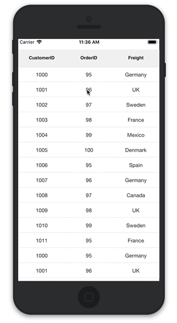

# Grid Events

## GridTapped event

The event will be triggered whenever you tap the SfDataGrid with [GridTappedEventsArgs](https://help.syncfusion.com/cr/cref_files/xamarin-ios/sfdatagrid/Syncfusion.SfDataGrid.iOS~Syncfusion.SfDataGrid.GridTappedEventsArgs.html) that contains following properties.

* [RowIndex](https://help.syncfusion.com/cr/cref_files/xamarin-ios/sfdatagrid/Syncfusion.SfDataGrid.iOS~Syncfusion.SfDataGrid.GridTappedEventsArgs~RowColumnIndex.html) - Gets the row index of the row on which you tapped
* [ColumnIndex](https://help.syncfusion.com/cr/cref_files/xamarin-ios/sfdatagrid/Syncfusion.SfDataGrid.iOS~Syncfusion.SfDataGrid.GridTappedEventsArgs~RowColumnIndex.html) - Gets the column index of the column on which you tapped
* [RowData](https://help.syncfusion.com/cr/cref_files/xamarin-ios/sfdatagrid/Syncfusion.SfDataGrid.iOS~Syncfusion.SfDataGrid.GridTappedEventsArgs~RowData.html) - Gets the row data of the row on which you tapped

The following code illustrates how to hook the `GridTapped` event and get the row and column details based on where you tapped on SfDataGrid. 


dataGrid.GridTapped += DataGrid_GridTapped;

private void DataGrid_GridTapped(object sender, GridTappedEventsArgs e)
{
    var rowIndex = e.RowColumnIndex.RowIndex;
    var rowData = e.RowData;
    var columnIndex = e.RowColumnIndex.ColumnIndex;
}


## GridDoubleTapped event

The event will be triggered whenever you double tap the SfDataGrid with [GridDoubleTappedEventsArgs](https://help.syncfusion.com/cr/cref_files/xamarin-ios/sfdatagrid/Syncfusion.SfDataGrid.iOS~Syncfusion.SfDataGrid.GridDoubleTappedEventsArgs.html) that contains the following properties. 

* [RowIndex](https://help.syncfusion.com/cr/cref_files/xamarin-ios/sfdatagrid/Syncfusion.SfDataGrid.iOS~Syncfusion.SfDataGrid.GridDoubleTappedEventsArgs~RowColumnIndex.html) - Gets the row index of the row on which you double tapped
* [ColumnIndex](https://help.syncfusion.com/cr/cref_files/xamarin-ios/sfdatagrid/Syncfusion.SfDataGrid.iOS~Syncfusion.SfDataGrid.GridDoubleTappedEventsArgs~RowColumnIndex.html) - Gets the column index of the column on which you double tapped
* [RowData](https://help.syncfusion.com/cr/cref_files/xamarin-ios/sfdatagrid/Syncfusion.SfDataGrid.iOS~Syncfusion.SfDataGrid.GridDoubleTappedEventsArgs~RowData.html) - Gets the row data of the row on which you double tapped

The following code illustrates how to hook the `GridDoubleTapped` event and get the row and column details based on where you double tapped on SfDataGrid.  


dataGrid.GridDoubleTapped += DataGrid_GridDoubleTapped;

private void DataGrid_GridDoubleTapped(object sender, GridDoubleTappedEventsArgs e)
{
    var rowIndex = e.RowColumnIndex.RowIndex;
    var rowData = e.RowData;
    var columnIndex = e.RowColumnIndex.ColumnIndex;
}


## GridLongPressed event

The event will be triggered whenever you long press the SfDataGrid with [GridLongPressedEventsArgs](https://help.syncfusion.com/cr/cref_files/xamarin-ios/sfdatagrid/Syncfusion.SfDataGrid.iOS~Syncfusion.SfDataGrid.GridLongPressedEventsArgs.html) that contains the following properties.

* [RowIndex](https://help.syncfusion.com/cr/cref_files/xamarin-ios/sfdatagrid/Syncfusion.SfDataGrid.iOS~Syncfusion.SfDataGrid.GridLongPressedEventsArgs~RowColumnIndex.html) - Gets the row index of the row on which you long pressed
* [ColumnIndex](https://help.syncfusion.com/cr/cref_files/xamarin-ios/sfdatagrid/Syncfusion.SfDataGrid.iOS~Syncfusion.SfDataGrid.GridLongPressedEventsArgs~RowColumnIndex.html) - Gets the column index of the column on which you long pressed
* [RowData](https://help.syncfusion.com/cr/cref_files/xamarin-ios/sfdatagrid/Syncfusion.SfDataGrid.iOS~Syncfusion.SfDataGrid.GridLongPressedEventsArgs~RowData.html) - Gets the row data of the row on which you long pressed

The following code illustrates how to hook the `GridLongPressed` event and get the row and column details based on where you long pressed on SfDataGrid. 


dataGrid.GridLongPressed += DataGrid_GridLongPressed;

private void DataGrid_GridLongPressed(object sender, GridLongPressedEventsArgs e)
{
    var rowIndex = e.RowColumnIndex.RowIndex;
    var rowData = e.RowData;
    var columnIndex = e.RowColumnIndex.ColumnIndex;
}


## GridViewCreated event

The event will be triggered once the [SfDataGrid.View](https://help.syncfusion.com/cr/cref_files/xamarin-ios/sfdatagrid/Syncfusion.SfDataGrid.iOS~Syncfusion.SfDataGrid.SfDataGrid~View.html) is created. You can give any operation in this event if it needs to happen once the `SfDataGrid.View` is created by handling [GridViewCreatedEventArgs](https://help.syncfusion.com/cr/cref_files/xamarin-ios/sfdatagrid/Syncfusion.SfDataGrid.iOS~Syncfusion.SfDataGrid.GridViewCreatedEventArgs.html).

The following code illustrates how to hook the `GridViewCreated` event and how to set alternate row colors in SfDataGrid.


dataGrid.GridViewCreated += DataGrid_GridViewCreated;

private void DataGrid_GridViewCreated(object sender, GridViewCreatedEventArgs e)
{
    (sender as SfDataGrid).GridStyle = new CustomGridStyle();   
}

internal class CustomGridStyle : DataGridStyle
{
    public override UIColor GetAlternatingRowBackgroundColor()
    {
        return UIColor.Purple;
    }
}


## GridLoaded event

The event will be triggered once the components in the SfDataGrid are initialized and rendered. You can give any operation in this event if it needs to happen once the grid is loaded by handling [GridLoadedEventArgs](https://help.syncfusion.com/cr/cref_files/xamarin-ios/sfdatagrid/Syncfusion.SfDataGrid.iOS~Syncfusion.SfDataGrid.GridLoadedEventArgs.html).

The following code illustrates how to hook the `GridLoaded` event and how to show the `UIActivityIndicatorView` until the grid comes to view.


dataGrid.GridLoaded += DataGrid_GridLoaded;

private void DataGrid_GridLoaded(object sender, GridLoadedEventArgs e)
{
    UIActivityIndicatorView indicator = new UIActivityIndicatorView();
    this.View.AddSubview(indicator);
    indicator.Frame = new CoreGraphics.CGRect(0,0,this.View.Frame.Width, this.View.Frame.Height);
    indicator.StartAnimating();
    await Task.Delay(2000);
    indicator.StopAnimating();      
}


## Create custom context menu using grid events

SfDataGrid allows to display any custom view like a context menu that can act similar to a pop using the `GridLongPressed` event and the `GridTapped` event.

To create a custom context menu using grid events, follow the code example:

//Creating custom View for Context Menu

public class ContextMenu:UIView
{       
    public ContextMenu()
    {
       
    }

    public override void LayoutSubviews()
    {
        base.LayoutSubviews(); 
        this.Subviews[0].Frame=new CoreGraphics.CGRect(0,0,this.Frame.Width,(this.Frame.Height/2)-5);
        this.Subviews[1].Frame = new CoreGraphics.CGRect(0, (this.Frame.Height/2)+ 5, this.Frame.Width, (this.Frame.Height / 2) - 5);
    }
}



public class MyViewController:UIViewController
{
    SfDataGrid dataGrid;
    ViewModel viewModel;
    UIButton sortButton;
    UIButton clearSortButton;
    ContextMenu contextMenu;
    private bool isContextMenuDisplayed = false;
    private string currentColumnName;

    public MyViewController()
    {
        dataGrid = new SfDataGrid();
        viewModel = new ViewModel();
        // Creates the view for the Context Menu
        Initialize_ContextMenu();           
    }

    public override void ViewDidLoad()
    {
        base.ViewDidLoad();
        dataGrid.ItemsSource = viewModel.Collection;
        dataGrid.AllowSorting = true;
        dataGrid.ColumnSizer = ColumnSizer.Star;
        dataGrid.GridTapped += DataGrid_GridTapped;
        dataGrid.GridLongPressed += DataGrid_GridLongPressed;
        this.View.AddSubview(dataGrid);
    }

    public void Initialize_ContextMenu()
    {
        contextMenu = new ContextMenu();
        sortButton = new UIButton();
        sortButton.SetTitle("Sort", UIControlState.Normal);
        sortButton.BackgroundColor = UIColor.Black;
        sortButton.SetTitleColor(UIColor.White, UIControlState.Normal);
        sortButton.TouchDown += SortButton_TouchDown;

        clearSortButton = new UIButton();
        clearSortButton.SetTitle("Clear sort", UIControlState.Normal);
        clearSortButton.BackgroundColor = UIColor.Black;
        clearSortButton.SetTitleColor(UIColor.White, UIControlState.Normal);
        clearSortButton.TouchDown += ClearSortButton_TouchDown;

        // A custom view hosting two buttons are now created
        contextMenu.AddSubview(sortButton);
        contextMenu.AddSubview(clearSortButton);
    }

    // Removes the sorting applied to the SfDataGrid
    private void ClearSortButton_TouchDown(object sender, EventArgs e)
    {
        contextMenu.RemoveFromSuperview();
        isContextMenuDisplayed = false;
        dataGrid.SortColumnDescriptions.Clear();
    }

    // Sorts the SfDataGrid data based on the column selected in the context menu
    private void SortButton_TouchDown(object sender, EventArgs e)
    {
        contextMenu.RemoveFromSuperview();
        isContextMenuDisplayed = false;
        dataGrid.SortColumnDescriptions.Clear();
        dataGrid.SortColumnDescriptions.Add(new SortColumnDescription()
        {
            ColumnName = currentColumnName
        });
    }

    private void DataGrid_GridLongPressed(object sender, GridLongPressedEventArgs e)
    {
        if (!isContextMenuDisplayed)
        {
            currentColumnName = dataGrid.Columns[e.RowColumnIndex.ColumnIndex].MappingName;
            var point = dataGrid.RowColumnIndexToPoint(e.RowColumnIndex);
            contextMenu.Frame = new CoreGraphics.CGRect(point.X, point.Y, 80, 80);
            // Display the ContextMenu when the SfDataGrid is long pressed
            this.View.AddSubview(contextMenu);
            isContextMenuDisplayed = true;
        }
        else
        {
            // Hides the context menu when SfDataGrid is long pressed when the context menu is already visible in screen
            contextMenu.RemoveFromSuperview();
            isContextMenuDisplayed = false;
        }
    }

    private void DataGrid_GridTapped(object sender, GridTappedEventArgs e)
    {
        // Hides the context menu when SfDataGrid is tapped anywhere outside the context menu view
        contextMenu.RemoveFromSuperview();
        isContextMenuDisplayed = false;
    }

    public override void ViewDidLayoutSubviews()
    {
        base.ViewDidLayoutSubviews();
        dataGrid.Frame = new CoreGraphics.CGRect(0, 30, this.View.Frame.Width, this.View.Frame.Height);
    }
}


Refer to the following GIF for final rendering on execution of the above code example:

