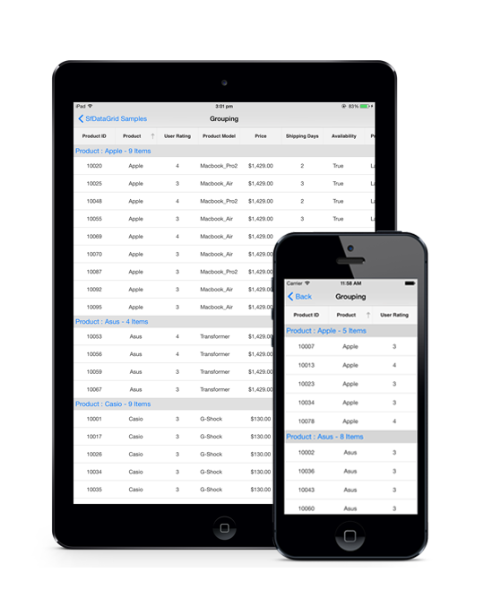
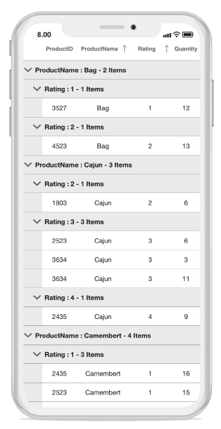
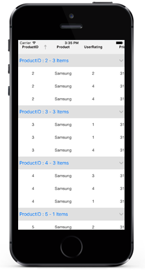

# Grouping 

A group represents a collection of records that belong to a particular category. When grouping is applied, the data is organized into a hierarchical structure based on matching field values. The records having identical values in the grouped column are combined to form a group. Each group is identified by its [CaptionSummaryRow](https://help.syncfusion.com/cr/xamarin-ios/Syncfusion.SfDataGrid.SfDataGrid.html#Syncfusion_SfDataGrid_SfDataGrid_CaptionSummaryRow) to get the underlying records in view.

N> To update grouping for the newly added row or column, set the `SfDataGrid.View.LiveDataUpdateMode` to `LiveDataUpdateMode.AllowDataShaping`.

N> When `BeginInit` method is called it suspends all the updates until `EndInit` method is called.

## Programmatic Grouping

SfDataGrid also allows to perform grouping from the code by defining the [GroupColumnDescription](http://help.syncfusion.com/cr/xamarin-ios/Syncfusion.SfDataGrid.GroupColumnDescription.html) object and adding it in the [SfDataGrid.GroupColumnDescriptions](http://help.syncfusion.com/cr/xamarin-ios/Syncfusion.SfDataGrid.GroupColumnDescriptions.html) collection. SfDataGrid groups the data based on the `GroupColumnDescription` object that is added to this collection.

`GroupColumnDescription` object holds following two properties:

* [ColumnName](https://help.syncfusion.com/cr/xamarin-ios/Syncfusion.SfDataGrid.GroupColumnDescription.html#Syncfusion_SfDataGrid_GroupColumnDescription_ColumnName): Name of the grouped column.
* [Converter](https://help.syncfusion.com/cr/xamarin-ios/Syncfusion.SfDataGrid.GroupColumnDescription.html#Syncfusion_SfDataGrid_GroupColumnDescription_Converter): Get the `IValueConverter` as input that helps to apply the custom grouping.

The following code example illustrates how to apply grouping by a column in SfDataGrid.


    dataGrid.GroupColumnDescriptions.Add (new GroupColumnDescription () {
    ColumnName = "CustomerID",
}); 


The following screenshot shows the output rendered when grouping is applied.

## MultiGrouping

The SfDataGrid also allows to group the data against one or more columns by using the `SfDataGrid.GroupingMode` property. When the `GroupingMode` is set as `GroupingMode.Multiple`, the data will be organized into hierarchical tree structure based on identical values of that column. MultiGrouping feature works similarly as MultiSorting feature. Initially, the data is grouped according to the first column added in the `GroupColumnDescriptions` collection. When more columns are added to the `GroupColumnDescriptions`, the newly added column will be grouped in consideration to the previous group(s). This results in a tree like hierarchy.



this.dataGrid.GroupingMode = GroupingMode.Multiple;



The following screenshot shows the output rendered when above code is executed:

## Indent column customizations

Indent columns are the columns present to the left of the `CaptionSummaryRows` when `GroupingMode` is set as multiple. The number of indent cells in each `CaptionSummaryRow` will be determined by the level of that `Group`. For example, the first group will have only one indent cell and the next immediate group will have an extra indent cell. It keeps on adding by one for each lower level groups to maintain the tree structure. Each data row will have indent cells count equal to the level of the last sub group in view. The following customizations can be done for the indent cells.

### Customize indent column width

By default, the width of the indent column is 20. To customize the width, use the `IndentColumnWidth` property. 



this.dataGrid.IndentColumnWidth = 60;



### Customize indent column background color 

Set background color to the indent cells based on the row where indent cells present. To set the desired background color, use the `GetIndentBackgroundColor()` override method in the custom `DataGridStyle` class. Refer to this [link](https://help.syncfusion.com/xamarin-android/sfdatagrid/styles) to know how to apply custom styles to the SfDataGrid. 



this.dataGrid.GridStyle = new CustomStyle();

public class CustomStyle : DataGridStyle
{
    public override UIColor GetIndentBackgroundColor(RowType rowType)
    {
       if (rowType == RowType.DefaultRow)
           return UIColor.Orange;
       if (rowType == RowType.CaptionCoveredRow)
           return UIColor.Blue;
       else return UIColor.LightGray;
    }
}



The following screenshot shows the output rendered when above code is executed:

## Expand groups while grouping
 
You can expand all the groups while grouping by setting [SfDataGrid.AutoExpandGroups](https://help.syncfusion.com/cr/xamarin-ios/Syncfusion.SfDataGrid.SfDataGrid.html#Syncfusion_SfDataGrid_SfDataGrid_AutoExpandGroups) to `true`. So, when user group any column, then all groups will be in expanded state. 


this.dataGrid.AutoExpandGroups = true;
this.dataGrid.AllowGroupExpandCollapse = true;


## Expand or collapse the groups

By default, the groups will be in expanded state in a SfDataGrid. However, you can expand or collapse a group in runtime by setting the [SfDataGrid.AllowGroupExpandCollapse](https://help.syncfusion.com/cr/xamarin-ios/Syncfusion.SfDataGrid.SfDataGrid.html#Syncfusion_SfDataGrid_SfDataGrid_AllowGroupExpandCollapse) as `true`.


this.dataGrid.AllowGroupExpandCollapse = true;


### Expand or collapse all the groups

You can expand or collapse all the groups at programmatically at runtime by using [SfDataGrid.ExpandAllGroup](https://help.syncfusion.com/cr/xamarin-ios/Syncfusion.SfDataGrid.SfDataGrid.html#Syncfusion_SfDataGrid_SfDataGrid_ExpandAllGroup) and [SfDataGrid.CollapseAllGroup](https://help.syncfusion.com/cr/xamarin-ios/Syncfusion.SfDataGrid.SfDataGrid.html#Syncfusion_SfDataGrid_SfDataGrid_CollapseAllGroup) methods.



this.dataGrid.ExpandAllGroup();
this.dataGrid.CollapseAllGroup();



### Expand or collapse a specific group

You can expand or collapse specific group by using [SfDataGrid.ExpandGroup](https://help.syncfusion.com/cr/xamarin-ios/Syncfusion.SfDataGrid.SfDataGrid.html#Syncfusion_SfDataGrid_SfDataGrid_ExpandGroup_Syncfusion_Data_Group_) and [SfDataGrid.CollapseGroup](https://help.syncfusion.com/cr/xamarin-ios/Syncfusion.SfDataGrid.SfDataGrid.html#Syncfusion_SfDataGrid_SfDataGrid_CollapseGroup_Syncfusion_Data_Group_) methods.


var group = (dataGrid.View.Groups[0] as Group);
this.dataGrid.ExpandGroup(group);
this.dataGrid.CollapseGroup(group);


## Custom Grouping

SfDataGrid allows you to group a column based on custom logic when the standard grouping techniques do not meet the requirements. To achieve the custom grouping, you need to write a converter that implements `IValueConverter` with your custom grouping logic and assign that converter to the [GroupColumnDescription.Converter](https://help.syncfusion.com/cr/xamarin-ios/Syncfusion.SfDataGrid.GroupColumnDescription.html#Syncfusion_SfDataGrid_GroupColumnDescription_Converter) property.

The following code example illustrates how to set the custom grouping converter for the group description that is added to group the Freight column.


dataGrid.GroupColumnDescriptions.Add (new GroupColumnDescription () {
    ColumnName = "Freight",
    Converter = new GroupConverter()
}); 


The following code example illustrates the converter used for applying custom grouping logic.


public class GroupConverter : IValueConverter
{
    public GroupConverter()
    {
        
    }

    public object Convert(object value, Type targetType, object parameter, CultureInfo culture)
    {
        var orderInfo = value as OrderInfo;
        if (orderInfo.Freight > 0 && orderInfo.Freight <= 250)
            return "<=250";
        else if (orderInfo.Freight > 250 && orderInfo.Freight <= 500)
            return ">250 & <=500";
        else if (orderInfo.Freight > 500 && orderInfo.Freight <= 750)
            return ">500 & <=750";
        else
            return ">1000";
    }

    public object ConvertBack(object value, Type targetType, object parameter, CultureInfo culture)
    {
        return null;
    }
}


## Display based grouping using group mode property

By default column grouping occurs based on the value in the underlying collection thereby creating a new group for each new value of that column. However you can also group a column based on the Display value by setting the [GridColumn.GroupMode](https://help.syncfusion.com/cr/xamarin-ios/Syncfusion.SfDataGrid.GridColumn.html#Syncfusion_SfDataGrid_GridColumn_GroupMode) property as `Display`. In the below code example we have set [GridColumn.Format](https://help.syncfusion.com/cr/xamarin-ios/Syncfusion.SfDataGrid.GridColumn.html#Syncfusion_SfDataGrid_GridColumn_Format) property as "#" which displays only the rounded off value in the `GridCell`.  


GridNumericColumn cargoWeight = new GridTextColumn();
cargoWeight.MappingName = "ShipmentWeight";
cargoWeight.GroupMode = Syncfusion.Data.DataReflectionMode.Display;
cargoWeight.Format = "#";
 

The below screenshot shows the comparison between the two Group modes. GroupMode.Value on the left and GroupMode.Display on the right.

## Clearing or removing a group

To clear grouping applied to SfDataGrid, remove the items from the `SfDataGrid.GroupColumnDescriptions` collection or clear the collection.
 
Refer to the following code snippets to remove grouping applied:


public class MyViewController:UIViewController
{
    SfDataGrid dataGrid;
    ViewModel viewModel;
    UIButton clearGroupingButton;
    UIStackView stackView;
    public MyViewController()
    {
        dataGrid = new SfDataGrid();
        viewModel = new ViewModel();
        clearGroupingButton = new UIButton();
        stackView = new UIStackView();
    }

    public override void ViewDidLoad()
    {
        base.ViewDidLoad();
        dataGrid.ItemsSource = viewModel.OrdersInfo; 
        dataGrid.GroupColumnDescriptions.Add(new GroupColumnDescription()
        {
            ColumnName = "Freight",
        });
        stackView.Axis = UILayoutConstraintAxis.Vertical;
        clearGroupingButton.SetTitle("Remove Grouping", UIControlState.Normal);
        clearGroupingButton.BackgroundColor=UIColor.White;
        clearGroupingButton.SetTitleColor(UIColor.Black, UIControlState.Normal);
        clearGroupingButton.TouchDown += ClearGroupingButton_TouchDown;
        clearGroupingButton.HeightAnchor.ConstraintEqualTo(200).Active = true;
        dataGrid.HeightAnchor.ConstraintEqualTo(600).Active=true;
        stackView.AddArrangedSubview(removeGroupingButton);
        stackView.AddArrangedSubview(dataGrid);
        this.View.AddSubview(stackView);
    }

    private void ClearGroupingButton_TouchDown(object sender, System.EventArgs e)
    {
        //Clearing the Group
        dataGrid.GroupColumnDescriptions.Clear();

        //Removing the Group based on group item
        //var groupColumn = dataGrid.GroupColumnDescriptions[0];
        //dataGrid.GroupColumnDescriptions.Remove(groupColumn);
        
        //Removing the Group based on group index
        //dataGrid.GroupColumnDescriptions.RemoveAt(0);
    }

    public override void ViewDidLayoutSubviews()
    {
        stackView.Frame = new CGRect(0, 30, this.View.Frame.Width, this.View.Frame.Height);
        base.ViewDidLayoutSubviews();
    }
}


Run the application to render the following output: 

N> You can also clear or remove the grouping on [GridTapped event](https://help.syncfusion.com/cr/xamarin-ios/Syncfusion.SfDataGrid.SfDataGrid.html), [GridDoubleTapped event](https://help.syncfusion.com/cr/xamarin-ios/Syncfusion.SfDataGrid.SfDataGrid.html), or [GridLongPressed event](https://help.syncfusion.com/cr/xamarin-ios/Syncfusion.SfDataGrid.SfDataGrid.html).

## Events

### GroupExpanding event

The [SfDataGrid.GroupExpanding](https://help.syncfusion.com/cr/xamarin-ios/Syncfusion.SfDataGrid.SfDataGrid.html) event occurs when the group is being expanded.
 
The [GroupChangingEventArgs](http://help.syncfusion.com/cr/xamarin-ios/Syncfusion.SfDataGrid.GroupChangingEventArgs.html) of the `GroupExpanding` event provides the information about the expanding group and it has the following members.

[Syncfusion.Data.Group](https://help.syncfusion.com/cr/xamarin-ios/Syncfusion.SfDataGrid.GroupChangingEventArgs.html#Syncfusion_SfDataGrid_GroupChangingEventArgs_Group) - Gets the group that’s being expanded.

[Cancel](https://msdn.microsoft.com/query/dev10.query?appId=Dev10IDEF1&l=EN-US&k=k(System.ComponentModel.CancelEventArgs.Cancel)&rd=true) – Decides whether to cancel the group expansion.
 
You can cancel the group expansion by setting `GroupChangingEventArgs.Cancel` to `true`.


this.dataGrid.GroupExpanding += dataGrid_GroupExpanding;

void dataGrid_GroupExpanding(object sender, Syncfusion.SfDataGrid.GroupChangingEventArgs e)
{
    if (e.Group.Key.Equals(1001))    
        e.Cancel = true;    
}       


### GroupExpanded event

The [SfDataGrid.GroupExpanded](https://help.syncfusion.com/cr/xamarin-ios/Syncfusion.SfDataGrid.SfDataGrid.html) event occurs after the group is expanded.

The [GroupChangedEventArgs](http://help.syncfusion.com/cr/xamarin-ios/Syncfusion.SfDataGrid.GroupChangedEventArgs.html) of the `GroupExpanded` event provides the information about the expanded group and it has the following member.

[Syncfusion.Data.Group](https://help.syncfusion.com/cr/xamarin-ios/Syncfusion.SfDataGrid.GroupChangedEventArgs.html#Syncfusion_SfDataGrid_GroupChangedEventArgs_Group) - Gets the expanded group.

### GroupCollapsing event 

The [SfDataGrid.GroupCollapsing](https://help.syncfusion.com/cr/xamarin-ios/Syncfusion.SfDataGrid.SfDataGrid.html) event occurs when the group is being collapsed.

The `GroupChangingEventArgs` of the `GroupCollapsing` event provides the information about the collapsing group and it contains the following member.

`Syncfusion.Data.Group` - Gets the group that’s being collapsed.

`Cancel` – Decides whether to cancel the group collapsing.

You can cancel the group is being collapsed by using `GroupChangingEventArgs.Cancel` of `GroupCollapsing` event.


this.dataGrid.GroupCollapsing += dataGrid_GroupCollapsing;

void dataGrid_GroupCollapsing(object sender, Syncfusion.SfDataGrid.GroupChangingEventArgs e)
{
    if (e.Group.Key.Equals(1001))    
        e.Cancel = true;    
}


### GroupCollapsed event
 
The [SfDataGrid.GroupCollapsed](https://help.syncfusion.com/cr/xamarin-ios/Syncfusion.SfDataGrid.SfDataGrid.html) event occurs after the group is collapsed.
 
`GroupChangedEventArgs` of the `GroupCollapsed` event  provides the information about collapsed group and it contains the following member.

`Syncfusion.Data.Group` - Gets the collapsed group.

## Animate group expand/collapse icon

SfDatagrid loads two different icons for denoting the group expanded and collapsed state. However, SfDataGrid allows you to rotate the expander icon animatedly for denoting the collapsed status by overriding the `DataGridStyle.GetGroupCollapseIcon` method and returning `null`.

The below code example illustrates how to enable the group/expand collapse icons animation by writing a custom style. 




//Apply custom style to SfDataGrid from code 

dataGrid.GridStyle = new CustomStyle ();

//Custom Style class

public class CustomStyle : DataGridStyle
{ 
   public CustomStyle ()
   {
       
   }
   public override ImageSource GetGroupCollapseIcon()
   {
       return null;
   }
}




## Hiding the column when grouped

In SfDataGrid a column will be generated with the default column width by default. In order to group by a column that should not be visible in view, add the column to the [SfDataGrid.Columns](https://help.syncfusion.com/cr/xamarin/Syncfusion.SfDataGrid.XForms.SfDataGrid.html#Syncfusion_SfDataGrid_XForms_SfDataGrid_Columns) collection and set its width as 0. Thus the column will be grouped and will not be visually seen. Please refer the below code example.


dataGrid.Columns.Add (new GridTextColumn () { 
    MappingName = "ShippingDate",
    Width = 0
});

dataGrid.GroupColumnDescriptions.Add (new GroupColumnDescription () { 
    ColumnName = "ShippingDate"
});

