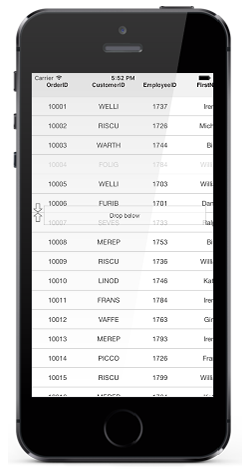
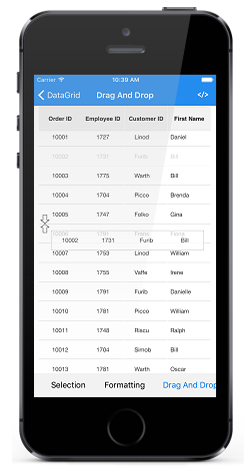

# Row Drag and Drop

SfDataGrid allows you to drag and drop a row by setting the `SfDataGrid.AllowDraggingRow` property to `true`. A Customizable row drag and drop template is displayed  while dragging a row. The drag and drop operation can be handled based on the requirement using `SfDataGrid.QueryRowDragging` event. 

The following code example illustrates how to enable row drag and drop in SfDataGrid.


sfGrid.AllowDraggingRow = true;


## Dragging scenarios

SfDataGrid allows you to perform the drag and drop operation with both the data rows and groups.

* Records can be reordered to any position with auto scrolling.
* Groups position can be reordered using drag and drop. But no groups can be added inside other groups. 
* Data rows can be reordered within the same group or into the other groups as well. 

N> Reordering changes are made only in `SfDataGrid.View` and not in the underlying data. Thus the changes will be reverted when performing sorting, grouping or any other operation that refreshes the view. Reordering underlying data can be achieved by handling `QueryRowDragging` event in the sample side as explained below in [Reordering underlying data](# Reordering underlying data ).

## Row drag and drop template

SfDataGrid allows you to load a desired content when performing row drag and drop operation using the `SfDataGrid.RowDragDropTemplate`. 

## Default template

Default template will be loaded, if template is not explicitly assigned for row drag and drop operations. 

## Customizing row drag and drop template

You can load any type of custom view inside `SfDataGrid.RowDragDropTemplate` based on your application’s  requirement.

Refer the following code example that shows how to load row like view in template.



//Assigning custom view to row drag and drop template.
sfGrid.RowDragDropTemplate = new RowDragDropTemplate(context);




//Row template a custom view which represent row.

public class RowDragDropTemplate : UIView
{
    #region Field

    UILabel label1;
    UILabel label2;
    UILabel label3;
    UILabel label4;

    #endregion

    #region Constructor 

    public RowDragDropTemplate()
    {
        label1 = new UILabel() { TextAlignment = UITextAlignment.Center, TextColor = UIColor.Black, LineBreakMode = UILineBreakMode.TailTruncation, Font = UIFont.FromName("HelveticaNeue", 12) };
        label2 = new UILabel() { TextAlignment = UITextAlignment.Center, TextColor = UIColor.Black, LineBreakMode = UILineBreakMode.TailTruncation, Font = UIFont.FromName("HelveticaNeue", 12) };
        label3 = new UILabel() { TextAlignment = UITextAlignment.Center, TextColor = UIColor.Black, LineBreakMode = UILineBreakMode.TailTruncation, Font = UIFont.FromName("HelveticaNeue", 12) };
        label4 = new UILabel() { TextAlignment = UITextAlignment.Center, TextColor = UIColor.Black, LineBreakMode = UILineBreakMode.TailTruncation, Font = UIFont.FromName("HelveticaNeue", 12) };

        this.AddSubview(label1);
        this.AddSubview(label2);
        this.AddSubview(label3);
        this.AddSubview(label4);

        this.Layer.MasksToBounds = true;
        this.Layer.AllowsEdgeAntialiasing = true;
        this.Layer.BorderWidth = 0.25f;
        this.Layer.BorderColor = UIColor.Black.CGColor;
    }

    #endregion

    #region Method

    public void UpdateRow(object rowData)
    {
        try
        {
            var orderInfo = rowData as OrderInfo;
            label1.Text = orderInfo.OrderID;
            label2.Text = orderInfo.EmployeeID;
            label3.Text = orderInfo.CustomerID;
            label4.Text = orderInfo.FirstName;
        }
        catch { }
    }

    public override void LayoutSubviews()
    {
        base.LayoutSubviews();
        label1.Frame = new CGRect(0, 0, this.Frame.Width / 4, this.Frame.Height);
        label2.Frame = new CGRect(this.Frame.Width / 4, 0, this.Frame.Width / 4, this.Frame.Height);
        label3.Frame = new CGRect((this.Frame.Width / 4) * 2, 0, this.Frame.Width / 4, this.Frame.Height);
        label4.Frame = new CGRect((this.Frame.Width / 4) * 3, 0, this.Frame.Width / 4, this.Frame.Height);
    }

    #endregion
}



## Row drag and drop event

`QueryRowDragging` event is fired upon starting to drag a row and will be continuously fired till the dragging ends. By handing the `SfDataGrid.QueryRowDragging` event you can also cancel the dragging of a particular row.

The `QueryRowDragging` event provides following properties in `QueryRowDraggingEventArgs`:

* `From` – Returns the index of the row currently being dragged.
* `To` – Returns the dragging index where you try to drop the row. 
* `Reason` – Returns row dragging details as `QueryRowDraggingReason`.
* `RowData` – Returns the underlying data associated with the dragged row.
* `CurrentRowData`  – Returns the corresponding row data, over which the row drag view is currently placed.
* [Cancel](https://msdn.microsoft.com/en-us/library/system.componentmodel.canceleventargs_properties(v=vs.110).aspx) – A Boolean property to cancel the event.

## Disable dragging for particular row

Dragging can be disabled for a particular row by handling the `QueryRowDragging` event using conditions based on `QueryRowDraggingReason`. Refer following code sample to disable dragging for particular row.



private void SfGrid_QueryRowDragging(object sender, QueryRowDraggingEventArgs e)
{
    //e.From returns the index of the dragged row.
    //e.Reason returns the dragging status of the row.
    if (e.From == 1 && e.Reason == QueryRowDraggingReason.DragStarted)
        e.Cancel = true;
}



## Disable dropping when dragging over particular rows

Dropping can be disabled for particular rows while dragging a row.Refer following code sample to cancel dropping of particular row.



private void SfGrid_QueryRowDragging(object sender, QueryRowDraggingEventArgs e)
{
    //e.To returns the index of the current row.
    //e.Reason returns the dragging status of the row.
    if ((e.To > 5 || e.To < 10) &&
    (e.Reason == QueryRowDraggingReason.DragEnded || e.Reason == QueryRowDraggingReason.Dragging))
        e.Cancel = true;
}



## Disable dropping of particular row 

Dropping can be canceled for particular row by handling `QueryRowDragging` event using conditions based on `QueryRowDraggingReason`. Refer following code sample to cancel dropping of particular row.



private void SfGrid_QueryRowDragging(object sender, QueryRowDraggingEventArgs e)
{
    //e.From returns the index of the dragged row.
    //e.Reason returns the dragging status of the row.
    if (e.From == 1 && e.Reason == QueryRowDraggingReason.DragEnded)
        e.Cancel = true;
}



## Disable dropping at a particular position

Dropping at a particular position can be canceled by handling `QueryRowDragging` event using conditions based on `QueryRowDraggingReason`. Refer following code sample to cancel dropping at particular position.



private void SfGrid_QueryRowDragging(object sender, QueryRowDraggingEventArgs e)
{
    //e.To returns the index of the current row.
    //e.Reason returns the dragging status of the row.
    if ((e.To == 5 || e.To == 7) && e.Reason == QueryRowDraggingReason.DragEnded)
        e.Cancel = true;
}



## Reorder the underlying data

Reordering changes directly on the underlying data can be done by handling `QueryRowDragging` event using conditions based on `QueryRowDraggingReason`. Refer following code sample to make permanent reordering changes.



private void SfGrid_QueryRowDragging(object sender, QueryRowDraggingEventArgs e)
{
    //e.To returns the index of the current row.
    //e.From returns the index of the dragged row.
    if (e.Reason == QueryRowDraggingReason.DragEnded)
    {
        var collection = (sender as SfDataGrid).ItemsSource as IList;
        collection.RemoveAt(e.From - 1);
        collection.Insert(e.To - 1, e.RowData);
    }
}



## Drop a grid row in the last position

The `To` property of the `QueryRowDraggingEventArgs` denotes the current drop index of the dragged row, it returns the same index when you drop a row at last position or last but one. In order to track the row programmatically whether it is dropped at the last position, SfDataGrid provides the `Position` property which denotes the position of the RowDragView.

Refer the following code example in which the `Position` property is used to determine whether the row is dropped in the last position.



private void SfGrid_QueryRowDragging(object sender, QueryRowDraggingEventArgs e)
{
    var totalHeight = dataGrid.RowColumnIndexToPoint(new RowColumnIndex(viewModel.OrdersInfo.Count,0)).Y + this.dataGrid.RowHeight;
    if (e.Reason == QueryRowDraggingReason.DragEnded)
    {
        if (Math.Ceiling(e.Position.Y + (dataGrid.RowHeight)) > totalHeight && e.To == viewModel.OrdersInfo.Count)
        {
            // Will hit if the row is dropped at the last position                 
            UIAlertView alert = new UIAlertView("RowDragAndDrop info", "The row is dropped at the last position", null, "OK");
            alert.Show();     
        }
    }
}


