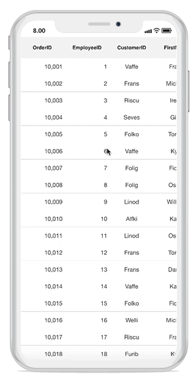
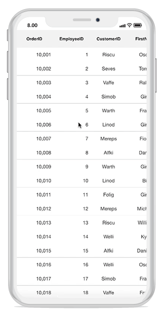

# Scrolling 

## Scrolling mode

The DataGrid provides three types of scrolling modes customized using the [SfDataGrid.ScrollingMode](https://help.syncfusion.com/cr/xamarin-ios/Syncfusion.SfDataGrid.SfDataGrid.html#Syncfusion_SfDataGrid_SfDataGrid_ScrollingMode) property. By default, the SfDataGrid will scroll its content based on pixel values.

* [PixelLine](http://help.syncfusion.com/cr/xamarin-ios/Syncfusion.SfDataGrid.ScrollingMode.html)
* [Line](http://help.syncfusion.com/cr/xamarin-ios/Syncfusion.SfDataGrid.ScrollingMode.html)
* [Pixel](http://help.syncfusion.com/cr/xamarin-ios/Syncfusion.SfDataGrid.ScrollingMode.html)

### PixelLine

The `ScrollingMode.PixelLine` allows scrolling its contents like an Excel sheet: whenever a row or a column is clipped at the top, a particular row or column will be auto scrolled to display fully in view.


dataGrid.ScrollingMode = ScrollingMode.PixelLine; 


### Line

The `ScrollingMode.Line` allows scrolling its contents based on lines: the view will be updated only when the offset values reach the origin of a row or column in the bound collection.


dataGrid.ScrollingMode = ScrollingMode.Line; 


### Pixel

The `ScrollingMode.Pixel` allows scrolling its contents based on pixel values: the view will be updated each pixel change of the offsets and rows or columns will appear clipped when offset exceeds the origin of the row or column.


dataGrid.ScrollingMode = ScrollingMode.Pixel; 


## Programmatic scrolling

The SfDataGrid allows scrolling to a particular row and column index programmatically.

### Scrolling to the row and column index

You can scroll programmatically to a particular row and column using the [SfDataGrid.ScrollToRowColumnIndex](https://help.syncfusion.com/cr/xamarin-ios/Syncfusion.SfDataGrid.SfDataGrid.html#Syncfusion_SfDataGrid_SfDataGrid_ScrollToRowColumnIndex_System_Int32_System_Int32_Syncfusion_SfDataGrid_ScrollToPosition_Syncfusion_SfDataGrid_ScrollToPosition_) method by passing the row and column index.



dataGrid.ScrollToRowColumnIndex(int rowIndex, int columnIndex);

//For example 
dataGrid.ScrollToRowColumnIndex(20, 6);



### Scrolling to the row index

You can scroll programmatically to a particular row using the [SfDataGrid.ScrollToRowIndex](https://help.syncfusion.com/cr/xamarin-ios/Syncfusion.SfDataGrid.SfDataGrid.html#Syncfusion_SfDataGrid_SfDataGrid_ScrollToRowIndex_System_Int32_Syncfusion_SfDataGrid_ScrollToPosition_) method by passing the row index.



dataGrid.ScrollToRowIndex(int rowIndex);

//For example 
dataGrid.ScrollToRowIndex(20);



### Scrolling to the column index

You can scroll programmatically to a particular column using the [SfDataGrid.ScrollToColumnIndex](https://help.syncfusion.com/cr/xamarin-ios/Syncfusion.SfDataGrid.SfDataGrid.html#Syncfusion_SfDataGrid_SfDataGrid_ScrollToColumnIndex_System_Int32_Syncfusion_SfDataGrid_ScrollToPosition_) method by passing the column index.



dataGrid.ScrollToColumnIndex(int columnIndex);

//For example
dataGrid.ScrollToColumnIndex(7);



### Scroll a row/column to a specific position

The SfDataGrid allows to position the scrolled row/column in the datagrid by passing [ScrollToPosition](https://help.syncfusion.com/cr/xamarin-ios/Syncfusion.SfDataGrid.ScrollToPosition.html) as parameter to the `ScrollToRowColumnIndex`, `ScrollToRowIndex`, `ScrollToColumnIndex` methods. The scrolled row/column can take either of the four positions as explained below. The default position is `Start`.

* MakeVisible: Scroll to make a specified row/column visible in datagrid. If the specified row/column is already in view, scrolling will not occur.
* Start: Scroll to make the row/column positioned at the start of the datagrid.
* Center: Scroll to make the row/column positioned at the center of the datagrid.
* End: Scroll to make the row/column positioned at the end of the datagrid. 

Refer the below code snippet to scroll a column/row to a specific position.



// To scroll a column to a particular position,
dataGrid.ScrollToColumnIndex(7,scrollToColumnPosition: ScrollToPosition.Center);

// To scroll a row to a particular position,
dataGrid.ScrollToRowIndex(7,scrollToColumnPosition: ScrollToPosition.Center);

// To scroll a cell to a particular position,
dataGrid.ScrollToRowColumnIndex(7, 7, scrollToColumnPosition: ScrollToPosition.Center, scrollToRowPosition: ScrollToPosition.Center);



N> Programmatic scrolling is not applicable for rows and columns that are frozen in view.

## Vertical Over Scroll Mode

The [SfDataGrid.VerticalOverScrollMode](https://help.syncfusion.com/cr/xamarin-ios/Syncfusion.SfDataGrid.SfDataGrid.html#Syncfusion_SfDataGrid_SfDataGrid_VerticalOverScrollMode) property allows you to customize the bouncing behavior of the data grid.

The [VerticalScrollMode](https://help.syncfusion.com/cr/xamarin-ios/Syncfusion.SfDataGrid.VerticalOverScrollMode.html) enum has the following values:

* Bounce
* None

### Bounce

The `Bounce` mode allows the data grid to have bouncing effect. Default value of `SfDataGrid.VerticalOverScrollMode` is Bounce .

To customize the bouncing effect in the data grid, refer the below code example:



dataGrid.VerticalOverScrollMode = VerticalOverScrollMode.Bounce;



### None

The `None` mode disables the bouncing effect in the data grid.

To customize the bouncing effect in the data grid, refer the below code example:



dataGrid.VerticalOverScrollMode = VerticalOverScrollMode.None;



## Identifying scroll state changes

The SfDataGrid will notify the scrolling state changes via the [ScrollStateChanged](https://help.syncfusion.com/cr/xamarin-ios/Syncfusion.SfDataGrid.SfDataGrid.html) event.

Following states will be notified through the [ScrollState](https://help.syncfusion.com/cr/xamarin-ios/Syncfusion.SfDataGrid.ScrollStateChangedEventArgs.html#Syncfusion_SfDataGrid_ScrollStateChangedEventArgs__ctor_Syncfusion_SfDataGrid_ScrollState_) property in the event argument.

* Dragging: Specifies that `SfDataGrid` is currently being dragged in the view.
* Fling: Specifies that fling action is performed on the `SfDataGrid`.
* Idle: Specifies that `SfDataGrid` is not scrolling currently.
* Programmatic: Specifies that scrolling is performed by using [ScrollToColumnIndex](https://help.syncfusion.com/cr/xamarin-ios/Syncfusion.SfDataGrid.SfDataGrid.html#Syncfusion_SfDataGrid_SfDataGrid_ScrollToColumnIndex_System_Int32_Syncfusion_SfDataGrid_ScrollToPosition_) or [ScrollToRowIndex](https://help.syncfusion.com/cr/xamarin-ios/Syncfusion.SfDataGrid.SfDataGrid.html#Syncfusion_SfDataGrid_SfDataGrid_ScrollToRowIndex_System_Int32_Syncfusion_SfDataGrid_ScrollToPosition_) method.




dataGrid.ScrollStateChanged += DataGrid_ScrollStateChanged;

   private void DataGrid_ScrollStateChanged(object sender, ScrollStateChangedEventArgs e)   
    {                    
      // you can customize your code here.
      var scrollState = e.ScrollState;            
    }




