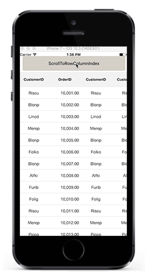
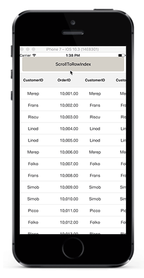

# Scrolling 

## Scrolling mode

The DataGrid provides three types of scrolling modes customized using the [SfDataGrid.ScrollingMode](http://help.syncfusion.com/cr/cref_files/xamarin-ios/Syncfusion.SfDataGrid.iOS~Syncfusion.SfDataGrid.SfDataGrid~ScrollingMode.html) property. By default, the SfDataGrid will scroll its content based on pixel values.

* [PixelLine](http://help.syncfusion.com/cr/cref_files/xamarin-ios/Syncfusion.SfDataGrid.iOS~Syncfusion.SfDataGrid.ScrollingMode.html)
* [Line](http://help.syncfusion.com/cr/cref_files/xamarin-ios/Syncfusion.SfDataGrid.iOS~Syncfusion.SfDataGrid.ScrollingMode.html)
* [Pixel](http://help.syncfusion.com/cr/cref_files/xamarin-ios/Syncfusion.SfDataGrid.iOS~Syncfusion.SfDataGrid.ScrollingMode.html)

### PixelLine

The `ScrollingMode.PixelLine` allows scrolling its contents like an Excel sheet: whenever a row or a column is clipped at the top, a particular row or column will be auto scrolled to display fully in view.


dataGrid.ScrollingMode = ScrollingMode.PixelLine; 


### Line

The `ScrollingMode.Line` allows scrolling its contents based on lines: the view will be updated only when the offset values reach the origin of a row or column in the bound collection.


dataGrid.ScrollingMode = ScrollingMode.Line; 


### Pixel

The `ScrollingMode.Pixel` allows scrolling its contents based on pixel values: the view will be updated each pixel change of the offsets and rows or columns will appear clipped when offset exceeds the origin of the row or column.


dataGrid.ScrollingMode = ScrollingMode.Pixel; 


## Programmatic scrolling

The SfDataGrid allows scrolling to a particular row and column index programmatically.

### Scrolling to the row and column index

You can scroll programmatically to a particular row and column using the [SfDataGrid.ScrollToRowColumnIndex](http://help.syncfusion.com/cr/cref_files/xamarin-ios/Syncfusion.SfDataGrid.iOS~Syncfusion.SfDataGrid.SfDataGrid~ScrollToRowColumnIndex.html) method by passing the row and column index.



dataGrid.ScrollToRowColumnIndex(int rowIndex, int columnIndex);

//For example 
dataGrid.ScrollToRowColumnIndex(20, 6);



### Scrolling to the row index

You can scroll programmatically to a particular row using the [SfDataGrid.ScrollToRowIndex](http://help.syncfusion.com/cr/cref_files/xamarin-ios/Syncfusion.SfDataGrid.iOS~Syncfusion.SfDataGrid.SfDataGrid~ScrollToRowIndex.html) method by passing the row index.



dataGrid.ScrollToRowIndex(int rowIndex);

//For example 
dataGrid.ScrollToRowIndex(20);



### Scrolling to the column index

You can scroll programmatically to a particular column using the [SfDataGrid.ScrollToColumnIndex](http://help.syncfusion.com/cr/cref_files/xamarin-ios/Syncfusion.SfDataGrid.iOS~Syncfusion.SfDataGrid.SfDataGrid~ScrollToColumnIndex.html) method by passing the column index.



dataGrid.ScrollToColumnIndex(int columnIndex);

//For example
dataGrid.ScrollToColumnIndex(7);



## Vertical Over Scroll Mode

The [SfDataGrid.VerticalOverScrollMode](https://help.syncfusion.com/cr/cref_files/xamarin-ios/Syncfusion.SfDataGrid.iOS~Syncfusion.SfDataGrid.SfDataGrid~VerticalOverScrollMode.html) property allows you to customize the bouncing behavior of the data grid.

The [VerticalScrollMode](https://help.syncfusion.com/cr/cref_files/xamarin-ios/Syncfusion.SfDataGrid.iOS~Syncfusion.SfDataGrid.VerticalOverScrollMode.html) enum has the following values:

* Bounce
* None

### Bounce

The `Bounce` mode allows the data grid to have bouncing effect. Default value of `SfDataGrid.VerticalOverScrollMode` is Bounce .

To customize the bouncing effect in the data grid, refer the below code example:



dataGrid.VerticalOverScrollMode = VerticalOverScrollMode.Bounce;



### None

The `None` mode disables the bouncing effect in the data grid.

To customize the bouncing effect in the data grid, refer the below code example:



dataGrid.VerticalOverScrollMode = VerticalOverScrollMode.None;



