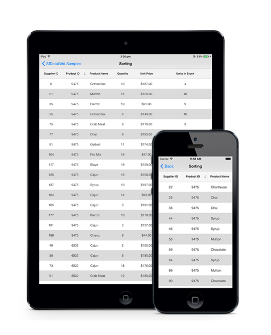
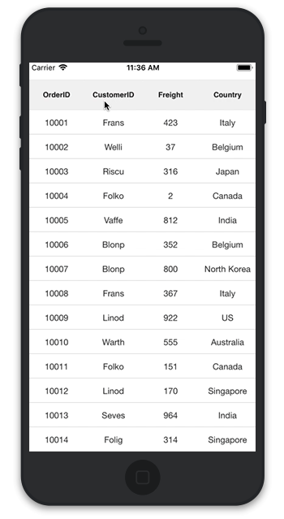

# Sorting 

The SfDataGrid allows applying sorting on its data by setting the [SfDataGrid.AllowSorting](https://help.syncfusion.com/cr/xamarin-ios/Syncfusion.SfDataGrid.SfDataGrid.html#Syncfusion_SfDataGrid_SfDataGrid_AllowSorting) property to `true`. It allows sorting the data adjacent to one or more columns. When sorting is applied, the SfDataGrid automatically rearranges the data to match the current sort criteria. When `SfDataGrid.AllowSorting` is `true`, you can sort the data simply by tapping the column header you wish to sort. Once sorting is applied, the SfDataGrid shows a sort icon in the respective column header indicating the direction of sorting.

N> To update sorting for a newly added row or column, set the `SfDataGrid.View.LiveDataUpdateMode` to `LiveDataUpdateMode.AllowDataShaping`.

## Programmatic sorting

The SfDataGrid also allows performing sorting from the code. This requires you to manually define the [SortColumnDescription](http://help.syncfusion.com/cr/xamarin-ios/Syncfusion.SfDataGrid.SortColumnDescription.html) objects and add it in the [SfDataGrid.SortColumnDescriptions](https://help.syncfusion.com/cr/xamarin-ios/Syncfusion.SfDataGrid.SfDataGrid.html#Syncfusion_SfDataGrid_SfDataGrid_SortColumnDescriptions) collection. The SfDataGrid sorts the data based on the `SortColumnDescription` objects added to this collection.

The `SortColumnDescription` object holds following two properties:

* [ColumnName](https://help.syncfusion.com/cr/xamarin-ios/Syncfusion.SfDataGrid.SortColumnDescription.html#Syncfusion_SfDataGrid_SortColumnDescription_ColumnName): Name of the sorted column.
* [SortDirection](https://help.syncfusion.com/cr/xamarin-ios/Syncfusion.SfDataGrid.SortColumnDescription.html#Syncfusion_SfDataGrid_SortColumnDescription_SortDirection): An object of type ListSortDirection that defines the sorting direction.

The following code example illustrates this.


dataGrid.AllowSorting = true;

dataGrid.SortColumnDescriptions.Add (new SortColumnDescription () {
    ColumnName = "OrderID",
    SortDirection = ListSortDirection.Descending
}); 


The following screenshot shows the sorting functionality in the SfDataGrid.

## Tri-state sorting

In addition to sort the data in ascending or descending order, the SfDataGrid also allows you to unsort the data to the original order by clicking the header again after sorting to descending order by setting the [SfDataGrid.AllowTriStateSorting](https://help.syncfusion.com/cr/xamarin-ios/Syncfusion.SfDataGrid.SfDataGrid.html#Syncfusion_SfDataGrid_SfDataGrid_AllowTriStateSorting) property to `true`. When this property is set, sorting in each column iterates through three sort states; ascending, descending, and unsorted.

The following code example shows how to enable tri-state sorting in the SfDataGrid.


dataGrid.AllowTriStateSorting = true;


## Multi-column sorting

The SfDataGrid allows sorting the data against more than one column by setting the [SfDataGrid.AllowMultiSorting](https://help.syncfusion.com/cr/xamarin-ios/Syncfusion.SfDataGrid.SfDataGrid.html#Syncfusion_SfDataGrid_SfDataGrid_AllowMultiSorting) property to `true`. The number of columns by which the data can be sorted is unlimited. To apply sorting for multiple columns, tap the desired column headers after setting the `SfDataGrid.AllowMultiSorting` property.

The following code example shows how to enable multi-sorting in the SfDataGrid.


dataGrid.AllowMultiSorting = true;


## Sort column in double-click

By default, the column gets sorted when the column header is clicked. You can change this behavior to sort the column by double-clicking by setting the [SfDataGrid.SortTapAction](https://help.syncfusion.com/cr/xamarin-ios/Syncfusion.SfDataGrid.SfDataGrid.html#Syncfusion_SfDataGrid_SfDataGrid_SortTapAction) property as [DoubleTap](http://help.syncfusion.com/cr/xamarin-ios/Syncfusion.SfDataGrid.SortTapAction.html).

The following code example shows how to set `SortTapAction` is `DoubleTap` in the SfDataGrid.



dataGrid.SortTapAction=SortTapAction.DoubleTap;



## Sorting Events

The SfDataGrid provides the following events for the sorting functionality:

* [SortColumnsChanging](https://help.syncfusion.com/cr/xamarin-ios/Syncfusion.SfDataGrid.SfDataGrid.html): Raised while sorting the column at execution time before the column gets sorted. It helps to cancel the sorting action by setting the Cancel property of [DataGridSortColumnsChangingEventArgs](https://help.syncfusion.com/cr/xamarin-ios/Syncfusion.SfDataGrid.SfDataGrid.html).
* [SortColumnsChanged](https://help.syncfusion.com/cr/xamarin-ios/Syncfusion.SfDataGrid.SfDataGrid.html): Raised after the column is sorted.

These two events are triggered with `DataGridSortColumnsChangingEventArgs` and [DataGridSortColumnsChangedEventArgs](http://help.syncfusion.com/cr/xamarin-ios/Syncfusion.SfDataGrid.DataGridSortColumnsChangedEventArgs.html) that contains the following properties.

* [AddedItems](https://help.syncfusion.com/cr/xamarin-ios/Syncfusion.SfDataGrid.DataGridSortColumnsChangedEventArgs.html#Syncfusion_SfDataGrid_DataGridSortColumnsChangedEventArgs_AddedItems): Gets the collection of `SortColumnDescription` objects added to `SfDataGrid.SortColumnDescriptions` collection for sorting.
* [RemovedItems](https://help.syncfusion.com/cr/xamarin-ios/Syncfusion.SfDataGrid.DataGridSortColumnsChangedEventArgs.html#Syncfusion_SfDataGrid_DataGridSortColumnsChangedEventArgs_RemovedItems): Gets the collection of `SortColumnDescription` objects removed from `SfDataGrid.SortColumnDescriptions` collection.

The following code example illustrates how to hook the `SortColumnsChanging` event and cancel the sorting of a column.


dataGrid.SortColumnsChanging += DataGrid_SortColumnsChanging; 



void DataGrid_SortColumnsChanging (object sender, DataGridSortColumnsChangingEventArgs e)
{
    if(e.AddedItems[0].ColumnName == "OrderID")
    {
        e.Cancel = true;
    }
}


## Custom sorting

The SfDataGrid allows sorting columns based on custom logic when the standard sorting techniques do not meet the requirements. For each column, you can apply different sorting criteria by adding `SortComparer` objects to [SfDataGrid.SortComparers](https://help.syncfusion.com/cr/xamarin-ios/Syncfusion.SfDataGrid.SfDataGrid.html#Syncfusion_SfDataGrid_SfDataGrid_SortComparers) collection.

A `SortComparer` object has the following properties:

* PropertyName: Defines the [MappingName]() of the column that applies custom sorting.
* Comparer: Gets or sets the custom comparer that implements the `IComparer` and `ISortDirection interfaces.

The following code example illustrates how to perform custom sorting for FirstName column based on the string length of the names.


dataGrid.SortComparers.Add (new SortComparer () {
    PropertyName = "FirstName",
    Comparer = new CustomComparer()
});

dataGrid.SortColumnDescriptions.Add (new SortColumnDescription () {
    ColumnName = "FirstName",
    SortDirection = ListSortDirection.Descending
}); 


The following code example illustrates how to write a Custom Comparer.


public class CustomComparer : IComparer<Object>, ISortDirection
{
    public int Compare(object x, object y)
    {
        int nameX;
        int nameY;

        //For OrderInfo type data
        if (x.GetType () == typeof(OrderInfo)) {
            //Calculating the length of FirstName in OrderInfo objects
            nameX = ((OrderInfo)x).FirstName.Length;
            nameY = ((OrderInfo)y).FirstName.Length;
        }

        //For Group type data                                   
        else if (x.GetType () == typeof(Group)) {
            //Calculating the group key length
            nameX = ((Group)x).Key.ToString ().Length;
            nameY = ((Group)y).Key.ToString ().Length;
        } else {
            nameX = x.ToString ().Length;
            nameY = y.ToString ().Length;
        }

        // Objects are compared and return the SortDirection
        if (nameX.CompareTo (nameY) > 0)
            return SortDirection == ListSortDirection.Ascending ? 1 : -1;
        else if (nameX.CompareTo (nameY) == -1)
            return SortDirection == ListSortDirection.Ascending ? -1 : 1;
        else
            return 0; 
    }

    //Gets or sets the SortDirection value
    public ListSortDirection SortDirection { get; set; }
}


## Animate sorting icons

The SfDatagrid loads two different icons for denoting the `Ascending` and `Descending` sort direction states. However, the SfDataGrid allows rotating the `DataGridStyle.GetHeaderSortIndicatorUp` icon animatedly for denoting the descending state by overriding the `DataGridStyle.GetHeaderSortIndicatorDown` method and returning `null`.

The following code example illustrates how to enable the sorting icons animation by writing a custom style. 




//Apply custom style to SfDataGrid from code 

dataGrid.GridStyle = new CustomStyle ();

//Custom Style class

public class CustomStyle : DataGridStyle
{ 
   public CustomStyle ()
   {
       
   }
   public override ImageSource GetHeaderSortIndicatorDown()
   {
       return null;
   }
}




## How to disable sorting for an individual column

The SfDataGrid allows disabling the sorting for an individual columns by using the [GridColumn.AllowSorting](https://help.syncfusion.com/cr/xamarin-ios/Syncfusion.SfDataGrid.SfDataGrid.html#Syncfusion_SfDataGrid_SfDataGrid_AllowSorting) property. The default value of this property is `true` so, all the columns in the [SfDataGrid.Columns](https://help.syncfusion.com/cr/xamarin-ios/Syncfusion.SfDataGrid.SfDataGrid.html#Syncfusion_SfDataGrid_SfDataGrid_Columns) collection can be sorted when `SfDataGrid.AllowSorting` is set to `true`.

To disable sorting for an individual column, follow the code example.

### For auto generated column


public MyViewController()
{
    dataGrid = new SfDataGrid();
    viewModel = new ViewModel();
}

public override void ViewDidLoad()
{
    base.ViewDidLoad();
    dataGrid.ItemsSource = viewModel.OrdersInfo; 
    dataGrid.AllowSorting = true;
    dataGrid.AutoGeneratingColumn += DataGrid_AutoGeneratingColumn;
    this.View.AddSubview(dataGrid);
}

private void DataGrid_AutoGeneratingColumn(object sender, AutoGeneratingColumnEventArgs e)
{
    // Sorting will not be done for the Freight column
    if (e.Column.MappingName == "Freight")
        e.Column.AllowSorting = false;
}

public override void ViewDidLayoutSubviews()
{
    dataGrid.Frame = new CGRect(0, 30, this.View.Frame.Width, this.View.Frame.Height);
    base.ViewDidLayoutSubviews();
}


### For manually defined column


public MyViewController()
{
    dataGrid = new SfDataGrid();
    viewModel = new ViewModel();
}

public override void ViewDidLoad()
{
    base.ViewDidLoad();
    dataGrid.ItemsSource = viewModel.OrdersInfo; 
    dataGrid.AutoGenerateColumns = false;
    dataGrid.AllowSorting = true;
    dataGrid.Columns.Add(new GridTextColumn() { MappingName = "OrderID" });
    // Sorting will not be done for the Freight column
    dataGrid.Columns.Add(new GridTextColumn() { MappingName = "Freight", AllowSorting = false });
    dataGrid.Columns.Add(new GridTextColumn() { MappingName = "Country" });
    this.View.AddSubview(dataGrid);
}

public override void ViewDidLayoutSubviews()
{
    dataGrid.Frame = new CGRect(0, 30, this.View.Frame.Width, this.View.Frame.Height);
    base.ViewDidLayoutSubviews();
}
