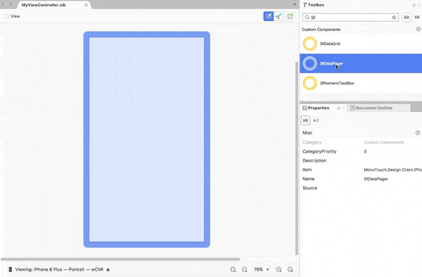

# Renderer the SfDataGrid on StoryBoard

This section explains how to renderer the SfDataGrid on StoryBoard

## This following steps will illustrates how to use SfDataGrid on StoryBoard

1. Create a new StoryBoard

2. Drag SfDataGrid from ToolBox and Drop into StoryBoard 

3. Preview for SfDataGrid will be shown

4. Set the ItemSource for SfDataGrid in Code behind.

5. Place the cursor on SfDataGrid and go to Properties window.

6. Set the needed properties in Properties window.

7. Ensure the behaviour

The following demo illustrates renderer the SfDataGrid on StoryBoard.

# how to use property of sfDatagrid on StoryBoard

This section explains how to use property of SfDataGrid on StoryBoard.

The following steps will illustrates how to set property of SfDataGrid and SfDataPager on StoryBoard:

1. As discussed above, place the cursor on SfDataGrid set Identity name as sfgrid for SfDataGrid and set AutoGenerateColumns as true by enabling the checkbox.

2. Place the cursor on SfDataPager set Identity name as sfpager for SfDataPager and set Page Count as 5 , Page Size as 15, Numeric Button Count as 5, Page Index as 0.

3. Set the Source for sfpager in Code Behind. 

4. Set the ItemSource for sfgrid in Code Behind.

5. Ensure the behaviour.

The following code illustrates to set ItemSource for SfDataGrid and Source for SfDataPager in code behind.




namespace GridIniOS
{
public partial class MyViewController : UIViewController
{
ViewModel viewModel;
public MyViewController() : base("MyViewController",null)
{
}
public override void ViewDidLoad()
{
 base.ViewDidLoad();
 // Perform any additional setup loading the view, typically from a nib.
 viewModel = new ViewModel();
 sfpager.Source = viewModel.OrdersInfo;
 sfgrid.ItemSource = sfpager.PagedSource;
}
public override void DidReceiveMemoryWarning()
{
base.DidReceiveMemoryWarning();
// Release any cached data, images, etc that aren't in use.
}
}
}





You can download the entire source code of this demo for Xamarin.iOS from [here](http://www.syncfusion.com/downloads/support/directtrac/general/ze/custom_designer_sfdatagrid_ios-764618167).
This is how the final output will look like on iOS devices.

