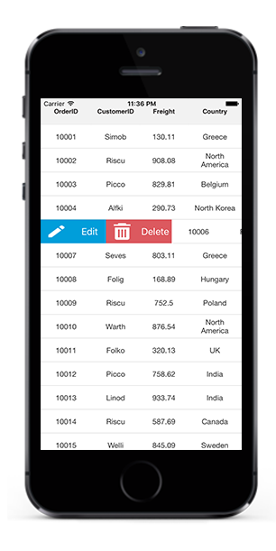

# Swiping

[SfDataGrid](http://help.syncfusion.com/cr/cref_files/xamarin-ios/sfdatagrid/Syncfusion.SfDataGrid.iOS~Syncfusion.SfDataGrid.SfDataGrid.html) lets you enable the swiping option by setting the [SfDataGrid.AllowSwiping](https://help.syncfusion.com/cr/cref_files/xamarin-ios/sfdatagrid/Syncfusion.SfDataGrid.iOS~Syncfusion.SfDataGrid.SfDataGrid~AllowSwiping.html) property to `true`.


this.sfGrid.AllowSwiping = true;


Swipe views are displayed when swiping from ‘left to right’ or ‘right to left’ on a data row. `SfDataGrid` provides customizable swipe templates for swiping on the left and right side. The swipe gesture can be restricted up to a certain point on the row by setting the [SfDataGrid.MaxSwipeOffset](https://help.syncfusion.com/cr/cref_files/xamarin-ios/sfdatagrid/Syncfusion.SfDataGrid.iOS~Syncfusion.SfDataGrid.SfDataGrid~MaxSwipeOffset.html) property.

## SwipeViews

`SfDataGrid` enables you to load the desired content using the [SfDataGrid.LeftSwipeView](https://help.syncfusion.com/cr/cref_files/xamarin-ios/sfdatagrid/Syncfusion.SfDataGrid.iOS~Syncfusion.SfDataGrid.SfDataGrid~LeftSwipeView.html) when swiping towards right and [SfDataGrid.RightSwipeView](https://help.syncfusion.com/cr/cref_files/xamarin-ios/sfdatagrid/Syncfusion.SfDataGrid.iOS~Syncfusion.SfDataGrid.SfDataGrid~RightSwipeView.html) when swiping towards the left. The contents inside the swipe view are arranged based on the offset values when you swipe a data row. Refer the following code example that shows how to load a view when swiping towards the right and towards the left.


UIButton leftSwipeViewText = new UIButton ();
leftSwipeViewText.SetTitle("Edit", UIControlState.Normal);
leftSwipeViewText.SetTitleColor(UIColor.White, UIControlState.Normal);
leftSwipeViewText.VerticalAlignment = UIControlContentVerticalAlignment.Center;
leftSwipeViewText.BackgroundColor = UIColor.FromRGB(0,158,218);

UIButton leftSwipeViewButton = new UIButton ();
leftSwipeViewButton.SetImage (UIImage.FromFile("Images/Edit.png"),UIControlState.Normal);
leftSwipeViewButton.BackgroundColor = UIColor.FromRGB(0, 158, 218);

CustomSwipeView leftSwipeView = new CustomSwipeView ();		
leftSwipeView.AddSubview (leftSwipeViewButton);
leftSwipeView.AddSubview(leftSwipeViewText);

UIButton rightSwipeViewText = new UIButton ();
rightSwipeViewText.SetTitle ("Delete", UIControlState.Normal);
rightSwipeViewText.SetTitleColor(UIColor.White, UIControlState.Normal);
rightSwipeViewText.VerticalAlignment = UIControlContentVerticalAlignment.Center;
rightSwipeViewText.BackgroundColor = UIColor.FromRGB(220, 89, 95);

UIButton rightSwipeViewButton = new UIButton ();
rightSwipeViewButton.SetImage (UIImage.FromFile("Images/Delete.png"),UIControlState.Normal);
rightSwipeViewButton.BackgroundColor = UIColor.FromRGB(220, 89, 95);
rightSwipeViewButton.HorizontalAlignment = UIControlContentHorizontalAlignment.Center;

CustomSwipeView rightSwipeView = new CustomSwipeView ();
rightSwipeView.AddSubview (rightSwipeViewButton);
rightSwipeView.AddSubview(rightSwipeViewText);

this.SfGrid.AllowSwiping = true;
this.SfGrid.LeftSwipeView = leftSwipeView;
this.SfGrid.RightSwipeView = rightSwipeView;

public class CustomSwipeView : UIView
{
    public CustomSwipeView()
    {
    }
    public override void LayoutSubviews()
    {
        var start = 0;
        var childWidth = this.Frame.Width / 3;
        foreach (var v in this.Subviews) 
        {  
            v.Frame = new CGRect(start, 0, childWidth + start, this.Frame.Height);
            start = start + (int)this.Frame.Width / 3;
        }
    }
}


The following screenshot shows the final outcome upon execution of the above code where swiping towards right loads an image and a label in the `LeftSwipeView`.

The following screenshot shows the final outcome upon execution of the above code where swiping towards left loads an image and a label in the `RightSwipeView`.

## SwipeEvents

[SwipeStarted](http://help.syncfusion.com/cr/cref_files/xamarin-ios/sfdatagrid/Syncfusion.SfDataGrid.iOS~Syncfusion.SfDataGrid.SfDataGrid~SwipeStarted_EV.html) - This event is fired when the swipe offset changes from its initial value. You can cancel the swipe action by setting the `Cancel` property of the [SwipeStartedEventArgs](https://help.syncfusion.com/cr/cref_files/xamarin-ios/sfdatagrid/Syncfusion.SfDataGrid.iOS~Syncfusion.SfDataGrid.SwipeStartedEventArgs.html) to `true`. 

[SwipeEnded](http://help.syncfusion.com/cr/cref_files/xamarin-ios/sfdatagrid/Syncfusion.SfDataGrid.iOS~Syncfusion.SfDataGrid.SfDataGrid~SwipeEnded_EV.html) - This event is fired when the swipe offset value reaches the `SfDataGrid.MaxSwipeOffset` indicating that the swipe action is completed. This event is triggered with [SwipeEndedEventArgs](https://help.syncfusion.com/cr/cref_files/xamarin-ios/sfdatagrid/Syncfusion.SfDataGrid.iOS~Syncfusion.SfDataGrid.SwipeEndedEventArgs.html). 

[Swiping](http://help.syncfusion.com/cr/cref_files/xamarin-ios/sfdatagrid/Syncfusion.SfDataGrid.iOS~Syncfusion.SfDataGrid.SfDataGrid~Swiping_EV.html) - This event is raised while swiping is in progress. This event is triggered with [SwipingEventArgs](https://help.syncfusion.com/cr/cref_files/xamarin-ios/sfdatagrid/Syncfusion.SfDataGrid.iOS~Syncfusion.SfDataGrid.SwipingEventArgs.html).

All the swipe events provides the following properties in their arguments:

• [RowIndex](http://help.syncfusion.com/cr/cref_files/xamarin-ios/sfdatagrid/Syncfusion.SfDataGrid.iOS~Syncfusion.SfDataGrid.SwipingEventArgs~RowIndex.html) - the swiping row index

• [RowData](http://help.syncfusion.com/cr/cref_files/xamarin-ios/sfdatagrid/Syncfusion.SfDataGrid.iOS~Syncfusion.SfDataGrid.SwipingEventArgs~RowData.html) - the underlying data associated with the swiped row as its arguments.

• [SwipeDirection](http://help.syncfusion.com/cr/cref_files/xamarin-ios/sfdatagrid/Syncfusion.SfDataGrid.iOS~Syncfusion.SfDataGrid.SwipingEventArgs~SwipeDirection.html) - the swipe direction of the swiped row

• [SwipeOffset](http://help.syncfusion.com/cr/cref_files/xamarin-ios/sfdatagrid/Syncfusion.SfDataGrid.iOS~Syncfusion.SfDataGrid.SwipingEventArgs~SwipeOffSet.html) - the current swipe offset of the row being swiped

By handling the swipe events, you can make use of these property values from the arguments to perform any desired action such as deleting the row, editing the data, etc.

## Loading Multiple Views as Swipe Template

You can customize your application by loading any view in the `SfDataGrid.LeftSwipeView` or `SfDataGrid.RightSwipeView` and assigning custom actions to them such as deleting a row, adding a row, editing the underlying data associated, etc. You can also display multiple views in the `SfDataGrid.LeftSwipeView` or `SfDataGrid.RightSwipeView` like in the following example where two views are loaded for editing the cell values in the row and deleting the row respectively. Refer the following code example that shows how to load multiple views in `SfDataGrid.LeftSwipeView` when swiping towards right.


public class Swiping : SampleView
{
    #region Fields
    SfDataGrid SfGrid;
    SwipingViewModel viewModel;
    DetailView detailView;
    UILabel col1;
    UILabel col2;
    UILabel col3;
    UILabel col4;
    UITextField orderIDText;
    UITextField customerIDText;
    UITextField employeeIDText;
    UITextField nameText;
    UIButton save;
    UIButton cancel;
    #endregion
    
    public Swiping ()
    {
        save = new UIButton ();
        save.SetTitle ("Save", UIControlState.Normal);
        save.BackgroundColor = UIColor.DarkGray;
        save.Font = UIFont.FromName("Helvetica-Bold", 12f);
        save.TouchDown += Save_TouchDown;
        cancel = new UIButton ();
        cancel.SetTitle ("Cancel", UIControlState.Normal);
        cancel.TouchDown += Cancel_TouchDown;
        cancel.BackgroundColor = UIColor.DarkGray;
        cancel.Font = UIFont.FromName("Helvetica-Bold", 12f);
        col1 = new UILabel();
        col1.Text="Order ID";
        col2 = new UILabel();
        col2.Text="Customer ID";
        col3 = new UILabel();
        col3.Text="Employee ID";
        col4 = new UILabel();
        col4.Text="Name";
        orderIDText = new UITextField ();
        orderIDText.AllowsEditingTextAttributes = true;
        
        orderIDText.ShouldReturn += (textField) => 
        { 
            orderIDText.ResignFirstResponder();
            return true;
        };			
        customerIDText = new UITextField ();
        customerIDText.ShouldReturn += (textField) => 
        { 
            customerIDText.ResignFirstResponder();
            return true;
        };		
        employeeIDText = new UITextField ();
        employeeIDText.ShouldReturn += (textField) => 
        { 
            employeeIDText.ResignFirstResponder();
            return true;
        };		
        nameText = new UITextField ();
        nameText.ShouldReturn += (textField) => 
        { 
            nameText.ResignFirstResponder();
            return true;
        };		
        orderIDText.Hidden = true;
        customerIDText.Hidden = true;
        employeeIDText.Hidden = true;
        nameText.Hidden = true;
        col1.Hidden = true;
        col2.Hidden = true;
        col3.Hidden = true;
        col4.Hidden = true;
        save.Hidden = true;
        cancel.Hidden = true;
        this.detailView = new DetailView ();
        this.detailView.Hidden = true;		
        this.SfGrid = new SfDataGrid ();
        this.viewModel = new SwipingViewModel ();
        this.SfGrid.ItemsSource = viewModel.OrdersInfo; 
        this.SfGrid.AutoGenerateColumns = false;
        this.SfGrid.ShowRowHeader = false;
        this.SfGrid.HeaderRowHeight = 45;
        this.SfGrid.RowHeight = 45;
        this.SfGrid.ColumnSizer = ColumnSizer.Star;
        
        UIButton leftSwipeViewText = new UIButton ();
        leftSwipeViewText.SetTitle("Edit", UIControlState.Normal);                                  
        leftSwipeViewText.SetTitleColor(UIColor.White, UIControlState.Normal);
        leftSwipeViewText.VerticalAlignment = UIControlContentVerticalAlignment.Center;
        leftSwipeViewText.BackgroundColor = UIColor.FromRGB(0,158,218);
        leftSwipeViewText.TouchDown += LeftSwipeViewButton_TouchDown;
        
        UIButton leftSwipeViewButton = new UIButton ();
        leftSwipeViewButton.SetImage (UIImage.FromFile("Images/Edit.png"),UIControlState.Normal);
        leftSwipeViewButton.BackgroundColor = UIColor.FromRGB(0, 158, 218);
        leftSwipeViewButton.TouchDown += LeftSwipeViewButton_TouchDown;
    
        UIButton rightSwipeViewText = new UIButton ();
        rightSwipeViewText.SetTitle ("Delete", UIControlState.Normal);
        rightSwipeViewText.SetTitleColor(UIColor.White, UIControlState.Normal);
        rightSwipeViewText.VerticalAlignment = UIControlContentVerticalAlignment.Center;
        rightSwipeViewText.BackgroundColor = UIColor.FromRGB(220, 89, 95);
        rightSwipeViewText.TouchDown += RightSwipeViewButton_TouchDown;
    
        UIButton rightSwipeViewButton = new UIButton ();
        rightSwipeViewButton.SetImage (UIImage.FromFile("Images/Delete.png"),UIControlState.Normal);
        rightSwipeViewButton.BackgroundColor = UIColor.FromRGB(220, 89, 95);
        rightSwipeViewButton.HorizontalAlignment = UIControlContentHorizontalAlignment.Center;
        rightSwipeViewButton.TouchDown += RightSwipeViewButton_TouchDown;
        
        // Multiple views inside LeftSwipeView
        CustomSwipeView leftSwipeView = new CustomSwipeView ();		
        leftSwipeView.AddSubview (leftSwipeViewButton);
        leftSwipeView.AddSubview(leftSwipeViewText);
        leftSwipeView.AddSubview (rightSwipeViewButton);
        leftSwipeView.AddSubview(rightSwipeViewText);
        
        this.SfGrid.AllowSwiping = true;
        this.SfGrid.LeftSwipeView = leftSwipeView;
        this.SfGrid.SwipeEnded += SfGrid_SwipeEnded; 
        this.SfGrid.SwipeStarted += SfGrid_SwipeStarted; 
        
        GridTextColumn CustomerID = new GridTextColumn();
        CustomerID.MappingName = "CustomerID";
        CustomerID.HeaderText = "Customer ID";
    
        GridTextColumn OrderID = new GridTextColumn();
        OrderID.MappingName = "OrderID";
        OrderID.HeaderText = "Order ID";
    
        GridTextColumn EmployeeID = new GridTextColumn();
        EmployeeID.MappingName = "EmployeeID";
        EmployeeID.HeaderText = "Employee ID";
    
        GridTextColumn Name = new GridTextColumn();
        Name.MappingName = "FirstName";
        Name.HeaderText = "Name";
    
        this.SfGrid.Columns.Add(OrderID);
        this.SfGrid.Columns.Add(CustomerID);
        this.SfGrid.Columns.Add(EmployeeID);
        this.SfGrid.Columns.Add(Name);
        this.AddSubview (SfGrid);
        this.AddSubview (detailView);
        this.AddSubview (col1);
        this.AddSubview (col2);
        this.AddSubview (col3);
        this.AddSubview (col4);
        this.AddSubview (orderIDText);
        this.AddSubview (customerIDText);
        this.AddSubview (employeeIDText);
        this.AddSubview (nameText);
        this.AddSubview (save);
        this.AddSubview (cancel);
    }

    void Cancel_TouchDown (object sender, EventArgs e)
    {
        hideOptionViews ();
        initializeTextFields ();
    }

    void Save_TouchDown (object sender, EventArgs e)
    {
        commitValues (); 
        hideOptionViews ();
    }

    private void commitValues ()
    {
        if (swipedRowindex > 0) 
        {
            var swipedRowData = this.viewModel.OrdersInfo [this.swipedRowindex - 1];
            swipedRowData.OrderID = this.orderIDText.Text;
            swipedRowData.CustomerID = this.customerIDText.Text;
            swipedRowData.EmployeeID = this.employeeIDText.Text;
            swipedRowData.FirstName = this.nameText.Text;
        }
    }

    private void hideOptionViews()
    {
        this.detailView.Hidden = true;
        this.col1.Hidden = true;
        this.col2.Hidden = true;
        this.col3.Hidden = true;
        this.col4.Hidden = true;
        this.orderIDText.Hidden = true;
        this.customerIDText.Hidden = true;
        this.employeeIDText.Hidden = true;
        this.nameText.Hidden = true;
        this.save.Hidden = true;
        this.cancel.Hidden = true;
    }

    private void initializeTextFields() 
    { 
        if (swipedRowindex > 0) 
        {
            var swipedRowData = this.viewModel.OrdersInfo [this.swipedRowindex - 1];
            orderIDText.Text = swipedRowData.OrderID;
            this.customerIDText.Text = swipedRowData.CustomerID;
            this.employeeIDText.Text = swipedRowData.EmployeeID;
            this.nameText.Text = swipedRowData.FirstName;
        }
    }

    void LeftSwipeViewButton_TouchDown (object sender, EventArgs e)
    {
        this.detailView.Hidden = false;
        this.col1.Hidden = false;
        this.col2.Hidden = false;
        this.col3.Hidden = false;
        this.col4.Hidden = false;
        this.orderIDText.Hidden = false;
        this.customerIDText.Hidden = false;
        this.employeeIDText.Hidden = false;
        this.nameText.Hidden = false;
        this.save.Hidden = false;
        this.cancel.Hidden= false;
    }

    void RightSwipeViewButton_TouchDown (object sender, EventArgs e)
    {
        viewModel.OrdersInfo.RemoveAt(swipedRowindex - 1);
    }

    public override void LayoutSubviews ()
    {
        this.SfGrid.Frame = new CGRect (0, 0, this.Frame.Width, this.Frame.Height);
        detailView.Frame = new CGRect (10, this.SfGrid.Frame.Top + 100, SfGrid.Frame.Width - 20, 200);
        col1.Frame = new CGRect (detailView.Frame.Right * 0.15, detailView.Frame.Top + 20, detailView.Frame.Right /2, 20);
        col2.Frame = new CGRect (detailView.Frame.Right * 0.15, col1.Frame.Bottom + 10, detailView.Frame.Right /2, 20);
        col3.Frame = new CGRect (detailView.Frame.Right * 0.15, col2.Frame.Bottom + 10, detailView.Frame.Right /2, 20);
        col4.Frame = new CGRect (detailView.Frame.Right * 0.15, col3.Frame.Bottom + 10, detailView.Frame.Right /2, 20);
        orderIDText.Frame= new CGRect( col1.Frame.Right,detailView.Frame.Top+ 20,detailView.Frame.Right,20);
        customerIDText.Frame= new CGRect( col2.Frame.Right,orderIDText.Frame.Bottom +10,detailView.Frame.Right,20);
        employeeIDText.Frame= new CGRect( col3.Frame.Right,customerIDText.Frame.Bottom +10,detailView.Frame.Right,20);
        nameText.Frame= new CGRect( col4.Frame.Right,employeeIDText.Frame.Bottom +10,detailView.Frame.Right,20);
        save.Frame = new CGRect (detailView.Frame.Right / 4, nameText.Frame.Bottom + 20, 50, 20);
        cancel.Frame = new CGRect (save.Frame.Right +10, nameText.Frame.Bottom + 20, 80, 20);
        base.LayoutSubviews ();
    }

    void SfGrid_SwipeStarted (object sender, SwipeStartedEventArgs e)
    {
        SfGrid.MaxSwipeOffset = (int)(SfGrid.Frame.Width / 2);
    }
    
    private void SfGrid_SwipeEnded (object sender, SwipeEndedEventArgs e)
    {
        swipedRowindex = e.RowIndex;
        initializeTextFields ();
    }
 }
     
 public class DetailView : UIView
 {
     public DetailView ()
     {			
         this.BackgroundColor = UIColor.LightGray;
     }			
 }
 
public class CustomSwipeView : UIView
{
    public override bool Hidden
    {
        get { return base.Hidden; }
        set { base.Hidden = value; }
    }
    
    public CustomSwipeView()
    {
            
    }
    
    public override void LayoutSubviews()
    {
        var start = 0;
        var childWidth = this.Frame.Width / 4;
        foreach (var v in this.Subviews)
        {
            v.Frame = new CGRect(start, 0, childWidth, this.Frame.Height);
            start = start + (int)this.Frame.Width / 4;
        }
     }   
}


The following screenshot shows the final outcome upon execution of the above code where swiping towards right loads two views in the `SfDataGrid.LeftSwipeView` to edit and delete a row respectively.

N> Similarly you can load the two views in the `SfDataGrid.RightSwipeView` when swiping towards left. The following screenshot shows the `SfDataGrid.RightSwipeView` with two views to edit and delete a row respectively.

## Customized Swipe Delete Functionality

You can perform operations such as deleting a row when swiping a data row from one extent to other in the view and retrieve the deleted row by tapping the view. Refer the below code example which illustrates how to delete a data row when swiping it from one extreme to other in the view and retrieve the deleted row by tapping the view.


UILabel leftSwipeViewText = new UILabel ();
leftSwipeViewText.Text = "DELETED";
leftSwipeViewText.TextColor = UIColor.White;
leftSwipeViewText.TextAlignment = UITextAlignment.Left;
leftSwipeViewText.BackgroundColor = UIColor.FromRGB(26, 170, 135);

UILabel leftSwipeViewButton = new UILabel();
leftSwipeViewButton.UserInteractionEnabled = true;
leftSwipeViewButton.Text = "UNDO";
leftSwipeViewButton.TextColor = UIColor.White;
leftSwipeViewButton.Font = UIFont.BoldSystemFontOfSize(14);
leftSwipeViewButton.TextAlignment = UITextAlignment.Right;
leftSwipeViewButton.BackgroundColor = UIColor.FromRGB(26,170,135);
leftSwipeViewButton.AddGestureRecognizer(new UITapGestureRecognizer(UndoTapped));

SwipeView leftSwipeView = new SwipeView ();
leftSwipeView.BackgroundColor = UIColor.FromRGB(26, 170, 135);
leftSwipeView.AddSubview (leftSwipeViewText);
leftSwipeView.AddSubview (leftSwipeViewButton);

UILabel rightSwipeViewText = new UILabel ();
rightSwipeViewText.Text = "DELETED";
rightSwipeViewText.TextColor = UIColor.White;
rightSwipeViewText.TextAlignment = UITextAlignment.Left;
rightSwipeViewText.BackgroundColor = UIColor.FromRGB(26, 170, 135);

UILabel rightSwipeViewButton = new UILabel ();
rightSwipeViewButton.UserInteractionEnabled = true;
rightSwipeViewButton.Text = "UNDO";
rightSwipeViewButton.TextColor = UIColor.White;
rightSwipeViewButton.Font = UIFont.BoldSystemFontOfSize(14);
rightSwipeViewButton.TextAlignment = UITextAlignment.Right;
rightSwipeViewButton.BackgroundColor = UIColor.FromRGB(26, 170, 135);
rightSwipeViewButton.AddGestureRecognizer(new UITapGestureRecognizer(UndoTapped));

SwipeView rightSwipeView = new SwipeView ();
rightSwipeView.BackgroundColor = UIColor.FromRGB(26, 170, 135);
rightSwipeView.AddSubview (rightSwipeViewText);
rightSwipeView.AddSubview (rightSwipeViewButton);

this.SfGrid.AllowSwiping = true;
this.SfGrid.LeftSwipeView = leftSwipeView;
this.SfGrid.RightSwipeView = rightSwipeView;

void UndoTapped (UITapGestureRecognizer gesture)	
{
    if (gesture.State == UIGestureRecognizerState.Ended)
    {
        var removedData = viewModel.OrdersInfo[swipedRowindex - 1];
        var isSelected = SfGrid.SelectedItems.Contains(removedData);
        viewModel.OrdersInfo.Remove(removedData);
        viewModel.OrdersInfo.Insert(swipedRowindex - 1, removedData);
        if (isSelected)
            SfGrid.SelectedItems.Add(removedData);
        IsUndoClicked = true;
    }
}

public class SwipeView : UIView
{
    public override bool Hidden 
    {
        get { return base.Hidden; }
        set { base.Hidden = value;}
    }
    
    public SwipeView()
    {
        
    }
    
    public override void LayoutSubviews()
    {
        var start = 0;
        var childWidth = this.Frame.Width / 2;
        try
        {
            this.Subviews[0].Frame = new CGRect(start + 20, 0, childWidth - 20, this.Frame.Height);
            this.Subviews[1].Frame = new CGRect(childWidth, 0, childWidth - 15, this.Frame.Height);
        }
        catch (Exception e)
        {
        Console.WriteLine(e.Message);
        }
    }
}


The following screenshot shows the final outcome upon execution of the above code.

