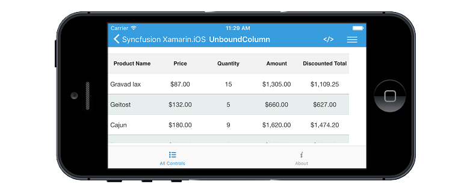

# Unbound Column

SfDataGrid allows you to add **additional columns** which are **not bound with data object** from underlying data source. You can add unbound column using [SfDataGrid.GridUnboundColumn](http://help.syncfusion.com/cr/cref_files/xamarin-ios/Syncfusion.SfDataGrid.iOS~Syncfusion.SfDataGrid.GridUnboundColumn.html) class.


SfDataGrid dataGrid = new SfDataGrid ();
UnboundViewModel viewModel = new UnboundViewModel();
dataGrid.ItemsSource = viewModel.Products;

GridUnboundColumn AmountColumn = new GridUnboundColumn();
AmountColumn.MappingName = "Amount";
AmountColumn.HeaderText = "Amount";
AmountColumn.Expression = "UnitPrice * Quantity";
AmountColumn.Format = "C";
AmountColumn.HeaderTextAlignment = UITextAlignment.Center;
AmountColumn.TextAlignment = UITextAlignment.Center;
dataGrid.Columns.Add(AmountColumn);

GridUnboundColumn TotalColumn = new GridUnboundColumn();
TotalColumn.MappingName = "Total";
TotalColumn.HeaderText = "Discounted Total";
TotalColumn.Expression = "(Quantity * UnitPrice) - ((Quantity * UnitPrice)/100 * Quantity)";
TotalColumn.Format = "C";
TotalColumn.HeaderTextAlignment = UITextAlignment.Center;
TotalColumn.TextAlignment = UITextAlignment.Center ;
dataGrid.Columns.Add(TotalColumn);


N> It is mandatory to specify the [GridColumn.MappingName](http://help.syncfusion.com/cr/cref_files/xamarin-ios/Syncfusion.SfDataGrid.iOS~Syncfusion.SfDataGrid.GridColumn~MappingName.html) for `SfDataGrid.GridUnboundColumn` with some name to identify the column. It is not necessary to define name of field in the data object.

## Populating data for unbound column

You can populate the data for unbound column by setting [Expression](http://help.syncfusion.com/cr/cref_files/xamarin-ios/Syncfusion.SfDataGrid.iOS~Syncfusion.SfDataGrid.GridUnboundColumn~Expression.html) or [Format](http://help.syncfusion.com/cr/cref_files/xamarin-ios/Syncfusion.SfDataGrid.iOS~Syncfusion.SfDataGrid.GridColumn~Format.html) property.

### Using Expression

You can specify the arithmetic or logic expression using `Expression` property to compute the display value. By default `GridUnboundColumn` evaluates the expression with casing. You can disable the casing while evaluate the expression by setting [CaseSensitive](http://help.syncfusion.com/cr/cref_files/xamarin-ios/Syncfusion.SfDataGrid.iOS~Syncfusion.SfDataGrid.GridUnboundColumn~CaseSensitive.html) property to `false`.
Below are the list of Arithmetic and logical operations supported.

<table>
<tr>
<th>
Arithmetic operations
</th>
<th>
Operator
</th>
</tr>
<tr>
<td>
Add
</td>
<td>
+
</td>
</tr>
<tr>
<td>
Subtract
</td>
<td>
-
</td>
</tr>
<tr>
<td>
Multiply
</td>
<td>
*
</td>
</tr>
<tr>
<td>
Divide
</td>
<td>
/
</td>
</tr>
<tr>
<td>
Power
</td>
<td>
^
</td>
</tr>
<tr>
<td>
Mod
</td>
<td>
%
</td>
</tr>
<tr>
<td>
Greater Than
</td>
<td>
>
</td>
</tr>
<tr>
<td>
Less Than
</td>
<td>
<
</td>
</tr>
<tr>
<td>
Equal
</td>
<td>
=
</td>
</tr>
<tr>
<td>
GreaterThanOrEqual
</td>
<td>
>=
</td>
</tr>
<tr>
<td>
LessThanOrEqual
</td>
<td>
<=
</td>
</tr>
</table>

*Logical Operations*

<table>
<tr>
<th>
Logical operations
</th>
<th>
Operators
</th>
</tr>
<tr>
<td>
AND
</td>
<td>
(char)135
</td>
</tr>
<tr>
<td>
OR
</td>
<td>
(char)136
</td>
</tr>
<tr>
<td>
NOT
</td>
<td>
(char)137
</td>
</tr>
</table>


SfDataGrid dataGrid = new SfDataGrid ();
UnboundViewModel viewModel = new UnboundViewModel();
dataGrid.ItemsSource = viewModel.Products;

GridUnboundColumn TotalColumn = new GridUnboundColumn();
TotalColumn.MappingName = "Total";
TotalColumn.HeaderText = "Discounted Total";
TotalColumn.Expression = "(Quantity * UnitPrice) - ((Quantity * UnitPrice)/100 * Quantity)";
dataGrid.Columns.Add(TotalColumn);


### Using Format

You can format the values of other columns and display the formatted value in unbound column using `Format` property.


SfDataGrid dataGrid = new SfDataGrid ();
UnboundViewModel viewModel = new UnboundViewModel();
dataGrid.ItemsSource = viewModel.Products;

GridUnboundColumn TotalColumn = new GridUnboundColumn();
TotalColumn.MappingName = "Total";
TotalColumn.HeaderText = "Discounted Total";
TotalColumn.Format = "C";
dataGrid.Columns.Add(TotalColumn);


### Using QueryUnboundColumnValue event

[QueryUnboundColumnValue](http://help.syncfusion.com/cr/cref_files/xamarin-ios/Syncfusion.SfDataGrid.iOS~Syncfusion.SfDataGrid.SfDataGrid~QueryUnboundColumnValue_EV.html) event is fired when value for the unbound column is queried. It provides the information about the cell that triggered this event and hence you can set the desired value for the grid cells of the unbound column. This event is triggered with [GridUnboundColumnEventsArgs](http://help.syncfusion.com/cr/cref_files/xamarin-ios/Syncfusion.SfDataGrid.iOS~Syncfusion.SfDataGrid.GridUnboundColumnEventsArgs.html).

`GridUnboundColumnEventsArgs` provides the following properties:

* [Column](http://help.syncfusion.com/cr/cref_files/xamarin-ios/Syncfusion.SfDataGrid.iOS~Syncfusion.SfDataGrid.GridUnboundColumnEventsArgs~Column.html) - Gets the GridColumn of the cell that triggers this event.  
* [OriginalSender](http://help.syncfusion.com/cr/cref_files/xamarin-ios/Syncfusion.SfDataGrid.iOS~Syncfusion.SfDataGrid.GridEventArgs~OriginalSender.html) - Gets the dataGrid raising this event.
* [Record](http://help.syncfusion.com/cr/cref_files/xamarin-ios/Syncfusion.SfDataGrid.iOS~Syncfusion.SfDataGrid.GridUnboundColumnEventsArgs~Record.html) - Gets the underlying row data. 
* [UnboundAction](http://help.syncfusion.com/cr/cref_files/xamarin-ios/Syncfusion.SfDataGrid.iOS~Syncfusion.SfDataGrid.GridUnboundColumnEventsArgs~UnboundAction.html) - Defines the action for triggering this event.
* [Value](http://help.syncfusion.com/cr/cref_files/xamarin-ios/Syncfusion.SfDataGrid.iOS~Syncfusion.SfDataGrid.GridUnboundColumnEventsArgs~Value.html) - Gets or sets the value for GridUnboundColumn cell based on UnboundAction.

N> `UnboundActions.CommitData` and `UnboundActions.PasteData` are currently not supported and likely to be supported in future.    

You can populate data for the Unbound column by handling `QueryUnboundColumnValue` event, which allows you to customize the value of the `GridUnboundColumn`. `GridUnboundColumnEventsArgs` exposes `Value` property by which you can set the value for the grid cells of the unbound column based on the `UnboundAction`.

Refer the below code example in which data for the unbound column is populated by handling the `QueryUnboundColumnValue` event.


dataGrid.QueryUnboundColumnValue += DataGrid_QueryUnboundColumnValue;

private void DataGrid_QueryUnboundColumnValue(object sender, GridUnboundColumnEventsArgs e)
{
    if (e.UnboundAction == UnboundActions.QueryData)
    {
        var quantity = Convert.ToInt16(e.Record.GetType().GetProperty("Quantity").GetValue(e.Record));
        var unitPrice = Convert.ToInt16(e.Record.GetType().GetProperty("UnitPrice").GetValue(e.Record));
        var amount = quantity * unitPrice;
        e.Value = amount;
    }
}

