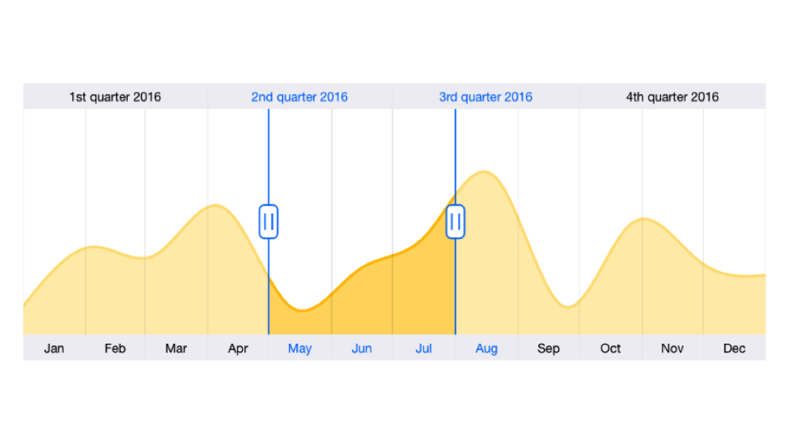

# Content

[`SFDateTimeRangeNavigator`](https://help.syncfusion.com/cr/xamarin-ios/Syncfusion.SfChart.iOS.SFDateTimeRangeNavigator.html) allows you to set [`SFChart`](https://help.syncfusion.com/cr/xamarin-ios/Syncfusion.SfChart.iOS.SFChart.html) as its content, explicitly, using [`Content`](https://help.syncfusion.com/cr/xamarin-ios/Syncfusion.SfChart.iOS.SFDateTimeRangeNavigator.html#Syncfusion_SfChart_iOS_SFDateTimeRangeNavigator_Content) property. By default the chart is added as its content of the range navigator. If you provide data source for the chart, the chart will be created for the provided data source and it has been set as content of the range navigator.

N> Since the Content property’s data type is UIView and it can accept any UIView as its value.

The following code snippet shows how to configure the range navigator’s chart content.



SFDateTimeRangeNavigator rangeNavigator = new SFDateTimeRangeNavigator ();

((SFChart)(rangeNavigator.Content)).DataSource = ChartDataSource;

this.View.AddSubview(rangeNavigator);



The following code snippet shows how to configure the range navigator using [`Minimum`](https://help.syncfusion.com/cr/xamarin-ios/Syncfusion.SfChart.iOS.SFDateTimeRangeNavigator.html#Syncfusion_SfChart_iOS_SFDateTimeRangeNavigator_Minimum) and [`Maximum`](https://help.syncfusion.com/cr/xamarin-ios/Syncfusion.SfChart.iOS.SFDateTimeRangeNavigator.html#Syncfusion_SfChart_iOS_SFDateTimeRangeNavigator_Maximum) properties.



SFDateTimeRangeNavigator rangeNavigator = new SFDateTimeRangeNavigator ();

rangeNavigator.ShowTooltip = false;
rangeNavigator.TooltipDisplayMode = SFRangeNavigatorTooltipDisplayMode.Always;

DateTime minDate   = new DateTime (2016, 01, 01);
DateTime maxDate   = new DateTime (2017, 01, 01);
DateTime startDate = new DateTime (2016, 05, 01);
DateTime endDate   = new DateTime (2016, 08, 01);

rangeNavigator.Minimum = ConvertDateTimeToNSDate(minDate);
rangeNavigator.Maximum = ConvertDateTimeToNSDate(maxDate);

rangeNavigator.ViewRangeStart = ConvertDateTimeToNSDate(startDate);
rangeNavigator.ViewRangeEnd   = ConvertDateTimeToNSDate(endDate);

this.View.AddSubview(rangeNavigator);



