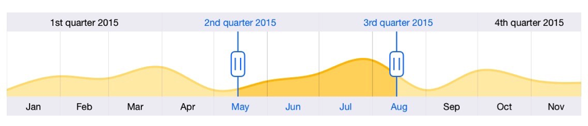
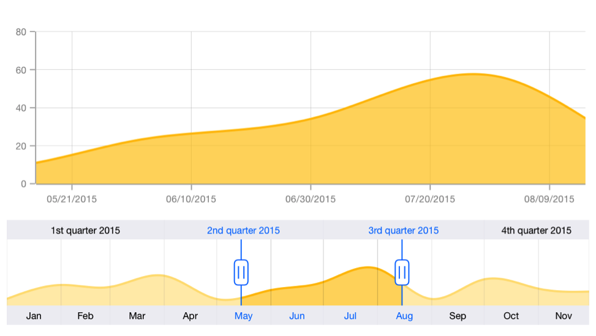

---
layout: post
title: Getting Started | SFDateTimeRangeNavigator | Xamarin.iOS | Syncfusion
description: A complete control document
platform: xamarin.ios
control: SFDateTimeRangeNavigator
documentation: ug
--- 

# Create your first SFDateTimeRangeNavigator

This section walks you through the steps required to add SFDateTimeRangeNavigator and populate it with data, and also explains how to respond to range selection performed in the control. 

## Adding and configuring the SFDateTimeRangeNavigator

First, let us initialize the control with major and minor date time scales by specifying the minimum and maximum date to be visualized in the control using [`Minimum`](https://help.syncfusion.com/cr/cref_files/xamarin-ios/Syncfusion.SFChart.iOS~Syncfusion.SfChart.iOS.SFDateTimeRangeNavigator~Minimum.html) and [`Maximum`](https://help.syncfusion.com/cr/cref_files/xamarin-ios/Syncfusion.SFChart.iOS~Syncfusion.SfChart.iOS.SFDateTimeRangeNavigator~Maximum.html) properties.

Following code example illustrates this,



public ViewController (IntPtr handle) : base (handle)
{    
    SFDateTimeRangeNavigator rangeNavigator    = new SFDateTimeRangeNavigator ();

    rangeNavigator.Minimum    = DateTimeToNSDate (new DateTime (2015, 1, 1, 0, 0, 0));
    rangeNavigator.Maximum    = DateTimeToNSDate (new DateTime (2015, 12, 1, 0, 0, 0));

    this.View.AddSubview (rangeNavigator);
}

public NSDate DateTimeToNSDate(DateTime date)
{
    DateTime reference   = TimeZone.CurrentTimeZone.ToLocalTime(new DateTime(2001, 1, 1, 0, 0, 0) );

    return NSDate.FromTimeIntervalSinceReferenceDate((date - reference).TotalSeconds);
}



   

Note: If you don’t specify Minimum and Maximum properties, minimum and maximum dates will be Jan 1’ 1970 and Jan 1’1971.

Next, create a data source representing the list of sample data.



public class ChartDataSource : SFChartDataSource
{
    NSMutableArray DataPoints;

    public ChartDataSource ()
    {
        DataPoints = new NSMutableArray ();
        DateTime date = new DateTime (2015, 1, 1, 0, 0, 0);

        AddDataPointsForChart(date, 10);
        AddDataPointsForChart(date.AddMonths(1), 31);
        AddDataPointsForChart(date.AddMonths(2), 28);
        AddDataPointsForChart(date.AddMonths(3), 45);
        AddDataPointsForChart(date.AddMonths(4), 10);
        AddDataPointsForChart(date.AddMonths(5), 23);
        AddDataPointsForChart(date.AddMonths(7), 56);
        AddDataPointsForChart(date.AddMonths(8), 10);
        AddDataPointsForChart(date.AddMonths(9), 39);
        AddDataPointsForChart(date.AddMonths(10), 26);
        AddDataPointsForChart(date.AddMonths(11), 21);
    }

    void AddDataPointsForChart (DateTime XValue, Double YValue)
    {
        NSCalendar cal          = new NSCalendar (NSCalendarType.Gregorian);
        NSDateComponents comp   = new NSDateComponents ();
        comp.Day                = XValue.Day;
        comp.Month              = XValue.Month;
        comp.Year               = XValue.Year;
        comp.Hour               = XValue.Hour;
        comp.Minute             = XValue.Minute;
        comp.Second             = XValue.Second;
        DataPoints.Add (new SFChartDataPoint ( cal.DateFromComponents(comp), NSObject.FromObject(YValue)));
    }

    void AddDataPointsForChart (String XValue, Double YValue)
    {
        DataPoints.Add (new SFChartDataPoint (NSObject.FromObject (XValue), NSObject.FromObject(YValue)));
    }

    public override nint NumberOfSeriesInChart (SFChart chart)
    {
        return 1; 
    }

    public override SFSeries GetSeries (SFChart chart, nint index)
    {
        SFSplineAreaSeries series   = new SFSplineAreaSeries ();
        series.Alpha                = 0.6f;
        series.BorderColor          = UIColor.FromRGBA( 255.0f/255.0f ,191.0f/255.0f, 0.0f/255.0f,1.0f);
        return series;
    }

    public override SFChartDataPoint GetDataPoint (SFChart chart, nint index, nint seriesIndex)
    {
        return DataPoints.GetItem<SFChartDataPoint> ((nuint)index);//returns the datapoint for each series.
    }

    public override nint GetNumberOfDataPoints (SFChart chart, nint index)
    {
        return (int)DataPoints.Count;//No of datapoints needed for each series.
    }
}



Then, let us populate the chart, which is displayed inside the SFDateTimeRangeNavigator, by setting the above data using dataSource property. 

Note: By default, SFChart content is added in SFDateTimeRangeNavigator with axes collapsed. You can add series to default chart by setting its dataSource property. 



SFDateTimeRangeNavigator rangeNavigator      = new SFDateTimeRangeNavigator ();
((SFChart)rangeNavigator.Content).DataSource = dataModel as SFChartDataSource;



## Handle range selection

In real time, other controls like chart, grid etc., are updated in response to the range selection performed in SFDateTimeRangeNavigator. You can handle the selection using [`RangeChanged`](https://help.syncfusion.com/cr/cref_files/xamarin-ios/Syncfusion.SFChart.iOS~Syncfusion.SfChart.iOS.SFRangeNavigatorDelegate~RangeChanged.html) delegate method and update other controls based on the selected date time.

Following code example illustrates how to handle range selection and update chart's date time axis range,

You need to implement the SFRangeNavigatorDelegate protocol.



public class RangeNavigatorDelegate: SFRangeNavigatorDelegate
{
    SFDateTimeAxis primaryAxis;

    public RangeNavigatorDelegate(SFDateTimeAxis _primaryAxis)
    {
        primaryAxis     = _primaryAxis;
    }

    public override void RangeChanged (SFDateTimeRangeNavigator rangeNavigator, NSDate startDate, NSDate endDate)
    {
        primaryAxis.Minimum        = startDate;
        primaryAxis.Maximum        = endDate;
    }
}



