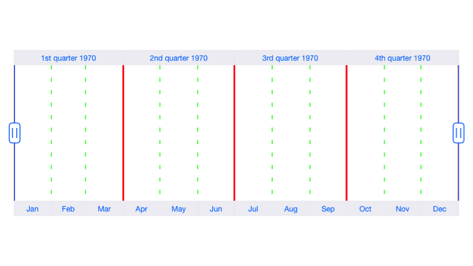

# Grid Lines

The [`MinorScaleStyle`](https://help.syncfusion.com/cr/cref_files/xamarin-ios/Syncfusion.SFChart.iOS~Syncfusion.SfChart.iOS.SFDateTimeRangeNavigator~MinorScaleStyle.html) and [`MajorScaleStyle`](https://help.syncfusion.com/cr/cref_files/xamarin-ios/Syncfusion.SFChart.iOS~Syncfusion.SfChart.iOS.SFDateTimeRangeNavigator~MajorScaleStyle.html) properties of [`SFDateTimeRangeNavigator`](https://help.syncfusion.com/cr/cref_files/xamarin-ios/Syncfusion.SFChart.iOS~Syncfusion.SfChart.iOS.SFDateTimeRangeNavigator.html) used to customize the minor and major grid lines. Following properties are available in each scale style to configure the grid lines.

* [`ShowGridLines`](https://help.syncfusion.com/cr/cref_files/xamarin-ios/Syncfusion.SFChart.iOS~Syncfusion.SfChart.iOS.SFRangeNavigatorScaleStyle~ShowGridLines.html) – used to set the visibility of grid lines
* [`GridLineWidth`](https://help.syncfusion.com/cr/cref_files/xamarin-ios/Syncfusion.SFChart.iOS~Syncfusion.SfChart.iOS.SFRangeNavigatorScaleStyle~GridLineWidth.html) – used to set the width for grid lines
* [`GridLineColor`](https://help.syncfusion.com/cr/cref_files/xamarin-ios/Syncfusion.SFChart.iOS~Syncfusion.SfChart.iOS.SFRangeNavigatorScaleStyle~GridLineColor.html) – used to set the color for grid lines
* [`GridLineDashes`](https://help.syncfusion.com/cr/cref_files/xamarin-ios/Syncfusion.SFChart.iOS~Syncfusion.SfChart.iOS.SFRangeNavigatorScaleStyle~GridLineDashes.html) – used to set dashes for grid lines



SFDateTimeRangeNavigator rangeNavigator = new SFDateTimeRangeNavigator ();

rangeNavigator.MajorScaleStyle.ShowGridLines = true;
rangeNavigator.MajorScaleStyle.GridLineWidth = 2;
rangeNavigator.MajorScaleStyle.GridLineColor = UIColor.Red;
        
rangeNavigator.MinorScaleStyle.ShowGridLines = true;
rangeNavigator.MinorScaleStyle.GridLineWidth = 1;
rangeNavigator.MinorScaleStyle.GridLineColor = UIColor.Green;
rangeNavigator.MinorScaleStyle.GridLineDashes = NSArray.FromObjects (5, 10);

this.View.AddSubview(rangeNavigator);



