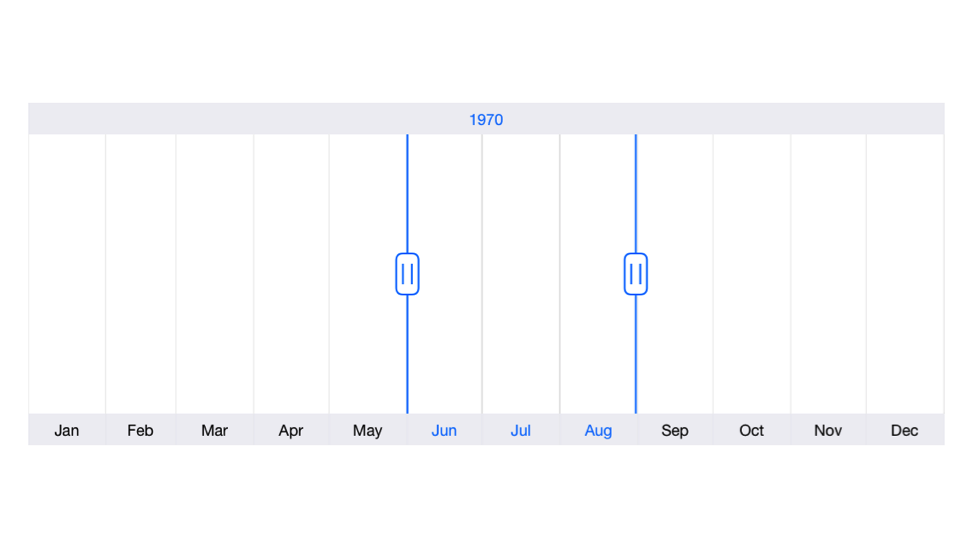
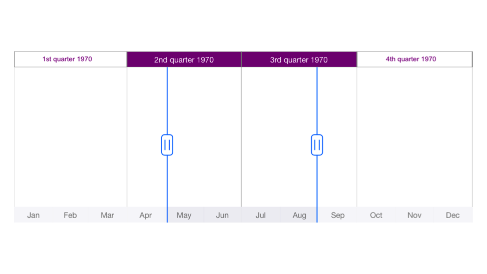

# Major and Minor Scales

[`SFDateTimeRangeNavigator`](https://help.syncfusion.com/cr/xamarin-ios/Syncfusion.SfChart.iOS.SFDateTimeRangeNavigator.html) displays major and minor scales at the top and bottom position of the control. You can also control its visibility using [`MajorScaleStyle.IsVisible`](https://help.syncfusion.com/cr/xamarin-ios/Syncfusion.SfChart.iOS.SFRangeNavigatorScaleStyle.html#Syncfusion_SfChart_iOS_SFRangeNavigatorScaleStyle_IsVisible) and [`MinorScaleStyle.IsVisible`](https://help.syncfusion.com/cr/xamarin-ios/Syncfusion.SfChart.iOS.SFRangeNavigatorScaleStyle.html#Syncfusion_SfChart_iOS_SFRangeNavigatorScaleStyle_IsVisible) properties.

## Intervals

By default, best possible interval component will be chosen for both major and minor scales based on the available size of the view. For example, if the available space is sufficient to show only year labels without overlapping, interval will be displayed in years. However, you can also set specific interval values using [`Intervals`](https://help.syncfusion.com/cr/xamarin-ios/Syncfusion.SfChart.iOS.SFDateTimeRangeNavigator.html#Syncfusion_SfChart_iOS_SFDateTimeRangeNavigator_Intervals) property as demonstrated in the below code snippet.



SFDateTimeRangeNavigator rangeNavigator = new SFDateTimeRangeNavigator ();

NSMutableArray intervals = new NSMutableArray ();

intervals.Add ((NSNumber)0);
intervals.Add ((NSNumber)2);
//Intervals: year = 0, Quarter = 1, Month = 2, Week = 3, Day = 4, Hour = 5
            
rangeNavigator.Intervals = intervals;

this.View.AddSubview(rangeNavigator);



## Customization

The [`MajorScaleStyle`](https://help.syncfusion.com/cr/xamarin-ios/Syncfusion.SfChart.iOS.SFDateTimeRangeNavigator.html#Syncfusion_SfChart_iOS_SFDateTimeRangeNavigator_MajorScaleStyle) and [`MinorScaleStyle`](https://help.syncfusion.com/cr/xamarin-ios/Syncfusion.SfChart.iOS.SFDateTimeRangeNavigator.html#Syncfusion_SfChart_iOS_SFDateTimeRangeNavigator_MinorScaleStyle) properties of [`SFDateTimeRangeNavigator`](https://help.syncfusion.com/cr/xamarin-ios/Syncfusion.SfChart.iOS.SFDateTimeRangeNavigator.html) are used to customize the appearance of ticks and labels.

* [`Position`](https://help.syncfusion.com/cr/xamarin-ios/Syncfusion.SfChart.iOS.SFRangeNavigatorScaleStyle.html#Syncfusion_SfChart_iOS_SFRangeNavigatorScaleStyle_Position) – used to position the labels and ticks [`Inside`](https://help.syncfusion.com/cr/xamarin-ios/Syncfusion.SfChart.iOS.SFRangeNavigatorScalePosition.html) or [`Outside`](https://help.syncfusion.com/cr/xamarin-ios/Syncfusion.SfChart.iOS.SFRangeNavigatorScalePosition.html) of the range navigator.
* [`LabelTextAlignment`](https://help.syncfusion.com/cr/xamarin-ios/Syncfusion.SfChart.iOS.SFRangeNavigatorScaleStyle.html#Syncfusion_SfChart_iOS_SFRangeNavigatorScaleStyle_LabelTextAlignment) – used to set the alignment of the labels. 
* [`LabelTextColor`](https://help.syncfusion.com/cr/xamarin-ios/Syncfusion.SfChart.iOS.SFRangeNavigatorScaleStyle.html#Syncfusion_SfChart_iOS_SFRangeNavigatorScaleStyle_LabelTextColor) – used to change the text color of the labels.
* [`LabelFont`](https://help.syncfusion.com/cr/xamarin-ios/Syncfusion.SfChart.iOS.SFRangeNavigatorScaleStyle.html#Syncfusion_SfChart_iOS_SFRangeNavigatorScaleStyle_LabelFont) – used to change the font of the labels.
* [`LabelBorderColor`](https://help.syncfusion.com/cr/xamarin-ios/Syncfusion.SfChart.iOS.SFRangeNavigatorScaleStyle.html#Syncfusion_SfChart_iOS_SFRangeNavigatorScaleStyle_LabelBorderColor) – used to change the border color of the labels.
* [`LabelBorderWidth`](https://help.syncfusion.com/cr/xamarin-ios/Syncfusion.SfChart.iOS.SFRangeNavigatorScaleStyle.html#Syncfusion_SfChart_iOS_SFRangeNavigatorScaleStyle_LabelBorderWidth) – used to change the border width of the labels. 
* [`LabelBackgroundColor`](https://help.syncfusion.com/cr/xamarin-ios/Syncfusion.SfChart.iOS.SFRangeNavigatorScaleStyle.html#Syncfusion_SfChart_iOS_SFRangeNavigatorScaleStyle_LabelBackgroundColor) – used to change the background color of the labels.
* [`LabelMargin`](https://help.syncfusion.com/cr/xamarin-ios/Syncfusion.SfChart.iOS.SFRangeNavigatorScaleStyle.html#Syncfusion_SfChart_iOS_SFRangeNavigatorScaleStyle_LabelMargin) – used to change the margin size of the labels. 
* [`SelectedLabelFont`](https://help.syncfusion.com/cr/xamarin-ios/Syncfusion.SfChart.iOS.SFRangeNavigatorScaleStyle.html#Syncfusion_SfChart_iOS_SFRangeNavigatorScaleStyle_SelectedLabelFont) – used to change the font of the selected labels.
* [`SelectedLabelTextColor`](https://help.syncfusion.com/cr/xamarin-ios/Syncfusion.SfChart.iOS.SFRangeNavigatorScaleStyle.html#Syncfusion_SfChart_iOS_SFRangeNavigatorScaleStyle_SelectedLabelTextColor) – used to change the text color of the selected labels. 
* [`SelectedLabelBorderColor`](https://help.syncfusion.com/cr/xamarin-ios/Syncfusion.SfChart.iOS.SFRangeNavigatorScaleStyle.html#Syncfusion_SfChart_iOS_SFRangeNavigatorScaleStyle_SelectedLabelBorderColor) – used to change the border color of the selected labels.
* [`SelectedLabelBorderWidth`](https://help.syncfusion.com/cr/xamarin-ios/Syncfusion.SfChart.iOS.SFRangeNavigatorScaleStyle.html#Syncfusion_SfChart_iOS_SFRangeNavigatorScaleStyle_SelectedLabelBorderWidth) – used to change the border width of the selected labels. 
* [`SelectedLabelBackgroundColor`](https://help.syncfusion.com/cr/xamarin-ios/Syncfusion.SfChart.iOS.SFRangeNavigatorScaleStyle.html#Syncfusion_SfChart_iOS_SFRangeNavigatorScaleStyle_SelectedLabelBackgroundColor) – used to change the background color of the selected labels.
* [`SelectedLabelTextColor`](https://help.syncfusion.com/cr/xamarin-ios/Syncfusion.SfChart.iOS.SFRangeNavigatorScaleStyle.html#Syncfusion_SfChart_iOS_SFRangeNavigatorScaleStyle_SelectedLabelTextColor) – used to change the text color of the selected labels. 
* [`SelectedLabelMargin`](https://help.syncfusion.com/cr/xamarin-ios/Syncfusion.SfChart.iOS.SFRangeNavigatorScaleStyle.html#Syncfusion_SfChart_iOS_SFRangeNavigatorScaleStyle_SelectedLabelMargin) – used to change the margin of the selected labels.
* [`TickColor`](https://help.syncfusion.com/cr/xamarin-ios/Syncfusion.SfChart.iOS.SFRangeNavigatorScaleStyle.html#Syncfusion_SfChart_iOS_SFRangeNavigatorScaleStyle_TickColor) – used to change the color of the ticks.
* [`TickWidth`](https://help.syncfusion.com/cr/xamarin-ios/Syncfusion.SfChart.iOS.SFRangeNavigatorScaleStyle.html#Syncfusion_SfChart_iOS_SFRangeNavigatorScaleStyle_TickWidth) – used to set the width of the ticks.



SFDateTimeRangeNavigator rangeNavigator = new SFDateTimeRangeNavigator ();

rangeNavigator.MajorScaleStyle.TickColor = UIColor.Gray;
rangeNavigator.MajorScaleStyle.TickWidth = 3;
rangeNavigator.MajorScaleStyle.Position = SFRangeNavigatorScalePosition.Outside;
rangeNavigator.MajorScaleStyle.ShowGridLines = true;
rangeNavigator.MajorScaleStyle.GridLineColor = UIColor.Black;
rangeNavigator.MajorScaleStyle.LabelFont = UIFont.SystemFontOfSize (8);
rangeNavigator.MajorScaleStyle.LabelMargin = new UIEdgeInsets (10, 2, 2, 2);
rangeNavigator.MajorScaleStyle.LabelTextColor = UIColor.Purple;
rangeNavigator.MajorScaleStyle.LabelBorderWidth = 1;
rangeNavigator.MajorScaleStyle.LabelBorderColor = UIColor.LightGray;
rangeNavigator.MajorScaleStyle.LabelTextAlignment = UITextAlignment.Center;
rangeNavigator.MajorScaleStyle.LabelBackgroundColor = UIColor.Clear;
rangeNavigator.MajorScaleStyle.SelectedLabelTextColor = UIColor.White;
rangeNavigator.MajorScaleStyle.SelectedLabelBackgroundColor = UIColor.Purple;

rangeNavigator.MinorScaleStyle.Position = SFRangeNavigatorScalePosition.Inside;
rangeNavigator.MinorScaleStyle.SelectedLabelTextColor = UIColor.Gray;

rangeNavigator.MinorScaleStyle.ShowGridLines = false;

this.View.AddSubview(rangeNavigator);



