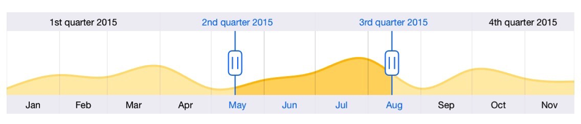

# Overview

The DateTime Range Navigator control provides an intuitive interface for selecting a smaller date range from a larger collection. It is commonly used in financial dashboards to filter the date range for which the data needs to be visualized.          

## Key features

Main capabilities of the control are listed below

* Major scale displays a date time scale that is one or more level higher than the minor scale.
* Visualize data with the available built-in chart types.
* Intuitive user interface to select a particular time range.

